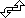

# rotate-string ("rst")

See this command in the [**command table**.](<COMMAND%20TABLE_R.md#rotate-string>)

To access this command:

  * **Digitize** ribbon **> > Transform >> Rotate**. 

  * Using the **[command line](<../COMMON/Command_Toolbar.md>)** , enter "rotate-string"

  * Use the quick key combination "rst".
  * On the **[Find Command](<../COMMON/findcommand.md>)** screen, highlight **rotate-string** and click **Run**.

## Command Overview

Rotate a string interactively about a fixed anchor point.

This command is affected by parameters that have been defined for your project. There are two possible ways that rotation can be performed:

  * Data can be rotated relative to the screen (that is, around a plane that is orthogonal to the current camera view), or;

  * Data can be rotated relative to the current data plane. This "3D" rotation allows the planar alignment of data to be maintained regardless of the position and direction of the camera.

See [Project Settings: Points and Strings](<../COMMON/Project%20Settings_Points%20and%20Strings.md>).

Command steps:

  1. Run the command. 

You are prompted to "Select anchor point on any string".

  2. Select the anchor point and the cursor changes to .

  3. Drag the anchor point and the selected string rotates about the defined anchor point. T

**Note** : The angle of rotation and the azimuth in the view plane from the rotation point to the cursor location is reported in the message area of the status bar.

Related topics and activities

  * [rotate-string-to-azimuth](<rotate-string-to-azimuth.md>)

  * [rotate-string-by-angle](<rotate-string-by-angle.md>)

  * [mirror-string](<mirror-string.md>)

  * [move-strings2d ("mstr")](<move-strings2d.md>)

  * [rotate-wireframe](<rotate-wireframe.md>)