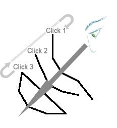

# select-string-depth

See this command in the [**command table**.](<COMMAND%20TABLE_S.md#select-string>)

To access this command:

  * Using the **[command line](<../COMMON/Command_Toolbar.md>)** , enter "select-string-depth".

  * On the **[Find Command](<../COMMON/findcommand.md>)** screen, highlight **select-string-depth** and click **Run**.

## Command Overview

Select string data based on its depth 'into the screen'.

This command is particularly useful where there is an abundance of data on screen, say when scheduling block perimeters where wireframe solids are also displayed without any view clipping. In this situation, it is commonly the case that a wireframe surface which is 'closer' to the camera than a target perimeter may obscure the data you wish to select.

With this command, you can click multiple times to select string data that lies underneath the cursor, and where multiple targets are possible, successive clicks of the mouse will allow string data that is further away from the camera to be selected instead, cycling through all possible 'hits' and repeating the cycle as required.

Command steps:

  1. Run the command.

  2. Position the cursor over the data you wish to select.

  3. Left-click. 

Use multiple left-clicks to select string data that is beneath the currently selected data, or to return to selection of the topmost data.

  4. Click **Done** to exit this selection mode and return to the default mode.

Related topics and activities:

  * Select Mode

  * [Selecting 3D Data Interactively](<../COMMON/Selecting3DDataInteractively.md>)