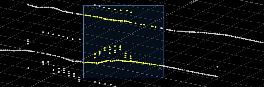

# selection-mode-box-switch ("smx")

See this command in the [**command table**.](<COMMAND%20TABLE_S.md#selection-mode-box-switch>)

  * Using the **[command line](<../COMMON/Command_Toolbar.md>)** , enter "selection-mode-append-switch".

  * Use the quick key combination "smx".

  * On the **[Find Command](<../COMMON/findcommand.md>)** screen, highlight **selection-mode-append-switch** and click **Run**.

## Command Overview

Activates box selection mode. If box selection mode is already active, running this command will have no effect.

Box selection mode is a modal switch that sets the left-hold-drag data selection behaviour in all 3D windows (the same behaviour is exhibited in all viewports).

'Box selection' refers to the method by which data is selected. Once active, left-clicking and holding the left mouse button down allows you to drag to form a rectangular boundary of a variable width and height (always unrotated) across the 3D screen, capturing all data that is either wholly captured by the selection shape boundary or any data that fully or partly overlaps the selection area (depending on your [data selection settings](<../COMMON/Project%20Settings_Points%20and%20Strings.md>)).

For example, in the image below, left-clicking and holding at point (1), then dragging to point 2, allows all data that lies fully within the selection rectangle to be selected. In this case, data selection settings are such that data has to be fully encapsulated within the selection area to become selected, for example:  
  
;>)

Related topics and activities:

  * [selection-mode-line-switch](<selection-mode-line-switch.md>)

  * [selection-mode-append-switch](<selection-mode-append-switch.md>)

  * [Selecting 3D Data Interactively](<../COMMON/Selecting3DDataInteractively.md>)