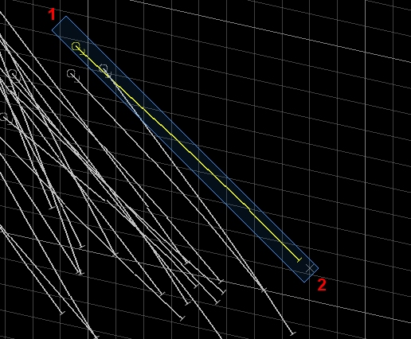

# selection-mode-line-switch ("sml")

See this command in the [**command table**.](<COMMAND%20TABLE_S.md#selection-mode-line-switch>)

  * **Home** ribbon **> > Select >> Swipe Selection** (toggle).

  * Use the quick key combination "sml".

  * Using the **[command line](<../COMMON/Command_Toolbar.md>)** , enter "selection-mode-line-switch".

  * On the **[Find Command](<../COMMON/findcommand.md>)** screen, highlight **selection-mode-line-switch** and click **Run**.

## Command Overview

Activates or deactivates line selection mode.

This command determines the left-hold-drag data selection behaviour in all 3D windows.

'Line selection' refers to the method by which data is selected. Once active, left-clicking and holding the left mouse button down allows you to drag a line of a fixed width across the 3D screen, capturing all data that is either wholly captured by the selection shape boundary or any data that fully or partly overlaps the selection area (depending on your [data selection settings](<../COMMON/Project%20Settings_Points%20and%20Strings.md>)).

After the first left-click, you control the length and orientation of the selection 'line' (actually, an elongated rectangle) using mouse movement.

**Tip** : Use the "sml" quick key combination to quickly swap between box and line selection modes.

For example, in the image below, left-clicking and holding at point (1), then dragging to point 2, allows a single drillhole to be selected. In this case, data selection settings are such that data has to be fully encapsulated within the selection area to become selected:  
  
;>)

Control the width of the selection line using the mouse wheel between points (1) and (2). The selection width is maintained for future selection events.

Command steps:

  1. Display and orient data so that data for selection is clearly seen.

  2. Run the command selection-line-mode-switch or the quick key combination 'sml'.

  3. Left-click and hold at the start of the selection line.

  4. Use the mouse wheel, if required, to set the width of the selection line.

  5. Left-click the second point to select data according to current selection settings.

Related topics and activities

  * [selection-mode-box-switch](<selection-mode-box-switch.md>)

  * [selection-mode-append-switch](<selection-mode-append-switch.md>)

  * [selection-mode-switch ("smt")](<selection-mode-switch.md>)

  * [Selecting 3D Data Interactively](<../COMMON/Selecting3DDataInteractively.md>)