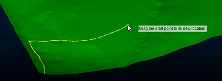

# string-at-gradient-on-wf ("sag")

See this command in the [**command table**.](<COMMAND%20TABLE_S.md#string-at-gradient-on-wf>)

To access this command:

  * Using the **[command line](<../COMMON/Command_Toolbar.md>)** , enter "string-at-gradient-on-wf"

  * Use the quick key combination "sag".

  * Display the **[Find Command](<../COMMON/findcommand.md>)** screen, locate **string-at-gradient-on-wf** and click **Run**.

  * **Design** ribbon **> > String Tools >> Gradient on WF**.

## Command Overview

Create strings (for example, road strings) to climb or descend a wireframe surface with a maximum gradient constraint.

The gradient value of the road is automatically encoded into the string when the command completes (**GRADDEG**). 

Tip: For more complex road networks, you can run the command again and use an existing string point as the starting point for a new one.

Note: A wireframe must be loaded and be the [current wireframe object](<../COMMON/Concept_Current_Object.md>). This is used to ascend/descend the road.

Command steps:

  1. Load the wireframe object onto which the road is located, and set it to the current object if required.

The **Set Maximum Gradient** screen displays.

  2. Enter the steepest gradient permitted for the road. The units are specified using the current [gradient convention](<set-gradient-convention.md>) for the system.

Note: If you have used the command before, the previous value is shown. If you have changed gradient conventions since the last command use, the previously used units are converted to the new convention.

  3. Pick the start point of the string on the current wireframe. You can use either a left click (to draw onto the current display section) or right click (to snap to data, based on your current [snap settings](<../VR_Help/Digitizing_In_VR.md>)).

  4. Pick the direction for the road, again by clicking a reference wireframe object using a left or right-click.

A road is projected from the start point to the point the road cannot be continued (this would typically be the edge of the wireframe surface, but could also be an internal void).

  5. Click (left or right) and drag the start point of the road to fine-tune its position dynamically, for example:

;>)

  6. To terminate the road at any point, left click the road away from the start position. The road is automatically truncated. 

Tip: Any subsequent movement of the road start point will maintain the elevation (Z) of the previous road termination point. This allows you to restrict the road to end at a particular elevation.

  7. To change the end position/elevation of the road, drag the terminal point to somewhere else on the wireframe.

  8. Click **Done** to finish.

Related topics and activities:

  * [set-gradient-convention ("grc")](<set-gradient-convention.md>)

  * [project-string-onto-wf ("ptw")](<project-string-onto-wf.md>)

  * [project-string-onto-wf-in-view ("ptd")](<project-string-onto-wf-in-view.md>)

  * [project-string-onto-wf-limit ("ptl")](<project-string-onto-wf-limit.md>)

  * [project-string-onto-wfs ("pstw")](<project-string-onto-wfs.md>)

  * [string-to-plane](<string-to-plane.md>)

  * [string-to-road](<string-to-road.md>)