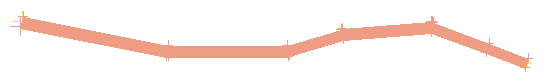

# string-to-road ("stro")

See this command in the [**command table**.](<COMMAND%20TABLE_S.md#string-to-road>)

To access this command:

  * Using the **[command line](<../COMMON/Command_Toolbar.md>)** , enter "string-to-road".

  * Use the quick key combination "stro".

  * Display the **[Find Command](<../COMMON/findcommand.md>)** screen, locate **string-to-road** and click **Run**.

## Command Overview

Create a road outline from a selected single road design string.

Command steps:

  1. Digitize or load string data representing a road centreline.

  2. Select the string data to become a road.

  3. Specify whether the original design string (to be selected) is kept after road creation, or whether it is removed. At the prompt, select **Yes** to delete the string or **No** to keep it.

  4. Define how the design string is treated using the String to Road Control screen. The options are:

     * _C_ use the selected string as a road centreline.

     * _L_ use the selected string as the left road edge.

     * _R_ use the selected string as the right road edge.

     * _LR_ the selected string runs from the left to the right of the road edge, with a gradual transition.

     * _RL_ as above, but the string runs from right to left edges.

  5. Enter the width of the road at the start and the end using the Road Width screen.

  6. Click **OK**.

The currently selected string is converted to a road of the specified settings, for example:  
  
  

Related topics and activities

  * [string-to-drillhole](<string-to-drillhole.md>)

  * [string-to-plane](<string-to-plane.md>)

  * road-design-string-single

  * road-design-string-pair

  * road-string-colour