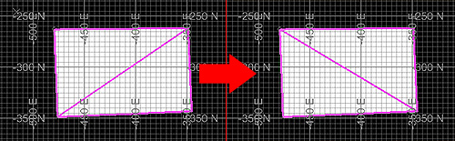

# switch-wireframe-edge ("ste")

See this command in the [**command table**.](<COMMAND%20TABLE_S.md#switch-wireframe-edge>)

To access this command:

  * Explicit ribbon **> >** Edit >> Switch.

  * Display the **[Find Command](<../COMMON/findcommand.md>)** screen, select **switch-wireframe-edge** and click **Run**.
  * Using the **[command line](<../COMMON/Command_Toolbar.md>)** , enter "switch-wireframe-edge"

  * Use the quick key combination "ste".

## Command Overview

Swap the linking off wireframe vertices from one arrangement to another within a quadrilateral. For example:

;>)

Command Steps:

  1. Display wireframe data with internal edges to be rearranged.

Tip: Show the loaded wireframe with highlighted edges before you run the switch-wireframe-edge command.

  2. Select an internal wireframe edge (exterior edges can't be adjusted).

The arrangement of the internal edge swaps between possible arrangements, within the bounding quadrilateral.

Related topics and activities

  * [delete-wireframe-point](<delete-wireframe-point.md>)