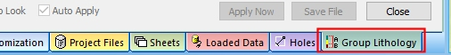

# Dynamic Control Bars

Control bars are either _fixed_ or _dynamic_.

A _fixed_ control bar will always host the same base functionality, although the actual contents may differ depending on what data is loaded, selected or other contexts. 

The [Sheets](<COMMON/Sheets%20Control%20Bar%20Overview.md>) control bar, for example, is a _static_ control bar; it will always host functionality for managing Studio visual overlays, and will update according to the object overlays that exist for the project.

;>)

The Group Lithology dynamic control bar

A dynamic control bar is used to host variable content. Studio creates these control bars 'on-the-fly' and can be considered a container into which a function is added. In the image above, for example, the [Group Lithology](<COMMON/Define_Sample_Lithologies.md>) managed task has been displayed. Commonly, these control bars support managed tasks in Studio products.

This populates a dynamic control bar which can then be [docked, floated, shown or hidden](<COMMON/Customizing.md>) in the same way as any other control bar.

Unlike static control bars, dynamic control bars do not appear in the [Home](<COMMON/Ribbon_Home.md>) ribbon's Show menu.

Related topics and activities

  * [Hiding and Showing tabs](<COMMON/Interface_Hide%20and%20Show%20tabs.md>)

  * [Customizing Control Bars](<COMMON/Customizing.md>)