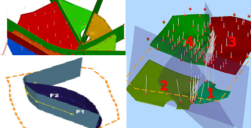
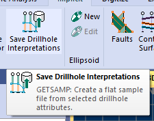
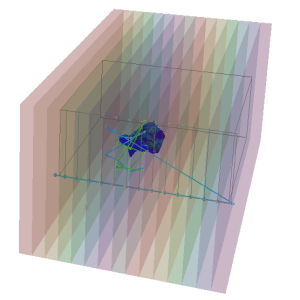
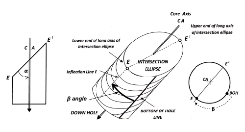

# Studio RM 2.0 Release Notes

## Important information for this version

  * **Important licensing changes** have been made to your product. See "Studio RM License Changes" and "License Services - Minimum Version", above, for more information. Please contact your local Datamine office for more information.

  * **COKRIG and Advanced Estimation** : Variogram models used in multivariate estimation must now include a **GRADE** and **GRADE2** field. Whilst these fields were optional previously, this could lead to an incorrect variogram being used, as first variogram in the file would be selected, which might not be the correct variogram for the estimation run. As such, these fields are now mandatory.

**Note** : **This may affect existing macros**. If affected, the input VMODEL file must be updated accordingly.

  * **Studio RM can produce long field names (up to 24 characters) by default**. 'Long Field' mode is automatically set when launching this version of the application, and is required for this and future versions. Care should be taken when defining new attributes to ensure output data can be read by legacy 'short field' applications in your business.

  * **Legacy application access to acQuire data sources** : An unavoidable compatibility break has been introduced with this version's installation of acQuire Data Provider components. This will prevent legacy applications from accessing an acQuire data source after this product is installed. A workaround for mixed environment users is provided below (see "acQuire Data Connection - Failure after Upgrade").

## Key Improvements

### Drillhole Importer

The **Drillhole Importer** simplifies the import of downhole data (collars, assays, surveys, depths, and intervals) from various sources. It validates the imported data for errors and converts it into a static drillhole file. For example, you can easily import drillholes with the latest assay data from the grade control database for short-term planning and blast modelling. 

Drillhole Importer also connects to a brand new Datamine Fusion connection facility - **Fusion Importer**. See below for more information.

Another common use case is updating geological wireframes by obtaining current drillholes from a Datashed grade control database after each bi-monthly RC drilling campaign. 

Configure your data connections to access and store a wide range of database formats, ensuring quick and easy reconnection for data updates.

### Fusion Importer

Replacing the previous Data Source Driver for Fusion database connections, Fusion Importer provides a simple and intuitive way of setting up a connection to your remote or local GDMS that remains live throughout the lifetime of your project. Connect, define a data scope and that's it. 

This facility is also seamlessly integrated with the Drillhole Importer, introduced in this update.

### Model Faults 

Quickly and easily model fault wireframes from loaded fault traces. Control each fault traces dip and dip direction (at any point along the line) and make further edits using any of Studios range of string editing tools. Fault wireframes are updated in real time, giving you dynamic control over fault shapes and extents.

Define fault relationships (for interdependent fault systems) using simple starts on / stops on settings, making even complex or sinusoidal fault relationships really easy to model.

### Improved Implicit Modelling

  * You can now optionally enforce tighter contact point to surface adherence using a post-processing 'Contact Snapping' option in both categorical and grade shell modelling commands.

  * Drillhole interpretation settings are preserved between different implicit modelling sessions.

  * In vein modelling, fault wireframe data can be automatically extended to ensure a clean intersection with the modelled vein volume(s). 

  * The categorical modelling command has been optimized to handle much larger input drillhole data than before.

  * You can now pick an existing output surface to update in **Create Contact Surfaces**.

  * Export contact points to a points object using the **Create Contact Surface** and **Create Vein Surfaces** tasks.

  * Choose how absent grade data is treated in the **Grade Shell** modelling task. It can either be ignored, or it can influence the shell boundary as if a zero grade were present.

### Vein Modelling: Model Inter-block Faults

Previously, fault wireframes had to fully divide the positive sample data when vein modelling. Now, a fault can terminate within the body of data, creating a 'scissor fault'. In this situation, Studio automatically adjusts the throw of the fault along the length of the fault as before, but will gradually eliminate the fault throw over distance after the fault zone terminates. 

This makes modelling of complex fault zones much quicker and easier as you can model a mixture of scissor and other faults within the same output.

### Improved Grade Estimation & Uniform Conditioning

  * **COKRIG** now quicker if multiple zones are estimated.

  * **MIKEST** supports Inverse Distance and Nearest Neighbour estimation with Dynamic Anisotropy.

  * **ELLIPSE** can use an input variogram model file to generate an ellipse that encloses the shape of model, and can now output both wireframes and ellipsoid point-type data files.

  * **Uniform Conditioning** can now recognize and process both **ESTIMA** and **COKRIG** variogram files.

  * Specify whether to use anisotropy when calculating Inverse Power of Distance estimations in the **Advanced Estimation** console.

### Point Cloud Reconstruction 2.0

This release provides an update to our point reconstruction facility. You have multiple surfacing options at your fingertips, including interpolative and triangulation methods. Weve kept parameters as simple as possible whilst maintaining flexibility, presenting a simple step-through process to accurately model your survey data.

You can find the **Point Reconstruction** console on the **Explicit** ribbon (**Automatic >> From Points**).

### Smooth Contour Grid Colouring Options

Generate a 'smooth' contour grid legend to show subtle variations in contour values between contour isobars. Select from a range of custom smooth legend options and your output grid model displays smooth colour transitions between contour landmarks.

### GETSAMP - Get Sample Data from Desurveyed Drillholes

A new process - **GETSAMP** \- lets you create a flat sample file from selected drillhole attributes. You can access this process via the **Implicit** ribbon.

### SWATHPLT Slices at any Orientation

The **SWATHPLT** process now lets you specify a rotation axis and angle to orient swaths in any direction in relation to the model and (optionally) input samples. Swaths are also output as distinct wireframe volumes, making it easier to see how the swaths interact with your data, and how grades and tonnages relate to model or sample slices.

### Attributes from Perimeters

A new command - **attributes-from-perimeters** \- transfers attributes and values from closed perimeter strings to enclosed target data. Target data can be points, strings, drillholes or wireframes. 

### Drillhole Data Selection Toggle

You can now use the quick key combination "tds" to swap between full drillhole and independent sample data selection in a **3D** view. A new command - toggle-drillhole-selection - is also available.

### Multiple Attribute Range Legends

The Multiple Attribute Legend wizard has been extended to let you define numeric ranges as well as distinct values, allowing for even more flexibility when generating visualization or evaluation legends.

### View & Data Type Quick Filters

Apply previously saved quick filters to all overlays of a data type, or all overlays of an entire view, using new **Sheets** control bar menu options.

### Calculate and Display Structural Orientations 

Define and format 2D or 3D drillhole structural symbols using a new 3D properties screen. Choose up to 3 orientation angles and render core sample orientation data using a wide range of visualization options.

**Calculate-structural-orientations** automatically calculates dip and dip directions from core logged alpha and beta angles. The resulting dip and dip direction attributes can be used to visualize angles using downhole structural symbols.

### A New Look & Ribbon Layout

A streamlined experience for geologists. Based on feedback, we have reorganized and refreshed the ribbon system, and it's now more intuitive and easier to navigate. Not only that, but it's supported by more effective look and feel themes.

### HTML5-compliant, Online Documentation

Access help via **docs.dataminesoftware.com**. This new online resource will, if an Internet connection is available (and you choose to access it), provide up-to-date system documentation that adapts to multiple target reading devices from laptops to phones. If no Internet connection is available, or you prefer to view compiled offline help, you can view the legacy installed content instead.

Not only that, but the latest help is deployed instantly, meaning you benefit from the latest knowledge available at all times.

**docs.dataminesoftware.com** will benefit from a lot of innovative development in the future, so it's worth taking a look!

### Improved Data Source Drivers

  * Export Vulcan .bmf block models to file sizes up to 4GB. Previously, the limit was 2GB.

  * Fusion Connex functionality has been deprecated, replaced by the more robust D-BOX Fusion connection service.

## All Improvements

### Commands & Processes

  * **Cases:** STUDIO-6549, STUDIO-6666 Specify whether to use anisotropy when calculating Inverse Power of Distance estimations in the **Advanced Estimation** console.

  * **Case:** STUDIO-6641 **GETSAMP** \- a new process - has been added to extract flat sample file information from static drillholes, preserving interpretations.

  * **Case:** STUDIO-6629 A new process - **GETSAMP** \- lets you extract sample data from a drillhole file to preserve interpretations.

  * **Case:** STUDIO-6589 Move wireframe points mode can now be enabled via the top-level ribbon button on the **Surfaces** ribbon.

  * **Case:** STUDIO-6587 Choose how absent grade data is treated in the **Grade Shell** modelling task. It can either be ignored, or it can influence the shell boundary as if a zero grade were present.

  * **Case:** STUDIO-6561 Export contact points to a points object using the **Create Contact Surface** task.

  * **Case:** STUDIO-6539 Pick an existing output surface in **Create Contact Surface**.
  * **Case:** STUDIO-6530 To support future project management options, the surface modelling commands/contouring commands now generate files with additional metadata.
  * **Case:** STUDIO-6409 You can now choose whether drillhole formatting is automatically updated during vein or surface modelling.

  * **Case:** STUDIO-6369 **Uniform Conditioning** can now recognize and process both **ESTIMA** and **COKRIG** variogram files.

  * **Case:** STUDIO-6349 The categorical modelling command has been optimized to handle much bigger input drillhole data than before.

  * **Case:** STUDIO-6388 Studio RM must now be run in Long Field mode.

  * **Case:** STUDIO-6340 When fitting a model, for exponential structures, control points on the chart are drawn at x=3*range, harmonizing structures between Studio and Supervisor.

  * **Case:** STUDIO-6336When modelling vein structures, a fault sheet can now terminate within the positive data.

  * **Case:** STUDIO-6333 When editing ellipsoids, shortcut rotation buttons now rotate by 90, not 180 degrees.

  * **Case:** STUDIO-6280 **COKRIG** now runs more quickly with multiple zones specified.

  * **Case:** STUDIO-6280 Wireframe data output by the structural modelling tasks is now rendered as a flat wireframe.

  * **Case:** STUDIO-6225 The legacy Design window is no longer accessible in this version.

  * **Case:** STUDIO-5562 Drillhole interpretation settings are now fully preserved between different implicit modelling sessions.

  * **Case:** STUDIO-5456 **MIKEST** now supports **Inverse Distance** and **Nearest Neighbour** estimation with **Dynamic Anisotropy**.

  * **Cases:** STUDIO-5368, STUDIO-5319 **ELLIPSE** uses an input variogram model file to generate an ellipse that encloses the shape of model, and can now output both wireframes and ellipsoid point-type data files.

  * **Case:** STUDIO-5185 Fault wireframe data can now be automatically extended to ensure a clean intersection with modelled vein volume(s).

  * **Case:** STUDIO-4669 Export HW and FW contact points to a points object during vein modelling.

  * **Case:** STUDIO-1095 **COMPDH** can composite both down and up holes, using a @REVERSE parameter.

  * **Case:** **STUDIO-924** **calculate-structural-orientations** calculates dip and dip directions from core logged alpha and beta angles. The resulting dip and dip direction attributes can be used to visualize angles using downhole structural symbols.
  * **Case:** GEO-17 The new **Model Faults** managed task appears in this update. Consult your help file for more details.
  * **Case:** GEO-16 **Drillhole Importer** is available for importing, validating and desurveying component drillhole data tables.
  * **Case:** CORE-7684An issue causing system instability when changing the format of a block model overlay in the Plots window has been resolved.

  * **Case:** **CORE-7632** Contouring commands now tag output data with their source command name.

  * **Case:** **CORE-7581** Legacy GRAPHICS and SCREEN windows no longer appear in your product.

  * **Case:** **CORE-7579** **SWATHPLT** now lets you specify optional axes and rotation angles to orient swaths in any direction in relation to the model or samples.

  * **Case:** **CORE-7569** Data objects derived from a database connection now display their connection string in the **Data Object Manager**.

  * **Case:** **CORE-7478** **Converge-segments** has been refactored, making it faster and more robust.

  * **Case:** **CORE-7447** **JOIN** supports up to 30 key fields.

  * **Case:** CORE-7436 @BOUNDTYP is no longer supported in the **PTCLD2WF** process.

  * **Case:** CORE-7405The deprecated command "Undo Last DTM" is no longer available via the ribbon system.

  * **Case:** CORE-7390 **SELWF** now assigns attribute values based on the order of input wireframe data, reinstating legacy behaviour.

  * **Case:** **CORE-7348** The **PTCLD2WF** process has been overhauled to accommodate a wider range of input point clouds.

  * **Case:** **CORE-7254** **SLIMOD** has a tolerance to check for the creation of very small cells. A cell will not be created in the output file if it has a volume less than the parent volume of the output prototype multiplied by 0.00000001. This tolerance is smaller than in previous versions to allow for prototypes with a large parent cell dimension in one of the axes.
  * **Case:** **CORE-7180** The legacy command **make-dtm-from-objects** is obsolete.
  * **Case:** **CORE-7163** Choosing to auto-align a section after creation will not automatically zoom to fit all data in the 3D view.
  * **Case:** **CORE-7141** **SELWF** supports a @SETABSNT parameter.
  * **Case:** **CORE-7112** Offset-string accommodates a wider range of input string shapes.
  * **Case:** **CORE-7102** You can choose a 'smooth' legend output when generating contour grids.
  * **Case:** **CORE-6885** Section plane pierce points are not enabled by default.
  * **Case:** CORE-6883 A new command - **toggle-drillhole-selection** (quick key "tds") toggles between full drillhole and independent sample data selection in a **3D** view.

  * **Case:** **CORE-6711** A new process for point reconstruction **PTCLD2WF** is available in this version.
  * **Case:** CORE-6152 Quickly **store and reinstate quick filters** using the **Sheets** control bar's context menu.
  * **Case:** CORE-6148 Choosing to auto-align a section after creation no longer automatically zooms to fit all data in the 3D view.
  * **Case:** CORE-7172 **MODSPLIT** has a @TOLERNCE parameter.
  * **Case:** CORE-7141 **SELWF** has a @SETABSNT parameter.
  * **Case:** CORE-7112 **offset-string** accommodates a wider range of input string shapes, including strings with near-coincident points that could previously generate erratic offset string shapes.
  * **Case:** CORE-7102 You can now choose **Smooth Legend** output when generating contour grids, allowing higher resolution colour maps to display. 
  * **Case:** CORE-7079 By default, the **Edit Attributes** screen defaults to selecting value options from selected legend items.
  * **Case:** CORE-7032 If the input files cannot be found in the **BOOLEAN** process, a warning is issued.
  * **Case:** CORE-7026 Choose to hide the 'Browse for file' prompt when loading a project with broken file references.

  * **Case:** CORE-7012 **HOLES3D** has a DESURVMD option if run interactively. It is used to locate sample centers or end points on desurveyed arcs.
  * **Case:** CORE-6991 The **BOOLEAN** process provides more verbose output messages.
  * **Case:** CORE-6793 You are now only notified of excessively large legends if the total number of bins exceeds 1000. Previously, the limit was 100

  * **Case:** CORE-6767 Custom cursor length intervals can be <1.
  * **Case:** CORE-6570 **snap-to-mid-string-switch** now affects snapping to both the mid points of strings and drillhole segments.

  * **Case:** CORE-6449 The **BOOLEAN** process will transfer attributes from input to output wireframes and strings.
  * **Case:** CORE-6148 **DECLUST** now supports retrieval criteria.

  * **Case:** CORE-6086 By popular request, the **unlink-wireframe** command has been reinstated.
  * **Case:** CORE-6053 **STATS** has @PRINT options to control the scope of control bar report output.
  * **Case:** CORE-5954 The **Multiple Attribute Legend** wizard can be used define numeric ranges as well as distinct values. This provides greater flexibility when generating visualization or evaluation legends.
  * **Case:** **CORE-5941** Define and format **2D and 3D drillhole structural symbols** using a 3D properties screen. Choose up to 3 orientation angles and render core sample orientation data using various visualization options.
  * **Case:** **CORE-5861** Use **string-at-gradient-on-wf** to generate on-surface strings (such as surface roads) between start and end points, honouring a maximum gradient.
  * **Case:** CORE-5347 Specify custom contour interval values when contouring from point data.
  * **Case:** CORE-5223 Enabling **Lock View** in a 3D window no longer adjusts the zoom setting of that view.
  * **Case:** CORE-5198 **Automatically align the view** when defining a 2 point section.
  * **Case:** CORE-1938 **Apply a template** to a 3D overlay by right-clicking it in a 3D view.
  * **Case:** CORE-1654 **Lock any 3D view** , or 3D view segment using a 3D window context menu option.

### User Experience

  * **Cases:** Various Studio RM has been rebranded, including documentation, splash screen and application icons. A ribbon overhaul has also been performed.

  * **Case:** STUDIO-6416 You can now access secondary clipping width settings from the **3D View** ribbon.

  * **Case:** STUDIO-6613 The Navigation toolbar icons have been updated.

  * **Case:** STUDIO-6508 New look and feel options are available.

  * **Case:** STUDIO-6577 Surface modelling commands make use of modern look and feel options.

  * **Case:** STUDIO-6419 Set your section movement distance value using a field on the **View** ribbon.

  * **Case:** STUDIO-6324 Several minor improvements have been made to the **Create Categorical Surfaces** and **Create Grade Shells** screens.

  * **Case:** CORE-7267 The **Command** toolbar icons have been updated.

  * **Case:** CORE-7150 Dynamically resize the components of the **Quick Filter** control bar.

  * **Case:** CORE-6792 Display up to **1000 drillhole names** for each drillhole object in the **Sheets** control bar.

  * **Case:** CORE-6767 Define custom cursor length intervals <1.

  * **Case:** CORE-6735 Hover your cursor over the object name in the **grid-dtms** screen to display the name in full.

  * **Case:** CORE-5442 The **3D Templates** screen is reorganized and iconized to make template creation and application simpler.

  * **Case:** CORE-4872 Show or hide all loaded ellipsoid data using a **Format** ribbon toggle.

  * **Case:** CORE-1928 The **Project Save** screen is resizable.

### Scripting & Automation

  * **Case:** CORE-6402 Feature Edge parameters can now be set when scripting the **Wireframe Verify** command (**VerifyEx(FeatureEdgeAngle=x**). where x is a numeric value between 0 and 360).

### Utilities & Supporting Services

  * **Case:** STUDIO-6337Studio RM requires a new license and Studio RM Pro has been discontinued.

  * **Case:** CORE-7451Rename multiple license solutions using a standard naming convention.

  * **Case:** CORE-7312 The License Services screen no longer appears behind the active Studio application if initiated by the third-party application.
  * **Case:** CORE-7306 Desurveying is no longer automatically performed when importing through the Data Providers as desurveying is now handled by the Drillhole Importer.

  * **Case:** CORE-7130 If an attempt is made to import a Vulcan .bmf file that is larger than our Maptek-provided driver can accommodate, a message is issued before processing and the operation is aborted.

  * **Case:** CORE-6510 Studio products will no longer operate if the local version of License Services is downgraded to an earlier version than installed with the product. See **License Services Important Information** , above.
  * **Cases:** CORE-7130, CORE-7118 Export Vulcan .bmf block models to file sizes up to 4GB (previously, the limit was 2GB).

  * **Case:** CORE-6838 Fusion Connex functionality has been deprecated, replaced by the more robust D-BOX Fusion connection service.

  * **Case:** CORE-6816 A maximum fields check and warning display for Vulcan, Surpac, Text, MineSight and Micromine drivers.

  * **Case:** CORE-6816 Export an object attribute containing DXF line style names.

  * **Case:** CORE-6648 When importing data via the **Text driver** , only a single legend is created (based on the first attribute field). In previous versions, a legend was created for each detected field in the incoming file, leading to an excessive number of stored legends.

  * **Case:** CORE-5809 Import **Amine-format SQL tables** using the ODBC driver.

  * **Case:** CORE-5020 When importing **Micromine block models** , field names are no longer limited to 9 characters. They can now be up to 24 characters on a long field system.

  * **Case:** CORE-5019 The **Data Converter** now converts MineSight block models to Datamine format.

### Documentation & eLearning

  * **Case:** CORE-7414 The **PICREC** help file includes information on disambiguating reserved keywords.

  * **Case:** CORE-85 Your application is supported by online, **HTML5-compliant help**. If an Internet connection is available (otherwise, locally-stored help content displays), context and conceptual help is displayed via Datamine's online documentation website at **docs.dataminesoftware.com**.

## Additional Defect Fixes

  * **Case:** STUDIO-6832 In **ESTIMATE** , you can now use floating point values when defining model update limits.

  * **Case:** STUDIO-6682 The **COKRIG** help file now explains that **VSETNUM** is not required for NN estimations.

  * **Case:** STUDIO-6649 In the **Create Vein Surfaces** command, the **Digitize New Perimeter** button is not available until a data context has been fully set.

  * **Case:** STUDIO-6648 An issue causing folder browser buttons to flicker in **Advanced Estimation** has been resolved.

  * **Case:** STUDIO-6645 **COKRIG** will no longer calculate an estimate without a valid GRADE field in the variogram.

  * **Case:** STUDIO-6633 An issue causing the Create Vein Surfaces command to fail if a small number of points were selected, has been resolved.

  * **Case:** STUDIO-6610 An issue causing **COKRIG** output from a macro and via the Advanced Estimation wizard (with the same parameters) to differ has been resolved.

  * **Case:** STUDIO-6565 The documentation for **DAELLIPS** shows the correct menu path.

  * **Case:** STUDIO-6527 An issue causing the vein modelling command to omit the generation of expected fault blocks has been resolved.
  * **Cases:** STUDIO-6524, STUDIO-6473,CORE-7137: Typographic errors in ribbon buttons and tooltips have been corrected.
  * **Case:** STUDIO-6527 The **Estimate Angles** panel now appears above the **Dynamic Anisotropy Fields** panel in the Advanced Estimation console.

  * **Case:** STUDIO-6462 **COKRIG** no longer creates an EMPTY field and a BHCOUNT field when no *KEY() is defined in the command line.

  * **Case:** STUDIO-6442 The default uncertainty value is now restored correctly to the categorical and grade shell functions.

  * **Case:** STUDIO-6393 An issue causing system instability, after unloading all data whilst the model-faults command is active, has been resolved.
  * **Case:** STUDIO-6384 The **Create Vein Surfaces** command now creates all fault blocks when using a prototype model as a boundary.

  * **Case:** STUDIO-6371 **COKRIG** no longer unexpectedly overwrites zone data when using the multivariate case.

  * **Case:** STUDIO-6371 In the Advanced Estimation console, the Up and Down arrows now work as expected in the available search volumes list.

  * **Case:** STUDIO-6132 A link to a redundant URL has been removed from the Studio RM Help file.

  * **Case:** STUDIO-6004 Additional points are now managed more consistently between implicit modelling commands.

  * **Case:** STUDIO-5429 The Advanced Estimation's Fit Model page, the **Variogram Type** list no longer reverts to the 'Variogram' item unexpectedly.

  * **Case:** CORE-7709 Reliance on the Microsoft Visual C++ 2010 x64 Redistributable (10.0.40219) has been removed, following reports of potential insecurities.

  * **Case:** CORE-7684 An issue causing **SELWF** to produce unexpected output, if both input sample and model attributes have the same name but different lengths, has been resolved.

  * **Case:** CORE-7304 An issue in **SELWF** (used by **WFCODE**), causing legacy automation scripts to fail, has been resolved.
  * **Case:** CORE-7300 MineSight Points Files can now be loaded by script.
  * **Case:** CORE-7291 **SELWF** now selects inside a wireframe correctly when the plane is not set.

  * **Case:** CORE-7255 If querying multiple strings the correct area is now calculated for non-convex shapes.
  * **Case:** CORE-7252 Retrieval criteria in **SELWF** are now working as expected.
  * **Case:** CORE-7250 An issue causing system shutdown, when clicking **OK** in the acQuire drillhole database import wizard, has been resolved.

  * **Case:** CORE-7245 The Text driver no longer fails when the number of fields exceeds the maximum limit.

  * **Case:** CORE-7216 The **Apply Filter** option no longer appears in **Sheets >> Plots** menus.
  * **Case:** CORE-7213 A legacy data driver problem causing system shutdown when reopening projects has been guarded against. In this version, a warning of unexpected driver input is issued, but all loadable project items are loaded afterwards.
  * **Case:** CORE-7202 'Point data' controls are correctly enabled/disabled on the **generate-contours-from-holes-intercepts** screen.

  * **Case:** CORE-7192 An issue causing system instability, when closing a project with the **Extract Objects** screen displayed, has been resolved.

  * **Case:** CORE-7178 The **Values** drop-down list in the **Edit Attributes** screen now initializes correctly.

  * **Case:** CORE-7171 Breaking strings with other strings (BKI or BKS) now correctly breaks the target string.

  * **Case:** CORE-7145 After breaking a string with another string (BKI or BKS), attributes are now edited correctly on resulting string segments.

  * **Case:** CORE-7139 In **COPYMOD** , default values of the new origin and angles are now being set correctly set when angles and origin are blank.

  * **Case:** CORE-7127 **PTCLD2WF** no longer fails when the active user account name contains a ".".

  * **Case:** CORE-7126 An issue preventing the successful drag and drop loading of DWG and DXF files has been resolved.

  * **Case:** CORE-7122 An instance of system instability, if closing a project whilst the **wireframe-volume** screen is displayed, has been resolved.

  * **Case:** CORE-7119 An issue causing system failure, when unloading objects via the **Data Object Manager** , where table data is selected, has been resolved.

  * **Case:** CORE-7117 **SELWF** output is now consistent between multiple runs with the same settings and data.

  * **Case:** CORE-7091 Internal block model blocks are now rendered correctly in the 3D view when clipping.

  * **Case:** CORE-7094 **edit-model-cell-values** now responds correctly to data unload operations.

  * **Case:** CORE-7087 An issue causing system failure when renaming an object data column in the **Data Object Manager** , has been resolved.

  * **Case:** CORE-7080 An issue causing system instability, when using **Drillhole Planner** with the **Data Properties** bar displayed, has been resolved.

  * **Case:** CORE-7077 An issue causing "Error 39" in **License Services** has been investigated and resolved by adding support for Dinkey Pro driverless dongles.

  * **Case:** CORE-7070 An issue causing **WFCODE** to generate only a single record when @ALLPTS=1 and @SETABSNT=0 has been resolved.

  * **Case:** CORE-7069 The **Edge Cylinder Segments** label is not truncated in Tools >> Options > 3D.

  * **Case:** CORE-7054 Messages no longer overlap on product splash screens.

  * **Case:** CORE-7050 **wf-intersections** generates string data with the expected inherited attributes.

  * **Case:** CORE-7038 Picture and plane objects no longer obscure transparent foreground filled strings and sections.

  * **Case:** CORE-7031 An issue causing system instability, if cancelling the **Image Registration** screen before the specified image has loaded, has been resolved.

  * **Case:** CORE-7028 The 3D view no longer unexpectedly shifts view position after using the **View Controller**.

  * **Case:** CORE-7025 **DESURV** no longer terminates with confusing message if number of survey points in a hole exceeds 10000.

  * **Case:** CORE-7024 In **DESURV** , @DESURVMD=0 no longer resets all of the coordinates to 0 if @ENDPTS=0.

  * **Case:** CORE-7018 The **PTCLD2WF** process will run correctly on machines that have no previous Studio installation.

  * **Case:** CORE-7009 **HOLES3D** does not reset the first Survey record to AT=0 if there is no AT=0 record.

  * **Case:** CORE-6935 DTM creation creates a surface where coincident points exist.

  * **Case:** CORE-6987 Object data overlays are rendered in the correct way when object opacity is reduced.

  * **Case:** CORE-6983 **DESURV** : Under some circumstances zero length or horizontal samples when using @ENDPTS=1 could result in corrupted B0 ouput values. This has been resolved.

  * **Case:** CORE-6979 The **BOOLEAN** process generates identical results to the **wireframe-intersection** command.

  * **Case:** CORE-6978 **DILUTMOD** 's subcell checking routines now provide useful user feedback instead of creating (potentially) arbitrarily large model outputs.

  * **Case:** CORE-6915 An issue causing system failure, when resetting the customization profile from **the Quick Access** menu, has been resolved.

  * **Case:** CORE-6877 The system no longer halts unexpectedly if the file source of a histogram chart cannot be found.

  * **Case:** CORE-6839 An issue causing incomplete export to Surpac .mdl format has been resolved.

  * **Case:** CORE-6822 Adjusting the scale of a plot no longer causes unexpected repositioning of labels.

  * **Case:** CORE-6818 An issue preventing accurate data picking in 3D views, when high magnification has been applied, has been resolved.

  * **Case:** CORE-6814**DECLUST** no longer automatically lists X, Y and Z as default coordinate fields.

  * **Case:** CORE-6807 A data-specific issue causing system shutdown after importing a 3D sheet template has been resolved.

  * **Case:** CORE-6781 In the **create-new-legends** command, changing the Precision value (of a Numeric Range legend) no longer results in the custom defined Range Filter being reset back to the defaults.

  * **Case:** CORE-6774 An issue causing the splash screen to flicker on startup has been resolved.

  * **Case:** CORE-6730 The **Edit Attributes** screen correctly references the ellipsoid data type.

  * **Case:** CORE-6720 An issue causing mouse wheel zooming to fail, after box selection and panning in 3D, has been resolved.

  * **Case:** CORE-6617 **wf-intersections** adds expected data attributes to generated strings.

  * **Case:** CORE-6607 An issue causing the system to fail after running **make-dtm-from-object** has been resolved.

  * **Case:** CORE-6594 An issue causing system shutdown when moving points with the snap mode set to 'Lines' has been resolved.

  * **Case:** CORE-6548 An intermittent problem causing an unclean shut down of the system after importing files via the Vulcan driver, has been resolved.

  * **Case:** CORE-6433 Mouse scrolling when editing date ranges in the **Create New Legend** wizard is no longer using inverse controls.

  * **Case:** CORE-6418 An issue causing scale locking in the **Plots** window to fail has been resolved.

  * **Case:** CORE-6368 Context sensitive help for the **Fault Modelling** panel now appears correctly.

  * **Case:** CORE-6167 The dialog labels for the **MODTRI** process have been corrected.

  * **Case:** CORE-6166 The dialog labels for the **BLKTRI** process have been corrected.

  * **Case:** CORE-6160 The **Project File** control bar's **Pictures** folder, if displayed, displays a title as expected.

  * **Case:** CORE-6138 A data-specific issue causing **SELPER** to fail to sort the output by IJK has been resolved.
  * **Case:** CORE-6137 An issue causing unexpected A0 and B0 results in output from **COMPDH** has been resolved.

  * **Case:** CORE-6131 An issue that could cause **create-ramp-string** to fail with a particular gradient, radius and distance end limit settings has been resolved.

  * **Case:** CORE-6128**break-strings-at-intersections** now produces string breaks in expected locations.

  * **Case:** CORE-6124An issue preventing the import of a large number of 3D display templates in one action has been resolved.

  * **Case:** CORE-6101 If a plot sheet is created without others existing, the legacy **Design** window is no longer displayed at the same time.

  * **Case:** CORE-6095 Running the **unlink-triangle** command will now automatically deselect any previously selected triangles.

  * **Case:** CORE-6080 The **Texture from Object** setting is now correctly applied from a visual display template.

  * **Case:** CORE-6072The URL to project startup scripts is now decoded to remove escape sequences.

  * **Case:** CORE-6060An issue, that could cause system failure when applying a 2D label of _BHID_ to loaded dynamic drillholes, has been resolved.

  * **Case:** CORE-6043The grid value for the weighting column is no longer reset if it has been pre-defined (e.g. from **Evaluation** settings).

  * **Cases:** CORE-6039, **CORE-5674** Linestyle and Thickness attribute values are now exported to DXF and DGN as expected.

  * **Case:** CORE-6003 Text boxes are now displayed as expected when switching back to **Plots** from the **Print Preview** window.

  * **Case:** CORE-5626 During volumetric block modelling, records are no longer saved in the control files if they have empty or non-existent filenames.

  * **Case:** CORE-5502 The **Plots** window correctly honours "SCALE" when a section definition file is applied from a script.

  * **Case:** CORE-5238 An issue causing the **Data Converter** to fail when accessing it via script has been resolved.

  * **Case:** CORE-5209 An issue causing alphanumeric field data to be imported incorrectly via the ODBC v2 driver has been resolved.

  * **Case:** CORE-4632 **WFCODE** no longer incorrectly sets alphanumeric zone fields to numeric if @SETABSENT=1.

  * **Case:** CORE-4333 Drillhole data selection in the 3D window is now more accurate with large data and high scaling.

  * **Case:** CORE-4238 A typographic error in the E-W section ribbon button tooltip has been corrected.

  * **Case:** CORE-4085 In **COMPBE** , where FROM-TOs are greater than @MINGAP, compositing will now continue at the next interval of the same hole, and won't skip to the next BHID as previously.

  * **Case:** CORE-3694 An intermittent issue causing 3D window zooming to fail after filtering has been resolved.

  * **Case:** CORE-3189 Unexpected rounding results in the A0 and B0 columns when using **COMPBE** have been resolved.

  * **Case:** CORE-3076 The ODBC v2 driver now permits alphanumeric columns to be exported in Microsoft Access format.

  * **Case:** CORE-2692 Spinner button behaviour in **Tools >> 3D >> Initial States** is now as expected.

  * **Case:** CORE-2405 **COMPDH** now produces accurate results when the EOH interval is 0.

  * **Case:** CORE-1449 An issue causing **COMPBR** to become unresponsive with certain interval values has been resolved.