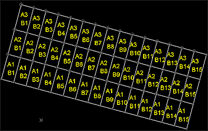
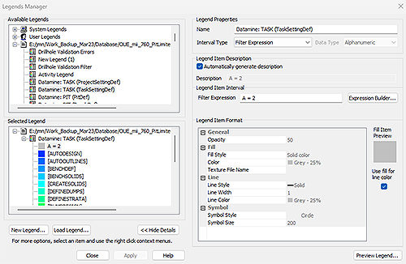

# Studio RM 2.1 Release Notes

## Key Improvements

### Implicit Modelling Improvements

  * Creating contact surfaces with large data is now _much_ quicker (up to 200x).

  * Choose from either per-value or global settings when performing a batch vein modelling run.

  * You can now select either points or string data to generate additional points for the **Vein** or **Contact surface** modelling task.

  * You can now retain existing visual formatting when updating previous implicit modelling output.

  * You can now update existing implicit models via the **Categorical** and **Grade Shells** tasks.

  * **Contact surface** values now show their corresponding legend colour in the chronology lists.

  * The **Vein** and **Categorical** modelling commands also display an associated legend colour alongside potential values when setting the data context.

  * In implicit modelling, the number of points that are beyond the specified **maximum snapping distance** (and thus are not used to snap the resulting surface) is reported in the output window following surface computation.

  * It is now possible to generate a vein or categorical surface using only additional points.

### Advanced Estimation Improvements

  * **ANISOANG** now uses the modelled variogram to ensure that the rotation convention of the DA angles in the block model are consistent with all angles in the variogram/search.

  * When defining search volumes for advanced estimation, you can now perform **axis-specific capping** , setting per-axis distances rather than a single, global value.

  * Transformed minimum distance (**TMINDIST**) and transformed average distance (**TAVEDIST**) are now calculated by **COKRIG** , and output to the fields table.

  * You can now select if an estimation contributes to a **SAMPOUT** file or not.

  * 3rd angle values (derived from the search volume or variogram) can now be written back to the block model when only 2 angles are used in Dynamic Anisotropy.

### Drillhole Importer Improvements

  * You can now quickly enable or disable data columns of imported drillhole component files.

### Generate a 2D Grid

;>)

Use **create-grid-perimeter** to generate a 2D grid anywhere in 3D space, with optional grid reference attribution.

Define any origin and azimuth, and design a grid on a 2D plane of any orientation. Each grid cell can be attributed automatically to quickly set up grid reference attributes.

### Legends Manager Overhaul

;>)

The **Legends Manager** has been overhauled to make it easier to use; Legends and intervals are now in separate lists. This also allows larger legends to be created.

### Plotting Enhancements

  * You can now use **Quick Filter** and Format ribbon filtering options whilst using the **Plots** window.

  * Use the "za" quick key combination to automatically zoom the contents of a target projection to fit the available space.

  * Navigate active projections or plot sheets by zooming in or out using the mouse wheel, similar to the 3D window behaviour.

  * Use the "zx" quick key combination in a Plots projection to activate zoom-by-area mode.

  * Deselect any active projection using <CTRL> and a left click.

### New and improved commands

  * A new command - **add-zintersect-to-string** \- lets you inject string points at a specified elevation.

  * A new command - **clip-strings-to-perimeters** \- lets you clip any string data with one or more selected perimeters.

  * **extend-string-to-string** can now be used to extend any string segment.

  * **extend-segment-virtual-intersect** : Extend a string segment to virtually intersect a second segment of another selected string (new command).

  * **fillet-single-string-point** can now be performed on strings not in the XY plane.

  * **filter-point-off** : Prevent the display of point data without removing it from memory.

  * **hide-non-selected-points** : Disable the display of all non-selected point data.

  * Several string **linking** commands now honour the 'Maximum Segment Length' value (if greater than 0) to limit the segment length of wireframes triangles.

  * **Macro path lengths** can now be up to 256 characters (the previous limit was 72 characters).

  * **move-string-to-view** projects string data without retaining the original data.

  * You can now **restore** previously used **retrieval criteria**.

  * **switch-wireframe-edge** : interactively swap the arrangement of internal edges in a two-triangle pair.

  * The maximum number of unique values for the ZONE field in **TRIVAL** has increased from 40 to 2000. The amount of text being written to the command text output window has been significantly reduced and a better progress indicator added to the status bar.

  * **write-selected-points** : Save selected points to an external file.

## All Improvements

### Commands & Processes

  * **Case:** STUDIO-6973 3rd angle values (derived from the search volume or variogram) can now be written back to the block model when only 2 angles are used in Dynamic Anisotropy.

  * **Case:** STUDIO-6843 Creating contact surfaces with large data is now much quicker (up to 200x).

  * **Case:** STUDIO-6825 The **attributes-from-perimeters** command can be accessed from the Data and Digitize ribbons.

  * **Case:** STUDIO-6817 When processing **COKRIG** or **ESTIMA** , warnings have been added when the dynamic anisotropy (in variogram or in search parameter file) is only partially defined.

  * **Case:** STUDIO-6798 Studio RM's Advanced Estimation module can now recieve data from Supervisor v9.

  * **Case:** STUDIO-6763 In implicit modelling, the number of points that are beyond the specified **maximum snapping distance** (and thus are not used to snap the resulting surface) is reported in the output window following surface computation.

  * **Case:** STUDIO-6706 It is now possible to generate a categorical surface using only additional points.

  * **Case:** STUDIO-6687 It is now possible to generate a vein surface using only additional points.

  * **Case:** STUDIO-6678 You can now update existing implicit models via the Categorical and Grade Shells tasks.

  * **Case:** STUDIO-6623 You can now select either points or string data to generate additional points for the vein or contact surface modelling task.

  * **Case:** STUDIO-6572 A batch vein modelling run now creates all expected outputs.

  * **Case:** STUDIO-6532 The **Vein** and **Categorical** modelling commands also display an associated legend colour alongside potential values when setting the data context.

  * **Case:** STUDIO-6452 When defining search volumes for advanced estimation, you can now perform **axis-specific capping** , setting per-axis distances rather than a single, global value.

  * **Case:** STUDIO-6352 Clear all custom estimation zones at once using a new **Clear list** option.

  * **Case:** STUDIO-5965 **ANISOANG** now uses the modelled variogram to ensure that the rotation convention of the DA angles in the block model are consistent with all angles in the variogram/search.

  * **Case:** STUDIO-5754 You can now select if an estimation contributes to a **SAMPOUT** file or not.

  * **Case:** STUDIO-5342 Choose from either per-value or global settings when performing a batch vein modelling run.

  * **Case:** **CORE-8153** The User License Logging template spreadsheet has been updated to meeting Windows 11 requirements.

  * **Case:** CORE-8060 **write-selected-points** has been added to the 3D window context menu (Save >> Selected Points).

  * **Case:** CORE-8051 Datamine License Services is now supported in networks utilizing the TLS (Transport Layer Security) protocol versions 1.2 and 1.3.

  * **Case:** CORE-7917 A new **SELWF** parameter - FIXNORM - can be used to detect and rectify common wireframe problems before processing.

  * **Case:** CORE-7855 The performance of commands that involve moving points has been improved when a lot of visual data is loaded and displayed in a 3D window.

  * **Case:** **CORE-7804** The command **link-multiple-strings** ("lms") now uses the 'Maximum Segment Length' value (if greater than 0) to limit the segment length of wireframes triangles.

  * **Case:** **CORE-7803** The command **link-selected-strings-attrib** ("lma") now uses the 'Maximum Segment Length' value (if greater than 0) to limit the segment length of wireframes triangles.

  * **Case:** **CORE-7802** The command **link-selected-strings-plane** ("lmpl") now uses the 'Maximum Segment Length' value (if greater than 0) to limit the segment length of wireframes triangles.

  * **Case:** **CORE-7800** The command **end-link-boundary** (elb) now uses the 'Maximum Segment Length' value (if greater than 0) to limit the segment length of wireframes triangles.

  * **Case:****CORE-7799** The command **end-link** (eli) now uses the 'Maximum Segment Length' value (if greater than 0) to limit the segment length of wireframes triangles.

  * **Case:** CORE-7792 Link-strings now honours the **Maximum Segment Length** wireframe linking setting.

  * **Case:** **CORE-7780** You can now pan plot views using the cursor as expected.

  * **Case:** CORE-7778 A new command - **write-selected-points** \- lets you save selected points to an external file.

  * **Case:** CORE-7670 **Macro path lengths** can now be up to 256 characters (the previous limit was 72 characters).

  * **Case:** CORE-7644 Use the "za" quick key combination to automatically zoom the contents of a target projection to fit the available space.

  * **Case:** CORE-7643 Use the "zx" quick key combination in a Plots projection to activate zoom-by-area mode.

  * **Case:** CORE-7641 You can now use **Quick Filter** and Format ribbon filtering options whilst using the **Plots** window.

  * **Case:** CORE-7592 Deselect any active projection using <CTRL> and a left click.

  * **Case:** CORE-7398 **move-string-to-view** projects string data without retaining the original data.

  * **Case:** CORE-7397 **extend-string-to-string** can now be used to extend any string segment.

  * **Case:** CORE-7396 **extend-segment-virtual-intersect** : Extend a string segment to virtually intersect a second segment of another selected string.

  * **Case:** CORE-7395 A new command - **add-zintersect-to-string** \- lets you inject string points at a specified elevation.

  * **Case:** **CORE-7361** An issue causing incorrect icons to be displayed for Data options in the Loaded Data/Sheets context menu has been resolved.

  * **Case:** CORE-7310 The **Legends Manager** has been overhauled to make it easier to use

  * **Case:** CORE-7152 A new command - **clip-strings-to-perimeters** \- lets you clip any string data with one or more selected perimeters.

  * **Case:** CORE-6934 You can now **restore** previously used **retrieval criteria**.

  * **Case:** CORE-6705 When clipping perimeters to other perimeters, interacting with the Quick Filter bar now persists the previous selection.

  * **Case:** CORE-6388 Use **create-grid-perimeter** to generate a 2D grid anywhere in 3D space, with optional grid reference attribution.

  * **Case:** **CORE-5284** **filter-point-off** and **show-non-selected-points** commands have been created.

  * **Case:** **CORE-4438****fillet-single-string-point** can now be performed on strings not in the XY plane.

  * **Case:** **CORE-3974** Define an upper limit for **triangle edge length** during string linking via the Project Settings screen. This can also be set using the reinstated dtm-new-point-separation command.

  * **Case:** **CORE-3957** A new command - **switch-wireframe-edge** , lets you quickly adjust the internal organization of wireframe triangles in a quadrilateral.

### User Experience

  * **Case:** STUDIO-6930 You can now access the **dtm-new-point-separation** command on the Explicit ribbon.

  * **Case:** STUDIO-6696 Your Start page will update immediately to reflect the colours of the current Look and Feel mode.

  * **Case:** STUDIO-6679Vein from Samples task computation buttons have been relabeled for consistency.

  * **Case:** CORE-7702 An issue causing the degrees symbol to be displayed incorrectly in various parts of the application has been resolved.

  * **Case:** CORE-7658 The **Find Command** dialog now reacts to visual theme changes.

  * **Case:** CORE-7574The **Wireframe Decimate** screen now displays the latest visual themes.

  * **Case:** CORE-7568 The **Wireframe Verify** screen now displays the latest visual themes.

  * **Case:** CORE-7534 The **Wireframe Smooth** dialog is now supported by extended visual themes.

### Utilities & Supporting Services

  * **Case:** CORE-7662 Swapping from online to offline mode (or vice versa) now automatically reloads the current Start page content.

### Documentation and Product Support

  * **Case:** STUDIO-6963 Documentation on Grade Shells command automation has been updated.

  * **Case:** STUDIO-6941 Documentation for COKRIG has been updated to reference the SAMPOUT field in the EPAR file.

  * **Case:** STUDIO-6890 The COKRIG help file's references to VAR and VARZSTR have been updated for clarity.

  * **Case:** CORE-7840 Documentation on macro limits has been updated.

## Additional Defect Fixes

  * **Case:** STUDIO-7853 The Drillhole Importer's validation table is no longer editable.

  * **Case:** STUDIO-7851 Drillhole Importer now correctly updates Duplicate AT errors during revalidation.

  * **Case:** STUDIO-7853 You can now model scissor faults as expected when a prototype model is used as a boundary object.

  * **Case:** STUDIO-7060 The Filter All ribbon icon is now enabled when expected.

  * **Case:** STUDIO-6960An issue causing unexpected ellipsoid inversion in COKRIG has been resolved.

  * **Case:** STUDIO-6894 The Studio RM Start Page no longer references unavailable functionality in offline mode.

  * **Case:** STUDIO-6766 The ESTIMA help file now states the correct ANISO fields for IPD and NN estimation methods.

  * **Case:** STUDIO-6750 Incorrect information has been removed from the COKRIG help file relating to SDYNAISO=0.

  * **Case:** STUDIO-6750 During advanced estimation, merged estimation runs now retain their ID in the SAMPOUT file.

  * **Case:** STUDIO-6722 When investigating anisotropy via the 3D variogram window, orientating anisotropy in the Horizontal, Angle 1 no longer incorrectly flips to -180 when in the fourth quadrant.

  * **Case:** STUDIO-6722 Your help file now correctly states that IPD method parameters can be imported from ESTIMA into COKRIG.

  * **Case:** STUDIO-6714 The COKRIG help file now correctly states that VREFNUM is not required in the estimation parameter file if using the IPD method.

  * **Case:** STUDIO-6693 An issue causing Nearest Neighbour estimates for two grade fields to differ between ESTIMA and COKRIG has been resolved.

  * **Case:** STUDIO-6538 The list of custom zones in Advanced Estimation no longer inverts unexpectedly after updating.

  * **Case:** STUDIO-6406 You can now remove erroneous zones when defining an advanced estimations.

  * **Case:** STUDIO-6237 Data generated by the categorical and grade shell commands now appears correctly in the Data Object Manager.

  * **Case:** STUDIO-5842 COKRIG now responds correctly if consecutive SVOLFACi values are identical.

  * **Case:** **GEO-234** Drillhole Importer has new 'quick fix' options to handle misaligned collar EOH and interval length values.

  * **Case:** **GEO-232** In Drillhole Importer, overlapping samples are no longer incorrectly reported as 'small' if they are not trivial overlaps.

  * **Case:** **CORE-7998** An issue causing system shutdown when creating a legend for a recently modified drillhole has been resolved.

  * **Case:** **CORE-7839** **SWATHPLT** now processes data where a ZONEFLD contains more than 40 records.

  * **Case:** **CORE-7788** An issue causing potential system instability when sorting by Date Modified in the Project Browser has been resolved.

  * **Case:** **CORE-7723** You can now update the License Services product name registration database more than once.

  * **Case:** **CORE-7722** In some circumstances in models with a large number of fields including alphanumeric fields, **PROMOD** volume calculations were incorrect. This is now resolved.

  * **Case:** **CORE-7618** Selecting and deselecting individual drillholes or segments is now significantly faster.

  * **Case:** **CORE-7530** An issue causing an unexpected system restart after a product installation has been resolved.

  * **Case:** **CORE-7435** DXF wireframes can now be saved via script as expected.

  * **Case:** CORE-7310 The **Legends Manager** has been overhauled to make it easier to use

  * **Case:** **CORE-6872** When using **SELPER** , If the perimeter file contains DPLUS and DMINUS fields and the values are zero a small tolerance is applied internally to avoid numerical comparison errors. This is now consistent with the methodology used for the DPLUS and DMINUS parameter values when either of them is zero.

  * **Case:** **CORE-6862** Contact snapping now creates expected results for contacts with constrained ends.

  * **Case:** **CORE-6787** An error in **SWATHPLT** when **ALLZONES** was set to 1 has been resolved.