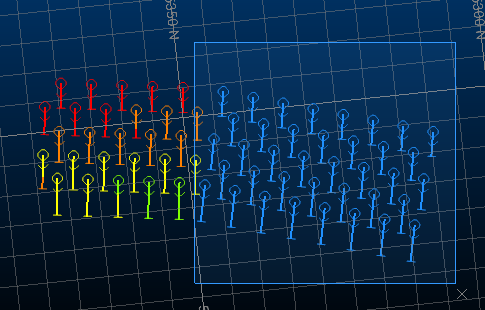
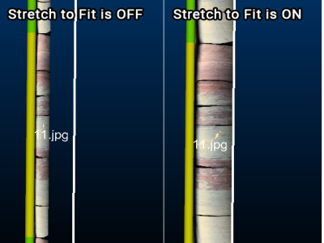
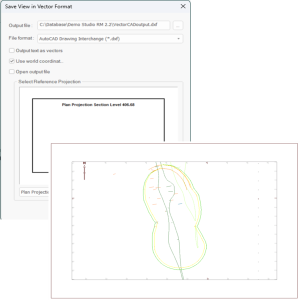
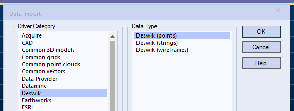

# Studio RM 2.2 Release Notes

## Key Improvements

### Advanced Estimation Unfolding

Where orebodies need to be unfolded to reduce structural complexity prior to estimation, you can now use the Advanced Estimation wizard's new **Unfolding** screen to define the parameters and strings required to unfold sample data.

Import an existing _Unfolding parameters file_ generated by the **Unfold Wizard** and apply the imported settings. You can also edit settings such as which strings are used for unfolding, the plane of structural interpretations and how section tag strings are treated, if they exist. 

Once configured, unfolding becomes an integrated part of the estimation workflow. To support this feature, **COKRIG** has been updated to allow an Unfolding Parameters and Strings file to be specified, allowing estimation macros to be enhanced with an unfolding step as well.

We've also given the **Unfold Wizard** an overhaul to remove unnecessary restrictions when defining section strings (they can now be defined between any concurrent sections and not necessarily across all sections) plus other fixes and minor improvements.

### Drillhole Importer Improvements

This update introduces the following improvements to our drillhole importation console:

  * Automatically validate the adherence of collar positions to a specified surface topography file, reporting errors above a specified distance threshold.

  * Re-import all drillhole component tables to absorb the latest source file changes using a new **Re-import** button on the **Import** tab.

  * Right-click a file to see a preview of the data table in the **Tables** window.

  * Automatically generate and choose the display legend for drillholes.

  * Use existing loaded drillhole component data to build or rebuild drillholes.

  * **Reapply Previous Fixes** : Previously committed drillhole data fixes can now be reapplied automatically when revalidating as part of the Drillhole Importer process, saving time when new sample data comes to light.

  * New 'quick fix' options handle misaligned collar EOH and interval length values.

  * Automatically detect Leapfrog system field names, saving time when setting up an import scenario.

  * Keyboard navigations shortcuts (SHIFT+Tab, SHIFT+Enter) have been added to Drillhole Importer table grids.

  * Include or exclude multiple fields at once using new context menu options.

  * You can now apply a quick fix to multiple selected validation results.

  * Delete custom data sources using the data sources list.

  * Import data as a background task after launching and highlight missing data sources.

### Implicit Modelling Improvements

  * Editing samples is now quicker and easier using one-click editing modes.

  * Changes in vein modelling calculations have been performed to improve the performance and resilience of results.

  * Set custom section definitions for each value in a vein modelling or contact surface batch run.

  * Control how collar and EOH points are considered during **vein modelling** , allowing the surface to pass above the hanging wall and below the foot wall if required.

  * If a vein model could not fully encompass all available positive samples, or all parts of all samples, drillhole IDs that could not be accommodated are listed.

  * Visual formatting in the vein modelling function has been improved to make it clearer which intervals are considered in modelling, in relation to task settings.

  * When generating a contact surface, snap and gap settings are reflected more obviously in the primary 3D window.

  * When editing samples in the **Contact Surfaces** and **Vein from Samples** tasks, you can undo and redo actions.

  * Pick your own HW and FW point colours!

### ANISOANG ZONE Key Field

**ANISOANG** 's ZONE parameter is now a key field to allow records to be matched between VMODEL or SEARCH and the specified input wireframe. This makes it easier to batch process runs.

### Project Data Bar

In a first step towards a unified data control bar in Studio RM, this version introduces the **Project Data Bar**.

In this phase, it's an extension of the legacy Project Files control bar, with more detailed data segregation into folders relevant to resource modelling, such as unrotated and rotated model prototype areas, geostatistical parameter files and more. Data created from implicit modelling commands are recognised so you can quickly navigate to project data relating to surface, vein, fault, categorical and grade modelling, for example, removing the need to find a wireframe of interest in a generic 'wireframes' folder.

The **Project Data Bar** is shown or hidden using the **Home** ribbon's **Show** menu. Watch this space for enhancements to this control bar in the near future!

See [Project Data Control Bar](<../../COMMON/PD%20Bar-RM.md>).

### Custom Coordinate Transformations

Define custom coordinate transformations using the **transform-coordinates** command.

Define one or more control points in 3D space and automatically calculate the transformation between source and target systems. The resulting transformation matrix can be saved and shared with others.

### Custom Highlight Colour

Change the 3D window selection colour to whatever you like, using the new **Options >> 3D >> General >> Selection** options.

### Rotate and Scale Downhole Column Images

If displaying downhole column images, you can now scale and rotate image data in both 3D and Log views. You can even set per-image rotations by appending this information within the image database.

### Drillholes as Points

A new option has been added to the 3D **Drillhole Properties** screen to allow drillhole samples to be rendered as points. Choose the position of the symbol and set its style, including 2D and 3D options.

### Attributes by Selection Order

It can be useful to define a series of numeric attributes in increasing order along a particular path. For example, assigning a stope index to wireframe volumes along the direction of development, assigning a blasthole row ID throughout a blast pattern and so on. A sequential index can also be useful to create spatial indices that can be used for dependency creation, control / guide schedule sequencing, mapping different areas of the reserve or mine and many other uses.

An excellent new command - **assign-attributes-by-selection-order** lets you do just that; attribute loaded wireframe, drillhole or string data based on the order you select data in a 3D window or how loaded data interacts with a projected string.

### MineScape Stratmodel Importer

A **MineScape Block Model Generator** utility can be accessed with a new minescape-to-blockmodel command.

Select one or more input Stratmodels in .csv format and select the ones you want to become a compound block model in your application. You can set sub celling and attribute weighting parameters.

### EXTRA Improvements

**EXTRA** is a popular expression translator tool, now in its 27th year! 

In this release, we've extended **EXTRA** and made existing functions easier to access and more consistent with global standards. For example, there's a new arctangent function (atan2), an azimuth calculator (azimuth(dx,dy), NOT expression support, simple row number field addition, random number generators and field type detection. 

There are improvements elsewhere, such as improved handling of missing fields, new ways to work with IJK values in block models. Inequality definition using "<>" and implicit field creation.

New procedures are here; exit() for immediate process termination (pre-data-recording) and keep() to name specific fields (cumulatively if required) to retain in data output. It's a useful partner function to saveonly(), which requires all output fields to be specified.

### Vector Export Improvements

Exporting Plots window data to CAD formats has been completely overhauled to provide support for a wider range of data configurations and to improve accuracy for all exported data types. 

Data can be exported as AutoCAD Drawing (.dwg) or AutoCAD Drawing Interchange Binary (.dxb) formats.

The latest changes also remove the need for plot projections to be axis-aligned before exportation, so they can now be exported in any orientation. Several other limitations of the previous export engine have been resolved as a result of this work, including export of labels to a dedicated layer, as outlined in the release notes further below.

### Import & Export Deswik Data

;>)

You can now import data in Deswik's unified format (points, strings or wireframes) using a brand new data driver, accessible using the various file load and import routines available on the **Data** ribbon. You can also export any loaded data as either points, strings or wireframes in the same .duf format.

### 1-Click Wireframe Triangles

Creating new wireframe triangles is now much quicker with an optional 1-click approach for data with shared edges. Digitize the first triangle and, optionally, click another point to generate a new triangle formed from that point and the two previously-digitized points. This makes build up a chain or patch of interconnected triangles much quicker.

### New Commands & Improvements

  * A new process - **ALPHCODE** \- converts between numeric and alphanumeric field values.

  * The **BOOLEAN** process now supports a @**USENORM** parameter to determine if wireframe triangle normals are used to determine the inside/outside of input data.

  * A new command - **create-planar-rectangle** \- lets you define a rectangle by height, width, azimuth and anchor point, then position it in a 3D window interactively.

  * You can now right-click a visible 3D object to set it as the **current object**.

  * **ELLIPSE** now supports a ZONE field to allow multiple ellipsoids to be generated simultaneously.

  * The **extrude-strings** command now lets you define a field for existing azimuth and dip extrusion values.

  * A new process - **RANDOM** \- generates random numbers, superseding the legacy MONACO process.

  * A new command - **simplify-string** \- provides an alternative string conditioning approach to condition-string. You can access it using the **Digitize** ribbon.

  * A new process - **TRANSCO** \- transforms data coordinates in physical files between Well Known Transformation (WKT) codes.

### Enhanced License Tracking

License Manager's user logging facility has been extended to include the status of all licenses on the target system (locked, unlocked, checked in or checked out) at the start of each logging session. Previously, only licensing events were recorded. This means you can now view the starting snapshot of all licenses on the server before logging continues.

## All Improvements

### Commands & Processes

  * **Case:** STUDIO-7135 The **Unfold Wizard** 's **Unfold** screen now automatically detects and specifies known coordinate field names in the sample file.

  * **Case:** STUDIO-7129 You can now unfold data as part of an advanced estimation run via the new Unfolding screen and additional parameter support in COKRIG.

  * **Case:** STUDIO-7122 **COKRIG** has been extended to provide support for an unfolding parameters file (UNFOLD) and a strings file (STRING).

  * **Case:** STUDIO-7076 If a vein surface can't be created as all positive samples either rise to the collar or fall to the EOH and position snapping is not used, an explanatory message now appears in the report.

  * **Case:** STUDIO-7052 Set custom section definitions for each value in a contact surface batch run.

  * **Case:** STUDIO-7051 Set custom section definitions for each value in a vein modelling batch run.

  * **Case:** STUDIO-7035 Changes in vein modelling calculations have been performed to improve the performance and resilience of results.

  * **Case:** STUDIO-6995 Opening Supervisor from Studio RM now always opens the latest available version.

  * **Case:** STUDIO-6994 You are now warned when a subcell model with different @SANGLE1,2,3 or @VANGLE1,2,3 values per IJK is used for parent cell grade estimation with Dynamic Anisotropy.

  * **Case:** STUDIO-6924 **ANISOANG** now features a *ZONE key field for matching records between VMODEL or SEARCH and the input wireframe.

  * **Case:** STUDIO-6886 When generating a contact surface, snap and gap settings are now reflected more obviously in the primary 3D window.

  * **Case:** STUDIO-6879 If a vein model could not fully encompass all available positive samples, or all parts of all samples. In this situation all drillhole IDs that could not be accommodated are listed.

  * **Case:** STUDIO-6874 When editing samples in the **Contact Surfaces** task, you can now undo and redo actions.

  * **Case:** STUDIO-6873 When editing samples in the **Create Vein Surfaces** task, you can now undo and redo actions.

  * **Case:** STUDIO-6816 **ANISOANG** results for horizontal and semi-horizontal surfaces have been improved.

  * **Case:** STUDIO-6570 **COKRIG** (and the Advanced Estimation console) now provide support for handling negative kriging weights (**KRIGNEGW**).

  * **Case:** STUDIO-6525 You now have control over how collar and EOH points are considered during **vein modelling**.

  * **Case:** STUDIO-6523 A new **Project Data Control bar** has been added to Studio RM. Consult these release notes and your help file for more details.

  * **Case:** STUDIO-6011 Editing samples is now quicker and easier using new one-click editing modes.

  * **Case:** STUDIO-5492 When modelling veins, you can pick your own HW and FW point colours.

  * **Case:** STUDIO-5393 Visual formatting in the vein modelling function has been improved to make it clearer which intervals are considered in modelling, in relation to task settings.

  * **Case:** STUDIO-5117 Editing samples for vein modelling is now quicker with a large dataset.

  * **Case:** STUDIO-4399 When unfolding data, between-section tags can now be set for any concurrent sections. It is no longer necessary to define sections tags between all sections.

  * **Case:** GEO-320 You can now automatically generate and choose the display legend for drillholes created with Drillhole Importer.

  * **Cases:** Multiple The **EXTRA** process has been extended with new features, procedures and other improvements.

  * **Case:** **CORE-8681** If a maximum file or field length is exceeded in a process, the output report now specifies the maximum amount breached.

  * **Case:** **CORE-8515** **ELLIPSE** now supports an input CENTRE file containing coordinates for positioning multiple ellipsoid output.

  * **Case:** **CORE-8514** **ANISOANG** process feedback has been improved.

  * **Case:** **CORE-8447** **DAELLIPS** now features a **ZONE** field that allows for multiple zones to be processed.

  * **Case:** **CORE-8441** **ELLIPSE** now supports a ZONE field to allow multiple ellipsoids to be generated simultaneously.

  * **Case:** **CORE-8411** When saving objects, files are no longer unnecessarily converted to lower case, invalid characters and spaces are now replaced with underscores.

  * **Case:** **CORE-8332** TRIFIL now considers surfaces where the elevation value is outside the block model Z range.

  * **Case:** **CORE-8321** An issue causing the capping surface of a block model cell to be displayed, even when clipping is disabled, has been resolved.

  * **Case:** **CORE-8319** An issue causing clipped block model cells to render incorrectly has been resolved.

  * **Case:** **CORE-8297** Use existing loaded drillhole component data to build or rebuild drillholes using the Drillhole Importer.

  * **Case:** **CORE-8278** A component misregistration problem that could cause Strat3D to malfunction after installing this product, has been resolved.

  * **Case:** CORE-8226 Changing section positions with the move-plane-forward and move-plane-backward commands is now quicker.

  * **Case:** CORE-8209The **extrude-strings** command now lets you define a field for existing azimuth and dip extrusion values.

  * **Case:** CORE-8197 You can now paste copied items into the Project Data control bar, and can access project file addition functions.

  * **Case:** CORE-8181 Exporting Plots window data to CAD formats has been completely overhauled to provide support for a wider range of data configurations and to improve accuracy for all exported data types. 

  * **Case:** CORE-8173 During volumetric block modelling, **TRIFIL** 's @RESOL (Z Resolution) parameter is now available when using wireframe dip to determine maximum subcelling.

  * **Case:** CORE-8122 You can now apply a quick fix to multiple selected validation results in **Drillhole Importer**.

  * **Case:** **CORE-8112** Drillhole Importer no longer creates files with multiple (drillhole) suffixes after reloading data.

  * **Case:** CORE-8109 Delete custom **Drillhole Importer** data sources using the data sources list.

  * **Case:** CORE-8101 Drillhole Importer now imports data as a background task after launching and, if a data source is missing, this is highlighted.

  * **Case:** CORE-8097 Drillhole Importer now automatically detects Leapfrog system field names, saving time when setting up an import scenario.

  * **Case:** CORE-8096 In the Drillhole Importer, the **Mapping Type** now appears in bold for clarity.
  * **Case:** CORE-8095 Include or exclude multiple fields at once in Drillhole Importer using new context menu options.

  * **Case:** CORE-8094 Keyboard navigations shortcuts (SHIFT+Tab, SHIFT+Enter) have been added to Drillhole Importer table grids.

  * **Case:** CORE-7925 When exporting vector data, each overlay now contributes to a unique CAD layer.

  * **Case:** CORE-7789 An "Open containing folder" option has been added to the Project Data control bar context menu.

  * **Case:** CORE-7936 A new command - **switch-drillhole-points-traces** \- toggles between pixel line and points drillhole rendering modes.

  * **Case:** CORE-7934 Automatically validate the adherence of collar positions to a specified surface topography file, reporting errors above a specified distance threshold.

  * **Case:** CORE-7933 Right-click a file in the **Drillhole Importer** to see a preview of the data table in the Tables window in your application.

  * **Case:** CORE-7931 Drillholes can now be rendered as points.

  * **Case:** CORE-7924 The **BOOLEAN** process now supports a @USENORM parameter to determine if wireframe triangle normals are used to determine the inside/outside of input data.

  * **Case:** CORE-7892 REBLOCK now cleans up temporary files during processing.

  * **Case:** CORE-7884 Re-import all drillhole component tables to absorb the latest source file changes using a new Re-import button on the Import tab.

  * **Case:** CORE-7881 Previously committed drillhole data fixes can now be reapplied automatically when revalidating as part of the **Drillhole Importer** process.

  * **Case:** CORE-7801 end-link-selected-strings is now supported by the Maximum Segment Length project setting.

  * **Case:** CORE-7759 A new process - **RANDOM** \- generates random numbers, superseding the legacy MONACO process.

  * **Case:** CORE-7671 The auto alignment option when defining a new 3D section now also applies to Vertical and Perpendicular section types.

  * **Case:** CORE-7612 During point cloud reconstruction, you are now prompted to save recent changes when closing the command.

  * **Case:** CORE-7611 Point reconstruction scenarios are now automatically enabled after creation.

  * **Case:** CORE-7588 You can now define custom coordinate transformations using the transform-coordinates command.

  * **Case:** CORE-7558 You can now automatically align the view when swapping between preset section orientations (N-S, E-W etc.)

  * **Case:** CORE-7557 Optionally, orient the 3D view direction after defining a one-point section.

  * **Case:** CORE-7391 A new command - **insert-segment-intersect** \- lets you add a vertex to a string segment where it intersects the projected intersection of another segment.

  * **Case:** CORE-7266 A new command - **simplify-string** \- provides an alternative string conditioning approach to condition-string.

  * **Case:** CORE-6886 A consistent **Enter Translation Distance** screen is displayed when translating point, string or wireframe data.

  * **Case:** CORE-6767 Categorical and grade shell modelling surface snapping routines have been improved where the output mesh contained near-coincident points.

  * **Case:** CORE-6536 Probability plots can now be displayed as either lines or points.

  * **Case:** CORE-6389 A new command - **assign-attributes-by-selection-order** \- lets you attribute string, drillhole or wireframe data based on data selection or string direction order.

  * **Case:** CORE-6369 A new process - **TRANSCO** \- transforms data coordinates in physical files between Well Known Transformation (WKT) codes.

  * **Case:** CORE-5683 Downhole images can now be in any industry-standard image format.

  * **Case:** CORE-4144 Change the 3D window selection colour to whatever you like, using the new **Options >> 3D >> General >> Selection** options.

  * **Case:** CORE-2849 You can now control the scale and rotation of downhole images in 3D and Log views.

  * **Case:** CORE-543 A new command - **create-planar-rectangle** \- lets you define a rectangle by height, width, azimuth and anchor point, then position it in a 3D window interactively.

### User Experience

  * **Case:** STUDIO-7144 The **Unfold Wizard** now inherits the current visual theme.

  * **Case:** STUDIO-7133 The **Unfold Wizard** is now a fixed size.

  * **Case:** STUDIO-7116 The layout and appearance of implicit modelling screens has been improved.

  * **Case:** STUDIO-7115 Sample intercept usage and direction options have been renamed in the Vein and Contact Surface tasks.

  * **Case:** STUDIO-7090 **create-planar-rectangle** has been added to the Digitize ribbon.

  * **Case:** STUDIO-7089 The **RANDOM** process now replaces MONACO on the **Sample Analysis** ribbon.

  * **Case:** STUDIO-7087 **assign-attributes-by-selection-order** is available on the **Data** and **Digitize** ribbons.

  * **Case:** STUDIO-7044 **merge-wf-to-object** is now accessible using the Explicit ribbon.

  * **Case:** **STUDIO-7043** **Clip to Perimeter** now replaces legacy string clipping commands on the Digitize ribbon. Consult your help file for more details.

  * **Case:** **STUDIO-7040** The **MineScape Block Model Converter** utility is now available on the Data ribbon (External menu).

  * **Case:** **STUDIO-6943** Various commands in the data **Unload** menu have been renamed to make the distinction between unloading and deleting clearer.

  * **Case:** **STUDIO-6893** Studio RM Start page resources have been updated to reflect the latest company branding.

  * **Case:** **STUDIO-6875** Vein and Contact Surfaces commands now have improved tooltips.

  * **Case:** **CORE-8108** Redundant drive linking settings have been removed from the **Project Settings** screen.

  * **Case:** **CORE-8008** The default Customization window watermark logo has been updated.

  * **Case:** **CORE-7944** Options for managing loaded ellipsoid data have been added to the Data ribbon menus.

  * **Case:** **CORE-7939** The **REBLOCK** ribbon tooltip has been modified to make it distinct from the REGMOD process.

  * **Case:** **CORE-7865** Screen text has been added to suggest using <CTRL> when using the assign-attributes-by-selection-order command.

  * **Case:** **CORE-7785** The **Data Unload** screen now lists objects alphabetically.

  * **Case:** **CORE-7783** The **Data Unload** screen is now resizable.

  * **Case:** CORE-7342 You can now right-click a visible 3D object to set it as the current object.

  * **Case:** **CORE-6891** The Studio RM splash screen has been updated to match the latest corporate branding.

  * **Case:** **CORE-6830** Small icons now appear when the Studio application frame is shrunk.

  * **Case:** **CORE-5851** Installer graphics have been updated following corporate rebranding.

### Automation

  * **Case:** **CORE-8292** The Studio Script Helper's **varsave()** method now produces a file that interacts with VARLOAD as expected.

  * **Case:****CORE-7782** The Grid DTMs command is now scriptable.

### Utilities & Supporting Services

  * **Case:** **CORE-8328** When importing MineScape Stratmodel data, you can now choose if overlapping seam data is consolidated or left overlapping.

  * **Case:** **CORE-8233** User logging in **License Manager** now records the status of all licenses on the host system at the start of data recording.

  * **Case:** **CORE-7937** A MineScape Block Model Generator utility can be accessed with a new minescape-to-blockmodel command.

  * **Case:** **CORE-7689** When importing a Minescape Prism model, multiple layers can be selected, and you can also create a SEAM column during import.

  * **Case:** **CORE-4876** You can now load and import data in Deswik Unified Format (.duf). The new driver option appears on the Data Import screen, accessed via the Data ribbon.

### Documentation & eLearning

  * **Case:** **CORE-8623** Documentation for the translate-string, translate-point, translate-string-opt and translate-wireframe commands has been extended.

  * **Case:** **CORE-8007** Help files have been updated to reflect the latest corporate branding.

  * **Case:** **CORE-3931** More information on IF-ELSE-END loops in **EXTRA** has been added to the help file.

  * **Case:** **CORE-3574** More examples have been added to the **EXTRA** help file.

## Additional Defect Fixes

  * **Case:** **STUDIO-7163** **DAELLIPS** no longer fails if ANGLE2 is empty.

  * **Case:** **STUDIO-7131** If generating an **Optional Output Parameter File** via the Unfold wizard, all options other than PLAN are now correctly defined as PLANE=1. If PLAN is chosen, the parameter file contains PLANE=2.
  * **Case:** **STUDIO-7112** 3D data generated by the Unfold wizard are now correctly updated when re-unfolding is performed.

  * **Case:** **STUDIO-7098** Introductory information relating to **Uniform Conditioning** has been corrected.

  * **Case:** **STUDIO-7095** The **Optional Output Parameter File** is now generated when the Unfold Wizard is run.

  * **Case:** **STUDIO-7070** An unexpected instance of samples within a soft boundary being used in estimation on a hard boundary zone has been resolved.

  * **Case:** **STUDIO-6998** The **SAMPOUT** toggle is now restored correctly in the Advanced Estimation console.

  * **Case:** **STUDIO-6956** In **Advanced Estimation** , a check has been added to see if variables are equally sampled at the same place. If not, estimations are not merged to avoid incorrect results.

  * **Case:** **STUDIO-6705** An issue causing unexpected variogram map plane rotations has been resolved.

  * **Case:** STUDIO-4164 Documentation for the set-face-angle command is now available.

  * **Case:** STUDIO-4106 In the **Unfold Wizard** , you can no longer proceed with unfolding if sample coordinates are required and not defined.

  * **Case:** STUDIO-2651 The **Unfold Wizard** now displays a more useful message to warn of malformed wireframes.

  * **Case:** **CORE-8823** .var files now reference the correct stack version. (Studio RM 2.2 Update 1)

  * **Case:** **CORE-8820** A regression of field addition in EXTRA when parsing numbers with scientific notation has been resolved. (Studio RM 2.2 Update 1)

  * **Case:** **CORE-8727** The application no longer halts unexpectedly if a macro containing more than 10 macros is right-clicked in the Project Files control bar.

  * **Case:** **CORE-8693** If **EXTRA** is called from a macro, a missing GO instruction no longer prevents the process from completing.

  * **Case:** **CORE-8581** An issue causing incomplete desurveying of imported holes in Drillhole Importer has been resolved.

  * **Case:** **CORE-8580** Retrieval criteria can now be used in the **STATCOM** process.

  * **Case:** **CORE-8565** **Drillhole Importer** now unlocks Excel files after import as expected.

  * **Case:** **CORE-8484** Start pages now show the correct modified data for projects. Previously, some dates were truncated.

  * **Case:** **CORE-8450** Editing scenario settings in **Drillhole Importer** now triggers a project save prompt when closing the project.

  * **Case:** **CORE-8448** The **DAELLIPS** field label for **ANGLE3** is now correct.

  * **Case:** **CORE-8404** An issue causing system instability when cutting multiple file references to the clipboard via Project Files, has been resolved.

  * **Case:** **CORE-8352** An issue causing the system to halt when reimporting Fusion data has been resolved.

  * **Case:** **CORE-8285** An issue preventing the import of ODBC-compliant data using the Drillhole Importer has been resolved.

  * **Case:** **CORE-8280** An issue causing the restoration of form values to render process screens incorrectly has been resolved.

  * **Case:** **CORE-8201** **Reload All** now reloads all data types as expected.

  * **Case:** **CORE-8184** An issue preventing **Edit Attributes** from working correctly with alphanumeric fields has been resolved.

  * **Case:** **CORE-8126** When assigning attributes via perimeters, you can now group attributes using the system SURFACE attribute.

  * **Case:** **CORE-8068** Unexpected parameters have been removed from the wireframe-section and wireframe-plane-project command interfaces.

  * **Case:** **CORE-8042** If **BHID** values were numeric and larger than seven significant figures DESURV could fail. This is now resolved.

  * **Case:** **CORE-8041** A data-specific issue causing **HOLES3D** to process indefinitely has been resolved.

  * **Case:** **CORE-7989** DXF import now imports frozen layers by default, and an issue causing duplicate points has been resolved.

  * **Case:** **CORE-7982** **Transform Coordinates** no longer creates empty output if the input is in single-precision format.

  * **Case:** **CORE-7971** An issue causing the Back, Finish and Cancel buttons to appear incorrectly in the **New Legend** wizard, after resizing it, has been resolved.

  * **Case:** **CORE-7970** New Legend bins now have correctly assigned values when the distribution is logarithmic.

  * **Case:** **CORE-7949** An error in the write-all-strings help file has been corrected.

  * **Case:** **CORE-7891** An issue preventing the full import of AutoCAD data has been resolved.

  * **Case:** CORE-7859 Redundant data import items in the 3D window context menu have been removed.

  * **Case:** **CORE-7837** An issue causing processes to fail, if long path names were used in conjunction with !**LOCDBOFF** , has been resolved.

  * **Case:** **CORE-7826** Block model hulls are now displayed correctly in 3D windows, in relation to the current clipping settings.

  * **Case:** CORE-7733 User feedback when setting up default grid templates has been improved.

  * **Case:** **CORE-7666** Pasting text into the **Command** toolbar no longer duplicates the clipboard contents.

  * **Case:** **CORE-7594** **Contact Surface** task list boxes are now sorted correctly.

  * **Case:** **CORE-7524** An issue causing an incorrect string segment to be removed, after using the Insert Line command, has been resolved.

  * **Case:** **CORE-7514** An issue causing clipboard items to be pasted twice into the command line has been resolved.

  * **Case:** **CORE-7487** EXTRA's calculation of inverse trigonometric function asin while there is a mathematical expression which contains columns inside it, is now as expected.

  * **Case:** **CORE-7441** An issue causing a Micromine block model to fail to load has been resolved.

  * **Case:** **CORE-7248** An issue causing unexpected value distributions in histogram and log histogram data when customizing the X axis has been resolved.

  * **Case:** **CORE-7004** An issue causing **Outliers** options to become unresponsive, on the Search Volume setup of **Advanced Estimation** , has been resolved.

  * **Case:** CORE-6988 The **Create Ramp String** command no longer creates an unexpected additional segment when the gradient is greater than 0.

  * **Case:** **CORE-6827** An issue causing a DGN mesh to import has been resolved.

  * **Case:** **CORE-6813** You can now define a segment length below 1 when using the **create-ramp-string** command.

  * **Case:** **CORE-6806** Create Vein Surfaces list values are no longer affected by inadvertent mouse wheel scrolling.

  * **Case:** CORE-6690 An issue causing misaligned texturing of an imported .obj file has been resolved.

  * **Case:** **CORE-6410** An issue causing coincident wireframe data to be displayed contrary to an schedule during animation playback has been resolved.

  * **Case:** **CORE-5654** An issue causing a Microstation DGN wireframe to import has been resolved.

  * **Case:** **CORE-5460** When exporting plot data to a CAD format, precision issues no longer occur when world coordinates are disabled.

  * **Case:** **CORE-3966** Exporting Faces and polylines via the CAD driver no longer export unwanted point data.

  * **Case:** **CORE-2248** Macro names in a .mac file now appear correctly via the Project Files control bar.

  * **Case:** **CORE-1498** Exporting to a vector format no longer includes data outside the original view boundaries.