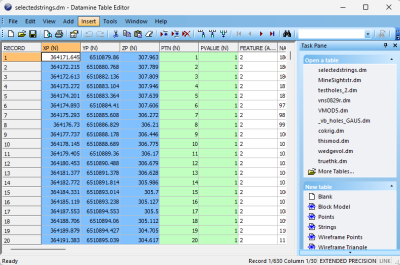
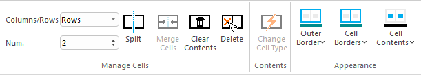
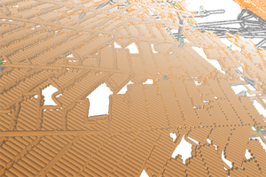
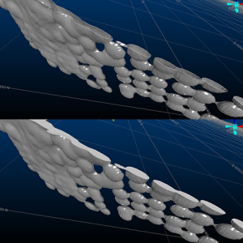
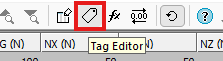

# Studio RM 3.0 Release Notes

### New Datamine File Format

The Datamine file format used natively by Studio products originated from Datamine's "Native File System" over thirty years ago. It has been maintained and supported by Datamine products since then. The mining industry has seen a significant increase in data volume and complexity during this time, which has started to strain the capabilities of the Datamine format. 

Our response to this challenge is a new file format that is more suitable for the current and future data requirements of the mining industry. This format has a new file extension; .dmx. 

Files are smaller and now supports up to 2048 columns. Your application generates .dmx files by default (this can be changed on the **System Options** screen. Both legacy (.dm) and new .dmx format files can be read. Other improvements will follow, as our new format is highly extensible and provides many opportunities to make data handling easier and smarter in the future.

The new format integrates smoothly with modern Studio products and your existing workflows and customization scripts, and the Table Editor can be used to view both legacy and new formats. For bulk file conversion, there's even a useful DM to DMX file conversion utility in the **Data Converter** installation folder should you wish to batch convert input files.

You can recognize .dm and .dmx files in the **Project Files** control bar:

 |  .dmx file |  A file in the proprietary .dmx Datamine binary file format.  
---|---|---  
 |  .dm file |  A file in the legacy .dm Datamine binary file format.  
  
### Plots Overhaul

We've made major changes to the way plots are constructed with this update.

Plots are formed from a collection of plot items, ranging from 3D projections and associated sections, to clip art, text boxes and so on. You asked us to improve the usability of these tools so we've taken a step back and changed our approach to reporting. In a good way.

Plot items are now supported by their own ribbons, displayed whenever a particular plot item is selected, be that a projection, a north arrow, title box or whatever. With your help, we analysed the most commonly-used features and settings and have created a dedicated ribbon of tools for each plot item type. For example, managing the tabular contents of title box cells is now much easier thanks to handy cell managers.

The **Plots (Manage)** and **Plots (View)** ribbons have also been combined.

### Residual Composites

**COMPDH** now supports residual outputs and has a new method for including residuals in the composite output.

### 3D Window Improvements

The display of large data so that it has a lower impact on system and application performance. This includes new, smart settings to control how and when 3D scene data is rendered, making sure the system only has to draw what it needs to. To support these changes, new 3D options have been introduced to control **Environment Settings** (automated scene clipping) and a **Render on Demand** setting (on by default), added to the 3D system settings screen.

### Assign Lithology Improvements

The **Assign Lithology** command's new **Paint** mode lets you iteratively apply drillhole attribute values using standard 3D data selection methods. This can make drillhole coding a lot quicker where you want to interactively assign new attribute values to multiple drillhole segments.

During implicit modelling, drillhole coding changes (via assign-lithology) are also now reflected instantly in the HW/FW/Intercept indicator symbols.

We've also added a shortcut to control whether selected 3D data is appended or alternated when the CTRL key is used, plus a new command **assign-lithology-assign** (quick keys "ala") which can be used to quickly apply the active lithology of the **Assign Lithology** screen to selected drillhole data.

### Filled Wireframe Intersections (Preview)

We've added a new wireframe formatting option to the Wireframe 3D Properties screen: **Fill intersection**.

Wireframe data shown with standard clipping and filled intersection mode

Now, you can display clipped wireframes with solid intersections, emulating a 'filled' volume. This can be really useful when visualizing volumes in cross section.

Note: This feature is still in development, but we thought we'd let you have a look at progress so far. There are some limitations, such as viewing intersections of multiple coincident intersection planes of different colours, but it should give you an idea of what we're aiming for.

### Text Importer

Import one or multiple text files using a new **Text Importer** screen. 

Select as many files as you need to import and configure all importation options on a single screen, including automated and interactive field mapping for your selected data type and preview your file before you import. 

Once you're happy with your settings (which can be set for each individual file if required), store your configuration information in a handy scenario file which can be used to consistently import data in the future and to share with others in your organization.

### Datamine File Tags

With the introduction of the new DMX file format in this version (see above), a new facility arrives for all users; table tagging.

We intend to make use of this new feature in the future, but you can also add your own data tags and values to any .dmx file using the Table Editor, which includes a new **Tag Editor** function on its toolbar:

Add as many tags and associated values as you like. This could be useful, say, to embed the status of a model or other design files, or to provide some implicit spatial context to data (mine, area, level, for example) without requiring additional data attributes.

### New Processes & Commands

  * **COMBTRI** allows up to 20 wireframe files to be combined in a single operation.

  * **INTEXT** You asked for a file-based process to convert text files to Datamine files, so we created **INTEXT**. Either using the data definition specified in the incoming file, or by choosing the definition of another file, import text data using a range of options.

### Command & Process Improvements

  * **extend-segment-virtual-intersect** can now be used on closed strings.

## All Improvements

### Commands & Processes

  * Multiple Cases Your product can now read and write the new Datamine binary format (.dmx) and will automatically convert non-default files in the project folder when a project is opened.

  * Multiple Cases A new scenario-based **Text Importer** lets you import (single or batch) text files as a specified data type.

  * Multiple Cases Several improvements and fixes have been made to improve 3D window visualization.

  * STUDIO-7229 We've added a shortcut to the **Assign Lithology** screen to control whether selected 3D data is appended or alternated when the CTRL key is used.

  * STUDIO-7226During implicit modelling, drillhole coding changes (via assign-lithology) are now reflected instantly in the HW/FW/Intercept indicator symbols.

  * STUDIO-7228 The **Assign Lithology** command's new **Paint** mode lets you iteratively apply drillhole attribute values using standard 3D data selection methods.

  * STUDIO-7227A new command **assign-lithology-assign** (quick keys "ala") can be used to quickly apply the active lithology of the Assign Lithology screen to selected drillhole data.

  * STUDIO-7183When processing categorical and grade shell scenarios, user feedback (errors, warnings) are improved.

  * STUDIO-7009 Project Settings have been added to support MineTrust-enabled projects.

  * STUDIO-7008 The New Project Wizard now lets you pick a MineTrust-aware project.

  * **GEO-426** When re-running Drillhole Importer, previously generated legends can now either be recreated, or previous legends reinstated as default legends for the target field.

  * CORE-9364 Coding drillholes using the Assign Lithology command is now more responsive.

  * CORE-9284 If you create a project using a folder that contains files in a non-native format, they are automatically converted.

  * CORE-9265 By popular request, the "red" quick key combination now launches reduce-points (not simplify-string) as in previous versions. Menu options have also been reinstated.

  * CORE-9240 Plot item locations now remain static when adjust the Relative positioning option for locatable plot items.

  * CORE-9239 You can now interactively pick the target position of a locatable plot item using a new Anchor ribbon button.

  * CORE-9234 DMX data saved from a Studio application now embeds the creating product and version as metadata (tags).

  * CORE-9112 Studio project startups now include a check for local project files in a non-default format, and converting them to the default format.

  * CORE-9030 The new-polygon command has been added to the Digitize ribbon.

  * CORE-9021 Your product's Mesh wireframing library has been updated to version 2.0.1.53.

  * CORE-9006 You can now use the "uc" quick key combination to apply clipping in Plots sheets.

  * CORE-8995 A new Paint Mode has been added to Assign Lithology.

  * CORE-8938 A warning is now displayed when running HOLES3D when the BHID value in the Collar and Survey files doesn't match.

  * CORE-8929 Loaded data objects that have metadata tags display those tags in the Properties control bar.

  * CORE-8918 Supporting plugins for PTCLD2WF and the Point Reconstruction Wizard have been updated.

  * **CORE-8895** In the Project files control bar, when using the context menu on a macro file that contains more than 9 macros, Studio doesn't crash and works as expected.

  * CORE-8876 You can now choose to manually or automatically adjust 3D window clipping planes using the Environment Settings screen.

  * CORE-8860 The "red" quick key combination now runs the **simplify-string** command, not the legacy reduce-points command. Ribbon access has also been updated.

  * CORE-8702 **query-angle** now outputs angle information in degrees, minutes and seconds.

  * CORE-8697 **intersect-drillholes-wireframes** now outputs the intersection angle between drillhole and wireframe.

  * CORE-8556 You can now create a template Unfolding Parameter File in the Table Editor. This file type is now also recognized by the Project Data bar.

  * CORE-8503 Implicit modelling commands, including lithology grouping and assignment, are now modeless and can be launched simultaneously.

  * **Cases:** CORE-8490, CORE-8452, CORE-8357 Front & back 3D window clipping distances now computed automatically based on objects bounding box.

  * CORE-8465 Context-sensitive **Section** and **View** ribbons now support projection editing and creation in the Plots window.

  * CORE-8460The **Plots (Manage)** and **Plots (View)** ribbons have been combined.

  * CORE-8424 Quick filtering wireframes and block models is now much quicker.

  * **CORE-8310** By default, data is now rendered in the 3D view only when required. This makes application usage with large data much quicker with more responsive controls.

  * CORE-8216An **Anchor** ribbon has been introduced to support locatable plot items.

  * CORE-8206 Reloading and refreshing large data objects is now quicker.

  * CORE-8181 Exporting Plots window data to CAD formats has been completely overhauled to provide support for a wider range of data configurations and to improve accuracy for all exported data types. 

  * CORE-8093 Improvements have been made to the way strings and points are rendered in the 3D window, to improve performance.

  * CORE-8047 Changes to the Plots ribbons will now be automatically shared with all Studio products, making forward development quicker and easier.

  * CORE-8012 A new context-sensitive Text Cell ribbon has been created to modify the contents of text cells in title boxes.

  * CORE-7966 You can now overwrite an existing legend instead of having to specify an unused/unique legend name.

  * CORE-7946 Legend box plot item formatting can now be performed using a new Legend Box context-sensitive ribbon.

  * CORE-7732 A new **Text Importer** screen lets you import multiple ASCII text files with per-file configurations and share your importation settings as a scenario.

  * CORE-7694 Symbol plot item formatting can now be performed using a new Symbol context-sensitive ribbon.

  * CORE-7693 Text Box formatting can now be performed using a new Text Box context-sensitive ribbon.

  * CORE-7692 Title box formatting can now be performed using a new Title Box context-sensitive ribbon.

  * CORE-7691 Scale bar formatting can now be performed using a new Scale Bar context-sensitive ribbon.

  * CORE-7690 North arrow formatting can now be performed using a new North Arrow context-sensitive ribbon.

  * **CORE-7279** **extend-segment-virtual-intersect** can now be used on closed strings.

  * CORE-7161 The Create Model Prototype screen now has additional support for both new and copied rotated model prototypes.

  * CORE-7051 **COMPDH** now lets you save residual composites to a new &RESIDUAL output file option.

  * CORE-6906 When creating a ramp string, if the Distance set is less than the minimum segment length, a partial segment is added.

  * CORE-6654 Group Lithology mappings are now saved while the project is open and also if the project is closed. These settings are reinstated with the next use of the command.

  * CORE-2410 A new process - **INTEXT** \- converts text files to Datamine files using an existing data definition and other parameters.

  * CORE-231 We've added a new wireframe visualization option; **Fill intersection**.

  * CORE-68 A new command - **clip-strings-to-wireframe** \- lets you trim string data in relation to a wireframe surface or volume.

### User Experience

  * STUDIO-7223 Studio RM product logos have been updated.

  * GEO-528 In the Drillhole Importer, all table columns are now immediately visible.

  * CORE-9108 The Quick Filters screen now inherits the selected look and feel option.

  * CORE-9086 The INTEXT text import process has been added to the Data ribbon

  * CORE-9085 Combine Wireframes (COMBTRI process) has been added to the Wireframe ribbon.

  * CORE-9084 Clip String to Wireframe has been added to the Digitize ribbon.

  * CORE-8973 The Project Files control bar now differentiates .dm and .dmx formats by distinct icons.

  * CORE-8937 The Project Files and Project Data control bars now display up to 30 macros in a .mac file.

  * CORE-8935 A new splash screen has been implemented.

  * CORE-8906 Large Data Mode has been relabeled "Keep data in front of the camera" to make it clearer what it does.

  * CORE-8851 The Table Editor now supports visual themes.

  * CORE-8765 The **Georeference Objects** screen now inherits current look and feel settings.

  * CORE-8742 Images and colour scheme have been updated for the New Project Wizard.

  * CORE-8499 The Group Lithology and Assign Lithology screens now inherit the current visual theme.

  * CORE-7184 A new 'Dark' look and feel theme is now available in Studio RM.

  * CORE-8601 The Project Data bar now displays the first level of available folders by default.

  * CORE-8488 Icons for the visualization window tabs and control bars have been updated.

  * CORE-5599 Managed task windows, such as implicit modelling and lithology assignment tasks, now persist their docked UI status between project sessions.

### Automation

  * **Multiple** Scripted access to Datamine files has been extended to manage both legacy and new DMX file processes.

  * STUDIO-7117 If executing scripts for implicit modelling, more information is now provided about parameter usage.

### Utilities & Supporting Services

  * CORE-8915 ALS Coreviewer options have been removed from this product. Datamine no longer resells ALS Coreviewer.

  * **Case:** CORE-8759 End User License Agreement references have been replaced with Terms and Conditions.
  * CORE-8747 You can now associate meta data with .dmx files using the Table Editor. This facility is not available for legacy .dm files.

  * CORE-8585 You can now import up to 256 fields via the Surpac driver, and you are alerted if this limit is exceeded.

  * CORE-8564 The obsolete command erase-wireframe-surface has been removed from the ribbon system.

  * CORE-8439 A standalone utility has been created to convert .dm to .dmx files.

  * CORE-8329 A new method more accurately calculates the volume of Prismatic models, as imported by the MineScape Importer utility (minescape-to-blockmodel command).

  * CORE-6986 .xyz files can now be imported when importing Text files to the project.

### Documentation & eLearning

  * STUDIO-7232 Create Vein Surfaces and Create Contact Surfaces automation help has been expanded to include section plane parameters.

  * STUDIO-5486 The SGSIM help file has been extended.

  * STUDIO-4883 The help file describing rotated models in grade estimation has been updated to make the exclusion of folded data clearer.

  * STUDIO-3940 More information about the maximum distance threshold for variogram calculations has been added to the Create Variograms screen (Adv. Estimation) help file.

  * CORE-9348 EXTRA help files, including the examples topic, have been updated for clarity and consistent terminology.

## Additional Defect Fixes

  * **STUDIO-7304** An issue causing COKRIG to fail, while checking for sample compatibility for merging the estimation, has been resolved.

  * **STUDIO-7299** Outlier capping is now functioning as expected for all estimations.

  * **STUDIO-7231** In Advanced Estimation, the Number of Holes output field is no longer unexpected reset to default when displaying the Run Estimation screen.

  * **STUDIO-7213** A data-specific issue causing incorrect estimated values using soft boundary estimation has been resolved.

  * **STUDIO-7102** Issues making it difficult to use point Kriging in Advanced Estimation have been resolved.

  * **STUDIO-7020** An issue preventing MINDIST and AVEDIST fields being populated by COKRIG, in some cases, has been resolved.

  * **CORE-9285** An issue that could cause system failure, when rapidly deleting project files via the Project Data bar, has been resolved.

  * **CORE-9000** Enabling and disabling values in Assign and Group Lithology tasks now shows and hides drillhole intervals as expected.

  * **CORE-8996** An erroneous "No field selected" message no longer appears on the Assign Lithology screen after lithology values have been picked.

  * **CORE-8958** An issue preventing **GETSAMP** from functioning correctly has been resolved.

  * **CORE-8947** 1-letter macro file names now appear in the Project Files control bar as expected.

  * **CORE-8947** SELWF now produces expected results when there are spaces in the field name values of ZONE.

  * **CORE-8867** An issue preventing the successful installation of License Services on some Windows Server platforms has been resolved.

  * **CORE-8848** The double-sided 3D wireframe rendering setting is now correctly saved to the project.

  * **CORE-8811** An issue caused by swapping Snap Mode settings has been resolved.

  * **CORE-8784** Wireframes generated by **SWATHPLT** now include consistently oriented triangles.

  * **CORE-8783** Making a plot item locatable no longer unexpectedly changes that plot item's position.

  * **CORE-8774** Implicit modelling screen expandable groups now appear correctly on 4K monitors.

  * **CORE-8757** An issue causing **PPQQPLOT** to fail with a large input file has been resolved.

  * **CORE-8754** An issue causing system shutdown after reordering georefencing table values (**georeference-objects**), has been resolved.

  * **CORE-8675** An issue causing **converge-segments** to display unexpected results after undoing the operation has been resolved.

  * **CORE-8670** The **BOOLEAN** process no longer fails when the two inputs (in the same run) have a column with the same name but a different data type.

  * **CORE-8610** 3D object bounding boxes, used for 3D view configuration are now set correctly for all string object entities.

  * **CORE-8583** An issue causing an orthographic 3D view corruption where the front clipping plane distance is very large, has been resolved.

  * **CORE-8530** An issue causing system instability, when clipping in the Plots window using a quick key, has been resolved.

  * **CORE-8523** An issue attempting to print screen contents when Info Mode is active has been resolved.

  * **CORE-8479** In Plots, setting a primary clipping width to a value larger than the extent of the section no longer causes the midpoint to be moved outside of the section extents.

  * **CORE-8475** An issue causing unexpected behaviour when snapping at high zoom levels has been resolved.

  * **CORE-8199** When exporting plot data in a vector format, labels are now position correctly if not exported as vectors.

  * **CORE-8087** An issue that could cause a progressive memory leak when reloading a data object has been resolved.

  * **CORE-7713** An issue preventing the automatic generation of legends by data type has been resolved.

  * **CORE-7645** **HOLES3D** now considers dip and bearing information from both a survey and collars file, prioritizing the survey file information. DIPMETH is applied to all data, regardless of source.

  * **CORE-6591** A repetitive warning message in Table Editor relating to undo operation performance can now be disabled as expected.

  * **CORE-6375** When exporting plot data in vector format, grid data is now exported correctly.

  * **CORE-6002** An issue preventing the update of associated screens after renaming 3D overlays has been resolved.

  * **CORE-5460** When exporting plot data to a CAD format, precision issues no longer occur when world coordinates are disabled.

  * **CORE-3477** You can now generate a 2 point vertical plane by selecting 2 vertically-aligned points.