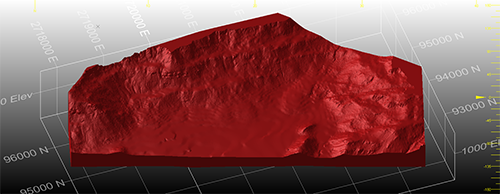
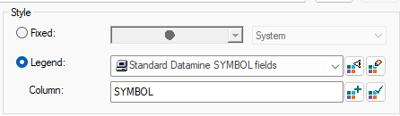
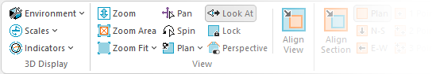
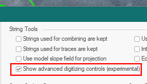
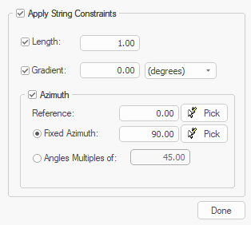
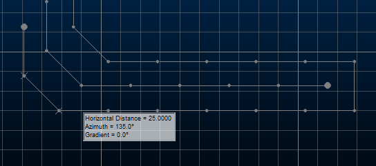

# Studio RM 3.1 Release Notes

## Key Improvements

### Implicit Modelling Improvements

  * You can now choose to model all, selected and/or visible data in any of the implicit modelling commands (Vein, Contact Surface, Categorical Value and Grade Shells).

  * Control the density of output contact surface data using a new Resolution control.

  * By default, all implicit modelling commands now default to snap surface data to the drillhole milestone data positions.

  * You can now colour Contact Surface symbols, additional points, output surface and output contact points using the colour of the stratigraphy.

### Estimation Improvements

  * You can now use the **Show Samples** function to view samples contributing to a particular estimated field and estimation reference, using new controls on the **Estimate** ribbon. 

This is useful where a parent cell includes multiple domains and you are using zonal control or soft boundaries. Just pick the estimated field and estimation reference number to filter the output of the **Show Samples** command.

### Drillhole Importer

**Drillhole Importer** now recognizes even more field names when automatically mapping to system fields, saving time during the initial phase of importation.

### Dynamic Anisotropy Estimation Support

When defining an estimation, you can now choose between Flay lying (horizontal or sub-horizontal) or Inclined (dipping) structural orientation. This introduces the same flexibility already present in the `ANISOANG` process.

### Leapfrog Data Import

You can now import Leapfrog mesh (.msh) and Leapfrog Project Model (.lfm) files using a new Data Source Driver. Data is imported as wireframes.

If importing a Leapfrog Project Model file, you can choose to import all associated mesh data or a subset, and can choose the attribute to use to store the original mesh name, making downstream data management much easier.

The new formats are also supported by Studio's drag-and-drop facility, meaning you can drag one or more files into the 3D view and default load settings are used to create the relevant objects in memory and display them.

### Digitise Doughnuts!

A new design command (`digitise-doughnut`) lets you create closed string data with internal voids. You select the non-overlapping and fully concentric closed string data and a new closed shape is formed automatically. This is particularly useful where you need to, say, capture the shape of internal void structures in a particular rock zone, or in any situation where an enclosed internal structure needs to be represented.

The new command works really well in relation to polygonal map features and outlines. You can even create multiple layers of structure 'nesting' and input closed strings can be at any orientation, providing the internal structures are fully enclosed without overlaps or crossovers.

You can control how new data is created using a new switch (`doughnut-storage-switch`) to choose between modifying an existing perimeter or generating completely new string data.

### Multiple File Loads

You can now import or load multiple files in one operation using new multi-file options. Just pick the files you want to load using a simple browser, and Studio does the rest. You still get to specify load and importation settings, including those specific to a particular driver, but now you can complete the process in a fraction of the time.

To access this function, click **Add to Project** or **External** on the **Data** ribbon and pick your files. 

Either import multiple files to the project or load them directly into memory. These files can be of the same type and format or different ones, meaning you can pick a batch of files of various formats (CAD, BMF, DMX and more) and either add them to the project or load and display them after importation and conversion. This makes light work of importing files from other projects and applications.

To use the previous driver selection method, use a menu option to pick a data type or select the new "by driver" option for project import.

### Legend Tools Update

3D properties and similar screens now use a clearer and expanded toolset for legend management. 

You can still display and edit legends as before, but now there is a dedicated button to create a new legend and (reinstating previous, reportedly popular behaviour) a new button appears to either select the current default legend for the selected column or set the current legend as the default for the current column (with no further prompts or popups).

We've also added the ability to add any colour chip to the unique legend item table in the New Legend Wizard

### COMPDH Field Improvements

`COMPDH `now supports up to 5 ZONE fields to composite within, and five optional fields **DOM1** to **DOM5** can now be specified to record dominant categorical values (by length) within each composited sample. **DOM1** to **DOM5** can be a combination of numeric or up to 32 character alpha fields.

### Geosoft Driver

Geosoft Voxel Models files represent useful geophysical files, also known as _UBC voxel models_. These files contain geophysical inversion data. An import comprises 2 or more files - one file to define the geometry, and 1 or more files containing data values associated with the cells.

To support this new file type a new _Geosoft_ option is available on the **Data Import** screen.

### Safer Scripting

To maintain the highest level of local data security, we've rigorized our scripting interface in Studio products to provide a way to securely instantiate approved ActiveX objects through automation scripts. This provides a safer and more marshalled automation environment. 

In brief, we've introduced a new Studio application method (CreateObject) that can be used in place of the deprecated `new ActiveXObject("Prog.ID");` instruction. A call to something like `window.external.System.CreateObject("Prog.ID");` allows approved ActiveX objects to be instantiated to support your scripts. Most importantly, the ones that provide the highest risk are blocked. 

The **Datamine Studio Script Updater** , accessible via your **Home** ribbon, can update your scripts either individually or as a batch, automatically making them safer to use. 

If you load a script that looks like it could benefit from additional protection, a banner appears atop your display area. This also provides access to the conversion utility:

### Ribbon Standardization

Following your requests to adopt a more consistent ribbon layout between Studio products for core (shared) commands, we've made a few changes for this update. This means your familiarity with one Studio is now useful if using another product in the Studio range. Where possible, we have standardized command grouping and positions for the **Data** , **Format** and **3D View** ribbons. We've maintained specific layouts where a particular operating domain demands it, such as grade estimation, resource modelling, pit design and field mapping functions, so these aren't changing.

We will continue to standardize our ribbons, where appropriate, in future releases.

### Early Access Features

#### Advanced Digitizing Controls

As part of a wider campaign to improve and extend our digitizing tools, we've introduced a new way of creating new string data in this update, and we'd love to know what you think before we finalize things.

`new-string`, arguably the most commonly used design command in any Studio product, has been extended over the years and also supported by a range of other design functions to enhance more 'managed' digitizing often required in the mine planning domain, where design drafting with precise string properties can be critical to an effective design and schedule. The `extend-string` command has been similarly enhanced.

`new-string` and `extend-string` can run in an enhanced mode in this update. By default, both commands behave as before, but there's a new project setting that allows advanced settings to be applied during digitizing to constrain the orientation of the next string segment you create. Located on the **Points and Strings** screen, check **Show advanced digitizing controls** to activate enhanced mode for **new-string** and **extend-string** :

The next use of either command displays a popup allowing you to constrain the length, azimuth and gradient of the next string edge. For constrained angle changes, you can also ensure azimuth changes are made in fixed amounts from the previous string segment:

This can help to ensure operational and design constraints are honoured during digitizing, saving time later by editing and adjusting design data. Help files for both commands have been updated to explain how to use the new controls. You can also press F1 when the new popup displays during digitizing. 

Please let us know what you think of this early-access feature. We value your feedback!

### Other Command & Process Updates

  * `COPYMOD` now supports retrieval criteria.

  * `smooth-gradient` can now be used to fully smooth (start to end) preselected strings.

  * `REBLOCK` now supports retrieval criteria

  * `INTEXT` can now process data using either a data definition (INDD) file or a SETTINGS file, or neither. 

  * `WIREFILL` now supports retrieval criteria.

## All Improvements

### Commands & Processes

  * STUDIO-7369 By default, all implicit modelling commands now default to snap surface data to the drillhole milestone data positions.

  * STUDIO-7338 The fixed colour legend used, when colouring by group with the Create Contact Surfaces command, has been improved.

  * STUDIO-7334 When defining an estimation, you can now choose between Flay lying (horizontal or sub-horizontal) or Inclined (dipping) structural orientation.

  * STUDIO-7300 The COKRIG help file has been extended to include more information about VREFNUM, VSETNUM in input parameter files.

  * STUDIO-7317 When importing estimation and field parameters files into Advanced Estimation, grades are now preselected if possible.

  * STUDIO-7253 The Project Data bar now features 3D and Plots folder items.

  * STUDIO-7221 You can now colour **Contact Surface** symbols, additional points, output surface and output contact points using the colour of the stratigraphy.

  * **STUDIO-7180** You can now manage additional points for the Categorical command in a script.

  * **STUDIO-7178** You can now use the **Show Samples** function to view samples contributing to a particular estimation, using new controls on the **Estimate** ribbon.

  * STUDIO-7094 Control the density of your output contact surface using new Resolution controls.

  * STUDIO-6801 The default discretization for angle estimation by Inverse Distance is now 1x1x1.

  * STUDIO-6584 In Advanced Estimation, left or right spaces are trimmed from the field names while reading the field's parameter file.

  * GEO-823 The Update Surface function in Categorical and Implicit Modelling no longer creates a new surface if one already exists.

  * GEO-720You can now choose to model all, selected and/or visible data in any of the implicit modelling commands (Vein, Contact Surface, Categorical Value and Grade Shells).

  * CORE-9827 .dmx.tmp files are now ignored by the **Project Files** and **Project Data** control bars.

  * CORE-9775 As part of the project to standardize some of the Studio ribbons, icon updates have been made.

  * CORE-9732 Read-only DM files are now converted to read-only DMX files during project or utility-initiated conversion.

  * CORE-9711 Documentation for `EXTRA`'s RAND and RANDBETWEEN numeric functions has been improved.

  * CORE-9649 Block model fields in the Text Importer are now ordered more sensibly.

  * CORE-9604 The default field of view angle for new projects is now 45 degrees (set-view-fov command).

  * CORE-9586 To increase system security, we have blocked the display of online content in the Customization window.

  * CORE-9583 In Files, Fields and Parameters screens running in Dark mode, text in dropdowns is now more readable.

  * CORE-9579 `COMPDH` now supports up to 5 ZONE fields to composite within, and five optional fields DOM1 to DOM5 can now be specified to record dominant categorical values (by length) within each composited sample. 
  * CORE-9578 The Script Recorder now generates syntax that aligns with Datamine's safer scripting practices.

  * CORE-9574The legacy script converter utility has been removed from product distributions.

  * CORE-9561 Rationalization of baggage files for help systems means Studio installation file sizes are now smaller.

  * CORE-9551 The **Datamine Studio Script Updater** has been provided to automatically convert your scripts to more protected versions.

  * CORE-9550 The Studio scripting environment now offers a safer scripting syntax, minimizing the potential impact of malicious thread actors.

  * CORE-9546 New calculated (virtual) fields are now available to calculate the dip angle (_**PDIP**) and direction (_**PDIPDIR**) of the best fit plane through a data object.

  * CORE-9542 A more secure mechanism for data object automation has been implemented. Consult your online help for more details.

  * CORE-9540 You can delete selected 3D overlays of the Project Data using the <DELETE> key.

  * CORE-9539 The **CalculateEdgeMetrics**() method now calculates values for the final edge of a closed perimeter.

  * CORE-9528 The Plots window **Section** and **View** ribbons now have new icons.

  * CORE-9526 It is now quicker to read and process DMX files containing alphanumeric columns.

  * CORE-9522 `WIREFILL` now supports retrieval criteria.

  * CORE-9521 `COPYMOD` now supports retrieval criteria.

  * CORE-9519 `REBLOCK` now supports retrieval criteria.

  * CORE-9490 The Text Importer can now be automated using any Studio product.

  * CORE-9482 The `switch-drillhole-points-traces` command is now available on the Format ribbon (Display Mode group).

  * CORE-9474 The **Text Importer** and `INTEXT` documentation has been extended and corrected.

  * CORE-9473 `INTEXT` can now process data using either a data definition (INDD) file or a SETTINGS file, or neither. 

  * CORE-9449 The **CENTRE** file for the `ELLIPSE` process is no longer dependent on search, variogram or zone parameter file inputs.

  * CORE-9409 An issue causing an unsorted block model to become locked after a previous attempt to load it has been resolved.

  * CORE-9398 In `COMPDH` it has always been the case that if the **LENGTH** field in the input sample file is not equal to **FROM** \- **TO** the **LENGTH** field is set to **TO** \- **FROM**. This behaviour remains, but a maximum of 10 messages are issued in a process run.

  * CORE-9383 The **3D View** ribbon layout is now consistent between Studio products.

  * CORE-9382 The **Format** ribbon layout is now consistent between Studio products.

  * CORE-9378 The **Data** ribbon layout is now consistent between Studio products.

  * CORE-9391 When using the Text Importer, you can now import alphanumeric trace and absent values into a destination field that is numeric.

  * CORE-9340 Unload all overlays of a specific data type using a new **Sheets** and **Project Data** control bar menu option.

  * CORE-9301 Legend controls within various screens have been reverted to more popular legacy behaviour (with improvements) and restyled.

  * CORE-9277 Quick Filter drop down lists now inherit the current look and feel theme.

  * CORE-9252 Project data bar icons for the Plots and 3D folders have been updated.

  * CORE-9233 By request, flat-rendered wireframes are now less shiny.

  * CORE-9229 **Text Importer** scenario files (.dminsv) now appear in the Project Data control bar.

  * CORE-9228 If opening a Text Importer scenario, file detection has been improved and you can now browse for missing files.

  * CORE-9103 The **Project Data** , **Loaded Data** and **Holes** control bars now inherit visual themes.

  * CORE-9097 An issue that could make data picking difficult where data was precisely coincident with the section plane has been resolved.

  * CORE-9082 **Drillhole Importer** now recognizes "Hole_ID" as a BHID mapping type.

  * CORE-9014 All commands relating to the obsoleted **Visualizer** window have been removed from the application.

  * CORE-8999 Tooltips have been added to the **Group Lithology** and **Assign Lithology** tasks.

  * CORE-8980 When adding a new unique value legend item in the New Legend Wizard, you can now add any other colour to the current pallete.

  * CORE-8839 Documentation on snapping to a grid has been improved.

  * CORE-8805 File case names are now preserved in the default overlay when dragging and dropping files into the 3D window.

  * CORE-8763 3D properties and similar screens now use a clearer and expanded toolset for legend management. See you help file for more details.

  * CORE-8699 An issue causing the `insert-by-segment-length` to fail when working with large data has been resolved.

  * CORE-8673 Issues causing unpredictable selection behaviour (or presentation of selected data) in the Plots window have been resolved.

  * CORE-8654 Selecting the outer boundary of a plot sheet now enables the **Manage** ribbon (not the **Home** ribbon as previously).

  * CORE-8625 **Drillhole importer** now recognizes more field names when automatically mapping to system fields.

  * CORE-8519 Studio Data, Report and 3D View ribbons have been made standard in all Studio products other than Studio Mapper.

  * CORE-8510 The **Project Data** control bar now displays files external to the project folder with the same vertical line indicator as the Project Files control bar.

  * CORE-8196 `MODSPLIT` can now output either **MODELOUT** , **FULLMOD** or both. Previously, both outputs were always generated.

  * CORE-8143 It is now quicker to close a project without saving it.

  * CORE-7746 A new command `digitise-doughnut` lets you create complex string data in relation to an external perimeter and one or more closed internal strings.

  * CORE-7506 The **Drillhole Planner** now inherits the current visual theme.

  * CORE-6637 This update features early access to a preview of our advanced string digitizing controls. Constrain the azimuth, length and gradient of new string segments as you draw. Enable this beta functionality using the **Project Settings** screen.

  * CORE-5878 The Project Data bar now permits multiple item selection.

  * CORE-5550 `smooth-gradient` can now be used to fully smooth (start to end) preselected strings.

  * CORE-1878 You can now import or load multiple files in one operation using new multi-file options.

  * GEO-718 The layout of the **Drillhole Importer** screens has been improved.

### Utilities & Supporting Services

  * CORE-9629 This update includes an upgrade to the mesh wireframing engine (2.0.2.54).

  * CORE-9577 Your product installs a major update to License Services (7.0). This introduces encrypted traffic options for enhanced data traffic security.

  * CORE-9536 The Start Page environment has been made more secure.

  * CORE-9481 Data Source Drivers now export virtual data columns.

  * CORE-9362 If using the DmFile SDK, reading and writing records is now twice as fast as before.

  * CORE-8826 You can now import MineScape prism models where data overlaps in Z.

  * CORE-8524 An encrypted traffic option is now available to License Services server administrators. Requires a compatible client installation (7.0 or higher).

  * CORE-8524 We have added a new driver! Import UBC voxel model data using the new **Geosoft** driver option.

  * CORE-8160 The MineScape Block Model Importer has been added to the Data Import screen as a new driver: "MineScape strata model".

  * CORE-6521 You can now import and load Leapfrog mesh and project model file data using a new Data Source Driver.

  * MSO-1558 Documentation for MSO version 5.0 has been completed for this version.

  * MSO-1581 Evaluation method descriptions on the **Report** screen have been updated for consistency and clarity.

## Defect Fixes

  * **STUDIO-7385** When editing contact surface samples for the first time in a project session, the Apply button is now correctly enabled.

  * **STUDIO-7370** An issue preventing `VCONTOUR `from processing DMX files correctly has been resolved.

  * **STUDIO-7363** When using `ANISOANG` with a flat wireframe, variogram model with rotation on Axis-3 in a 3-1-3 rotation no longer produces an unexpected result.

  * STUDIO-7350 The `COKRIG` help file information on **USEPK** and **SAMPOUT** has been corrected to show correct valid values.

  * **STUDIO-7239** Evaluation ribbon options are now correctly enabled for evaluation against drillhole data.

  * **STUDIO-6957** **COUNTFLD** defined in soft boundary/custom zones (zpar file) is now being output correctly in `COKRIG` block models.

  * **STUDIO-6754** An issue preventing variogram fitting of variograms generated via the VGRAM process has been resolved.

  * **GEO-720** You can now choose to model all, selected and/or visible data in any of the implicit modelling commands (Vein, Contact Surface, Categorical Value and Grade Shells).

  * CORE-9921 EXTRA's FLDFAIL parameter's default value of 1 has been reinstated (previously 0) to match earlier application versions.

  * CORE-9919 An issue causing system failure, if v1 or v2 commands were used in conjunction with plane alignment options, has been resolved.

  * CORE-9875 An issue preventing the initial display of colour chips on the Assign Lithology screen has been resolved.

  * CORE-9868 A data-specific issue causing Deswik import to fail has been resolved.

  * CORE-9855 An issue causing issues when snapping and zooming in conjunction with vertical 3D scene exaggeration has been resolved.

  * CORE-9826 An issue preventing the successful import of Deswik wireframe data has been resolved.

  * CORE-9761 Picking of data symbols rendered in 2D in screen space can now be selected as normal.

  * CORE-9745 An issue causing `REBLOCK` to delete the input block model, if additive fields are used, has been resolved.

  * CORE-9717 The Project Data Bar's "Create from Loaded Data" menu option now works as expected.

  * CORE-9716 Grids and Sections folders can no longer be removed from the Project Data bar.

  * CORE-9714 An issue causing the incorrect rendering of 3D drillhole cylinders has been resolved.

  * CORE-9710 Modeless dialogs are now reset as expected when a default profile is reinstated.

  * CORE-9700 When translating strings, points or wireframes, decimal values now persist correctly between dialog sessions.

  * CORE-9673 3D overlay group projections in Plots now react immediately to Project Data or Sheets control bar changes.

  * CORE-9670 The `UNFOLD `wizard now has context-sensitive help.

  * CORE-9653 When importing DXF/DWG points data, the 'Include Hatches' option is no longer displayed.

  * CORE-9642 3D window axis and scale indicators now hide and show immediately following window configuration changes.

  * CORE-9631 The `INTEXT `process no longer stalls indefinitely if settings are unexpected.

  * CORE-9622 An issue causing `SELWF `to run more slowly than expected has been resolved.

  * CORE-9618 An issue causing move-points to pick an incorrect target has been resolved.

  * CORE-9615 An issue preventing the import of a Vulcan block model has been resolved.

  * CORE-9613 An issue causing incorrect display of Information Mode output, if the 3D view was orthogonal to the active section, has been resolved.

  * CORE-9595 The Command Toolbar contents are now more easily visible in Dark mode.

  * CORE-9582 The Move String command is now available again on the ribbon.

  * CORE-9562 Crash reports are now registering successfully in Freshdesk.

  * CORE-9537 DMX files input to transform-coordinates now generates output files usable by Datamine Supervisor.

  * CORE-9518 You no longer see an empty message box when trying to save an object to an open DMX file.

  * CORE-9517 The Text Importer is now storing the Delimeter correctly if not a comma.

  * CORE-9509 The Text Importer now reads fixed width values correctly.

  * CORE-9503 "Ignore Clipping" instructions at the overlay level are now applied immediately.

  * CORE-9499 An issue preventing string editing in plan view with >1 exaggeration in Z has been resolved.

  * CORE-9419 The Point Cloud Reconstruction wizard now automatically generates a scenario on entering a new scenario name.

  * CORE-9403 An issue causing the incomplete display of model cells in intersection at some section orientations has been resolved.

  * CORE-9370 An issue causing unexpected data rounding in `TRIFIL `has been resolved.

  * CORE-9353 An issue causing `SELWF `to fail when processing retrieval criteria has been resolved.

  * CORE-9348 The select-perimeter command no longer behaves inconsistently when called from a script.

  * CORE-9264 An issue causing incorrect IJK values to be generated via the Text Importer has been resolved.

  * CORE-9236 An issue causing the incorrect alignment of a georeferenced image has been resolved.

  * CORE-9231 An issue preventing the successful reinstatement of a UI profile has been resolved.

  * CORE-9100 When transforming coordinates, and converting EPSG 5533 to WGS 84 and exporting to Earth, Lat/Long columns are no longer inverted.
  * CORE-9012 When transforming geographic coordinates, you can now generate output files on a non-primary drive.

  * CORE-8952 The zoom command now accurately centers the screen if the scene is exaggerated.

  * CORE-8794 An issue causing clipped block model data to be rendered invisible, when the clipping section deviates from the major axes, has been resolved.

  * CORE-8696 An issue causing smooth-gradient (smg) to fail with a large string data file has been resolved.

  * CORE-8632 Importing Deswik wireframe data now imports all available attributes. Previously some were not imported.

  * CORE-8582 An issue causing unexpected view navigation in scenes with vertical (Z) exaggeration has been resolved.

  * CORE-8259 3D window section clipping is now reapplied correctly when the section corridor width is changed.

  * CORE-7929 3D plot overlay labels now react to clipping settings as expected.

  * CORE-6800 Studio now supports the concept of a temporary session-only data attribute.

  * CORE-5413 **REBLOCK** no longer fails if there is a space in the file in the project folder.

  * CORE-5270 Unable to cancel (ESC Key) Set Section about a single point

  * CORE-5137 Adding a trailing space to a new project name no longer causes Studio to create 2 project folders.