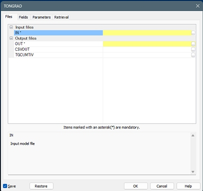
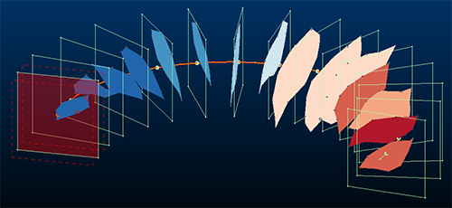
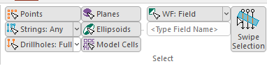
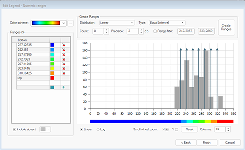
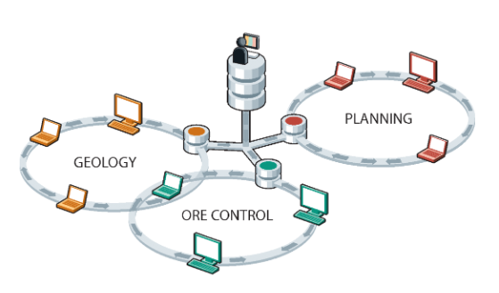

# Studio RM 3.2 Release Notes

Note: Your product supports long field names by default and some functions may now generate field names greater than 8 characters which may be concatenated by very old versions of software when saved.

## Key Improvements

## Process Speedups

Our Optimization team have been hard at work making fundamental changes to how our file-based processes operate, and this has provided significant speedups across all processes (on average, process and - by association - macro completion times have been cut in half).

There are no changes to how the processes are accessed or used interactively, and macros require no changes to take advantages of our engine tune-up. If you use processes in your current workflows, you will certainly notice the difference.

The team will continue to optimize and refactor key functional areas of the Studio range, so expect to see further performance improvements arrive in 2026, including areas such as large data handling and 3D data rendering.

### Create Multiple Sections

The new **Create Multiple Sections** feature significantly streamlines the process of generating and managing sets of parallel or string-based sections for geological analysis and planning. Previously, 3D window users had to manually create each section or edit section definition files outside the 3D environment, which was time-consuming and prone to errorespecially when dealing with off-azimuth sections that required manual coordinate calculations. With this enhancement, you can now quickly define multiple sections in parallel, along a string, or per string, directly within the 3D window, using intuitive controls for orientation, spacing, and reference points. 

Choose fixed or relative section orientations, and automatic or manual reference points, and dynamic adjustment of section spacing and dimensions based on the loaded data. Sections can be saved as definition files for reuse and further analysis, ensuring seamless integration with existing workflows. By automating complex tasks and providing a user-friendly interface, this tool addresses a common gap in geological modelling workflows, empowering you to generate comprehensive section sets with minimal effort and maximum accuracy.

Access the new functionality using the **3D View** ribbon (**Sections >> Multiple Sections**) or run the command `create-multiple-sections` (quick keys "cms").

### Edge Editor

The **Edge Editor** tool, popularized by Studio UG, is now available in Studio RM.

Pick a string, then review its edge coordinate and orientation data, then edit accordingly and precisely. Data can be selected before or after the screen is opened. If string selection changes whilst the screen is displayed, its contents update automatically.

Strings can be edited on an edge-by-edge basis, or you can choose the point at which a transformation should start and then adjust all subsequent edges along the design string in the same way.

Rapidly adjust string segment properties and view changes immediately in the 3D window.

### Selection Settings Simplified

You wanted more intuitive data selection, so we've rationalized and simplified the **Home** ribbon's presentation of these options to make things a lot clearer. Now, a toggle shows, for each data type, whether that data type is selectable or not and we've tackled the more complex case of wireframe data selection by giving access to the various options (by field, by group, by filter and so on) in the same area.

### Design Command Improvements

This update sees the introduction of some new wireframe data commands to make viewing and saving wireframe data easier, and other improvements:

  * `assign-attributes-by-selection-order` You can now automatically apply a suffix or prefix to alphanumeric attribute values generated by selection order.

  * `filter-wireframe-off` Hide selected wireframe data without removing it from memory. If no wireframe data is selected when the command is run, you are asked to select a wireframe face. In this way, faces can be successively removed. This command can also be found on the **Format** ribbon.

  * `hide-non-selected-wireframes` Hide unselected wireframe data, leaving only selected wireframe data visible. Useful for focusing on a subset of wireframe data in a dense set. This command can also be found on the **Format** ribbon.

  * `dtm-create` We added a new Make diagonals consistent option to Create DTM so triangulation is consistent and volumes match expectations where point data is the same across multiple data objects.

  * `write-selected-wireframes` Save currently highlighted (selected) wireframe data to an external Datamine file. Data can be selected by any method, including the selection of independent triangles. This command can also be found on the **Data** ribbon.

  * `grid-dtms` You can now calculate and output True Dip data when creating the minimum or maximum elevations of points belonging to multiple (and potentially overlapping) wireframe surfaces.

### Edit Legend Wizard

In 2025, we introduced a new wizard to take the hassle out of creating a new legend of any type (unique values, range, filter). This was particularly helpful when generating legends from loaded data object values, but also made light work of setting up and managing unique value and filter intervals.

Now, we've extended this facility to existing legends, meaning you can edit legends in a similar way to creating them, using the popular range generation and gap-filling tools already available.

To access this facility, pick a legend and click **Edit Legend** in the **Legends Manager**.

### New Drillhole Selection Modes

A new command - **switch-drillhole-selection** \- lets you pick drillhole data either as entire holes, **FROM** -**TO** intervals, the current display legend or any nominated unique attribute value. This extends the previous all-or-intervals choice. Note that the **toggle-drillhole-selection** command still exists; it now swaps automatically between "Select entire drillhole" and "Select drillhole samples" options.

Note: These options are also available on the **Project Settings >> Drillholes** screen.

### Logs Ribbon

Log sheet functions have been reimplemented using a context-sensitive Logs ribbon that appears whenever a log sheet is selected. This ribbon provides useful hole-log-specific functions including access to hole selection, log properties and sheet scaling commands.

### RocScience Dips Export Driver

A new **RocScience Dips** export driver has been added to the Data Source Drivers set to allow you to export string data in the Dips format, describing dip, dip direction and midpoint coordinate.

### Introducing...MineTrust!

;>)

This update features an early view of our amazing **MineTrust Data Management** system. We've had an exciting time developing this world-beating data synchronization solution for mining and couldn't wait to show you. 

Once that's done, you can synchronize and share data with other Studio users with minimal effort. MineTrust ensures you are all working on the latest version of data and in a highly secure environment. With flexible data control options, you can let MineTrust do all the heavy lifting when it comes to transmitting data to the right place quickly and safely.

MineTrust development continues into 2026 so expect more updates very soon. For more information on configuring MineTrust for your organization, please contact your local Datamine office.

### Documentation & eLearning

  * Multiple Cases The ongoing **Studio Documentation Refresh** project continues unabated with hundreds more topics reviewed, reformatted and (in some cases) rewritten. We're still on track to complete this project in 2026.

## All Improvements

### Commands & Processes

  * STUDIO-7399 Your Start Page now features an "Open MineTrust Project" button to open a shared project directly from the cloud.

  * STUDIO-7196 Studio RM is now available as a localized version for Russian-language speaking customers.

  * Multiple Cases Your product is now supported by the **MineTrust** data management system. Consult your help file for more details.
  * CORE-10138 We have speeded up the loading of Datamine files and updating the Project Data control bar.

  * CORE-10101 The **MAKEDTM** process has a new parameter (@DIAGONAL) to emulate the "Make Diagonals Consistent" switch of the interactive dtm-create screen.

  * CORE-10086 Improved **DmFile performance for DMX files** by optimising default row handling and cache usage to significantly speed up file operations.

  * CORE-10080 Your product now warns you where your graphics capabilities don't match a minimum OpenGL standard required to operate correctly.

  * CORE-10073 The performance of reading and writing Datamine files has been improved, offering general speedups in many functional areas.

  * CORE-10071 The **COPY** process is now much quicker.

  * CORE-10034 The "Make Diagonals Consistent" DTM feature is now accessible from a script.

  * CORE-10021 You can now avoid potential field name and function name ambiguity in the same transform using square brackets to explicitly declare field names.

  * CORE-10004 Added a new Make diagonals consistent option to **Create DTM** so triangulation is consistent and volumes match where point data is the same across multiple data objects.

  * CORE-9986 Default font lookups have been optimized, providing performance enhancements.

  * CORE-9922 Data type filtering commands on the Report ribbon are now supported by undo/redo.

  * CORE-9917 When translating 3D data (translate-point, translate-string and so on) by script, a `RepeatCount` final parameter now accesses the "Repeat" functionality of the interactive command.

  * CORE-9902 Start Page online/offline controls have been reorganized to make their usage clearer.

  * CORE-9895 You can now create a new drillhole attribute using the **Assign Lithology** task.

  * CORE-9895 New wireframe filtering commands have been added to the **Format** ribbon. A new selected wireframe saving command has been added to the **Data** ribbon.

  * CORE-9847 The **Project Data** bar now shows the active section in bold, for clarity.

  * CORE-9846 The **Project Data** bar now highlights unsaved object data changes in italics.

  * CORE-9839 A new context-sensitive **Logs** ribbon reimplements log sheet functions.

  * CORE-9835 **COMBTRI** can now receive up to 62 input files.

  * CORE-9771 A new command - `switch-drillhole-selection` \- lets you pick drillhole data either as entire holes, **FROM** -**TO** intervals, the current display legend or any nominated unique attribute value.

  * CORE-9752 Reloading a script now runs a check for unsafe syntax and displays a warning if it is found.

  * CORE-9752 The **DTS** ribbon no longer appears if DTS is not installed.

  * CORE-9664 The folder browser displayed by the New Project Wizard has been updated.

  * CORE-9597 An issue causing a texture to not georeference correctly has been resolved.

  * CORE-9556 The **Project Data** bar now includes a useful toolbar of file-related functions.

  * CORE-9457 Creating an alphanumeric legend on a large block model is now quicker.

  * CORE-9425 The **Independent View** screen now has a check box to select whether new 3D object overlays should be automatically added, this defaults to unchecked.

  * CORE-9381 **Report** ribbon items that are common to all Studio products now appear in the same arrangement throughout the product range. Product-specific items remain.

  * CORE-9377 **Home** ribbon functions common to all Studio products now appear in the same arrangement throughout the product range. Product-specific items remain.

  * CORE-9355 Long field name support is now provided and expected in all Studio products.

  * CORE-9056 Project file browsers have been updated in line with modern Studio product file types.

  * CORE-8970 Data selection toggles and options have been simplified on the Home ribbon.

  * CORE-8569 Enhanced error reporting has been added to the `fillet-single-string-point` command.

  * CORE-8432 Feedback information when using extend-segment-virtual-intersect has been improved.

  * CORE-8432 The **grid-dtms** command can now output True Dip values in addition to thickness analysis.

  * CORE-7975 You can now edit existing legends using the **Format Legend** wizard, as well as creating them.

  * CORE-3204 The new **Create Multiple Sections** tool lets you create sections throughout your data using a range of options.

  * CORE-1953 Hide selected wireframe data (`filter-wireframe-off`), hide unselected wireframe data (`hide-non-selected-wireframes`) and write selected wireframe data to a file (`write-selected-wireframes`) using new commands.

  * OP-3893 Design Direction controls on the Preparation screen no longer appear if there are no FXS design data.

### Utilities & Supporting Services

  * CORE-9967 The DM to DMX file converter is now supported by a desktop shortcut.

  * CORE-8754 A new **RocScience Dips** export driver has been added to the Data Source Drivers set to allow you to export string data in the Dips format, describing dip, dip direction and midpoint coordinate.

  * CORE-7272 The **Edge Editor** is now available in this product. Use it to dynamically adjust string edges.

### Documentation & eLearning

  * Multiple Cases The ongoing **Studio Documentation Refresh** project continues unabated with hundreds more topics reviewed, reformatted and (in some cases) rewritten. We're still on track to complete this project in 2026.

### Automation

  * STUDIO-XXX TBC

## Defect Fixes

  * STUDIO-7315 Missing tool tips have been resolved on the Create Vein Surfaces screen.

  * STUDIO-6249 Swipe selection now works as expected when selecting samples via the Create Categorical Surfaces task.

  * CORE-10164 When STATS is run with @PRINT=0 the message: "WEIGHTING FIELD: ...." is no longer output multiple times

  * CORE-10151 SWATHPLT no longer uses substitution variable names as file names if output files SWATH1 and/or SWATH2 are not defined.

  * CORE-10057 An issue causing a driver load error message, when converting Leapfrog data via the Data Converter, has been resolved.

  * CORE-10053 An issue preventing the display of context-sensitive help of some Data Source Driver screens has been resolved.

  * CORE-10038 Loaded block model prototypes are now listed as expected in the Project Data bar's 3D folder.

  * CORE-10020 The Project Wizard's help button now displays the expected help content.

  * CORE-10019 An issue causing HOLES3D to fail where a field name also matched an EXTRA function name, has been resolved.

  * CORE-10011 The quick key for `doughnut-storage-switch` has been changed to "ddss" to avoid ambiguity with the delete-string-segment command.

  * CORE-9985 The GetTag method on the DmFile table object now returns the expected tag value using Javascript.

  * CORE-9873 Swipe selection can now be used when selecting samples using the Assign Lithology tool's Paint mode.

  * CORE-9863 An issue causing unexpected rendering of block model cuboid edges with clipping applied.

  * CORE-9825 SWATHPLT is now faster when @ANGLE1,2 and 3 = 0 (unrotated swaths).

  * CORE-9799 We have updated DMX model loading so that dragging and dropping a DMX file that is already loaded now creates a new overlay instead of showing an error, while other load methods keep the existing warning.

  * CORE-9697 An issue causing WIREPE to create strings at incorrect intervals has been resolved.

  * CORE-9680 The @CHECKROT parameter is now working as expected in SELPER.

  * CORE-9657 We have updated the MineScape Model Importer so it can no longer be opened multiple times at once, preventing the system instability caused by closing one of the duplicate dialogs.

  * CORE-9634An issue causing SELPER to print unexpected output file alphanumeric values has been resolved.

  * CORE-9576 If section auto-alignment is enabled, this is now applied as expected when swapping sections via the Sheets control bar.

  * Ellipsoid selection buttons (Home ribbon) are now only enabled if ellipsoid data is loaded.

  * CORE-9183 SWATHROT now runs as expected in Studio RM.

  * CORE-9064 An issue causing some parts of a rotated model to be ignored when using SWATHPLT has been resolved.

  * CORE-8492 The Find Command screen now lists 'tra' as the quick key for string and point translation commands.

  * CORE-8819 You can now redo `extend-segment-virtual-intersect` operations as expected.

  * CORE-7057 Fixed an issue where Calculate Wireframe Volume did not report separate volumes and spatial statistics for each key field value, ensuring results are now correctly split by the selected key field.