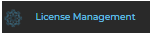
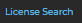
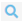
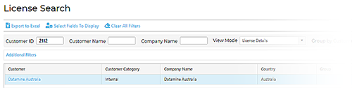
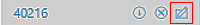
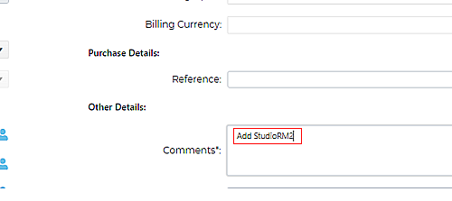
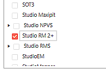

# Studio RM V2 and Studio RM Pro Licensing Changes

Technical Note: IN00092

**Important** : **This document is not for general circulation**. A public version of this document is available on the Datamine Support Website.

## Background

**Note** : Throughout this document, Isatis.neo is a shorthand representation of Isatis.neo Mining. Any reference to Studio RM V2 relates to the publicly released version of Studio RM 2.0.

Datamine Studio products automatically install or upgrade **Datamine License Services** , a support service used to protect your software from unauthorized use.

Prior to November 2023, Datamines Studio resource modelling functionality was delivered primarily using two product variants; **Studio RM** and **Studio RM Pro** , with the latter including the additional Advanced Estimation module functionality. These applications were independently licensed.

To make things simpler and to provide more value to customers, all maintained Studio RM customers will now automatically receive the Advanced Estimation functionality within **Studio RM V2** as part of their maintenance.

Studio RM Pro will continue to exist as a bundled offering of Studio RM V2 and Supervisor, but going forward it will include Isatis.neo.

### Studio RM Pro Changes from November 2023

From **November 2023 onwards** , a single Studio resource modelling product is available; **Studio RM**. This starts with V2.

Studio RM V2 and later versions require a new license - Studio RM 2+. This is available from both the corporate licensing server and the License Kiosk (see "Accessing Licenses", below.

Studio RM Pro remains as a bundled offering and now includes:

  * Studio RM V2

  * Supervisor 

  * Isatis.neo

Clients who **purchased Studio RM Pro prior to November 2023** will have access to Studio RM V2 and Supervisor, with discounted upgrade options for including Isatis.neo within the bundle.

The contents of the Studio RM Pro bundle before and after November 2023 is summarised in the table below.

Before November 2023 | After November 2023  
---|---  
Studio RM Pro | Studio RM Pro  
Studio RM V1 plus the Advanced Estimation module |  Studio RM V2  _Includes Advanced Estimation functionality as standard. (The Advanced Estimation licensed module is discontinued.)_  
Supervisor | Supervisor  
| Isatis.neo (supported by Datamine License Services)  
  
# Studio "RM 2+" License

Studio RM V2 requires a new license to run it (Studio RM 2+). 

**Important** : Studio RM 2+ is an **UPGRADE** license and must be bound to a qualifying Studio RM or Studio RM Pro license. DO NOT issue customers additional UIDs and therefore additional licenses for this purpose.

This license is different to previous Studio RM and Studio RM Pro versions.

**Studio RM V2 will not operate with a Studio RM or Studio RM Pro license** issued prior to November 2023. For clients with maintained Studio RM and Studio RM Pro licenses, these legacy licenses will continue to be available for the duration of the maintenance period.

Legacy Studio RM and RM Pro maintenance keys will no longer be issued.

# Studio RM V2 Rollout Guidelines

  * Clients can upgrade a legacy version of Studio RM to version Studio RM V2 or later (although a new license is needed - Studio RM 2+).

  * Clients cannot upgrade a Studio RM Pro installation with a Studio RM V2 installer. This has always been the case.

  * **Studio RM 2.0 will be released in November 2023**. 

At this point:

    * You can issue maintained customers with a **bundled Studio RM and a Studio RM 2+ licence** (on the same UID). This will grant access to legacy versions of Studio RM (versions 1.13 and lower) and current versions (Studio RM V2 and higher) for the duration of their maintenance period.

**Solution-bound licenses** should be automatically replaced with a bundled license that allows legacy and new Studio RM products to operate on client machines. Manual solution adjustment is not required.

    * Otherwise, for clients moving to Studio RM V2 completely (no requirement to fall back to legacy versions), **issue Studio RM 2+ licenses** to cover their current license quota if they plan on running Studio RM 2.0 or later. Licenses must be issued using the same license ID as their legacy licenses, to replace them.

  * **Existing Studio RM Pro users**. Isatis.neo is not provided for free. Instead there is an upgrade fee to add Isatis.Neo Mining to the licence bundle. Consult the pricing handbook for details.

  * **Users not ready or willing to upgrade** : if there is a valid reason not to upgrade and maintenance is up to date, legacy keys can be extended. If a program defect is preventing you from moving forward with Studio RM, find out what the problems are and report them asap via JIRA.

  * **Regardless, at the next issue of maintenance key(s)** for your organization, issue Studio RM 2+ keys to allow Studio RM V2 or later versions to run. Keys for the retired products will expire and those legacy products are no longer accessible/supported.

  * The newly issued Studio RM 2+ license is bound to legacy key(s), meaning licenses can only be installed, checked out or locked on one PC. It isn't possible to 'split' a new license up to access products separately.

  * We are not planning to patch legacy Studio RM or Studio RM Pro versions, other than in critical circumstances.

# Script Compatibility

**Previous Studio RM Pro customers may need to update their scripts**. If so, the changes are trivial.

This information is also available in the public document and Studio RM 2.0 Release Notes:

  * **Legacy Studio RM users** : no script changes are required. Scripts will continue to operate in RM V2 or later versions without modification.

  * **Legacy Studio RM Pro users** : if script(s) instantiate the DmStudioApplication directly, by referencing its registered class, such as:
        
        variable = new ActiveXObject("StudioRMPro.Application");  
  
---  
  
the ActiveXObject reference should be changed to:
        
        variable = new ActiveXObject("StudioRM.Application");  
  
---  
  
If accessing the Datamine Application object via the ScriptHelper class, or window.external, no changes are necessary.

# Accessing Licenses

## Definitions and Terminology

The following terms are used throughout this section:

  * **UID** : The unique identifier for a license.

  * **Bind** : Link a license to another or itself.

  * **Full** : A perpetual license.

  * **Renewable** : An expiring license.

## Prerequisites

Before you start, a qualifying (maintained **Full** or current **Renewable**) **StudioRM** or **Studio RM Pro** license UID must exist.

## License Generation Process

Licenses for clients are always created using the **Datamine License Kiosk** at:[https://kiosk.dataminesoftware.com](<https://kiosk.dataminesoftware.com/>)

  1. Log into the License Kiosk.

  2. Click **License Management**.

  3. Click **License Search** :

  4. Use the **License Search** panel to enter search parameters and click the Magnifying Glass ()to isolate client Studio RM or Studio RM Pro licenses to replace.

  5. Click the customer name to display the licenses assigned to the customer, for example:

  6. Click **Review License** on the line for the required UID, for example:

  7. On the **Review License** screen, add a comment "Add StudioRM2":

  8. Click **Proceed to Generate**.

The **Generate Temporary / Permanent License Key** screen displays.

  9. If **Bind to License Id** is **unchecked** , **check** it.

  10. Clear any existing value in the **Bind to License ID** field.

  11. In the **Products and Components** list, select (only) _Studio RM 2+_ :

  12. Click **Generate**. 

A new license is generated, bound to the selected UID and ready for issue.