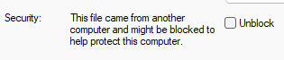

# Strat3D 2.3.22.0 Patch

Technical Note: TN00451

## Background

Datamine's **Strat3D** application is a legacy product for stratigraphic modelling, last released in January 2022. **Strat3D** expects a 32-bit version of Table Editor (and associated components) to be installed in order to read from and write to physical ".dm" files.

With the advent of 64-bit applications and the newer DMX format, Studio applications now install a 64-bit, DMX-ready Table Editor. This is, unfortunately, incompatible with Strat3D and prevents some aspects of the stratigraphic modelling workflow from completing successfully.

This document describes how to resolve this problem to run Strat3D and modern Studio applications on the same PC.

### Symptom

Where an incompatible version of Table Editor exists (usually as the result of a newer Studio application existing on the same PC), Strat3D exhibits failing behaviour when building the stratigraphic model. Instead of building a model successfully, an error appears in the output console, for example:
    
    
    Cannot load fault data from File : name FAULTS, path .\Inputs\faults, type STRINGS
    
    
    Cannot load faults from File : name FAULTS, path .\Inputs\faults, type STRINGS
    
    
    Cannot load faults
    
    
    Failed to complete drill hole validation

## Solution

To resolve this issue and allow both Strat3D and modern Studio product versions to run on the same PC, a hotfix patch is required.

You can download this patch from the [Datamine Customer Portal](<https://support.dataminesoftware.com/software/74950312-c0e2-444e-96d8-6995edcbb1cf>).

To patch Strat3D:

  1. Close all running Studio applications.

  2. If you haven't done so already, **upgrade your version of Strat3D to 2.3.22.0** (the latest available version). You can access this version on the Datamine Customer Portal.

  3. Download the patch component (`Strat3D_3.2_DmFile_Patch_2025.zip`) using the link above.

Note: This archive has been virus-checked and is downloaded from a secure location. It is safe to download and unpack.

  4. Unzip the archive.

  5. Right-click the ZIP file and select **Properties**.

  6. On the General tab, at the bottom of the screen, look for the following **Security** controls (English operating system image - may be different on your system):

If present, click **Unblock** and **OK**.

  7. Extract the archive components to a new temporary folder. The archive contains the following files:

     * `Fix.bat` A batch file to install the updated components below. You'll use this shortly.

     * `Filter.dll`

     * `DmFile.dll `

     * `BuildDrillholeModel.exe`

  8. Right-click each of the four files and check for the same **Security** controls if present. If so, Unblock the files.

  9. Right-click the `Fix.bat` file and choose Run as Administrator.

Important: Administrative level running is important to ensure the successful copying of files into the protected **Strat3D** installation folder.

  10. Launch **Strat3D**.