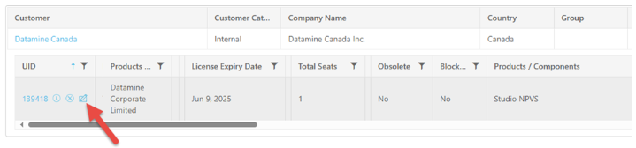
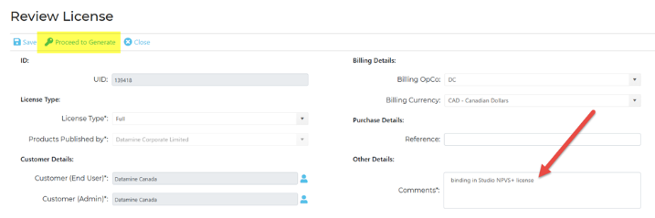
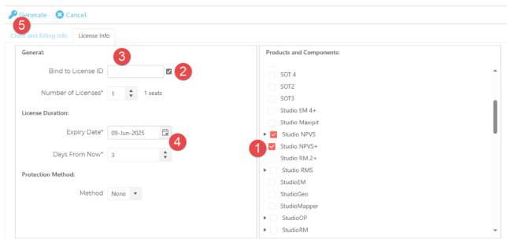
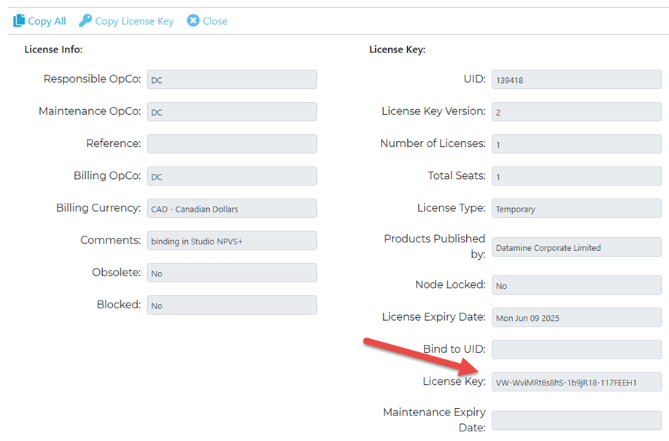
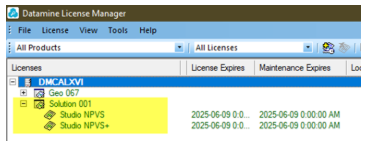
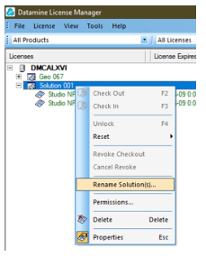

# Studio NPVS License Upgrade

Technical Note: TN00450

To upgrade a Studio NPVS license to include Studio NPVS+:

  1. Locate the customer's existing Studio NPVS license in the License Kiosk ([https://kiosk.dataminesoftware.com](<https://kiosk.dataminesoftware.com/>)).

  2. Make a note of the **License Expiry Date** (if Renewable) or **Maintenance Expiry Date** (if Full), then click Review License:

  3. Add an appropriate comment, then click Proceed to Generate:

  4. To create the license key:

     1. Add the **Studio NPVS+** license.

     2. Check **Bind to License ID**.

     3. Clear the contents of the **Bind to License ID** text field.

     4. Re-enter the correct expiry date noted above.

     5. Click **Generate**.

  5. The license key appears here:

  6. When the key is registered in **Datamine License Manager** , the bound licenses automatically appear together in a _solution_. Locking one license in the solution automatically locks the other as well:

  7. From the License Manager of the host machine, the solution can be given a custom name:

