 |  Adding Tag Strings Adding Tag Strings  
---|---  
  
# Overview

In this part of the tutorial you will add Tag Strings to an existing geological ore body strings model.

## Prerequisites

  * Completed the [Creating a New Project](<Creating_a_New_Project.md>) exercise.

  * Completed the [Defining Geological Modeling Settings](<Defining_Geological_Modeling_Settings.md#Exercise1>) exercise.

  * [Files](<Tutorial_Files_List.md>) required for the exercises on this page:

  *     * _vb_holesc.dm

    * _vb_min2st.dm

    * _vb_stopo.dm

    * _vb_viewdefs.dm

## Exercise: Adding Tag Strings to a String Model

In this exercise, you will add Tag Strings to the existing ore body strings model _vb_min2st.dm. The strings will link the northern and southern ends of the upper and lower mineralized zone strings between adjacent N-S sections which are spaced 25m apart. They will be digitized from west to east and will be colored red (default setting). The modified strings model will be saved to the file min3st.dm.

There will be six separate strings for each of the top and bottom edges as follows:

  * top southern edge of the upper zone
  * bottom southern edge of the upper zone (shared with the top southern edge of the lower zone)
  * bottom southern edge of the lower zone
  * top northern edge of the upper zone
  * bottom northern edge of the upper zone (shared with the top northern edge of the lower zone)
  * bottom northern edge of the lower zone.

The image below shows the modified strings model (Tag Strings are shown in red), relative to the drillhole and topography surface data:

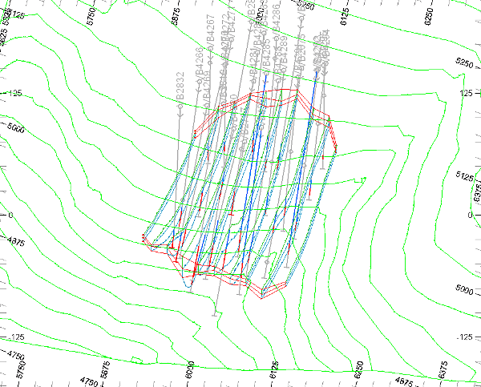   

 |  Add Tag Strings to an existing strings model in order to:

  * control the exact placement of wireframe edges;
  * overcome the problem of twisted wireframes associated with complex geometries.

  
---|---  
 | Tag Strings allow advanced control options in the String Linking wireframing command, and are:

  * added to a string model in order to optionally guide subsequent wireframe creation techniques;
  * optional in the case of simple string models, but are generally needed when modeling complex geometries;
  * saved as part of the string model with which they are associated (stored in the same file or table).

  
---|---  
  
## Loading and Formatting the Data

  1. Unload any data you currently have loaded, and display the 3D window.

  2. In the Project Files control bar, select the All Tables folder.

  3. Drag-and-drop the following files (if not already loaded) into the 3D window:  

     * _vb_holesc

     * _vb_min2st

     * _vb_stopo

     * _vb_viewdefs

  4. Select the Sheets control bar and expand the 3D-Overlays folder.

  5. Select only the following check boxes (i.e. display these objects):  

     * Grids folder -Default Grid

     * Strings folder -_vb_min2st (strings)

     * Sections folder -_vb_viewdefs

  6. In theView Controltoolbar, clickGet View'gvi'.
  7. In theCommandtoolbar,Run Command field, type in '2', press <Enter>.
  8. In theView Controltoolbar, clickZoom All Data.
  9. If it exists, delete theDefault Sectionitem from theSheets | 3D | Sectionsfolder, then double-click the_vb_viewdefsitem
  10. Disable theUse Dimensionscheck box and click the right arrow until the 'Inclined View' is shown in the left hand. Disable theSection Plane - Fillcheck box and clickOK.
  11. Disable the view of theDefault Grid, using theSheetscontrol bar.
  12. Click theLockicon on theViewribbon.
  13. In the 3D window confirm that the 'Inclined View' of the composited static drillholes, topography contours and ore body strings is displayed as shown below:  
  
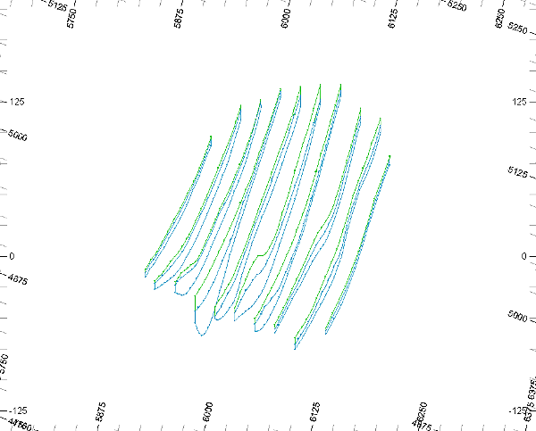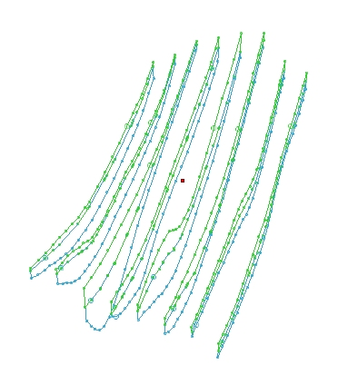  
  

| 

  * The data is shown looking from above and the southeast.
  * The mineralization zone strings lie in vertical N-S orientated planes, spaced 25m apart.

  
---|---  
  
## Creating a Working Copy of _vb_min2st.dm (strings) 

  1. In the Sheets control bar, right-click _vb_min2st (strings) object, and select Data | Save As.

  2. In the Save New 3D Object dialog, click Extended Precision Datamine (.dm) File.

  3. In the Save _vb_min2st (strings) dialog, select your project folder, define the File name: as 'min3st.dm', and click Save.
  4. In the Sheets control bar, confirm that _vb_min2st (strings) has been replaced by min3st (strings).
  5. In the Sheets Control bar, select min3st (strings).
  6. Double-click min3st (strings) to make it the current object.

| The current object is highlighted in black in the Loaded Data control bar, and is also listed in the Current Objects toolbar.  
---|---  
  
## 

## Setting the Tag String Color

  1. Display theStructureribbon
  2. Expand theTag Stringmenu to selectTag String Color
  3. In theStudio RMdialog, confirm that theTag String Colour:is set to '2' (default setting), and clickOK.  
  

## Digitizing the Tag String for the Top Southern Edge of the Upper Mineralized Zone

  1. Activate theViewribbon and useZoom Areaand define a zoom rectangle around the southern edges of the first five (from the left) mineralization zone strings.
  2. Activate theHomeribbon and check thatSnapmode is set to points
  3. Activate theStructureribbon and select the top-levelTag Stringcommand
  4. Digitize the first five string points by snapping (right-click) to the zone string points shown below - but don't clickDone\- you'll need to continue digitizing in the following steps:  
  
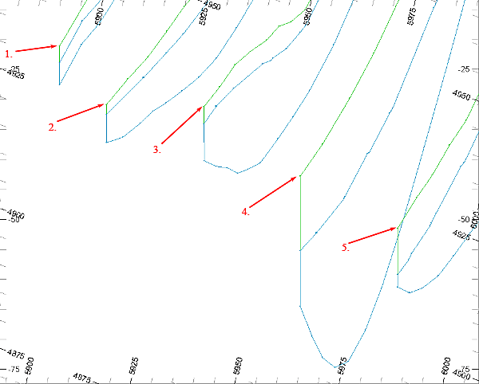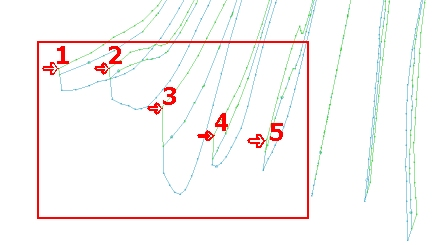  

  5. You should now see this:  
  
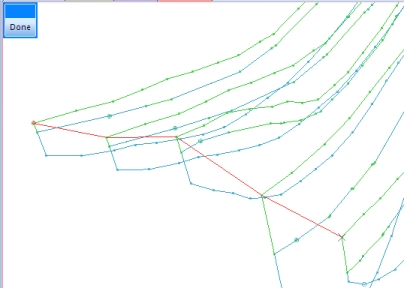  
  

  6. Press <Left Arrow> and <Up Arrow> to move across and up to the southern end of the next five sections.
  7. Digitize the second batch of 5 string points by snapping (right-click) to the zone string points shown below:  
  
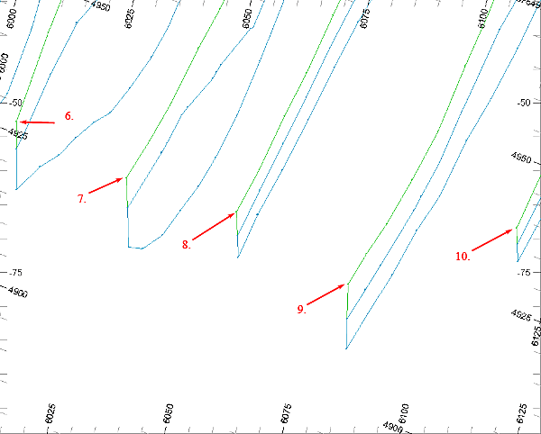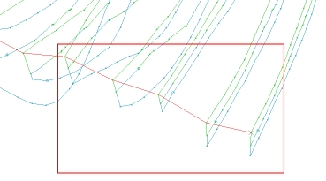
  8. ClickDone
  9. CllickZoom Outand confirm that your Tag String is as shown below:  
  
  
  
| The Tag String should contain a total of 10 points.  
---|---  
  10. In the 3D window, check the positions of the Tag String points relative to the zone string corner points.

## Digitizing the Tag String for the Bottom Southern Edge of the Upper Mineralized Zone

  1. Using steps 1. to 7. of the above section, digitize a second Tag String using the 10 points shown in the two images below:  
  
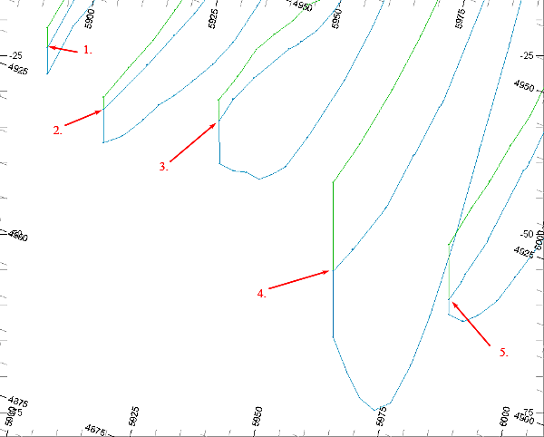  
  
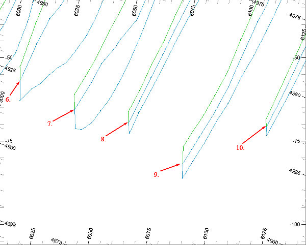  

  2. Cllick Zoom Out and check that your Tag String is as shown below:  
  
  

| The Tag String should contain a total of 10 points.The first Tag String is not shown above, but will appear in your view.  
---|---  
  3. In the 3D window, check the positions of the Tag String points relative to the zone string corner points.

  4. In the Loaded Data control bar, right-click on the min3st (strings) object, select Save.  

## Digitizing the Tag String for the Bottom Southern Edge of the Lower Mineralized Zone

  1. Using steps 1. to 7. of the first digitizing heading, digitize a second Tag String using the 10 points shown in the two images below:  
  
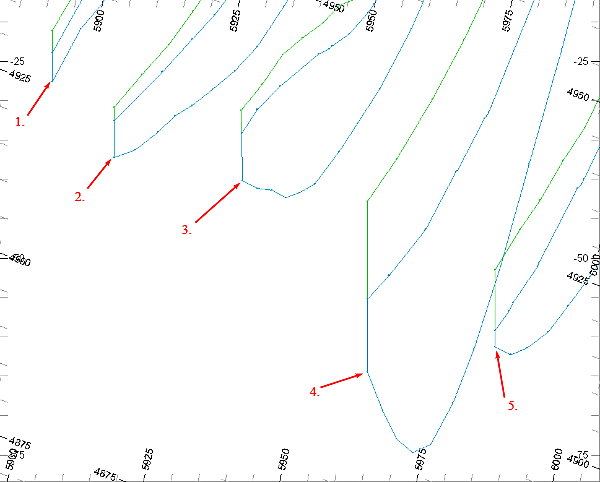  
  
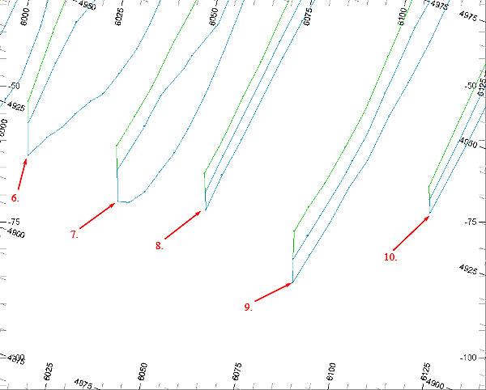  

  2. Cllick Zoom Out and check that your Tag String is as shown below:  
  
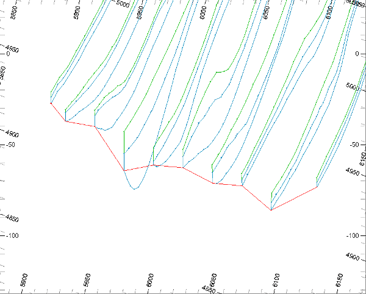  

| The Tag String should contain a total of 10 points.The first and second Tag Strings are not shown.  
---|---  
  3. In the 3D window, check the positions of the Tag String points relative to the zone string corner points.

  4. In the Sheets control bar, right-click on the min3st (strings) object, select Save.

## Digitizing the Tag String for the Top Northern Edge of the Upper Mineralized Zone

  1. Digitize another 3 tag strings, this time along the southern fault line:  
  
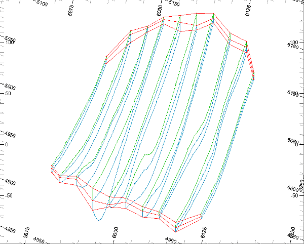  

 | 

  * There should be 6 red Tag Strings.
  * They should all be open strings.
  * The start point of each string has a larger point symbol than the other string points.

  
---|---  
  
  1. In the Sheets control bar, right-click on the min3st (strings) object, select Save.

| Your tagged extended ore zone strings can be checked against the example file _vb_min3st.dm  
---|---  
  
## 

## Checking the Tag Strings in the Table Editor

  1. In the Project Files control bar, Strings folder, double-click min3st.

  2. In the Table Editor dialog, check that the ten new strings, with an additional field TAG, tag values 1 to 6, have been added:  

 | 
     * The table should contain 60 new records, 10 for each of the 6 new tag strings.
     * Tag Strings are identified by the field TAG containing a value greater or equal to '1'.
     * All other strings have TAG set to '-'.  
---|---  
  3. In the Table Editor dialog, select File | Exit.

| See the Command Table in the Help documentation for a comprehensive list of Processes and their uses.  
---|---  
  
##  [Next Page](<Conditioning_Section_Strings.md>)