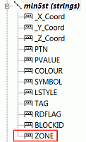
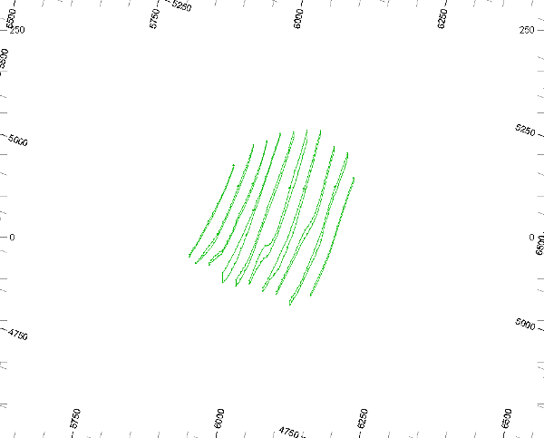
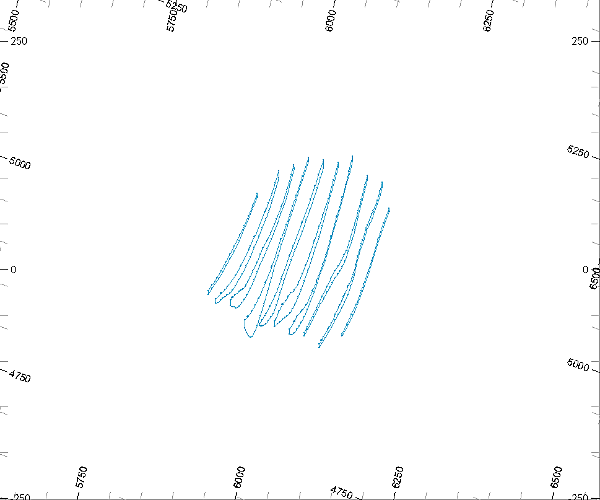
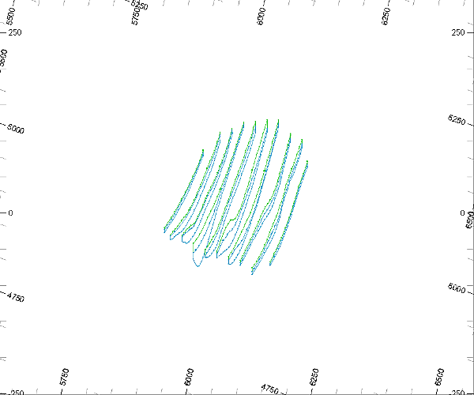

 |  Adding ZONE Attributes to the String Model Adding a ZONE attribute field to the string model  
---|---  
  
# Overview

In this part of the tutorial you will add a numeric attribute field ZONE, and edit its values in the ore body string mode.

 |  See the exercises [Adding ZONE Attributes to the String Model - EXTRA](<Adding_a_ZONE_Attribute_to_the_String_Model_-_EXTRA.md#Exercise1>) and [Adding ZONE Attributes to the String Model - Table Editor](<Adding_a_ZONE_Attribute_to_the_String_Model_-_Table_Editor.md#Exercise1>) for alternative methods of adding and editing attributes.  
---|---  
  
## Prerequisites

  * Completed the [Creating a New Project](<Creating_a_New_Project.md>) exercise.

  * Completed the [Defining Geological Modeling Settings](<Defining_Geological_Modeling_Settings.md#Exercise1>) exercise.

  * [Files](<Tutorial_Files_List.md>) required for the exercises on this page:

  *     * _vb_holesc.dm

    * _vb_min2st.dm

    * _vb_stopo.dm

    * _vb_viewdefs.dm

## Links to exercises

The following exercise is available on this page:

  * Adding Attributes to the String Model Using Design Window Tools

## Exercise: Adding Attributes to the String Model Using Design Window Tools

In this exercise you will use 3D window tools to add a numeric attribute field ZONE to a working copy of the ore body string model _vb_min2st.dm . The strings will the be edited to add the ZONE values as displayed by the static drilhole data. This attribute will have a value of '1' for the upper (Green 5) and a value of '2' for the lower (Cyan) mineralized zone strings.

The adding and editing of attributes will be assisted by filtering of the string model data.

 | Add the following attributes to the ore body string model:

  * Add a mineralization zone field to allow grade estimating control by zone (default field name ZONE) when usingGRADEorESTIMATE.
  * Add sufficient custom attribute fields to allow data to be filtered, processed, colored and annotated.

  
---|---  
 | 

  * Custom attributes placed in the ore body string model can be transferred to both wireframe models and block models.
  * Adding and editing attributes using the methods in this exercise are not recordable. 

  
---|---  
  
 | 

  * Custom attribute fields should not have the same name as restricted system fields.
  * Do not add attribute fields with the same name, but with different properties to different objects ( for example, field type, or field length)

  
---|---  
  
## Loading and Formatting the Data

  1. Select the Project Files control bar, All Tables folder.

  2. Drag-and-drop the following files into the 3D window:

     * _vb_holesc

     * _vb_min2st

     * _vb_viewdefs

  3. Select the Sheets control bar and expand the Design-Overlays folder.

  4. Select only the following check boxes (i.e. display these objects) :

     * Default Grid

     * _vb_holesc (drillholes)

     * _vb_min2st (strings)

  5. Double-click on the_vb_holesc (drillholes)overlay.
  6. In the Format Display dialog, Overlays tab, Overlay Format group, Drillholes tab, click Format....

  7. In the Drillhole Traces dialog, static Drillholes tab, select theColor tab.

  8. In the Color tab, select the Legend: [ ZONE (_vb_holesc)], and the Column: [_vb_holesc (drillholes).ZONE] .

  9. In the Labels tab, select Collar, and click Apply and OK.

  10. In the Format Display dialog, click Apply and OK.

  11. In theView Controltoolbar, clickGet View'gvi'.
  12. In theCommandtoolbar,Run Command field, type in '2' and press <Enter>.
  13. In theDesignwindow confirm that the 'Inclined View' of the upper (Green 5) and lower (Cyan 6) mineralization zone strings and static drillholes colored on ZONE are displayed, as shown below:  
  
  
  

The mineralization zone strings lie in vertical N-S orientated planes, spaced 25m apart.

The static drillholes are colored on ZONE, where:

     * the upper mineralization zone (ZONE=1) is colored blue

     * the lower mineralization zone (ZONE=2) is colored red.

| The data is shown looking from above and the southeast.  
---|---  

## Creating a Working Copy of _vb_min2st (strings) 

  1. In the Loaded Data control bar, right-click _vb_min2st (strings) object, and select Data | Save As.

  2. In theSave New 3D Objectdialog, clickSingle Precision Datamine (.dm) File.
  3. In theSave _vb_min2st (strings)dialog, select your project folder, define theFile nameas 'min5st.dm', and clickSave.
  4. In theLoaded Datacontrol bar, confirm thatvb_min2st (strings)has been replaced bymin5st (strings).
  5. In theSheetscontrol bar, selectmin5st (strings).
  6. Double-clickmin5st (strings)to make it the current object.  
| The current object is highlighted in black in the Loaded Data control bar, and is also listed in the Current Objects toolbar.  
---|---  

**Adding the Attribute ZONE to the Ore Body String Model**

  1. Select the Data ribbon then Attributes | Add

  2. In the Add Column dialog: 
     * Select the Object: [min25st (strings)].
     * Define the Name 'ZONE'.
     * Select the Type [Numeric].
     * Select Default Value [absent (-)].
     * Click OK.  

  3. Open the Data Object Manager (Data | Manage Objects)and expand the min25st (strings) |Data Tablemenu:  
  
  
  

  4. In theLoaded Datacontrol bar, collapse the tree for**min5st (strings)**.

## Filtering the Upper Zone Strings

  1. In the Sheets control bar, expand the 3D-Overlays folder.

  2. Display only min25st (strings) - hide the view of all other overlays.

  3. Activate theFormatribbon andFilter | Strings
  4. In the Expression Builder dialog, Expression box, define the filter as 'COLOUR=5' , and click OK.
  5. Confirm that only the upper zone strings (Green 5) are displayed, as shown below:  
  
  

## Setting the Upper Zone Strings ZONE Attribute to "1"

  1. Select theHomeribbon andSelect | Select All Strings
  2. Click into the data window and type 'eat' to display theEdit Attributesdialog.
  3. In the Edit Attributes dialog, Attributes group, Name column, select the ZONEcheck box.
  4. In the Value column for ZONE , type in '1' and press <Enter> on the keyboard.
  5. In the Edit Attributes dialog, click OK.
  6. In the  dialog, click Yes.
  7. Use theHomeribbon to selectDeselect | All Strings

## **Filtering the Lower Zone Strings**

  1. Activate theFormatribbon andFilter | Strings
  2. In the Expression Builder dialog, Expression box, define the filter as 'COLOUR=6' , and click OK.
  3. Check that only the lower zone strings (Cyan 6) are displayed, as shown below:  
  
  

## Setting the Lower Zone Strings ZONE Attribute to "2"

  1. Select theHomeribbon andSelect | Select All Strings
  2. In the Point and String Editing: Advanced toolbar, click Edit Attributes (quick key 'eat').

  3. In the Edit Attributes dialog, Attributes group, Name column, select ZONE.
  4. In the Value column for ZONE , type in '2' and press <Enter> on the keyboard.
  5. In the Edit Attributes dialog, click OK.
  6. In the dialog, click Yes.
  7. Use theHomeribbon to selectDeselect | All Strings

## Removing the String Filters

  1. Activate theFormatribbon andFilter | Erase All
  2. Confirm that both the upper zone strings (Green 5) and the lower zone strings (Cyan 6) are displayed, as shown below:  
  

## Saving and Checking the Modified min5st (strings) Object

  1. In the Sheets control bar, right-click min5st (strings), and select Save.

  2. In theLoaded Datacontrol bar, right-click**min5st (strings)** and selectData Object Manager....
  3. In theData Object Managerdialog, select theData Tabletab.
  4. Using the horizontal slider bar, move the view to the right.
  5. Click in the table, and use <Page Down> and <Page Up> on the keyboard to confirm that theZONEcolumn only contains values '1' (upper zone - Green 5) or '2' (lower zone - Cyan 6). 
  6. Close theData Object Managerdialog.

##  [Next Page](<Adding_a_ZONE_Attribute_to_the_String_Model_-_EXTRA.md>)