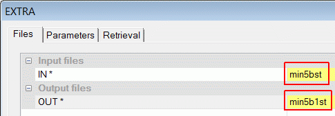
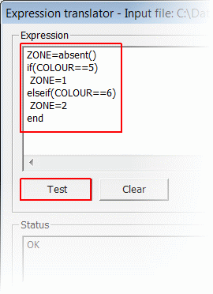

# Adding a ZONE Attribute to the String Model - EXTRA

 |  Adding a ZONE Attribute to the Strings Model - EXTRA Adding a ZONE attribute field to the strings model using the process EXTRA.  
---|---  
  
# Overview

In this part of the tutorial you will use the process EXTRA to add a numeric attribute field ZONE, and set its values in the ore body strings model. 

 |  Please see the exercises [Adding ZONE Attributes to the String Model - Design Window](<Adding_a_ZONE_Attribute_to_the_String_Model_-_Design_Window.md#Exercise1>) and [Adding ZONE Attributes to the String Model - Table Editor](<Adding_a_ZONE_Attribute_to_the_String_Model_-_Table_Editor.md#Exercise1>) for alternative methods of adding and editing attributes.  
---|---  
  
.

## Prerequisites

  * Completed the [Creating a New Project](<Creating_a_New_Project.md>) exercise.

  * Completed the [Defining Geological Modeling Settings](<Defining_Geological_Modeling_Settings.md#Exercise1>) exercise.

  * [Files](<Tutorial_Files_List.md>) required for the exercises on this page:

  *     * _vb_min2st.dm

## Exercise: Adding Attributes to the Strings Model Using EXTRA

In this exercise you will use the process EXTRA to add a numeric attribute field ZONE to a working copy of the ore body strings model _vb_min2st.dm . The attribute values will reflect the ZONE values as displayed by the corresponding zones in the static drilhole data. These attribute values will have a value of '1' for the upper (Green 5), and a value of '2' for the lower (Cyan 6) mineralized zone strings.  

 | 

  * Custom attributes placed in the ore body string model can be transferred to both wireframe models and block models.
  * Adding and editing attributes using the methods in this exercise are recordable in Macros or Scripts.

  
---|---  
  
The static drillhole data together with the mineralized zone strings are shown below. The data is shown looking from above and the southeast. The mineralization zone strings lie in vertical N-S orientated planes, spaced 25m apart.  
The static drillholes are colored on ZONE, where:

  * the upper mineralization zone (ZONE=1) is colored blue;
  * the lower mineralization zone (ZONE=2) is colored red.

   

 |  Add the following attributes to an ore body string model:

  * Add a mineralization zone field to allow grade estimating control by zone (default field name ZONE) when usingGRADEorESTIMATE.
  * Add sufficient custom attributes to allow data to be filtered, processed, colored and annotated.

  
---|---  
 | 

  * Custom attribute fields should not have the same name as restricted system fields.
  * Do not add attribute fields with the same name, but with different properties to different objects ( for example, field type, or field length)

  
---|---  
  
## Creating a Working Copy of _vb_min2st.dm 

  1. Activate the Data ribbon and select Data Tools | Tables | Copy File
  2. In the COPY dialog, define the Filessettings as shown below and clickOK:  
  
IN: _vb_min3st (use the browse button to find it)  
OUT: min5bst

| Use the Browse buttons in the Files tab to browse and select the required input file and then type in the name of the output file.  
---|---  
  
  1. In the Project Files control bar, confirm that min5bst has is listed.

**Setting ZONE Field Values**

  1. Select the 3D window.

  2. Using the Data ribbon select Data Tools | Expressions
  3. In the EXTRA dialog, Files tab, define the Files settings shown below and click **OK** :  
  

  4. In the Expression Translator dialog, use the Input Fields,Operators, and Functions and Procedures options to create the expression shown below, and then click Test:  
  

  5. If the Status pane displays the message "OK", then click Execute.

| When your current project was originally set up, you elected to automatically add files in the specified project directory to your project, and as a result, the new file created in this section has been added to your project automatically and listed in the Project Files control bar.  
---|---  
  
## Checking the Strings Table For the New Attribute ZONE

  1. In the Project Files control bar, double-click min5b1st.
  2. In the Table Editor dialog, confirm that the column ZONE has been added, and that the values have been set correctly - any row that has a COLOUR value of 5 should also have a ZONE value of "1". A COLOUR value of 6 should show a ZONE value of 2. All other values should be absent (-)  

  3. Select _F_ ile | E _x_ it.

 | User attributes can be added to Datamine Tables in the form of extra Fields (also known as Columns) whose Type is either Numeric or Alphanumeric. The following processes can be used to add or edit Fields in a Datamine Table:

  * EXTRA: add or manipulate Fields using simple or advanced string manipulation and algebraic transformations.
  * SETVAL: insert a user-defined value into a given field either during copying of a table or as an in-place operation.
  * DECODE: copy a file, decoding a field in the input file through a dictionary file, to a new output file containing a new decoded field.
  * COPYNR: copy one table to another, adding a line number field RECORDNO.
  * GENTRA: modify existing or create new fields as a function of old fields, constants or expressions, using arithmetic and other operators.

  
---|---  
  
##  [Next Page](<Adding_a_ZONE_Attribute_to_the_String_Model_-_Table_Editor.md>)