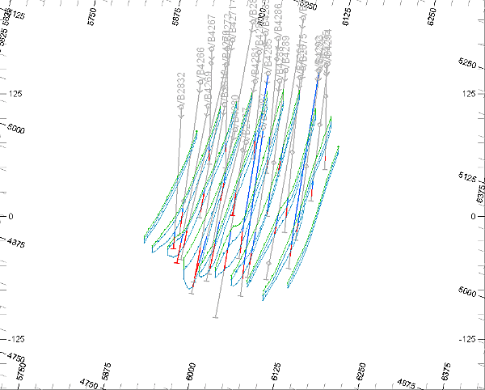
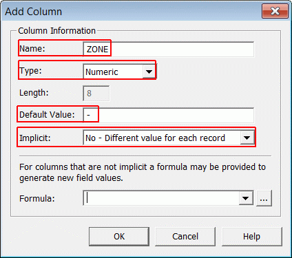
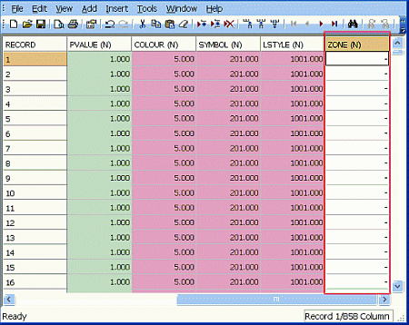
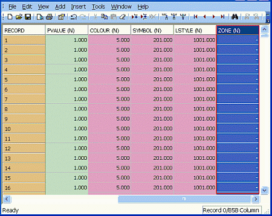
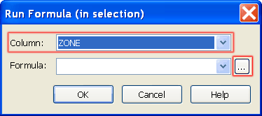
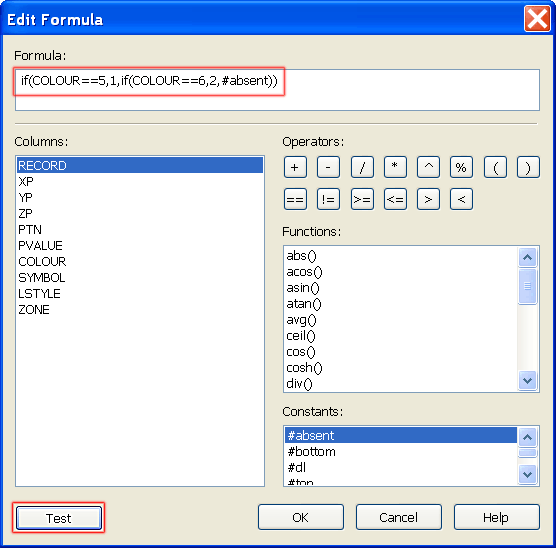
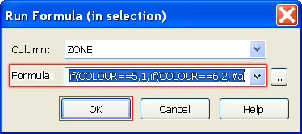
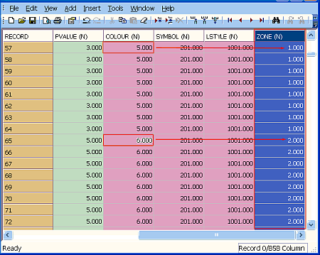

# Adding a ZONE Attribute to the String Model - Table Editor

 |  Adding a ZONE Attribute to the Strings Model - Table Editor Adding a ZONE attribute field to the strings model using the Table Editor.  
---|---  
  
# Overview

In this part of the tutorial you will use the Datamine Table Editor to add a numeric attribute field ZONE and set its values in the ore body strings mode.

 |  Please see the exercises [Adding ZONE Attributes to the Strings Model - Design Window](<Adding_a_ZONE_Attribute_to_the_String_Model_-_Design_Window.md#Exercise1>) and [Adding ZONE Attributes to the Strings Model - EXTRA](<Adding_a_ZONE_Attribute_to_the_String_Model_-_EXTRA.md#Exercise1>) for alternative methods of adding and setting attributes.  
---|---  
  
## Prerequisites

  * Completed the [Creating a New Project](<Creating_a_New_Project.md>) exercise.

  * Completed the [Defining Geological Modeling Settings](<Defining_Geological_Modeling_Settings.md#Exercise1>) exercise.

  * [Files](<Tutorial_Files_List.md>) required for the exercises on this page:

  *     * _vb_min2st.dm

## Exercise: Adding a ZONE Attribute to the Strings Model using the Table Editor

In this exercise you will use the Table Editor to add a numeric attribute field ZONE to a working copy of the ore body strings model _vb_minst.dm . The attribute values will reflect the ZONE values as displayed by the corresponding zones in the static drilhole data.

 | 

  * Custom attributes placed in the ore body string model can be transferred to both wireframe models and block models.
  * Adding and editing attributes using the methods in this exercise are not recordable. 

  
---|---  
  
These attribute values will have a value of '1' for the upper (Green 5) and a value of '2' for the lower (Cyan 6) mineralized zone strings. The static drillhole data together with the mineralized zone strings are shown below.

  

 | Add the following attributes to the ore body string model:

  * Add a mineralization zone field to allow grade estimating control by zone (default field name ZONE) when usingGRADEorESTIMATE.
  * Add sufficient custom attributes to allow data to be filtered, processed, colored and annotated.

  
---|---  
 | 

  * Custom attribute fields should not have the same name as restricted system fields.
  * Do not add attribute fields with the same name, but with different properties to different objects ( for example, field type, or field length)

  
---|---  
  
## Creating a Working Copy of _vb_min2st.dm 

  1. In the Project Files control bar, expand theStringsfolder and double-click_vb_min2st.

  2. In the Datamine Table Editor dialog, selectFile | Save As....  
  
| You may need to expand the drop-down menu to display this option.  
---|---  
  3. In the Save As dialog, select your project folder, define the File name as 'min5cst.dm' and clickSave.

## Adding a New Attribute Field

  1. In the Datamine Table Editor dialog, select Add | _C_ olumn.
  2. In the Add Column dialog, define the Column Information settings shown below and click OK:  
  
  

  3. In the Datamine Table Editor dialog, confirm that the column ZONE (N) has been added to the far right side of the table and that all records have value '-':  
  

## Setting ZONE Field Values

  1. In the Datamine Table Editor, select the **ZONE (N)** column header so that the column is highlighted blue, as shown below:  
  
  

  2. Select _T_ ools | Run Formula....
  3. In the Run Formula (in selection) dialog, select the Column [ZONE] and click the Edit Formula button [...].  
  

  4. In the Edit Formula dialog, use the Columns:, Operators:, Functions and Constants items and buttons, as well as the keyboard to define the formulae shown below, and click Test:  
  
  

  5. Confirm that the formula evaluation succeeded and click OK.
  6. In the Edit Formula dialog, click OK.
  7. In the Run Formula (in selection) dialog, confirm that the correct formula is displayed and click OK:  
  
  
  
 | The above formula uses nested "if()" Functions to check for, and set values as follows:
     1. If  COLOUR is equal to '5', then ZONE is set to '1'
     2. If COLOUR is equal to '6', then ZONE is set to '2'
     3. If neither condition is met, then ZONE is set to absent ( '-')  
---|---  
  8. In the Datamine Table Editor dialog, confirm that the ZONE column values have been set correctly, as shown below:  
  
  

  9. Click Save.
  10. Select _F_ ile | E _x_ it.

****[Next Section](<Extracting_Parts_of_the_String_Model.md>)