# Applying Legends to Geological Modeling

 |  Applying Legends to Geological Modeling Data Creating and using color legends in the geological modeling process  
---|---  
  
# Overview

In this part of the tutorial you will create, modify, load and apply color legends which are typically used to format data during the viewing, validation and modeling of geological data.

## Prerequisites

  * Completed the [Creating a New Project](<Creating_a_New_Project.md>) exercise.

  * Competed the [Defining Geological Modeling Settings](<Defining_Geological_Modeling_Settings.md#Exercise1>) exercise.

  * [Files](<Tutorial_Files_List.md>) required for the exercises on this page:

  *     * _vb_holes.dm

    * _vb_faultpt.dm

    * _vb_faulttr.dm

    * _vb_stopopt.dm

    * _vb_stopotr.dm

    * _vb_viewdefs.dm

    * _vb_holes_NLITH1.elg

## Links to exercises

The following exercises are available on this page:

  * Creating a Unique Values Legend for Rocktype Codes

  * Modifying a Legend to Use Fill Patterns

  * Loading and Applying a Shared Geological User Legend

## Exercise: Creating a Unique Values Legend for Rocktype Codes

In this exercise you will create a unique values legend for the set of rocktype codes (field NLITH) in the static drillholes file _vb_holes. The legend will be saved to a new legend file vb_holes_NLITH1.elg.

 |  Create and save user legends to a legend file when:

  * they need to be shared by multiple projects
  * defining standard legends for distribution and use by multiple users working on a single modeling project, or within the same organization.

  
---|---  
  
## Loading Data

  1. Select the 3D window if not already displayed.

  2. Select the Project Files control bar, Drillholes folder.

  3. Drag-and-drop the following drillholes file into the 3D window:

  1.      * _vb_holes

**Creating Unique Values Legend (NLITH - lithology codes)**

  1. Activate the Format ribbon and select Format Legends
  2. In the Legends Manager dialog, click New Legend....
  3. In the Legend Wizard: Data Table Column dialog, select Use Object Field.
  4. Select **the Object [**_vb_holes(drillholes)], and the Field [NLITH].
  5. In the Legend Wizard: Data Table Column dialog, click Next.
  6. In the Legend Wizard: Legend Storage dialog, select Current Project File and click Next.  
  
 | Legends can be stored in three ways:
     * Current Project file - legends are stored in the current project file and are not available to other projects.
     * User Legends Storage - legends are stored in the external legend file user.elg (in the folder C:\Users\\[UserName]\AppData\Roaming\Datamine\Legends) and are available to other projects opened by the current user.
     * External legend file - a single legend is saved to a user-defined legend file (.elg) which can be loaded into any project.  
---|---  
  7. In the Legend Wizard: General dialog, define the legend **Name** as 'vb_holes_NLITH1'.  
| The Type has been automatically set to [Numeric] as the field NLITH is defined as a numeric field in the table _vb_holes(drillholes).  
---|---  
  8. Select Unique Values , and deselect Convert to Filter Expressions.
  9. In the Legend Wizard: General dialog, click **Next**.
  10. In the Legend Wizard: Data Range dialog, click Next.
  11. In the Legend Wizard: Coloring dialog, select [Rainbow blue->red].
  12. Click Preview Legend... and compare your legend to that shown below:  
  
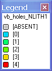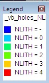
  13. Close the Legend dialog.
  14. In the Legend Wizard: Coloring dialog, click Finish.
  15. In the Legends Manager dialog, Available Legends group, confirm that the new legend **vb_holes_NLITH1** is listed, in its expanded form, at the bottom of the project legends folder.

**  
Editing Legend Colors**

  1. In the Legends Manager dialog, Available Legends group, select project legend vb_holes_NLITH1, and expand the item list using the "+" symbol next to the legend name, if not already expanded.
  2. Select legend item NLITH = 0[0].
  3. In the right-hand pane, Legend Item Description group, deselect Automatically generate description, and define the Description as 'Soil'.
  4. In the **Legend Item Format** group, set the Fill Color and the Line Color options to [Yellow] using the color palette.
  5. In the Available Legends group, select legend item [1].
  6. In the right-hand pane, set the Description to 'Sandstone', and Fill Color and Line Color to [Red].
  7. In the Available Legends group, select legend item [2].
  8. In the right-hand pane, set the Description to 'Siltstone', and Fill Color and Line Color to [Bright Green].
  9. In the Available Legends group, select legend item [3].
  10. In the right-hand pane, set the Description to 'Breccia', and Fill Color and Line Color to [Magenta 2].
  11. In the Available Legends group, select legend item [4].
  12. In the right-hand pane, set the Description to 'Basalt', and Fill Color and Line Color to [Bright blue], and then click Apply.
  13. Finally, select the [NLITH = - ] item and change the description to "ABSENT" and colored Light Grey (fill and line).
  14. In the **Legends Manager** dialog, confirm that your legend has been modified as shown below:  
  
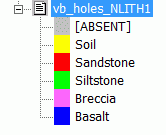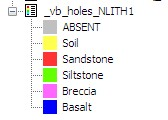

## Saving the Modified Legend to a Legend File

  1. In the Legends Manager dialog, Available Legends group, right-click project legend vb_holes_NLITH1 , and select Save Legend.
  2. In the Save As dialog, browse to your project folder, and click Save. Overwrite any files if prompted.
  3. Back in the Legends Manager dialog click Close.
  4. Save the project file using the Project button and Save.  
| Your legend file vb_holes_NLITH1.elg can be checked against the example file _vb_holes_NLITH1.elg. See [Tutorial Files List](<Tutorial_Files_List.md>).  
---|---  

## Exercise: Modifying a Legend to Use Fill Patterns

In this exercise you will change the fill style for the user legend vb_holes_NLITH1, created in the above exercise, from solid color to fill patterns.

 |  Use fill patterns for geological legends when formatting data to be viewed or verified in:

  * drillhole logs
  * rock type perimeters in plan or section views in thePlotswindow.

  
---|---  
  
**Copying a Legend (NLITH)**

 |  If you have not already done so, please complete all steps in the above exercise Creating a Unique Values Legend for Rocktype Codes.  
---|---  
  
  1. Activate the Format ribbon and select Format Legends
  2. In the Legends Manager dialog, Available Legends group, right-click the project legend vb_holes_NLITH1 , and select Copy to User Legends(you may need to expand the bottom menu item to see this legend - NLITH1 is at the bottom of the list).
  3. In the Available Legends group, User Legends folder, select the legend vb_holes_NLITH1 .
  4. in the Legend Properties group in the right-hand pane, change the Name to 'vb_holes_NLITH2'.

**Changing Legend Colors to Textures**

  1. In the Legends Manager dialog, Available Legends group, User Legends folder, expand the legend vb_holes_NLITH2 .
  2. Select the legend item 'Soil' and specify the following settings in the **Legend Item Format** group: 
     * Set Fill Style to [Texture].
     * SetTexture File Name to [p-Soil B.bmp].
     * Set Fill Color and Line Color to [Black], as shown below:  
  
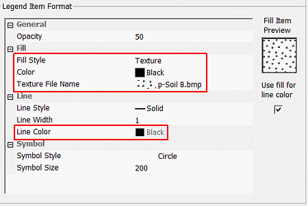
  3. Select the legend item 'Sandstone' and specify the following settings in the **Legend Item Format** group: 
     * Set Fill Style to [Texture.
     * Set Texture File Name to [p-Sandstone W.bmp].
     * Set Fill Color and Line Color to [Black].
  4. Select the legend item 'Siltstone' and specify the following settings in the **Legend Item Format** group: 
     * Set Fill Style to [Texture].
     * Set Texture File Name to [p-Siltstone N.bmp].
     * Set Fill Color and Line Color options to [Black].
  5. Select the item labeled 'Breccia' and specify the following settings in the **Legend Item Format** group: 
     * Set Fill Style to [Texture].
     * Set Texture File Name to [p-Breccia.bmp].
     * Set Fill Color and Line Color to [Black].
  6. Select the item labeled 'Basalt' and specify the following settings in the **Legend Item Format** group: 
     * Set Fill Style to [Texture.
     * Set Texture File Name to [p-Basalt.bmp].
     * Set Fill Color and Line Color to [Black].
  7. In the **Legends Manager** dialog, click Preview Legend...and confirm that your legend has been modified as shown below:  
  
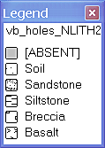
  8. Close theLegend dialog. 
  9. In the **Legends Manager** dialog, click Apply, and then click Close.

 |  The legend file vb_holes_NLITH2.elg can be checked against the example file _vb_holes_NLITH2.elg. See [Tutorial Files List](<Tutorial_Files_List.md>).  
---|---  
  
## Exercise: Loading and Applying a Shared Geological User Legend

In this exercise you will load the existing legend file _vb_holes_NLITH1.elg and use it to format the static drillholes column NLITH.

| Load and apply legend files when:

  * legends need to be shared by multiple projects
  * defining standard legends for distribution and use by multiple users working on a single modeling project, or within the same organization.

  
---|---  
  
## Loading the Data

  1. Select the 3D window.

  2. In the Project Files control bar, expand the All Tables folder.

  3. Drag-and-drop the following wireframe, drillholes and section definition *.dm files (add to the ones already in place from the previous exercise) into the 3D window:

     1.         * _vb_faulttr

        * _vb_stopotr

        * _vb_viewdefs

  4. Select the Sheets control bar and expand the 3D-Overlays folder.

  5. Select only the following objects:

     * Grids Folder -Default Grid

     * Drillholes folder -_vb_holes (drillholes)

     * Wireframes folder -_vb_faulttr/_vb_faultpt (wireframe)

     * Wireframes folder -_vb_stopotr/_vb_stopopt (wireframe)

## Checking the View

  1. Select the 3D window.
  2. Enable the View ribbon and make sure the Lock setting is enabled.
  3. Using the View ribbon, select [_vb_viewdefs (table)] from the Sections drop-down list
  4. In the Command control bar, note the list of available views:  
  
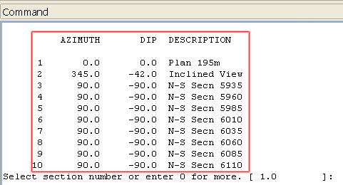
  5. In theCommandtoolbar,Run Command field, type in '3', press <Enter> :  
  
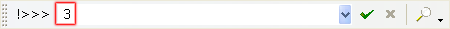
  6. Double-click the _vb_viewdefs item in the Sheets | 3D | Sections folder to show the Section Properties dialog:  
  
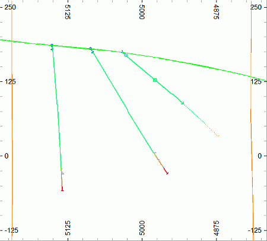  

  7. In the Section Properties dialog press the right arrow in the Position group until the status bar of Studio RM reads 'N-S Secn 5935':  
  
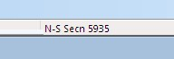
  8. Zoom-all graphics ("za") and your 3D window view should now look similar to the following:  
  
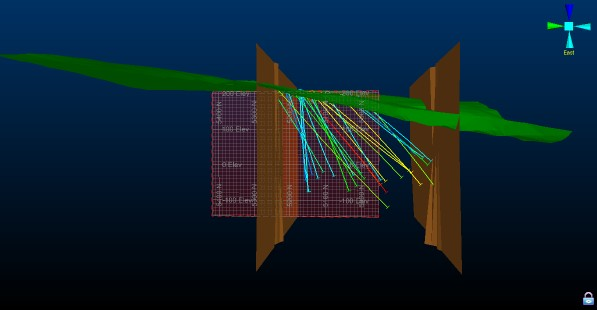

**Loading and Previewing the _vb_holes_NLITH1 Legend File**

  1. Activate the Format ribbon and select Format Legends.
  2. In the Legends Manager dialog, Available Legends group, right-click the User Legends folder and select Load Legend....
  3. In the Open dialog, browse to C:\Database\MyTutorials\GeolMod, select _vb_holes_NLITH1.elg and click Open.
  4. In the Legends Manager dialog, Available Legends group, User Legends folder, select the legend vb_holes_NLITH1.
  5. In the **Legends Manager** dialog, click Preview Legend....
  6. Confirm that the legend is as shown below:  
  
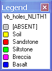
  7. Close the Legend preview dialog.
  8. In the Legends Manager dialog, click Close.

##  Formatting Static Drillhole Traces

  1. In the Sheets control bar, 3D folder, double-click on _vb_holes (drillholes).

  2. In the Format Display dialog, Overlays tab, Overlay Format group, Drillholes tab, deselect Display downhole columns, and clickFormat...

  3. In the Drillhole Properties dialog, select the Lines & Symbols tabIn the Drillhole Traces dialog, Static Drillholes tab, select the Color tab.

  4. Define the color settings shown below, and click OK:  
  
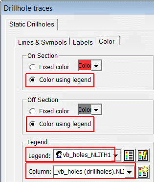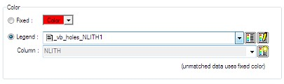

  5. Click OK

  6. In the Format Display dialog, click Apply and OK.

  7. In the 3D window, confirm that your drillhole traces are now colored by rock type and that no additional drillhole columns are displayed, as shown below:  
  
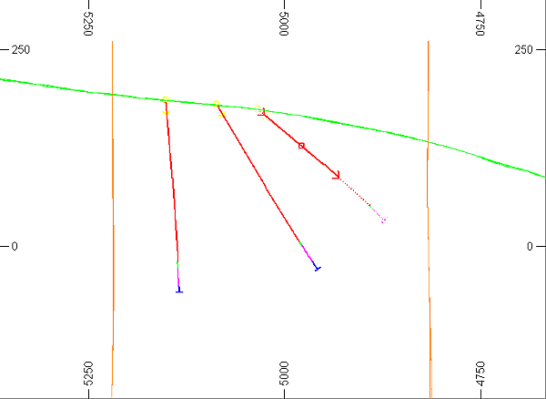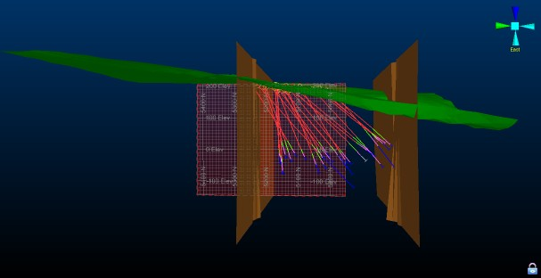  

  8. Save the project file using the Project button and Save

****[Next Page](<Formatting_Static_Drillholes_using_FilterLegends.md>)