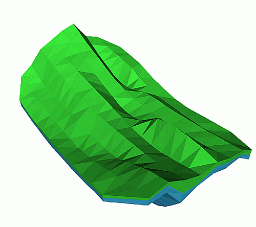
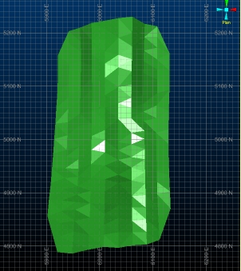
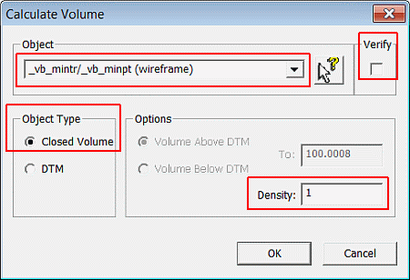
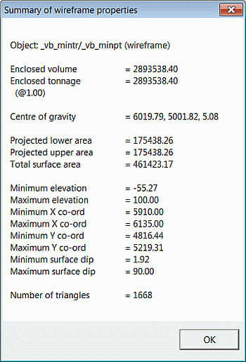
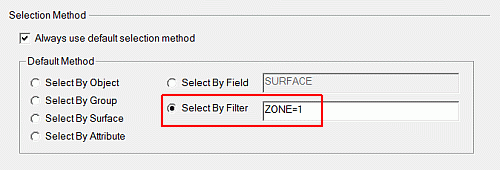
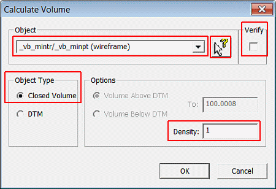
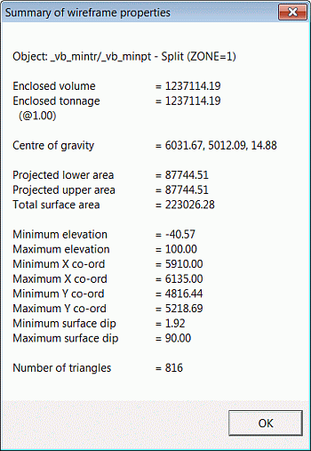
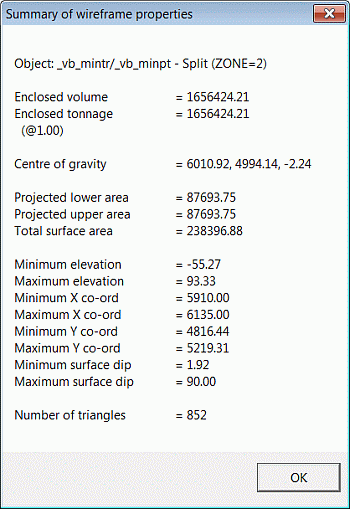

 |  Calculating Wireframe Model Volumes Calculating the volume of a wireframe model.  
---|---  
  
# Overview

In this part of the tutorial you will use the 3D window tools to calculate the volume of the ore body wireframe model.

## Prerequisites

  * Completed the [Creating a New Project](<Creating_a_New_Project.md>) exercise.

  * Completed the [Defining Geological Modeling Settings](<Defining_Geological_Modeling_Settings.md#Exercise1>) exercise.

  * [Files](<Tutorial_Files_List.md>) required for the exercises on this page:

  *     * _vb_minpt.dm

    * _vb_mintr.dm

    * _vb_viewdefs.dm

## Exercise: Calculating the Volume of the Ore Body Wireframe Model

In this exercise, you will use 3D window commands to calculate the volume for the ore body as defined by the closed volume wireframe object _vb_mintr/_vb_minpt (wireframe). The ore body closed volume wireframe model is shown below:

****

 |  Calculate wireframe volumes as a check before:

  * evaluating wireframes (i.e. calculating tonnes and average grades) against drillholes or block models;
  * using wireframes for block modeling purposes.

  
---|---  
  
 |  Wireframes need to be verified before volumes can be calculated.  
---|---  
  
## Loading and Formatting the Data

  1. In the Project Files control bar, All Tables folder.

  2. If not already loaded, drag-and-drop the following files into the 3D window:

     * _vb_mintr

     * _vb_viewdefs

  3. Select the Sheets control bar and fully expand the 3D folder.

  4. Select only the following objects:  

     * Default Grid

     * _vb_mintr/_vb_minpt (wireframe)

  5. Using the View ribbon, select ZoomFit | Zoom Plan:**  
  
**

## Calculating the Volume of the Entire Object  

  1. Activate the Structure ribbon and select Operations | Volume (top-level icon).

  2. In the Calculate Volume dialog, ensure the _vb_mintr object is shown in the Name field, and that the Closed Volume option is selected (these should be set by default) and the Verify option is deselected (you will need to switch this off).define the settings shown below, and click OK:**  
  
**  

 |  Volumes can also be calculated for open wireframe surfaces (DTMs) using this command.  
---|---  
  3. In theSummary of Wireframe Propertiesdialog, confirm that your results are as shown below and clickO**K****  
  
**

## Calculating the Volume for the Top ZONE=1

  1. Activate the Home ribbon and Project | Settings \- activate the Wireframes tab
  2. In theProject Settingsdialog, browse toProject Settings | Wireframes.
  3. n theSelection Methodgroup, specify the options shown below and clickOK:**  
  
**
  4. Using the Structure ribbon, select Operations | Volume.
  5. In the Calculate Volume dialog, disable the Verify check box:**  
  
**
  6. Select the picker button (next to the Name field) andIn the Design window, left-click on the ore body wireframe object.

  7. In the Calculate Volume dialog, confirm that the object name is now set to _vb_mintr/_vb_minpt - Split (ZONE=1)  

  8. In the Summary of wireframe properties dialog, confirm that the results are as shown below, and click OK:**  
  
**  

## Calculating the Volume for the Bottom ZONE=2

  1. Select the3Dwindow.
  2. Repeat steps 2. to 8. in the section above, for a filter setting of 'ZONE=2' and compare your results to those shown below:**  
  
**  

  3. Check that your volume for the two zones is = 1,237,114.19 + 1,656,424.21 =2,893,538.40.

  4. Compare this total to the volume of the entire object calculated in the Calculating the volume of the entire objectsection above.  

 | 
     * Volumes for closed volume and open surface wireframes can also be calculated using the Studio process TRIVOL. This can be run by activate the Structure ribbon and selecting Operations | Volume | Volume from File  
---|---  

****[Next Section](<Creating_a_Prototype_Block_Model.md>)