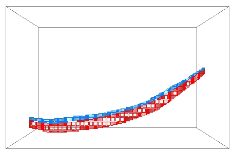
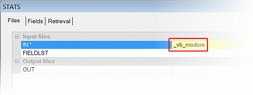
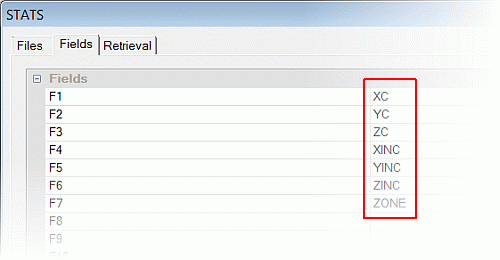
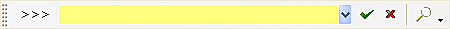
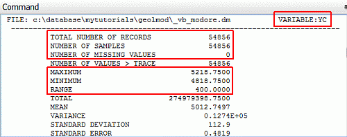
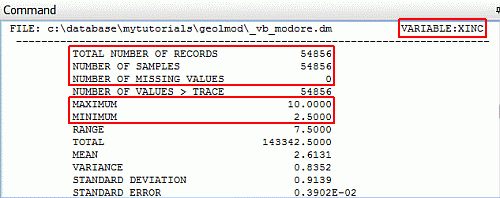
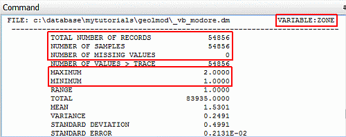

# Checking the Ore Body Block Model using Summary Statistics

 |  Checking the Ore Body Block Model using Summary Statistics How to check the Ore Body Block Model using summary statistics.  
---|---  
  
# Overview

In this portion of the tutorial you are going to check the ore body block model using the process STATS.

## Prerequisites

  * Created a new project and added all the required tutorial files i.e. the exercise on the [Creating a New Project page](<Creating_a_New_Project.md>).

  * Defined project settings i.e. completed the [Defining Geological Modeling Settings](<Defining_Geological_Modeling_Settings.md#Exercise1>) exercise.

  * Read through the relevant heading on the Principles page [Working with Block Models](<Working_with_Block_Models.md>).

  * [Files](<Tutorial_Files_List.md>) required for the exercises on this page:

  *     * _vb_modore.dm

    * _vb_viewdefs.dm

## Exercise: Checking the Ore Body Block Model using Summary Statistics

In this exercise, you are going to use theprocessSTATSto generate summary statistics for certain fields in the ore body block model file_vb_modore.dm. The summary statistics will be displayed and checked in theCommandcontrol bar. The ore body block model, showing the upper (ZONE=1) and lower (ZONE=2) mineralization zones, is shown below: 

| 

  * Use summary statistics to check a block model's numeric fields for the following errors:
  *     * absent data e.g. cells not flagged with the mineralization zone field ZONE (denoted by '-')
    * records with missing values (denoted by ' ' i.e. blank)
    * unexpected minimum or maximum values e.g. coordinates, mineral grade values
  * Check a block model after:
  *     * creation and flagging using wireframes, strings or other methods
    * optimization or manipulation
    * grade estimation.
  * Use summary statistics and other processes when needing to record these checking methods in a Macro or Script.

  
---|---  
| 

  * Summary statistics can be calculated and reported by key fields e.g. rocktype, mineralization zone.
  * Summary statistics can optionally be saved to s Datamine file.

  
---|---  
  
| Checking a block model using summary statistics may not highlight all types of errors, use the following methods to complement your checking procedure:

  1.      * Visual checking techniques e.g. in the Design window
     * A combination of the processes SORT and SELCOP to generate a unique list of values e.g. when checking rock type codes.

  
---|---  
  
## Loading and Formatting the Data

  1. Unload any data you may have already loaded.

  2. Select the Project Files control bar, All Tables folder.

  3. Drag-and-drop the following files (if not already loaded) into the Design window:

     * _vb_modore

     * _vb_viewdefs

  4. Select the Sheets control bar and expand the 3D folder.

  5. Select only the following check boxes (i.e. display these objects):  

     * Default Grid

     * _vb_modore (block model)

  6. In the Sheets control bar, 3D folder, double-click on _vb_modore (block model).

  7. Edit the _vb_modore 3D overlay properties so that it is displayed as an Intersection, 80% exaggeration, disabled Show Fill and enabled Show Edges.

  8. Edit the Default Section properties so that a North-South section is show with a Section Ref Point of X: 5935. Click OK and enable the View Lock.

  9. In the Format Display dialog, Overlays tab, Overlay Format group, select the Color tab.

  10. In the Color tab, Color group, select the Legend : [Datamine: ZONE (_vb_modore (block model))] and Column [ZONE] , click OK .

  11. In the View Control toolbar, click Get View 'gvi'.
  12. In the Command control bar, note the list of available sections.
  13. In theCommandtoolbar,Run Command field, type in '3', press <Enter>.
  14. Your view should look similar to that shown below, check that the 'N-S Secn 5935' view of the ore body block model is displayed, colored by the field ZONE, as shown below:**  
  
**

## Calculating Summary Statistics for the Block Model

  1. Select the Design window.

  2. Activate the Sample Analysis ribbon and click Statistics | Statistics Processes (top level icon)Select Applications | Statistical Processes | Compute Statistics.

  3. In the STATS dialog, Files tab, set IN* by browsing for and selecting the block model file _vb_modore.**  
  
**  

|  The summary statistics can also be saved to an output file by defining a new filename in the OUT* field in the Output files group.  
---|---  
  4. In the Fields tab, select the following fields, click OK:**  
  
  
**

| 
     * In this exercise, the summary statistics are calculated across all records i.e. no key field *KEYn (e.g. ZONE, NLITH) is used.
     * Summary statistics can either be calculated across all records in a file or by key field (fields *KEY1 to *KEY10).
     * Weighted summary statistics can also be calculated by selecting a weighting field (field *WEIGHT).
     * Retrieval Criteria can be defined in the Retrieval tab in order to additionally filter the input records.  
---|---  
  5. In the Command toolbar, check that the Run Command field is selected, press <Enter> seven times, once for each of the selected input fields:**  
  
**  

  6. In the Command control bar, check that the message '>>> STATS Complete <<<' is displayed, which indicates that the STATS process is complete.

## Checking the Summary Statistics

  1. In the Command control bar, use the vertical slider bar to find and then check that your summary statistics for the field YC is as shown highlighted below:**  
  
  
  
**

| 
     * There should be no missing values '-'.
     * The minimum and maximum coordinate values should correspond with what is displayed in the Design window.
     * The summary statistics for XC and ZC are checked in the same way.  
---|---  
  
  2. In the Command control bar, use the vertical slider bar to find and then check that your summary statistics for the field XINC is as shown highlighted below:**  
  
  
**

| 
     * There should be no missing values '-'.
     * The maximum should be the same as the parent cell size as defined in the file header (data definition).
     * The minimum value should be the same as the value defined for the parameter CELLXMIN in the process WIREFILL, which was used to create this block model by filling the ore body wireframe with cells.
     * The summary statistics for YINC and ZINC are checked in the same way.  
---|---  
  
  3. In the Command control bar, use the vertical slider bar to find and then check that your summary statistics for the field ZONE is as shown highlighted below:**  
  
  
**

| 
     * There should be no missing values '-'.
     * The maximum should be '2' and the minimum '1'.
     * These are summary statistics for a field which contains discrete values (in this case only '1' and '2').
     * Ideally, in order to do a full check, a combination of the processes SORT and SELCOP should be used to generate a list of unique values for any numeric flag field in order to check that only the expected values are present in the block model. This is especially important when block models are optimized e.g. using PROMOD, or manipulated using other processes.  
---|---  
  

****[Next Section](<Combining_the_Waste_and_Ore_Block_Models.md>)