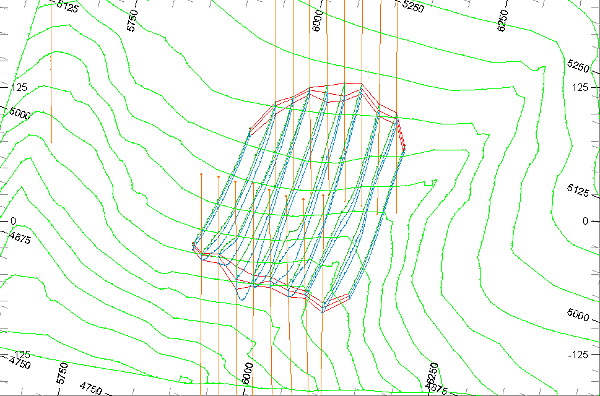
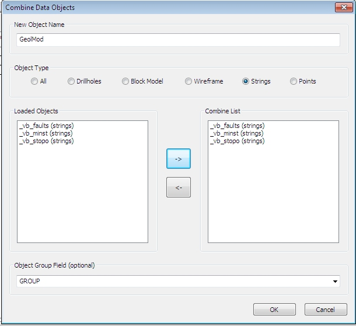

# Combining the Different String Models

 |  Combining Different String Models Using the Data Object manager to combine different strings model objects.  
---|---  
  
# Overview

In this part of the tutorial, you will use the Data Object Manager to combine different strings models into a single object.

## Prerequisites

  * Completed the [Creating a New Project](<Creating_a_New_Project.md>) exercise.

  * Completed the [Defining Geological Modeling Settings](<Defining_Geological_Modeling_Settings.md#Exercise1>) exercise.

  * [Files](<Tutorial_Files_List.md>) required for the exercises on this page:

  *     * _vb_faults.dm

    * _vb_minst.dm

    * _vb_stopo.dm

## Exercise: Combining the Different Strings Models

In this exercise, you will use the Data Object Manager to combine the topography contours _vb_stopo.dm , faults _vb_faults.dm and ore body strings model _vb_minst.dm objects into one strings model object called GeolMod.  

 |  Combine string model objects into a single object:

  * when combining individual string models of different portions of an ore body into a single model on completion of a modeling exercise;
  * for simplifying object management when a large number of string model objects are used;
  * as a means of simplifying a data set for presentation purposes.

Ensure that the individual strings objects contain enough custom attributes, prior to combining the objects, to enable a successful extraction of the combined objects in the future.  
---|---  
| 

  * Combined objects may be difficult to filter or extract if they do not contain a sufficient number of custom attributes to allow effective filtering.

  
---|---  
  
## Loading the Data

  1. Unload any data you may have already loaded.

  2. In the Project Files control bar, select the All Tables folder.

  3. Drag-and-drop the following files (if not already loaded) into the 3D window:  

     * _vb_faults.dm

     * _vb_minst.dm

     * _vb_stopo.dm

     * _vb_viewdefs

  4. Select the Sheets control bar and expand the 3D folder.

  5. Select only the following check boxes (i.e. display these objects) :  

     * Default Grid

     * _vb_faults (strings)

     * _vb_minst (strings)

     * _vb_stopo (strings)

  6. Position and zoom the view so it is approximately the same as that shown here:  
  

 | 

  * The data is shown looking from above and the southeast.
  * The topography contours are shown in Green (5).
  * The sub-vertical fault boundary strings are shown in Orange (3).
  * The mineralization zone strings lie in vertical N-S orientated planes, spaced 25m apart.
  * The mineralization zone strings are colored on COLOUR using a standard legend, where:
  *     * the tag strings (COLOUR=2) are colored Red
    * the upper mineralization zone strings (COLOUR=5) are colored Green
    * the lower mineralization zone strings (COLOUR=6) are colored Cyan.

  
---|---  
  
## Combining Three Strings Model Objects

  1. Activate the Data ribbon and select Manage Objects.

  2. In the Data Object Manager dialog, click Combine Objects.

  3. In the Combine Data Objects dialog, define a New Object Name of 'GeolMod'.

  4. In the Object Type group select Strings.

  5. In the Loaded Objects group, select the objects highlighted in the image below, using <Ctrl> \+ click, and click Move Right.

  6. In the Combine List group, confirm that these string models are listed.

  7. In the Object Group Field(optional) group, select [GROUP] and click OK:  
  
  

  8. In the Data Object Manager dialog, Loaded Data Objects pane, select the combined strings object GeolMod.
  9. In the Data Object tab, Statistics pane, confirm that this combined object has 70 strings (20 from _vb_faults (strings), 26 from _vb_minst (strings) and 24 from _vb_stopo (strings).
  10. Close the Data Object Manager dialog.

## Checking Combined Object in the 3D Window

  1. Select the3Dwindow.
  2. In the Sheets control bar, expand the 3D-Overlays folder.
  3. Select only the following check boxes (i.e. display these objects) to see your combined object.  

     * Default Grid

     * GeolMod

  4. Double-clickGeolMod.
  5. In the Format Display dialog, Overlays tab, Overlay Format group, select the Color tab.

  6. In the Color group, select the Legend [Standard Datamine COLOUR Fields], the Column [COLOUR], and click OK.

  7. In the3Dwindow, confirm that the fault, topography and mineralization zone strings are displayed, as shown below:  
  

| The techniques covered in this exercise can be used to combine other types of model objects of the same type - for example, wireframes, block models, and tables.   
---|---  
  
## 

****[Next Section](<Creating_Surfaces_using_DTM_Techniques.md>)