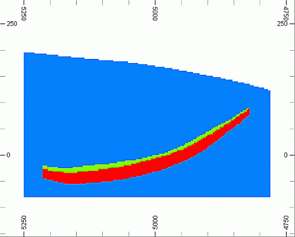
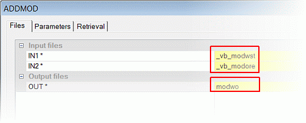
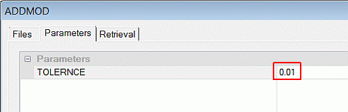
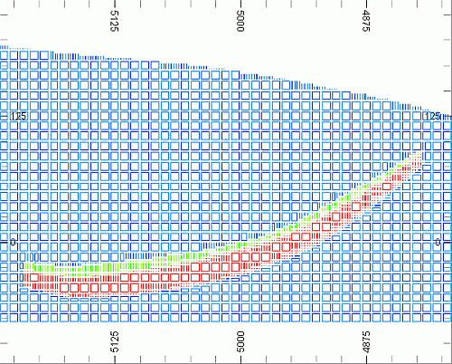
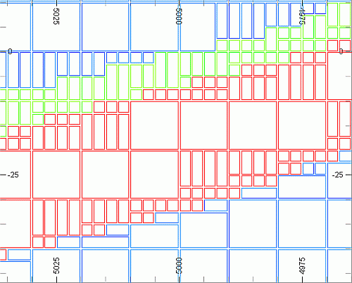

# Combining the Waste and Ore Block Models

 |  Combining the Waste and Ore Block Models How to add the waste and ore block models to create a combined model.  
---|---  
  
# Overview

In this portion of the tutorial you are going to combine an ore body block model and waste block model using Studio processes.

## Prerequisites

  * Created a new project and added all the required tutorial files i.e. the exercise on the [Creating a New Project page](<Creating_a_New_Project.md>).

  * Defined project settings i.e. completed the [Defining Geological Modeling Settings](<Defining_Geological_Modeling_Settings.md#Exercise1>) exercise.

  * Read through the relevant heading on the Principles page [Working with Block Models](<Working_with_Block_Models.md>).

  * [Files](<Tutorial_Files_List.md>) required for the exercises on this page:

  *     * _vb_modore.dm

    * _vb_modwst.dm

    * _vb_viewdefs.dm

## Exercise: Combining the Waste and Ore Block Models

In this exercise, you are going to use the process ADDMOD to combine the "waste" model _vb_modwst and the "ore" model _vb_modore to create a combined "waste + ore" block model modwo. The order in which these models are added together is important - in this exercise, the ore needs to be added to the waste block model.

A slice through the combined block model, with the waste colored blue and the upper and lower ore zones colored green and red respectively, is shown below:

| 

  * Add block models when:
  *     * needing a single model for presentation, economic optimization or evaluation purposes
    * managing a large number of block models in an adjacent work space.
  * Optimize a combined block model to potentially reduce the number of subcells and in so doing, reduce the size of the file.

  
---|---  
| The order in which block models are combined has an effect on the resultant model - please see [Combining Block Models](<Working_with_Block_Models.md#WorkingBlockModel3>) for further details.  
---|---  
  
| 

  * Block models which do not have the same block model definition i.e. block model prototype, cannot be combined. They first need to be placed in the same prototype using the process SLIMOD.
  * Block model files which are not sorted on the field IJK cannot be combined. If a block model can be loaded and viewed in the Design window, then it is already sorted on IJK. If not, use the process MGSORT to sort the block model, setting the field *KEY1 to IJK.
  * Combining block models can potentially result in very large files.

  
---|---  
  
## Adding the "Ore" to the "Waste"

  1. Select the 3D window.
  2. In the 3D window, activate the Model ribbon and select Manipulate | Combine.
  3. In the ADDMOD dialog, Files tab, browse for and define the file names, as shown below:**  
  
**  
  
| 
     * In this exercise the "waste" model (Input File IN1) is updated with the "ore" model (Input File IN2).
     * Updating the "ore" model with the "waste" model will generate a block model consisting only of "waste" cells.  
---|---  
  4. In the ADDMOD dialog, Parameter tab, define the settings, as shown below, click OK:**  
  
**  
  
| 
     * The TOLERNCE value (0.01) gives a tolerance of 0.1m (i.e. 0.01 tolerance factor x 10m parent cell size). The updated model will not contain cells with dimensions less than 0.1m.  
---|---  
  5. In the Command control bar, view the message to follow the status of the ADDMOD process.

  6. Check that the output model file modwo contains 147,423 records.

##  Loading and Formatting the Data

  1. Unload any data that may already be loaded.

  2. Select the Project Files control bar, All Tables folder.

  3. Drag-and-drop the following files (if not already loaded) into the 3D window:

     * _vb_viewdefs

     * modwo

  4. Select the Sheets control bar and expand the 3D-Overlays folder.

  5. Select only the following check boxes (i.e. display these objects):  

     * Default Grid

     * modwo (blobk model)

  6. In the Sheets control bar, double-click modwo (block model).

  7. Edit the modwo 3D overlay properties so that it is displayed as an Intersection, 80% Exaggeration, disabled Show Fill and enabled Show Edges.

  8. Edit the Default Section properties so that a North-South section is show with a Section Ref Point of X: 5935. Click OK and enable the View Lock.

  9. In the Format Display dialog, Overlays tab, Overlay Format group, select the Color tab.

  10. In the Color tab, Color group, select the Legend : [Datamine: ZONE (modwo (block model))] and Column [ZONE] , click OK .

  11. In the View Control toolbar, click Get View.
  12. In theCommandtoolbar,Run Command field, type in '3', press <Enter>.
  13. Your data should look similar to that shown below:**  
  
**
  14. Use the View ribbon to Zoom Area
  15. CIn the 3D window, check that the upper (Green) and lower (Red) mineralization zones are surrounded by waste (Blue), as shown below:**  
  
**
  16. Activate the Edit ribbon and select Query | Point and select (left-click) points within model cells which lie in the upper mineralization zone, lower mineralization zones and in the waste both above and below the ore.
  17. Click Cancel.
  18. In the Output control bar, check that the values for the queried points have ZONE field values as follows:  
  

     * "waste" above: ZONE = 0
     * upper (green) mineralized zone: ZONE = 1
     * lower (red) mineralized zone: ZONE = 2
     * "waste" below: ZONE = 0
  19. Repeat steps 8. to 15. for other views.

| Your combined block model can be checked against the example file _vb_modwo.dm.  
---|---  
  
##  [Next Page](<Optimizing_a_Block_Model.md>)