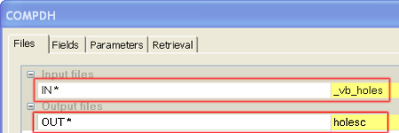
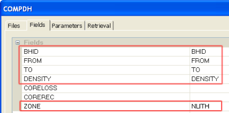
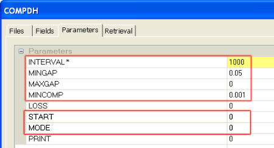
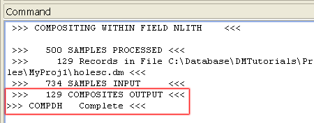

 |  Compositing Static Drillholes Compositing down drillholes using COMPDH.  
---|---  
  
# Overview

In this part of the tutorial you will composite a set of drillholes down the hole by rock type.

## Prerequisites

  * Completed the [Creating a New Project](<Creating_a_New_Project.md>) exercise.

  * Read the Principles page: [Working with Drillholes](<Working_with_Drillholes.md>).

  * Completed the [Defining Geological Modeling Settings](<Defining_Geological_Modeling_Settings.md#Exercise1>) exercise.

  * [Files](<Tutorial_Files_List.md>) required for the exercises on this page:

  *     * _vb_holes.dm

## Exercise: Compositing Down Drillholes

In this exercise you will use the process COMPDH to composite the drillholes _vb_holes down their lengths, so that each composite contains a single rock type.

This is done by using the rock type code field NLITH as well as the compositing "Zone" field, and by setting the INTERVAL parameter to 1000 (a distance greater than the longest continuous rock type interval according to the information in the lithology table _vb_lithology).

 |  Use composited drillholes for the following:

  * composited by rock type or domain (by setting a very large interval) to generate individual rock type composites to be used for rock type or domain boundary modeling.
  * composited by a fixed interval (e.g. minimum mining width or block size) for geostatistical analysis, variogram modeling.

  
---|---  
  
 |  These 'rock zone' composited drillholes will be used in later exercises to model rock type zones.  
---|---  
  
## Compositing Down Drillholes

  1. Select the 3D window.

  2. Activate the Sample Analysis ribbon and expand the Composite menu to select Composite Down Drillholes.

  3. In the COMPDH dialog, Files tab, define the input and output files shown below:

  4. In the COMPDH dialog, Fields tab, define the fields shown below (be sure to select NLITH for the ZONE field, not LITH):  
  
  

  5. In the COMPDH dialog, Parameters tab, define the settings shown below, and click OK.

  
  
| 
     * The combination of setting the ZONE field to NLITH (rock type) and the parameter INTERVAL to '1000', will combine adjacent sample intervals and generate composites which consist of a single rock type.
     * These rocktype composited drillholes can be used for modeling rock contacts in the 3D window.  
---|---  
  6. In the Command control bar, check that the output file contains 129 records (compared to734 input samples):  
  
  

 |  Your output composite drillhole file holesc can be checked against the example file _vb_holesc.  
---|---  

 |  See the Command Table in the Help documentation for a comprehensive list of Processes and their uses.  
---|---  
  
****[Next Section](<Creating_Dynamic_Drillholes.md>)