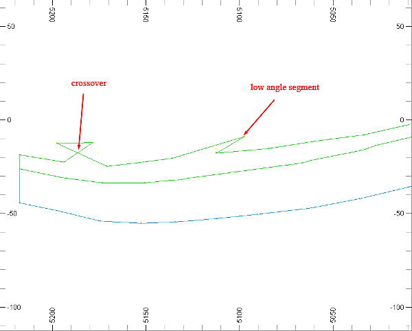
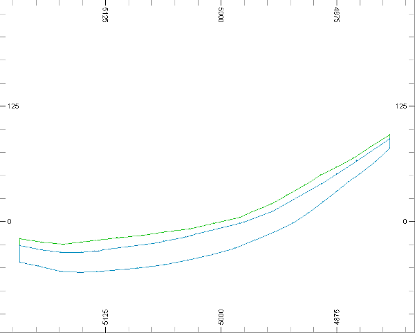
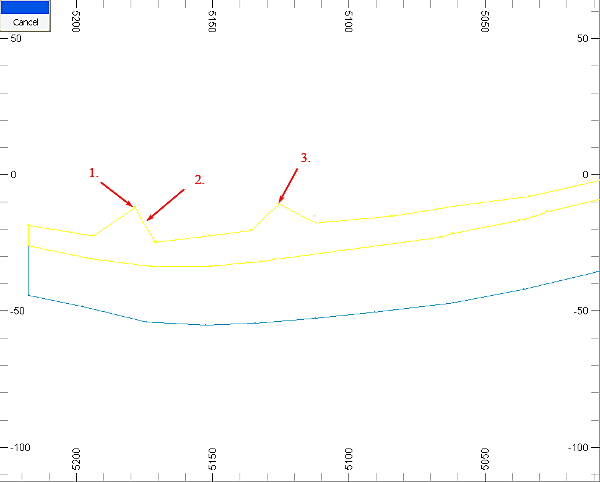
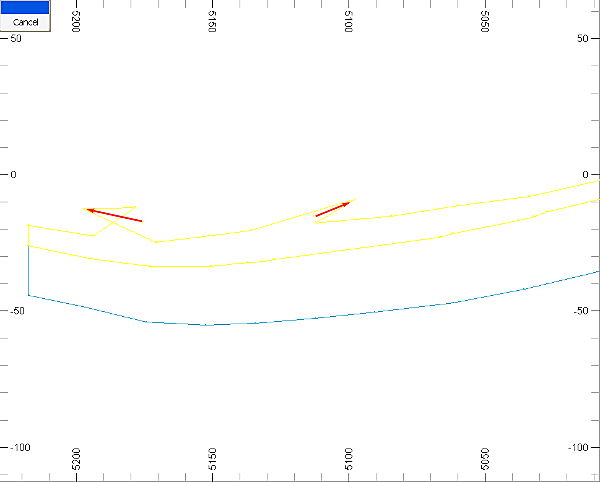
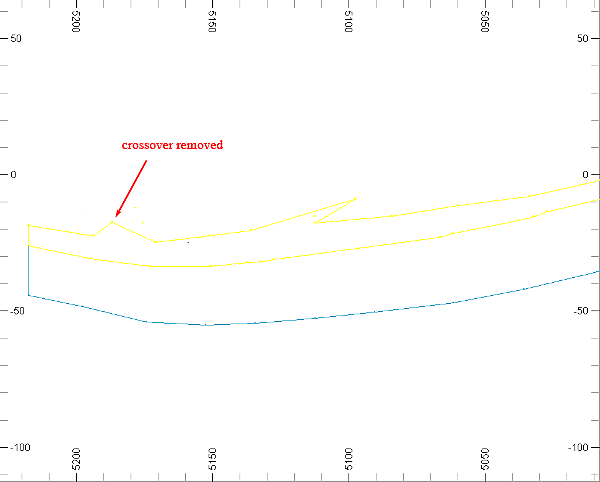
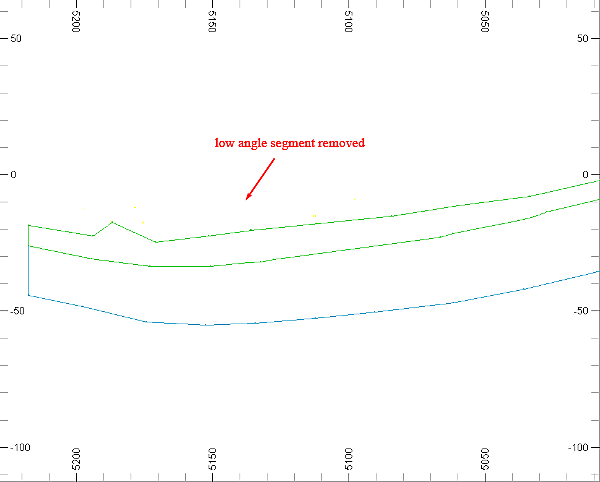

 |  Conditioning Section Strings Conditioning section strings in the Design window.  
---|---  
  
# Overview

In this part of the tutorial you will be introduced to some of the tools and techniques used to condition digitized section strings.

## Prerequisites

  * Completed the [Creating a New Project](<Creating_a_New_Project.md>) exercise.

  * Completed the [Defining Geological Modeling Settings](<Defining_Geological_Modeling_Settings.md#Exercise1>) exercise.

  * [Files](<Tutorial_Files_List.md>) required for the exercises on this page:

  *     * _vb_min2st.dm

    * _vb_viewdefs.dm

## Links to exercises

The following exercise is available on this page:

  * Conditioning Section Strings in the 3D window

## Exercise: Conditioning Section Strings in the Design window

In this exercise, you will load the existing ore body string model _vb_min2st.dm, and then create a working copy min4st.dm. One of the strings will be modified to introduce a crossover, and a low angle segment. These features will then be removed using specific 3D window string conditioning commands.

The image below shows the section string including the two unwanted features: the crossover, and the low angle segment:

   

 |  Condition section strings interactively in the3Dwindow after:

  * a string has been created by digitizing, translation, copying or slicing a wireframe in the Design window;
  * importing a strings data file.

  
---|---  
 | Strings are conditioned in order to:

  * achieve the required string shape, location and spacing of string data points;
  * remove unwanted features:

  * crossovers
  * low angle segments
  * duplicate points
  * irregular string point spacing

Conditioning can be done in two ways:

  1.      * Interactively in the Design window (this exercise)
     * Using Studio processes (see the exercise [Conditioning the Imported Topography Contours](<Conditioning_the_Imported_Contours_Strings.md#Exercise1>)).

  
---|---  
  
 | 

  * Automatic conditioning commands can:
  *     * change the shape of the selected string;
    * add many points - for example, when smoothing;
    * remove many points.
  * Always check the string(s) after using automatic conditioning commands - adjustments can be made using alternative settings or by manually editing string points.

  
---|---  
  
## 

## Loading and Formatting the Data

  1. In the Project Files control bar, select the All Tables folder.

  2. Drag-and-drop the following files (if not already loaded) into the Design window:

     * _vb_min2st

     * _vb_viewdefs

  3. Select the Sheets control bar and expand the Design-Overlays folder.

  4. Select only the following check boxes (i.e. display these objects) :

     * Default Grid

     * _vb_min2st (strings)

  5. In the View Control toolbar, click Get View 'gvi'.
  6. In the Command toolbar, Run Command field, type in '3', press <Enter>.
  7. In the Design window, confirm that the 'N-S SEcn 5935' view of the upper (Green 5) and lower (Cyan 6) mineralization zone strings are displayed as shown below:  
  
  

## Creating a Working Copy of _vb_min2st.dm (strings) 

  1. In the Loaded Data control bar, right-click _vb_min2st.dm (strings), and select Data | SaveAs.

  2. In the Save New 3D Object dialog, click Single Precision Datamine (.dm) File.
  3. In the Save _vb_min2st (strings) dialog, select your project folder, define the File name as 'min4st.dm', and click Save.
  4. In the Loaded Data control bar, confirm that _vb_min2st (strings) has been replaced by min4st (strings).
  5. Double-click on min4st (strings) to make it the current object.  
| The current object is highlighted black in the Loaded Data control bar and is also listed in the Current Objects toolbar.  
---|---  

## Inserting Unwanted String Features

  1. Select the Design window.
  2. In theView Controltoolbar, click Zoom Inand define a zoom rectangle around the northern (left) half of mineralization zone strings.
  3. Select the upper (Green 5) mineralization zone string.
  4. In the Point and String Editing: Standard toolbar, click Insert Points 'ipo'.

  5. Digitize (left-click) the three new points as shown below:  
  

  6. In the Point and String Editing: Standard toolbar, click Move Points 'mpo'.

  7. Move the second inserted point to the left of the first point; move the third inserted point to the right, as shown below:  
  

  8. Click Cancel.
  9. Check that you have a crossover and a low angle segment similar to those shown below:  
  

## Removing the Unwanted String Features

  1. Check that the string is still selected.

  2. Using theEditribbon, select theConditiondrop-down menu and thenTrim Crossovers.

  3. Check that the crossover has been removed and that the upper zone string appears as shown below:  
  

  4. Using the Edit ribbon, select Condition | Condition String.

  5. In the resulting dialog, define the Minimum angle: as '45' , click OK.

  6. In the 3D window right-click and select Deselect All Strings.

  7. Check that the low angle segment has been removed and that the upper zone string appears as shown below:  
  
  

 | 
     * Multiple strings can be selected and conditioned at the same time
     * These unwanted features are often small and difficult to detect visually
     * Strings should generally be conditioned as part of the modeling process.  
---|---  
  
| Unconditioned strings may contain unwanted features which can potentially prevent the successful creation of wireframes from the string model.  
---|---