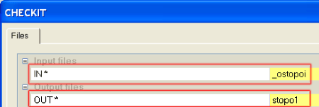
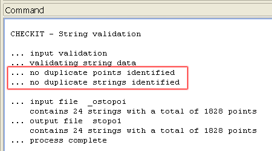
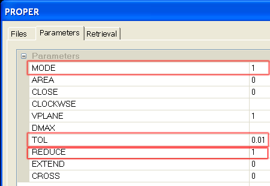
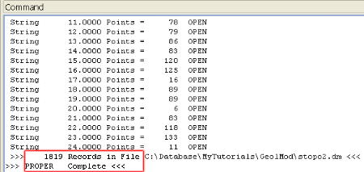

 |  Conditioning the Imported Topography Contours How to condition imported topography contour strings  
---|---  
  
# Overview

In this part of the tutorial you will use the processes PROPER and CHECKIT to condition the imported topography contour strings.

## Prerequisites

  * completed the [Creating a New Project](<Creating_a_New_Project.md>) exercise.

  * [Files](<Tutorial_Files_List.md>) required for the exercises on this page:

  *     * _ostopoi.dm

## Exercise: Conditioning Imported Topography Contour Strings

In this exercise, you will condition the imported topography contour strings _ostopoi. This includes the following tasks:

  * Using the process CHECKIT to identify and remove duplicate points and strings.

  * Using PROPER to reduce the number of points by 1%, and set a minimum chord length of 0.01m .

 |  UseCHECKITandPROPERto check and condition strings after:

  * importing data from an external source, e.g. CAD drawing (*.dwg, *.dxf).
  * generating or editing strings in theDesignor3Dwindow.
  * generating strings by slicing wireframes in the3Dwindow.
  * creating or modifying strings using processes e.g.BLKPER,CONPOL,EXPMMW.

  
---|---  
  
## Checking for Duplicate Points and Strings

  1. Activate the Data ribbon and select Data Tools | 3D Utilities | Check Strings.

  2. In the CHECKIT dialog, Files tab, Input files group, set IN* by browsing for and selecting the file _ostopoi.
  3. In the Output files group, define OUT* as stopo1 and click OK.  
  

  4. In the Command control bar, check that no duplicate points or strings have been detected.  
  

## Reducing Points and Setting a Minimum String Chord Length

  1. In the Command toolbar, click Find Command.

  2. In the Find Command dialog, type "proper".

  3. Click Run.

  4. In the PROPER dialog, Files tab, Input files group, set PERIMIN* by selecting the file stopo1.

  5. In the Output files group, define PERIMOUT* as stopo2.

  6. In the Parameters tab, define the settings shown below, and click OK:  
  
  

 |  Following the descriptions in the help pane at the bottom of the dialog, the above parameters have been set as follows:
     * @MODE=1 - contours are treated as open strings and not closed perimeter
     * @TOL=0.01 - the minimum chord length set when conditioning the strings
     * @REDUCE=1 - the reduction percentage (%) used when reducing the number of string points.  
---|---  
  7. Select the Command control bar, check that PROPER has finished running, and that the output file contains 1819 records (the input file has 1828 records), as shown below.  
  
  
  

 | 
     * In this exercise, the input topography contours strings file consists of both 'open' contour strings, one 'closed' contour string and a 'closed' boundary string (perimeter).
     * In the above use of PROPER, setting MODE=1 will convert all 'closed' strings to 'open' strings - this may not always be desired in the final file e.g. when using a boundary string to limit DTM creation. If required, these individual strings can be re-closed in the Design or VR window.  
---|---  

##   [Next Page](<Changing_the_Color_Values_-_Table_Editor.md>)