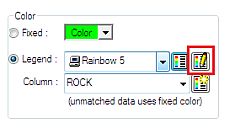
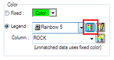
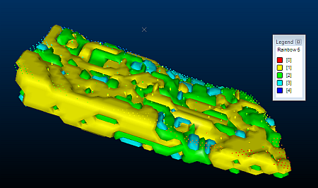
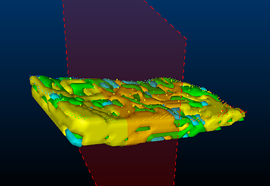
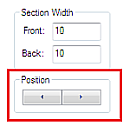
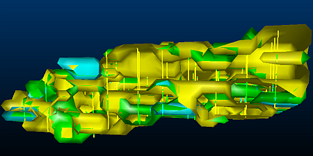

 |  Viewing Categorical Isoshells Enhancing the display of categorical isoshells using legends and sections  
---|---  
  
# Overview

In this part of the tutorial, you will specify and configure a legend to enhance the view of the isoshells for different rock categories. You will then create a section through the isoshells to provide a clearer view of the drillholes and isoshells.

## Prerequisites

  * Completed the following exercises.

  *     * [Tutorial Preparation](<CreateIsoshells_AddData.md#Exercise1>)

    * [Creating Categorical Isoshells](<CreateIsoshells_CatValues.md#Exercise1>)

## Exercise: Viewing Categorical Isoshells

## Specifying a Single Legend for Drillholes

  1. In the Sheets control bar, expand the 3D and Strings folders and select comps5 (drillholes).
  2. In the Sheets control bar, expand the Wireframes folder, and select  the following objects:  

     * ISO_ROCK: (ROCK=1)

     * ISO_ROCK: (ROCK=2)

     * ISO_ROCK: (ROCK=3)

  3. In the Sheets control bar, Strings folder, double-click comps5 (drillholes).
  4. In the Strings Properties dialog, select the Lines tab.
  5. In the Colorgroup,Legend:drop-down list, select [Rainbow 5].
  6. In theColorgroup,Columndrop-down list, confirm that [ROCK] is selected and clickOK.

## Specifying a Legend for Isoshells

  1. In the Sheets control bar,Wireframes folder, double-click ISO_ROCK: (ROCK=1).
  2. In the Wireframe Properties dialog,General tab, Colorgroup,click Edit Legend:  

  3. In the Legends Manager dialog, Available Legends pane, expand System Legends and locate Rainbow 5.
  4. Right-clickRainbow 5and selectCopy.
  5. In the Legends Manager dialog, Available Legends pane, right-click User Legendsand selectPaste.
  6. In User Legends, click on each color of the Rainbow 5 legend, and select [Value] in the Legend Properties group, Interval Type drop-down list.
  7. In the Legends Manager dialog, click Close.
  8. In the Wireframe Properties dialog,General tab, Colorgroup,select the [Rainbow 5] user legend from the Legend:drop-down list:  
  

  9. In the Wireframe Properties dialog,Colorgroup,Columndrop-down list, confirm that [ROCK] is selected.
  10. In theShadinggroup,select theSmoothoption, and clickOK.
  11. In the Sheets control bar,Wireframes folder, double-click ISO_ROCK: (ROCK=2).
  12. In the Wireframe Properties dialog,General tab,Colorgroup,Legend:drop-down list, select the [Rainbow 5] user legend.
  13. In the Wireframe Properties dialog,Colorgroup,Columndrop-down list, confirm that [ROCK] is selected.
  14. In theShadinggroup,select theSmoothoption and clickOK.
  15. In the Sheets control bar,Wireframes folder, double-click ISO_ROCK: (ROCK=3).
  16. In the Wireframe Properties dialog,General tab, Colorgroup,Legend:drop-down list, select the [Rainbow 5] user legend.
  17. In the Wireframe Properties dialog,Colorgroup,Columndrop-down list, confirm that [ROCK] is selected.
  18. In the Colorgroup, clickShow Legendby theLegend:drop-down list:  
  

  19. In theShadinggroup,select theSmoothoption and clickOK.
  20. In the3Dwindow, confirm that theRainbow 5legend is used to display each isoshell category:   
  

## Using Sections

  1. In the Sheets control bar, right-click the Sections folder and select New.
  2. In the 3Dwindow, click above the isoshells.
  3. In theOrientationdialog, select theBy 2 Pointsoption, and clickOK.
  4. In the 3Dwindow, click below the isoshells.
  5. In theOrientationdialog, select theVerticaloption, and clickOK.
  6. In the Sheets control bar, Sections folder, right-click the Sectionthat you created, and selectRename.
  7. In theRename 3D Object Overlaydialog, type "Isoshell Section" and click OK.
  8. In the3Dwindow, confirm that a vertical section through the isoshells has been created:   
  

  9. In theVRwindow, zoom into the isoshells, and double-click the section.
  10. In theSection Propertiesdialog,Section Widthgroup, type '10' in theFront:box.
  11. In theSection Propertiesdialog,Section Widthgroup, type '10' in theBack:box.
  12. In theClippinggroup, select theFrontoption.
  13. In theSection Planegroup, deselectFillandArrow, and clickApply.
  14. Position theSection Propertiesdialog so that theVRwindow is visible.
  15. In theSection Propertiesdialog,Positiongroup, use theLeftandRightbuttons to view vertical sections though the isoshells and drillholes:   
  

  16. In the3Dwindow, confirm that a section through the isoshells for each rock type is displayed:   
  

  17. In theSection Propertiesdialog, clickOK.
  18. In the Sheets control bar, expand the Wireframes folder, and deselect the following objects: 
     * ISO_ROCK: (ROCK=1)
     * ISO_ROCK: (ROCK=2)
     * ISO_ROCK: (ROCK=3)
  19. In the Sheets control bar, expand the Sections folder, and deselect Isoshell Section.