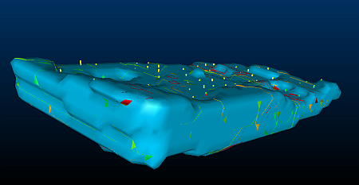
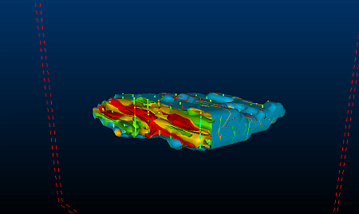
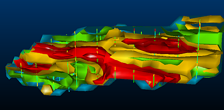

 |  Viewing Continuous Isoshells Enhancing the display of continuous isoshells using legends and sections  
---|---  
  
# Overview

In this part of the tutorial, you will specify and configure a legend to enhance the view of the isoshells for a range of AU grades. You will then create a section through the isoshells to provide a clearer view of the drillholes and isoshells.

## Prerequisites

  * Completed the following exercises:

  *     * [Tutorial Preparation](<CreateIsoshells_AddData.md#Exercise1>)

    * [Creating Categorical Isoshells](<CreateIsoshells_CatValues.md#Exercise1>)

    * [Viewing Categorical Isoshells](<ConfigCatIsoshells.md#Exercise1>)

    * [Creating Continuous Isoshells](<CreateIsoshells_ContValues.md>)

## Links to exercises

The following exercises are available on this page:

  * Viewing Continuous Isoshells

## Exercise: Viewing Continuous Isoshells

## Specifying a Legend for Drillholes

  1. In the Sheets control bar, expand the Strings folder and confirm that comps5 (drillholes) is selected.
  2. In the Sheets control bar, expand the Wireframes folder and confirm that the following objects are selected: 
     * ISO_AU: (AU=0)

     * ISO_AU: (AU=2)

     * ISO_AU: (AU=4)

     * ISO_AU: (AU=6)

     * ISO_AU: (AU=8)

     * ISO_AU: (AU=10)

  3. In the main menu, select Format | Legends....
  4. In the Legends Manager dialog, click New Legend....
  5. In the Legend Wizard: Data Table Column dialog, select the Use Explicit Ranges option, and click Next.
  6. In the Legend Wizard: Legend Storage dialog, click Next.
  7. In the Legend Wizard: General dialog, Name box, type "AU Range" and click Next.
  8. In the Legend Wizard: Data Range dialog, Number of Items box, type '5' and click Next.
  9. In the Legend Wizard: Legend Distribution dialog, click Next.
  10. In the Legend Wizard: Coloring dialog, confirm that [Rainbow blue->red] is selected in the drop-down list, and click Finish.
  11. In the Legends Manager dialog, click Close.
  12. In the Sheets control bar, Strings folder, double-click comps5 (drillholes).
  13. In the Strings Properties dialog, select the Lines tab.
  14. In the Colorgroup,Legend:drop-down list, select [AU Range].
  15. In theColorgroup,Columndrop-down list, select [AU].
  16. In the Colorgroup, clickShow Legend, and clickOK:  
  

## Specifying a Legend for Isoshells

  1. In the Sheets control bar,Wireframes folder, double-click ISO_AU: (AU=0).
  2. In the Wireframe Properties dialog,General tab, Colorgroup,Legend:drop-down list, select [AU Range].
  3. In theColorgroup,Columndrop-down list, select [AU].
  4. In theShadinggroup,select theSmoothoption and clickOK.
  5. Repeat steps 1-4 for the following wireframes:
     * ISO_AU: (AU=2)
     * ISO_AU: (AU=4)
     * ISO_AU: (AU=6)
     * ISO_AU: (AU=8)
     * ISO_AU: (AU=10)
  6. In the3Dwindow, confirm that theAU Rangelegend is used for the isoshells:   
  

## Using Sections

  1. In the Sheets control bar,Sections folder, select IsoshellsSection.
  2. In theVRwindow, confirm that a vertical section through the isoshells is displayed:   
  

  3. In theVRwindow, zoom into the isoshells, and double-click the section.
  4. Position theSection Propertiesdialog so that theVRwindow is visible.
  5. In theSection Propertiesdialog,Positiongroup, use theLeftandRightbuttons to view vertical sections though the isoshell wireframes and drillholes:   
  

  6. In theVRwindow, confirm that isoshells are displayed for the ranges of AU values that you specified:   
  

  7. In theSection Propertiesdialog, clickOK.
  8. In the Sheets control bar, right-click the Strings folder and select Hide All.
  9. In the Sheets control bar, right-click the Wireframes folder and select Hide All.
  10. In the Sheets control bar, right-click the Sections folder and select Hide All.

****Top of page

Checklist:

  1. The topic is stored in the relevant tutorial area of the RoboHelp X5 project.

  2. All topics created with this template are set at TOPIC-LEVEL to the relevant TUTORIAL build tag.

  3. Related topics are not normally required - use BROWSE SEQUENCES instead.

  4. Popups

  5. Browse sequences

  6. Index

  7. TOC

  8. Glossary Items

Also, please check the online Procedures project for more information.