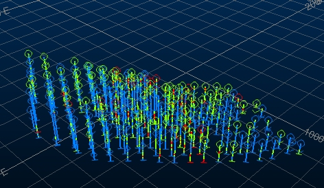
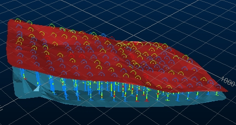

# Creating Isoshells - Setup

 |  Tutorial Preparation Adding the drillholes and wireframes files required for the Creating Isoshells tutorial  
---|---  
  
# Overview

In this part of the tutorial, you will load a drillholes file, and use a macro to create the wireframes used to bound the isoshells you create. The macro identifies the top and bottom mineralized sample in each drillhole, and then creates upper and lower wireframes to constrain the isoshells.  

## Prerequisites

  * [Files](<Tutorial_Files_List.md>) required for these exercises:

  *     * COMPS5.dm

    * Start_End_Samples.mac

## Exercise: Data Preparation

## Adding a Drillholes File to the 3D Window

  1. In the 3D Window, type 'ua' to unload any loaded data.
  2. In the Project Files control bar, drag the COMPS5 drillholes file into the 3D window.
  3. In the 3D window, confirm that drillholes are displayed:  
  

## Adding Wireframes to the 3D window

  1. Activate the Home ribbon and select Macro | Run Macro
  2. In the Select File dialog, browse to your project folder and double-click the macro file Start_End_Samples.mac.
  3. In the Command toolbar, type 'M1', and click Run Command.
  4. select Macro | Run Macro
  5. In the Select File dialog, browse to your project folder, and double-click Start_End_Samples.mac.
  6. In the Command toolbar, type 'M2', and click Run Command.
  7. In the Project Files Control Bar, Wireframe Triangles folder, confirm that the following wireframes have been created:  

     * lowertr
     * uppertr  

  8. In the Project Files control bar, drag both wireframes into the 3D window.
  9. In the 3D window, confirm that the wireframes are displayed above and below the drillholes:  
  

 |  The above wireframe files are also provided here:C:\Database\DMTutorials\Data\VBOP\Datamine(assuming a default installation).  
---|---  
  
**  
**Top of page