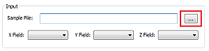
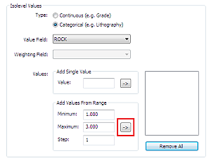
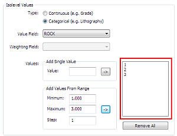
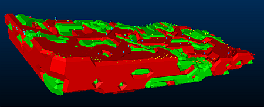
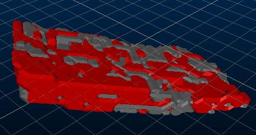
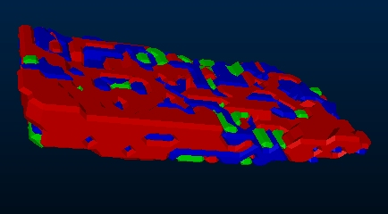

# Creating Isoshells with Categorical Values

 |  Creating Categorical Isoshells Using the Create Isoshells dialog to create categorical isoshells for various rock values  
---|---  
  
# Overview

In this part of the tutorial, you will create categorical isoshells for various rock values using theCreate Isoshellsdialog. TheConditiontab is not used in this exercise as the isoshells will not require conditioning.

## Prerequisites

  * Completed the [Tutorial Preparation](<CreateIsoshells_AddData.md#Exercise1>) exercise.

  * [Files](<Tutorial_Files_List.md>) required for this exercise:

  *     * COMPS5 .dm

    * lowertr.dm

    * uppertr.dm

## Exercise: Creating Categorical Isoshells

## Specifying Input Data  

 | Categorical values are discrete values, with no numerical relationship - for example, zone or rock type. Samples with a specific target value are used, rather than interpolated values. This type of value is numeric or alphanumeric.  
---|---  
  
  1. Unload any data that may already be loaded.
  2. Use the Structure ribbon to select Create Isoshells.
  3. In the Create Isoshellsdialog, select theInput tab.
  4. In the Inputgroup, click theEllipsisbutton by theSample File:box:  
  

  5. In theProject Browser - [Project name]dialog, expand theDrillholesfolder and double-clickCOMPS5.
  6. In the Create Isoshellsdialog,Input tab, Input group, confirm that the following fields are selected in the indicated fields: 
     * X Field: [X]
     * YField: [Y]
     * Z Field: [Z]
  7. In the Input tab, Isolevel Values group, select the Categorical (e.g. Lithography) option.
  8. In the Isolevel Values group, Value Field drop-down list, select [ROCK].
  9. In the Isolevel Values group, AddValues From Rangegroup, click the right-pointingArrowbutton:  
  

  10. In the box to the right of theValues group, confirm that '1', '2' and '3' are listed:   
  

## Specifying Estimation Parameters

  1. In theCreate Isoshellsdialog,Estimation Parameterstab,EstimationSearch Ellipsoidgroup, enter the following values in the indicated fields:

  1.      * X : '100'
     * Y : '100'
     * Z : '50'

 |  The search radii of 100, 100, 50 reflect the stratified nature of the orebody.  
---|---  
  
  2. In theCreate Isoshellsdialog,Estimation Parameterstab,Rotationsgroup, enter the following values in the Angle boxes for the indicated fields:  

     * Z : '30'
     * X : '17'
     * Y : '0'

 |  As the orebody has a dip direction of N30oE and a dip of 17o, the above rotation angles are used to align the estimation search ellipsoid with this structure.  
---|---  
  
## Specifying Volume Details

  1. In the Create Isoshellsdialog,Volume tab, Alignment group, confirm that Align with search ellipse is selected.

  2. In the Volume tab, Boundaries group, select Below wireframe.

  3. In the Project Browser - [Project name]dialog, expand theWireframe Trianglefolder and double-clickuppertr.

  4. In the Volume tab, Boundaries group, select Above wireframe.

  5. In the Project Browser - [Project name]dialog, expand theWireframe Trianglefolder and double-clicklowertr.

  6. **I** n the Create Isoshellsdialog,Volume tab, Bounding Box group, confirm that Fit to data and boundaries is selected. Keep the dialog open.

## Specifying Output Details

  1. **I** n the Create Isoshellsdialog,Output tab,  Object Base Name: box, type "ISO_ROCK".

  2. In the Output tab,  confirm that the following check-boxes are selected:

     * Calculate from bounding box

     * Different object for each isolevel

     * Include volume boundary in isosurface

  3. **I** n the Create Isoshellsdialog, clickOK.

## Saving the Results

  1. In the Isoshell Report dialog, click Save to Project.
  2. In the Project Browser - [Project name]dialog,Filename:box, type "categorical isoshell report" and clickOK.
  3. In the Isoshell Report dialog, click Finish.
  4. In Windows Explorer, browse to the location of your project, and confirm that the Categorical Isoshell Report.dm file has been created.

 |  Double-clicking Categorical Isoshell Report.dm will open the report using Table Editor.  
---|---  
  
  5. In the 3D window, confirm that the isoshells are displayed:  
  

  6. In the Sheets control bar, right-click the 3D folder, and select Hide All.

  7. In the Sheets control bar, expand the 3D and Wireframes folders, and select each of the following wireframes individually, viewing the corresponding isoshells in the 3D window:

     * ISO_ROCK: (ROCK=1)

     * ISO_ROCK: (ROCK=2)

     * ISO_ROCK: (ROCK=3)

  8. As each of the rock codes are represented by independent wireframes, set the properties for each one to display a single, fixed color:

     * ROCK=1: show in Red

     * ROCK=2: show in Blue

     * ROCK=3: shown in Green

You should now see a display clearly identifying the 3 rock shells:  

****Top of page