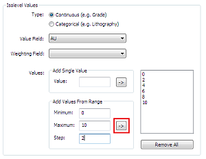
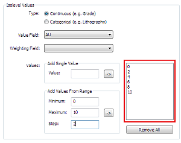
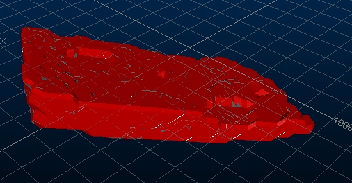
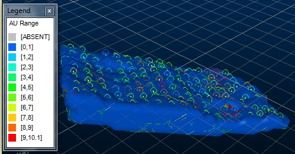

# Creating Isoshells with Continuous Values

 |  Creating Continuous Isoshells Using the Create Isoshells dialog to create continuous isoshells for AU grades  
---|---  
  
# Overview

In this part of the tutorial, you will create continuous isoshells for AU grades using theCreate Isoshellsdialog. As the isoshells will not require conditioning, theConditiontab is not used in this exercise.

## Prerequisites

  * Completed the following exercises:

  *     * [Tutorial Preparation](<CreateIsoshells_AddData.md#Exercise1>)

    * [Creating Categorical Isoshells](<CreateIsoshells_CatValues.md#Exercise1>)

    * [Viewing Categorical Isoshells](<ConfigCatIsoshells.md#Exercise1>)

## Exercise: Creating Continuous Isoshells

In this exercise, the AU field identifies the gold grade in the COMPS5 file, and contains values between 0.01 and 32.59.

  1. Unload any data that may already be loaded - even if unsaved.
  2. Use the Structure ribbon to select Create Isoshells.
  3. In the Create Isoshellsdialog, clickRestore.  
  
| After isoshells have been generated, clicking Restore re-adds the last parameters which you entered in the Create Isoshellsdialog. These are automatically saved when isoshells are created.  
---|---  
  4. In the Input tab, Isolevel Values group, select the Continuous (e.g. Grade) option.  
  
| Isoshells created using continuous values are helpful in identifying ore-waste boundaries, and use interpolated values between sample data. This type of value is numeric.  
---|---  
  5. In the Isolevel Values group, Value Field drop-down list, select [AU].
  6. In the Isolevel Values group, click Remove All.
  7. In the Inputtab,Add Values From Range group, Minimum box, type '0'.
  8. In the Inputtab,Add Values From Range group, Maximum box, type '10'.
  9. In the Inputtab,Add Values From Range group, Step: box, type '2'.
  10. In the Isolevel Values group, AddValues From Rangegroup, click theArrowbutton:  
  

  11. In the box to the right of theValues group, confirm that the values '0', '2' '4', '6', '8' and '10' are listed:   
  

  12. **I** n the Create Isoshellsdialog,Output tab, Output group, Object Base Name box, type "ISO_AU".
  13. **I** n the Create Isoshellsdialog, clickOK.
  14. In the Isoshell Report dialog, click Export to Excel.
  15. In row 3 of the Excel worksheet, confirm that 47,949,622 m3 of material contains more than 2 g/t of AU.
  16. In row 7 of the Excel worksheet, confirm that 1,862,609 m3of material contains more than 10 g/t of AU.
  17. In Excel, select File | Exit.
  18. In the Microsoft Excel dialog, click Don't Save.
  19. In the Isoshell Report dialog, click Finish.
  20. In the 3D window, confirm that the following isoshells are displayed:  
  

  21. In the Sheets control bar, expand the Wireframes folder and deselect the following objects:

     * ISO_AU: (AU=0)

     * ISO_AU: (AU=2)

     * ISO_AU: (AU=4)

     * ISO_AU: (AU=6)

     * ISO_AU: (AU=8)

     * ISO_AU: (AU=10)

  22. In the Sheets control bar, select each of the above wireframes individually, and view the corresponding isoshells in the 3D window. Confirm that isoshells are displayed for the range of AU values that you specified.

## Exercise: Viewing Continuous Isoshells

## Specifying a Legend for Drillholes

  1. Drag the file comps5 (drillholes)into the3D window, from the Project Files control bar.
  2. In the Sheets control bar, expand the Wireframes folder and confirm that the following objects are selected: 
     * ISO_AU: (AU=0)

     * ISO_AU: (AU=2)

     * ISO_AU: (AU=4)

     * ISO_AU: (AU=6)

     * ISO_AU: (AU=8)

     * ISO_AU: (AU=10)

  3. Using the Format ribbon select Format LegendsIn the main menu, select Format | Legends....
  4. In the Legends Manager dialog, click New Legend....
  5. In the Legend Wizard: Data Table Column dialog, select the Use Explicit Ranges option, and click Next.
  6. In the Legend Wizard: Legend Storage dialog, click Next.
  7. In the Legend Wizard: General dialog, Name box, type "AU Range" and click Next.
  8. In the Legend Wizard: Data Range dialog, Number of Items box, type '5' and click Next.
  9. In the Legend Wizard: Legend Distribution dialog, click Next.
  10. In the Legend Wizard: Coloring dialog, confirm that [Rainbow blue->red] is selected in the drop-down list, and click Finish.
  11. In the Legends Manager dialog, click Close.
  12. In the Sheets control bar, DrillholesStrings folder, double-click comps5 (drillholes).
  13. In the DrillholesStringsProperties dialog, select the Lines& Symbols tab.
  14. In the Colorgroup,Legend:drop-down list, select [AU Range] - it should be at the bottom of the list.
  15. In theColorgroup,Columndrop-down list, select [AU].
  16. In the Colorgroup, clickShow Legend, and clickOK:  
  

## Specifying a Legend for Isoshells

  1. In the Sheets control bar,Wireframes folder, double-click ISO_AU: (AU=0).
  2. In the Wireframe Properties dialog,General tab, Colorgroup,Legend:drop-down list, select [AU Range].
  3. In theColorgroup,Columndrop-down list, select [AU].
  4. In theShadinggroup,select theSmoothoption and clickOK.
  5. Repeat steps 1-4 for the following wireframes:
     * ISO_AU: (AU=2)
     * ISO_AU: (AU=4)
     * ISO_AU: (AU=6)
     * ISO_AU: (AU=8)
     * ISO_AU: (AU=10)
  6. In the3Dwindow, confirm that theAU Rangelegend is used for the isoshells:   
  

## Using 3D Sections

  1. In the Sheets control bar,Sections folder, select IsoshellsDefaultSection.
  2. Double-click the Default Section item and set an Azimuth of '40' and an Inclination of '-90'.
  3. Disable theUse Dimensionscheck box and set theClippingtoFront. ClickOK.
  4. In the3Dwindow, rotate the view with the cursor and confirm that a vertical section through the isoshells is displayed:   
  

  5. In the3Dwindow,zoom into the isoshells, anddouble-click the section.
  6. Position theSection Propertiesdialog so that the3Dwindow is visible.
  7. In theSection Propertiesdialog,Positiongroup, use theLeftandRightbuttons to view vertical sections though the isoshell wireframes and drillholes:   
  

  8. In the3Dwindow, confirm that isoshells are displayed for the ranges of AU values that you specified:   
  

  9. In theSection Propertiesdialog, clickOK.
  10. (Now for something a bit more interactive) using the View ribbon, select the Edit Interactively button to display the section widgets (zoom out if you can't see them).
  11. Disable the display of the Default Grid.
  12. Click-grab-move the Green widget to see how you can position the section with the mouse, with all clipping being updated in real-time.
  13. Experiment with the Red widgets to adjust theAzimuthof the section interactively.
  14. Experiment with the Blue widgets to adjust theInclinationof the section interactively.   
  
  
  
(Refresh the page - press F5 - to watch the animation from the start)  
  

  15. In the Sheets control bar, right-click the Strings folder and select Hide All.
  16. In the Sheets control bar, right-click the Wireframes folder and select Hide All.
  17. In the Sheets control bar, right-click the Sections folder and select Hide All.

****Top of page