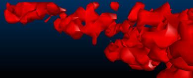

 |  Creating Isoshells Creating isoshells from drillhole or point sample data  
---|---  
  
# Creating Isoshells

Previously, geological and grade interpretation could be challenging and highly subjective, with wireframe interpretations of geological data requiring section lines to be digitized manually. This process had to be restarted with each arrival of new data, and could take days to complete. The Create Isoshells process automates this procedure, allowing you to create complex shells in minutes.

Creating a resource model is an iterative process with greater understanding of the geology and grade distribution being achieved as the study proceeds, and more data becomes available. Isoshell wireframes can assist in this process: surrounding an area in 3D space, they allow boundaries between rock types to be delineated, and allow you to model the spatial distribution of grades by representing different cutoffs. Where controls on mineralization are unclear, Isoshell wireframes allow different levels of a lower cutoff to be investigated - providing a suitable domain for grade estimation.

An example showing three levels of nested isoshells

A slice through the nested isoshells

The Create Isoshells process allows isoshells to be created from any point sample input, such as drillholes or chip samples, and is accessed as follows:

  * Using the Structure ribbon's Create Isoshells commandFrom the main menu, by selecting Wireframes | Create Isoshells.
  * Running the create-shells command (shortcut key "csh").
  * Through scripting using the ParseCommand method, and providing parameters to define behavior.

The Create Isoshells functionality is outlined below, with links to information for each tab of the Create Isoshells dialog:

## Licensing

An Orebody Block Modeling license is required to use the Create Isoshells dialog. Additionally, a Wireframe Modeling License is required if the following options are selected in the Create Isoshells dialog,Volume tab:

  * Below wireframe
  * Above wireframe
  * Inside wireframe

## Specifying Input Details

The Create Isoshellsdialog,Input tab allows you to select a sample file (usually a drillhole or points file), and associated coordinate fields. The field of interest can be defined, as well as isolevel values and the type of isoshells to be generated. The isoshells you produce can contain either Continuous or Categorical values – the type you select determines several subsequent options:

  * Continuous - values vary continuously between samples, as illustrated below, and are assumed to have an infinite number of possible values - for example, grade. In isoshells created using continuous values, interpolated values between sample data are created. This type of value is numeric.  
  

  * Categorical - a specific set of values with no numerical relationship - for example, zone or rock type, as illustrated below. This type of value is numeric or alphanumeric. Samples with a specific target value are used rather than interpolated values.  
  

 |  Continuous isolevels are numeric. Categorical isolevels can be either numeric or text.  
---|---  
  
The field which contains the values being interpreted must be selected, and an optional weighting field can be specified for the interpolation of Continuous isolevels values. Values can be added singly, or as part of a range, and are displayed in the right-hand side of the dialog.

## Conditioning Input Data

TheCreate IsoShellsdialog,Condition tab allows you to condition the input data before it is passed to the interpolator, allowing upper and lower limits to be imposed on the input samples. For Continuous isoshells, it allows you to transform data to a different distribution - converting it to the log of the input data, or mapping it to fit a normal distribution. If the input sample distribution is approximately lognormal, then the normal and log transformations will usually reduce the effect of high sample values.

The following graph illustrates the relationship between cutoff (isolevel) grade, and volume above cutoff for different transformations, and for topcuts of 100 and 200. The input sample file has a lognormal distribution with a mean of 28 g:   

## Specifying Estimation Parameters

To produce a realistic estimated value of a point in 3D space, at least three original sample points must fall within the search ellipse which is centered on that estimation point. A maximum of 10 samples is permitted - if there are more than 10 samples, then the nearest 10 samples to the point being estimated are selected.

In order to achieve anisotropy for both Continuous and Categorical isolevel types, different radii and orientations can be specified for each axis. Orientations are defined by specifying rotations in degrees (-360 to 360) for up to 3 axes.

TheEstimation Parameters tab allows you to specify the parameters in the Estimation Search Ellipsoid for continuous isolevels. It also allows you to select the interpolation algorithm used to estimate values which lie between samples for Continuous isolevel types.Inverse Distance Weighting, or Ordinary Kriging estimation methods can be selected.

The Inverse Distance Weighting method estimates values on a regular grid by weighting each sample by the inverse power of its distance from each grid point, and is the faster of the two methods.Ordinary Kriging, however,takes account of the spatial relationship between samples, and has the advantage of adjusting weights to compensate for the clustering of samples. The variogram model used for Ordinary Kriging has a zero nugget variance, with ranges and orientation defined by the search volume.

## Defining Boundaries

The Volume tab allows you to define a bounding box within which isoshells are calculated. This provides the advantages of restricting the volume to a specific area of interest, and minimizing the effects of extrapolation.

  * Horizontal extents are defined by the intersection of the Inside perimeter and Inside wireframe hulls, if defined. If these files have not been specified, the horizontal extent of the input sample file is used instead.
  * The maximum vertical extent is defined by the lowest maximum elevations of the Below wireframe or Inside wireframe hulls, if defined. If these files have not been specified, the maximum vertical extent of the input sample file is used instead.
  * The minimum vertical extent is defined by the highest minimum elevation of the Above wireframe or Inside wireframe hulls, if defined. If these files have not been specified, the minimum vertical extent of the input sample file is used instead.
  * If Align with search ellipse is selected in the Alignment group, then the bounding box is extended to enable the values specified for Below wireframe, Above wireframe, and Inside perimeter to be processed in world space. This means that ‘above’ and ‘below’ are always relative to the world vertical axis, regardless of any dip in the search ellipse.

## Specifying Output Parameters

The Output tab allows you to specify output parameters for isoshells, including defining the Object Base Name, and Triangle Spacing parameters, as well as specifying different objects for each isolevel, and selecting whether to include volume boundaries in the isosurface. Low, medium or high levels of smoothing for Isosurfaces can also be specified.

 |  Isoshell wireframes are written into memory for visualization and analysis purposes only - if you require isoshell files, they must be explicitly saved.  
---|---  
  
### Triangle Spacing

Specifying triangle spacing allows you to define a value related to the size of the triangles used in generating the output. Larger triangles are processed faster, but produce coarser wireframes which may not show smaller structures. Triangle size can also be set automatically for the size of bounding box specified in the Volume tab by selecting the Calculate from bounding box. The following images demonstrate the effects of different triangle spacing parameters:

Triangle Spacing set to '10'

Triangle Spacing set to '5'

Triangle Spacing set to '2.5'

### Volume boundaries

By selecting the Include volume boundary in isosurface option, isoshells are automatically closed where they pass through the bounding box boundary – otherwise they remain open. Since wireframes must be closed to allow volumetric calculations and other wireframe processes to be run, it is recommended to select this option.

A categorical isoshell left open at the volume boundary - open edges are highlighted.

A categorical isoshell which is closed at the volume boundary.

### Smoothing Isosurfaces

When using larger triangle sizes, noticeable ramping steps may be visible in the output wireframe. These can be smoothed during generation by selecting the Smooth Isosurfaces option. This process ‘averages out’ regional differences between existing vertices, rather than adding additional vertices to the wireframe. Smoothing can also be performed on the wireframe after generation by using thewireframe-smoothcommand. Excessive smoothing should be avoided, however, as this can reduce volumes.

The following images show the effects of smoothing on the output wireframe:

An isosurface with no smoothing

An isosurface with low smoothing

The same Low-smoothed isosurface, now with smooth shading

## Completing the Create Isoshells Process

When you have entered appropriate parameters in the Create Isoshells dialog, isoshells are generated by clicking OKin any tab.

 |  The following values must be defined in the Input tab before the OK button is enabled:

  * Sample File
  * X Field
  * Y Field
  * Z Field
  * Value Field
  * At least one Isolevel value

  
---|---  
  
When the Create Isoshells process is running, a progress bar is shown, and additional information is displayed in the Command Bar. The progress bar shows general progress through the various processing steps, while additional information, including references to problems encountered, is displayed in the Command Bar. You can stop this process by clicking Cancel in the Progress bar - this is helpful if processing is slower than expected, and a larger triangle size is required.

When the process is complete, a summary of resulting isolevel wireframes is displayed in the Isoshell Report dialog. This contains one row for each isolevel. The first column lists the value being converted into isoshells - only non-empty isoshells are listed. If an isoshell contains open edges - for example, because the Include volume boundary in isosurface option was not selected in the Output tab - a "Not closed” message is displayed in the Volume and Area columns.

The Isoshell Report dialog also allows you to save this summary as a datamine-format table, or export it to Microsoft Excel. Clicking Finish closes both the Isoshell Report and the Create Isoshells dialogs. All Parameters in the Create Isoshells dialog are automatically saved, and can be restored when the Create IsoShells process is run subsequently. This is done by clicking Restore in the Create Isoshells dialog.

##    
Scripting the Create Isoshells Process

This functionality can be scripted using the ParseCommand() method, and providing parameters to define behavior.