# Creating Closed Volumes Using String Linking Techniques

 |  Creating Closed Volumes Using Wireframe Linking Techniques Creating closed wireframe volumes using wireframe linking tools.  
---|---  
  
# Overview

In this part of the tutorial you will use the 3D window's Wireframe Linking tools to create a closed volume wireframe model from a strings model.

## Prerequisites

  * Completed the [Creating a New Project](<Creating_a_New_Project.md>) exercise.

  * Completed the [Defining Geological Modeling Settings](<Defining_Geological_Modeling_Settings.md>) exercise.

  * [Files](<Tutorial_Files_List.md>) required for the exercises on this page:

  *     * _vb_minst.dm

    * _vb_viewdefs.dm

## Exercise: Creating the Ore Body's Closed Volume Wireframe Model Using Wireframe Linking Tools

In this exercise, you are going to use the Structure ribbon's wireframe linking functions to create a closed volume wireframe model of the ore body. This will be done using the ore body mineralization zone strings vb_minst (strings) object as a basis for the wireframe.

The Wireframe Linking toolbar functions only use string data (and not points) to generate wireframes, and can also be used to generate open wireframe surfaces.

 | 

  * UseWireframe Linkingtoolbar functions when creating wireframe models ofclosed volumes or complexopensurfaces, for example:
  *     * geological features (lithology or mineralization volumes)
    * underground designs
    * underground survey measurements
  * Make use of Tag Strings to enhance control during the creation of wireframes using the Wireframe Linking toolbar functions.

Using Wireframe Linking toolbar functions with:

  1.      * Malformed string data, is likely to produce unwanted features or errors.
     * Unconditioned string data, is likely to produce poor quality wireframes e.g. clusters of many long thin triangles. 

  
---|---  
  
## Loading and Formatting Data

  1. If you have any data previously loaded, unload it.

  2. In the Project Files control bar, select the All Tables folder.

  3. Drag-and-drop the following files (if not already loaded) into the 3D window:  

     * _vb_minst

     * _vb_viewdefs

  4. Select the Sheets control bar and expand the 3D folder.

  5. Select only the following check boxes (i.e. display these objects):  

     * _vb_minst (strings)

  6. Right-click to Delete the Default Section item if it exists, and double-click the _vb_viewdefs item to display the Section Properties dialog.
  7. Disable theUse DimensionsandSection Plane - Fillcheck boxes and click the right arrow until 'Inclined View' appears in the status bar - clickOK.
  8. Click Lock in the View ribbon to show the 'Inclined view' showing the upper (Green 5), lower (Cyan 6) mineralization zone strings and tag strings (Red 2), as shown below:  
  
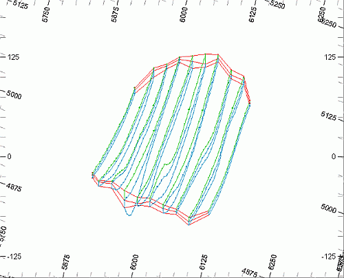

## Creating the New Wireframe Object

  1. In theCurrent Objectstoolbar, select theObject Type[Wireframe], clickCreate New Object Applying Default Template, as shown below:  
  
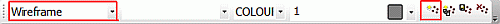
  2. In theLoaded Datacontrol bar, confirm that theNew Wireframeobject is listed, and that it is the current wireframe object (highlighted in bold).

**Creating the Upper Mineralized Zone Wireframe Without U****sing Tag Strings**

|  Tag Strings provide additional control when Wireframe Linking more complex shapes. In this part of the exercise, this feature will be turned OFF in order to demonstrate the effects of not using this feature.  
---|---  
  
  1. Using the Home ribbon, open the Project | Settings dialog and select the Wireframe Linking tab.
  2. In the String Linking Control group, select the Wireframe Attributes from Strings option, but disable the Use tag strings option and click OK.
  3. Activate the Format ribbon and select the Filter | Strings option
  4. In the Expression Builder define the Expression as shown below, click OK:  
  
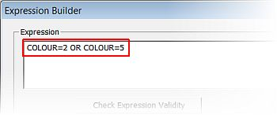  

  5. CIn the 3D window, confirm that only the tag strings (Red 2), and the upper mineralized zone strings (Green 5) are displayed, as shown below:  
  
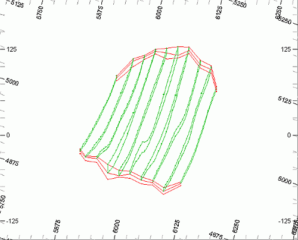  

  6. Activate the Structure ribbon and select End Link
  7. In the 3D window, select (left-click) the section string on the western end (left), select the section string on the eastern end (right) - click Done when the string is filled:  
  
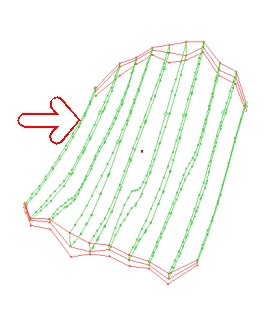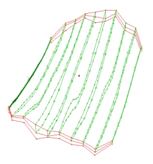  

  8. Zoom and rotate the view, confirm that wireframes have been created for the two end sections:  
  
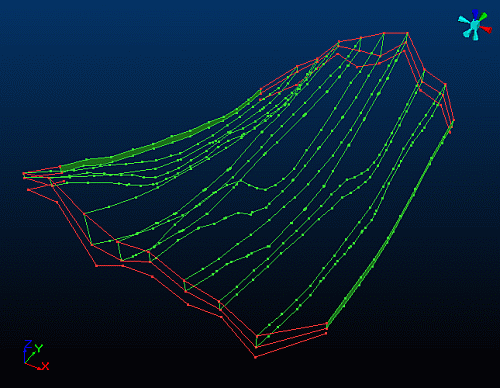  

  9. In the 3D window, starting at the western end, run the linking command again select (left-click) each of the 10 section strings in turn from left to right - INCLUDING the one you just end-linked. The last section string will be the one on the eastern end.
  10. Click Done.
  11. Confirm that your wireframe for the upper mineralized zone is as shown below: **  
  
  
**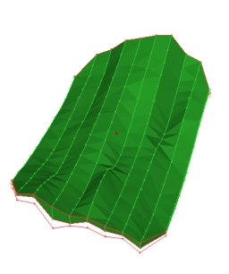  
  
|  This wireframe is a closed volume containing both wireframe surfaces at each end and between each section string. There should not be any gaps nor holes in the wireframe volume.  
---|---  
  12. Zoom and rotate the view. Note that between many of the adjacent section strings, the wireframes have not been created as expected on the northern and southern edges. This is identified by the gaps between the wireframe and the tag strings (Red 5) - for example, between the sections indicated below:**  
  
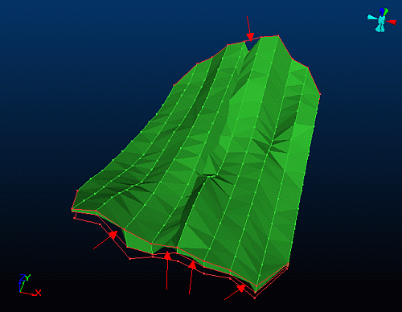**  
  
|  If a wireframe does not honor the linked strings as expected, you need to:
     * unlink or erase the wireframe;
     * check, and change or correct the following:
     *        * Wireframe Linking settings - for example, using tag strings, linking method
       * the string object that is being used to create the wireframe;
     * recreate the wireframe.  
---|---  

## Unloading the Malformed Upper Mineralized Zone Wireframe

  1. Select the 3D window.
  2. Using the Structure ribbon, select Edit | Erase  
 | The Erase Wireframe by Group dialog is displayed when this command is run. The Data Picker (highlighted below) needs to be toggled ON (default status) before a wireframe can be selected in the Design window. **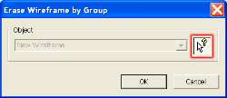**  
---|---  
  3. In the 3D window, select (left-click) the upper mineralization zone wireframe: **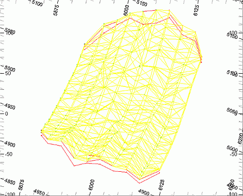**  
  
| 
     * The selected wireframe is highlighted yellow
     * The current default selection method for wireframes is By Field (SURFACE), as set in an earlier exercise; but the Erase Wireframe command uses the By Group selection option.  
---|---  
  4. In the Erase Wireframe by Group dialog, confirm that the correct object is listed, and click OK.
  5. In the dialog, click Yes.
  6. In the object unloading confirmation dialog, click No.
  7. In the Erase Wireframe by Group dialog, click Cancel.
  8. In the 3D window, confirm that the upper mineralization zone wireframe has been erased, and that only the filtered ore body strings are displayed.

| The New Wireframe object should still be listed in both the Project Files control bar and in the Loaded Data control bar, but the object's data table contains no records.  
---|---  
  
**Recreating the Upper Mineralized Zone Wireframe Using Tag strings  
**

| Tag Strings provide additional control when Wireframe Linking more complex shapes.  
---|---  
  
  1. Select the 3D window.
  2. Using the Structure ribbon, ensure Tag Strings are enabled in the Tag String drop-down menu.
  3. Select Create | End link
  4. In the 3D window, select (left-click) the section string on the western end (left), select the section string on the eastern end (right), click Cancel.
  5. Select Link Strings, select (left-click) each of the 10 section strings in turn, moving from west to east, then click Cancel.
  6. In the3Dwindow, zoom and rotate the view, confirm that your wireframe is as shown below i.e. without gaps between the wireframe and the tag strings:**  
  
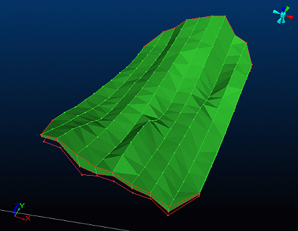**

**Creating the Lower Mineralized Zone Wireframe Using Tag Strings**

| This part of the exercise uses a different procedure to generate the wireframe i.e. it usestag strings andthe**Link Multiple by Attribute** function in place of**Link Strings** and**End Link**. This procedure is faster but relies on a numeric Attribute field to define the automatic string linking order. In this case the Attribute SECTION is used; the section strings are numbered 1 to 10 starting with the far Western section.  
---|---  
  
  1. Select the 3D window.
  2. Activate the Format ribbon and select Format | Wireframes.
  3. In the Object Expression Builder define the Expression as shown below, click OK:**  
  
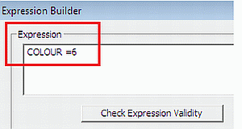**
  4. Select Format | Strings.
  5. In the Object Expression Builder define the Expression as shown below, click OK:**  
  
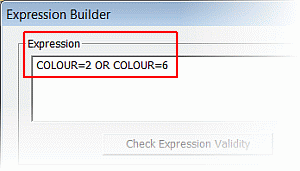**
  6. In the 3D window, check that only the tag strings (Red 2) and the lower mineralization zone strings (Cyan 6) are displayed.
  7. Activate the Structure ribbon and expand the Link Multiple drop-down list to ensure the Endlink When Multiple Linking is toggled ON
  8. In the 3D window, click and drag a selection box across all 10 section strings (no tag strings are selected). All strings should then shown as highlighted.
  9. Select Wireframes | Link Multiple | Link Multiple by Attribute
  10. In the dialog, type in 'SECTION' as the Attribute To Define Sequence, click OK.
  11. In the Number of Strings per block dialog, type in '10' as the Number of Strings, click OK.
  12. In the 3D window zoom and rotate the view, check that your wireframe for the lower mineralization zone, is as shown below:**  
  
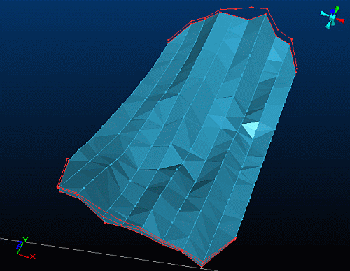**
  13. **Using the Formatribbon selectFilter | Erase All**
  14. Check your 3D window output with that shown below:**  
  
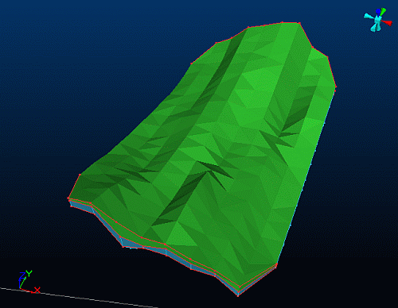**

##  Saving the New Wireframe Object

  1. Select the Sheets control bar.
  2. Right-click on New Wireframe toselectData | Save As.
  3. In the Save New 3D Object dialog, click Extended Precision Datamine (.dm) File.
  4. In the Save New Wireframe dialog, select your project folder, define the File name 'mintr', click Save.  
 | 
     * This dialog is prompting for the name of the wireframe triangle file
     * Use the standard *tr naming convention
     * The process of saving the wireframes will automatically create the wireframe points file with the name 'stopobpt'
     * The "tr" suffix is replaced with "pt" (the standard suffix used to name wireframe points files).  
---|---  
  5. In the Sheets control bar, check that the New Wireframe object has been replaced by the mintr/minpt (wireframe) object.

| Your ore body closed volume wireframe can be checked against the example wireframe _vb_minpt/_vb_mintr (wireframe).  
---|---  
  
****[Next Section](<Verifying_the_Wireframe_Models.md>)