 |  Creating Dynamic Drillholes Creating dynamic drillholes from drillhole tables.  
---|---  
  
# Overview

In this part of the tutorial you will create dynamic drillholes from a set of drillhole data tables.

## Prerequisites

  * Completed the [Creating a New Project](<Creating_a_New_Project.md>) exercise.

  * Read the Principles page: [Working with Drillholes](<Working_with_Drillholes.md>).

  * Completed the [Defining Geological Modeling Settings](<Defining_Geological_Modeling_Settings.md#Exercise1>) exercise.

  * [Files](<Tutorial_Files_List.md>) required for the exercises on this page:

  *     * _vb_assays_comma.txt

    * _vb_collars_space.txt

    * _vb_lithology_comma.txt

    * _vb_surveys_comma.txt

    * _vb_zones_comma.txt

## Exercise: Creating Dynamic Drillholes

In this exercise you will use the Data Load Wizard to load and desurvey a set of drillhole data tables to create the dynamic drillholes object Holes. The drillhole data tables contain the following information:

  * _vb_collars_space \- collar coordinate, coordinate system, coordination and drilled date data
  * _vb_surveys_comma \- survey measurement depth, survey bearing and dip data
  * _vb_assays_comma \- sample interval start and end depth, Au, Cu and Density assay data
  * _vb_lithology_comma \- sample interval start and end depth, lithology data
  * _vb_zones_comma \- sample interval start and end depth, mineralized zones data.

 |  Use Dynamic Drillholes for the following:

  * Advanced visualization in the 3D window
  * Presentation in the Design, Visualizer and VR windows
  * generation of drillhole Logs in the Logs window
  * plotting from the Plots window
  * validation of drillhole data in the Reports sheet
  * dynamic query and validation of drillhole data in Linked Views (Tables, Logs, Plots).
  * string modeling in the Design window using drillhole segment startpoints/endpoints as a reference.

  
---|---  
  
## Creating the Dynamic Drillholes

  1. Unload all data by clicking into the 3D window and typing 'ua', then activate the Data ribbon and select Hole Wizard

  2. If the Data Load Wizard (Welcome...) dialog is displayed, click Next.
  3. In the **Data Load Wizard (Import Data Types)** dialog, select the following data types, and click **Next** :  
  
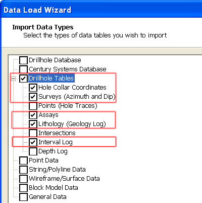
  4. In the **Data Load Wizard (Import Hole Collar Coordinate Tables)** dialog, click **Add...**.
  5. In the Data Import dialog, select the following options, and click OK:  
  
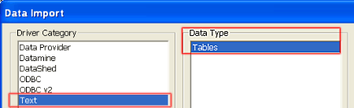
  6. In the Open Source File (Text) dialog, browse to your project folder C:\Database\MyTutorials\GeolMod, select _vb_collars_space.txt , and click Open.

  7. In the Text Wizard (1 of 3) dialog, define the settings shown below, and click Next>.  
  
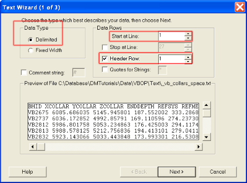  

  8. In the Text Wizard (2 of 3) dialog, define the settings shown below, confirming that the columns of data in the Preview group are separated by vertical lines, and click Next>:  
  
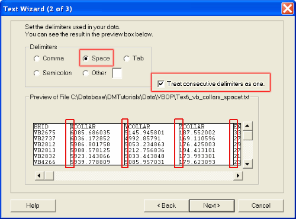

  9. In the Text Wizard (3 of 3) dialog, define the absent data setting as follows:  
  
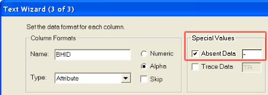  

  10. In the Text Wizard (3 of 3) dialog, select each data column in turn in the Preview group (use the horizontal slider bar to view the fields hidden to the right), define the column format settings shown below, and click Finish.  

Column Formats: |  |   
---|---|---  
Name |  Type |  Property  
BHID |  Attribute |  Alpha  
XCOLLAR |  Attribute |  Numeric  
YCOLLAR |  Attribute |  Numeric  
ZCOLLAR |  Attribute |  Numeric  
ENDDEPTH |  Attribute |  Numeric  
REFSYS |  Attribute |  Alpha  
REFMETH |  Attribute |  Alpha  
HOLETYPE |  Attribute |  Alpha  
ENDDATE |  Attribute |  Alpha  
Special Values: |  |   
Absent Data |  - |  Leave blank  
Trace Data |  - |  Leave blank  
  
  11. In the Define Drillhole Data Table dialog, define all seven of the Field Assignments as shown below, and click OK:  
  
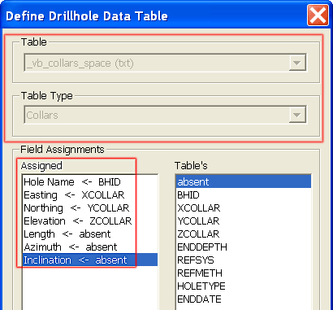  

 |  Define a Field Assignment entry using the following steps:
     1. First select a required field item in the left pane
     2. Then select the corresponding import table field from the pane on the right.  
---|---  
  12. Back in the **Data Load Wizard** dialog, click **Next**.

  13. Repeat steps **5**. to **13**. for the surveys table "_vb_surveys_comma.txt" using the settings shown below:  
  
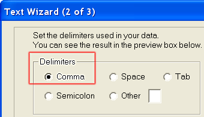  
  
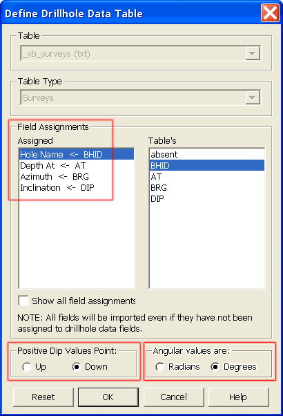  
  
IMPORTANT: Unless you want your holes to be pointing the air (never a good idea), make sure you ensure the Positive Dip Values Point field is set to Down.  

  14. Repeat steps **5**. to **13**. for the assays table "_vb_assays_comma.txt" using the settings shown below:  
  
  
  
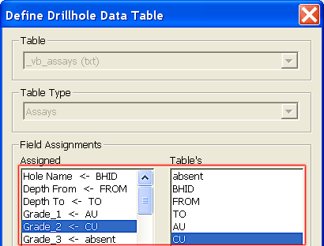  
  
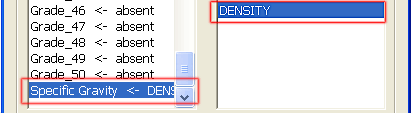  

 |  select the Show all field assignments option so that the Specific Gravity field (DENSITY) can be assigned.  
---|---  
  15. Repeat steps **5**. to **13**. for the lithology table "_vb_lithology_comma.txt" using the settings shown below:  
  
  
  
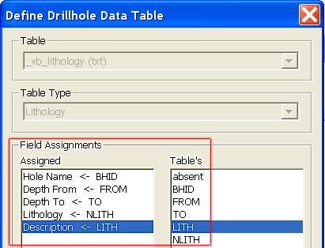  

  16. Repeat steps **5**. to **12**. for the mineralization zones table (interval log) "_vb_zones_comma.txt" using the settings shown below:  
  
  
  
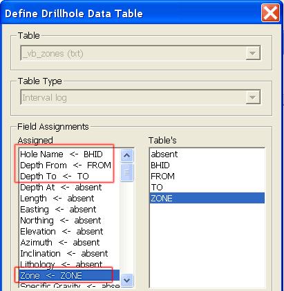  

 |  Select the Show all field assignments option so that the Zone field (ZONE) can be assigned.  
---|---  
  17. In the **Data Load Wizard** dialog, click **Next**.
  18. In the**Data Load Wizard (Load Complete!)** dialog , define the settings shown below, and click**Finish** :  
  
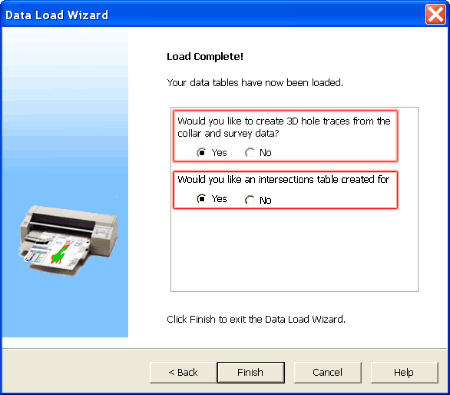
  19. In the **Loaded Data** control bar, check that the five drillhole data tables,IntersectionsandHolesobjects are listed:  
  
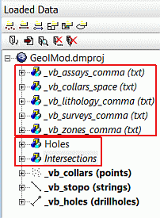
  20. Confirm that the drillhole traces have been loaded into the3Dwindow
  21. In theSheetscontrol bar, confirm that theDynamic DrillholesOverlay has been added to3D and thePlotsfolders, e.g.:   
  
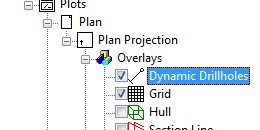

## Saving Dynamic Drillhole Settings

  1. Save the project file using the Project button and Saveusing File | Save.
  2. In the Save Data/Set Auto Reload dialog, clear all the Save check boxes, select all the Auto Reload check boxes, and click OK.

##   [Next Page](<Validating_Dynamic_Drillholes.md>)