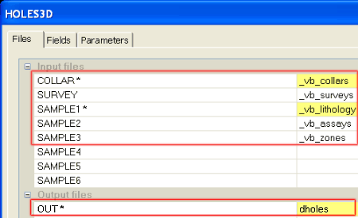
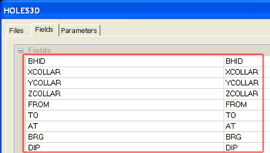
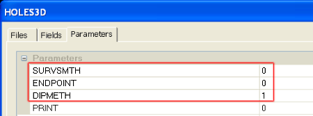
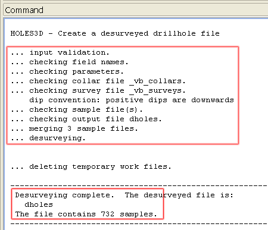

 |  Creating Static Drillholes How to create static drillholes from drillhole data tables.  
---|---  
  
# Overview

In this part of the tutorial you will create static drillholes from a set of drillhole data tables.

## Prerequisites

  * Completed the [Creating a New Project](<Creating_a_New_Project.md>) exercise.

  * Read the Principles page: [Working with Drillholes](<Working_with_Drillholes.md>).

  * Completed the [Defining Geological Modeling Settings](<Defining_Geological_Modeling_Settings.md#Exercise1>) exercise.

  * [Files](<Tutorial_Files_List.md>) required for these exercises:

  *     * _vb_assays.dm

    * _vb_collars.dm

    * _vb_lithology.dm

    * _vb_surveys.dm

    * _vb_zones.dm

## Exercise: Creating Static Drillholes

In this exercise you will use the process HOLES3D to desurvey a set of drillhole data tables to create the static drillholes file dholes.dm. The drillhole data tables contain the following information:

  * _vb_collars \- collar coordinate, coordinate system, coordination and drilled date data
  * _vb_surveys \- survey measurement depth, survey bearing and dip data
  * _vb_assays \- sample interval start and end depth, Au, Cu and Density assay data
  * _vb_lithology \- sample interval start and end depth, lithology data
  * _vb_zones \- sample interval start and end depth, mineralized zones data.

 |  Use Static Drillholes for the following:

  * drillhole compositing using COMPDH , COMPBE or COMPBR
  * string modeling in the Design window using drillhole segment startpoints/midpoints/endpoints as a reference
  * validation and visualization in the 3D window
  * grade estimation using GRADE or ESTIMATE.

  
---|---  
  
## Creating the Static Drillholes

  1. Activate the Sample Analysis ribbon and select the Build Static button

  2. In the HOLES3D dialog, Files tab, define the input and output files shown below:

  3. In the HOLES3D dialog, Fields tab, ensure that the fields are automatically set as shown below:  
  
  

  4. In the HOLES3D dialog, Parameters tab, define the settings shown below, and click OK.

  
  
| Check the description for each of he above parameters in the help pane at the bottom of the dialog.Setting the parameter ENDPOINT to '1' will include coordinates for both the start and end of each sample in the desurveyed output file. These start or end coordinates can be extracted to a points table and used as the basis for generating DTMs.  
---|---  
  5. In the Command control bar, confirm that all checks were successful, and that desurveying has generated the output file dholes which contains 732 records:  
  
  
  

 |  Your static drillholes dholes can be checked against the example file _vb_holes.dm.  
---|---  

##   [Next Page](<Validating_Static_Drillholes.md>)