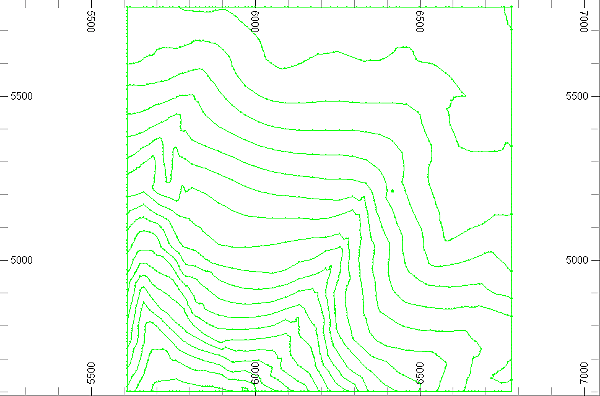
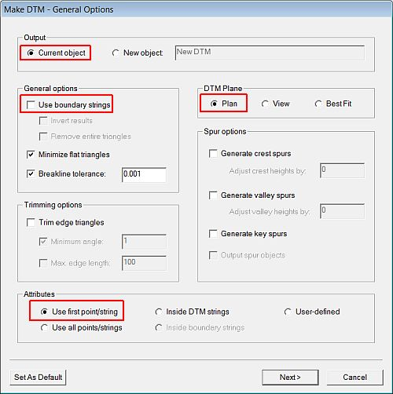
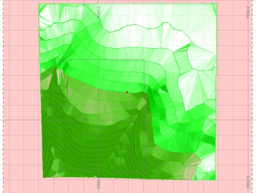
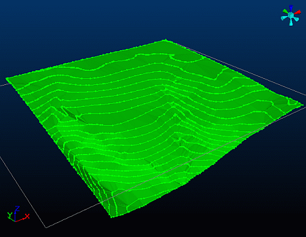
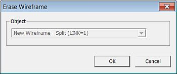
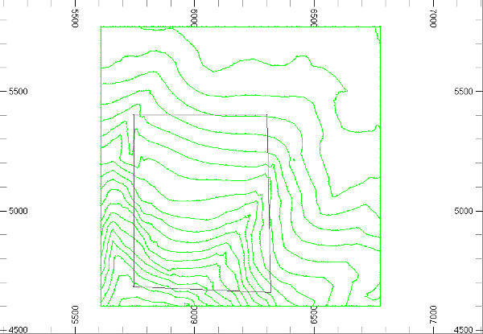
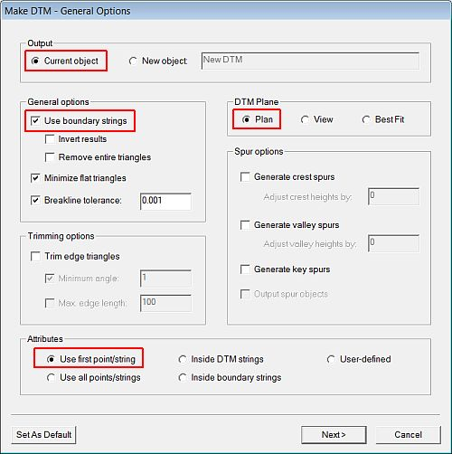
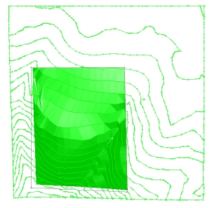

 |  Creating Surfaces Using DTM Techniques Creating wireframe surfaces using Digital Terrain Modeling tools.  
---|---  
  
# Overview

In this part of the tutorial you will use the 3D window's DTM tools to create a surface wireframe model.

## Prerequisites

  * Completed the [Creating a New Project](<Creating_a_New_Project.md>) exercise.

  * Completed the [Defining Geological Modeling Settings](<Defining_Geological_Modeling_Settings.md#Exercise1>) exercise.

  * [Files](<Tutorial_Files_List.md>) required for the exercises on this page:

  *     * _vb_modlim.dm

    * _vb_stopo.dm

    * _vb_viewdefs.dm

## Exercise: Creating the Topography Surface Wireframe Model Using DTM Tools

In this exercise, you will use the 3D window's DTM Creation toolbar functions to create a wireframe model of the topography. This will be done using the topography contour strings vb_stopo (strings) object as a basis for the wireframe.

 |  UseDTM Creationtoolbar functions when creating wireframe models ofopenundulating surfaces such as the following:

  * topography;
  * geological features (fault surfaces, lithology or mineralization contact surfaces);
  * open pit designs;
  * open pit survey measurements.

  
---|---  
| DTM Creation functions should not generally be used to create wireframe models of complex surfaces - for example, recumbent folds or overhanging pit walls. Instead, use the Wireframe Linking tools.   
---|---  
  
## Loading and Formatting the Data

  1. Unload any data you may have already loaded.

  2. In the Project Files control bar, select the All Tables folder.

  3. Set the 3D window background colour to white.

  4. Drag-and-drop the following files (if not already loaded) into the 3D window:

     * _vb_modlim

     * _vb_stopo

     * _vb_viewdefs

  5. Select the Sheets control bar and expand the 3D folder.

  6. Select only the following Overlays:  

     * Default Grid

     * _vb_stopo (strings)

  7. Remove the Default Section from the 3D view if it exists, and open the Section Properties dialog for the _vb_viewdefs overlay.
  8. Disable the Use Dimensions check box and check that you see the 'Plan 195m' description appear in the status bar (use the left and right arrows to set this if not). Click OK and the click Lock on the View ribbon:  
  

## Creating the New Wireframe Object

  1. In theCurrent Objectstoolbar, select theObject Type[Wireframe] and then click Create New Object Applying Default Template, as shown below:  
  

## Creating the DTM without Boundaries

| DTM creation without using boundaries is typically used for contiguous surfaces with rectangular, circular or elliptical shapes, where all the data in the base string and /or points object(s) are used during DTM creation.  
---|---  
  
 | 

  * Ensure thatNew Wireframeis selected as the current object.
  * The settings used to create the DTM in the steps below saves the output to the current wireframe object (the default). Be careful not to add the new DTM to the incorrect wireframe object. 

  
---|---  
  
  1. Activate the Structure ribbon and click the top-level DTMs icon.
  2. In the Make DTM - General Options dialog, define the Output, General Options, DTM Plane and Attributes options as shown below, and click Next:  
  
  
  
|  Here, boundary strings are not being used to confine the limits of the DTM.  
---|---  
  3. In the Make DTM - Select DTM Points and Strings... dialog, select only the _vb_stopo (strings) object, and click Finish.
  4. In the 3D window, confirm that your topography wireframe is displayed as shown below:  
  
  
  

  5. In the 3D window, rotate the view and confirm that the wireframe triangles correctly represent the wireframe as defined by the different segments on the contour strings.  
  
  

 | In the above view, note that the Axis Controller (top right) and Axis Indicator (bottom left) have been turned on.Generally check that:
     * triangle edges lie along string segments;
     * triangle corners correspond to points or string points;
     * triangles cover the total area of the base string and/or points object(s).
Check the wireframe for the following types of problems:
     * gaps,
     * malformed areas i.e. triangles intersecting each other.  
---|---  
  6. Activate the Data ribbon and select Manage Objects

  7. In the Data Object Manager dialog, select the [New Wireframe] item, then the Data Object tab, Statistics pane, confirm that the wireframe contains 1785 points and 3332 faces.
  8. Close the Data Object Manager dialog. 

## Erasing the DTM

  1. Reactivate the Structure ribbon and select DTMs | Undo Last DTM
  2. In the Erase Wireframe dialog, check that the correct object is selected, and click OK.  
  
  
  
| In the Design window, the object is also selected (highlighted yellow).  
---|---  
  3. In the confirmation dialog, click Yes.
  4. In the unloading confirmation dialog, click No.  

## Creating the DTM with Boundaries

 | DTM creation with boundaries is typically used for:

  * surfaces with irregular shapes;
  * surfaces containing holes (inner limits);
  * creating surfaces where only a portion of the data of the base string and /or points object(s) is used to generate the DTM.

  
---|---  
  
  1. In the Sheets control bar, expand the 3D-Overlays folder.

  2. Select only the following Overlays :  

     * Default Grid

     * New Wireframe

     * _vb_modlim (strings)

     * _vb_stopo (strings)

  3. SCheck that both the topography contours (Green 5) and limit string (Grey 1) are displayed, as shown below:  
  

  4. In the Sheets control bar, check that New Wireframe is still the current object.
  5. Activate the Structure ribbon and click the top-level DTMs icon.
  6. In the Make DTM - General Options dialog, define the Output, General Options, DTM Plane and Attributes options as shown below, and click Next:  
  
  
  
| Here, boundary strings are being used to confine the limits of the DTM.  
---|---  
  7. In the Make DTM - Select DTM Points and Strings... dialog, select only _vb_stopo (strings) and click Next>.
  8. In the Make DTM - Select Boundary Strings... dialog, select only the _vb_modlim (strings) object and click Finish.
  9. CIn the 3D window, confirm that your boundary limited topography surface wireframe is displayed as shown below:  
  
  

## Saving the New Wireframe Object

  1. In the Sheets control bar, right-click New Wireframe, and selectData | Save As.
  2. In the Save New 3D Object dialog, click Extended Precision Datamine (.dm) File.
  3. In the Save New Wireframe dialog, select your tutorial folder, define the File name: as 'stopobtr.dm', click Save.  
 | This dialog is prompting for the name of the wireframe triangle file
     * Use the standard *tr naming convention
     * The process of saving the wireframes will automatically create the wireframe points file with the name 'stopobpt'
     * The "tr" suffix is replaced with "pt" (the standard suffix used to name wireframe points files).  
---|---  
  4. In the Loaded Data control bar, confirm that New Wireframe has been replaced by the stopobtr/stopobpt (wireframe) object.

****[Next Page](<creating_surfaces_from_grids.md>)