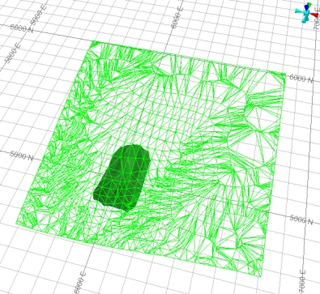
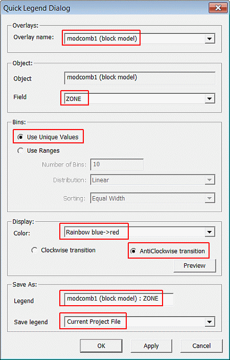
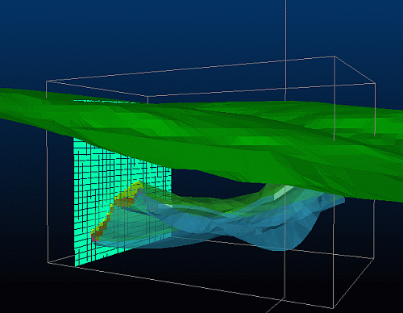

# Creating a Combined Ore Body and Waste Block Model

 |  Creating a Combined Ore Body and Waste Block Model Creating a combined ore body and waste block model using a DTM and a closed volume wireframe.  
---|---  
  
# Overview

In this portion of the tutorial you are going to create a combined ore body and waste block model using a surface DTM and closed ore body wireframe.

## Prerequisites

  * Created a new project and added all the required tutorial files i.e. the exercise on the [Creating a New Project page](<Creating_a_New_Project.md>).

  * Defined project settings i.e. completed the [Defining Geological Modeling Settings](<Defining_Geological_Modeling_Settings.md#Exercise1>) exercise.

  * [Files](<Tutorial_Files_List.md>) required for the exercises on this page:

  *     * _vb_modprot.dm

    * _vb_minpt.dm

    * _vb_mintr.dm

    * _vb_stopopt.dm

    * _vb_stopotr.dm

    * _vb_viewdefs.dm

## Exercise: Creating a Combined Ore Body and Waste Block Model from Multiple Wireframes

In this exercise, you are going to use the Volumetric Block Modeling function to create a combined ore and waste block model. This will be done using the prototype block model **_vb_modprot** , the topography surface wireframe _vb_stopotr/_vb_stopopt (wireframes) and the ore body closed volume wireframe object **_vb_mintr/_vb_minpt (wireframe)** . A zone field ZONE will be added to the block model and these attribute values will be both set and also transferred from the wireframe to the model cells, where the upper mineralization zone is set to ZONE =1 and the lower mineralization zone is set to ZONE =2.

 | 

  * Create a field ZONE and set a values for each mineralization zone, including the surrounding waste material.
  * Before using a closed volume wireframe for block model creation:
  *     * validate the wireframe
    * calculate the volume of the wireframe.
  * Use the same block model prototype when creating the waste and ore block models.

  
---|---  
| The field ZONE is a default name for the zonal control field used to control grade estimation.  
---|---  
  
| Incomplete or damaged wireframes can potentially cause errors during the creation of a block model.  
---|---  
  
## Loading and Formatting the Data

  1. Unload any previously-loaded data.

  2. Select the Project Files control bar, All Tables folder.

  3. Drag-and-drop the following files (if not already loaded) into the 3D window:  

     * _vb_mintr

     * _vb_stopotr

     * _vb_viewdefs

  4. Select the Sheets control bar and expand the Design-Overlays tree.

  5. Select only the following check boxes (i.e. display these objects):  

     * Default Grid

     * _vb_mintr/_vb_minpt (wireframes)

     * _vb_stopotr/_vb_stopopt (wireframes)

  6. In the View Control toolbar, click Get View 'gvi'.
  7. In the Command control bar, note the list of available sections.
  8. In the Command toolbar, Run Command field, type in '2', press <Enter>.
  9. In the View Control toolbar, click Zoom All Data.
  10. Set the view of the topography wireframe to be Wireframe.
  11. Rotate the view so it is roughly positioned as shown belowIn the Design window check that you have the 'Inclined View' showing both the topography surface and the ore body wireframe model (upper and lower mineralization zones), as shown below:**  
  
**

## **Creating the Combined Block Model using Volumetric Block Modeling**

  1. Select the 3D window.
  2. Activate the Model ribbon and select Fill Wireframes.
  3. In the Volumetric Block Modelling dialog, Prototype Block Model group, browse your project folder and select the file _vb_modprot.
  4. In the Boundary Wireframes group, first row:  
  

     * Select Run and Topo
     * In Wireframe, browse your project folder, select _vb_stopotr
     * Select the Zone Field [ZONE] and Zone Code [0]
     * Select the Plane [XY] and Boundary Type [Single Surface - Fill Below]
  5. Click Add Row (+).
  6. In the second row:

  1.      * Select Run
     * Clear the Topo check box
     * In Wireframe, browse your project folder, select _vb_mintr
     * Select the Zone Field [ZONE] and Zone Code option [(From Field)]
     * Select the Plane [XY] and Boundary Type [Solid - Fill Inside]

  7. In the General Options group, clear the Validate Input option.
  8. In the Output group, define the Block Model name as 'modcomb1'.
  9. In the Modelling Settings Control File group, define a new file name 'vbmpar1', click Save.
  10. In the 'File saved successfully' message dialog, click OK.
  11. Click Apply.
  12. Follow the messages displayed in the progress bar and the Command control bar.
  13. When finished, close the Volumetric Block Modelling dialog (Cancel).
  14. Check that modcomb1 is listed in the Project Files control bar.

| Block Model Combination Order  
The order in which the individual block models are created and combined is important. For further details please click [here](<Working_with_Block_Models.md#WorkingBlockModel3>).Zone Fields

  * The field ZONE exists in the wireframe triangle file and is transferred to the block model when theZONEfield ZONE is defined.
  * As a result, the block model will contain a field ZONE, with values set as follows: upper mineralization zone (ZONE=1) and lower mineralization zone (ZONE=2).
  * These ZONE values are used as input into the zonal control option for grade estimation purposes.

  
---|---  
  
## Checking the Combined Ore Waste Model

  1. Select theProject Filescontrol bar,Block Modelsfolder.

  2. Drag-and-drop the modcomb1 file into the 3D window.

  3. Select the Sheets control bar and expand the 3D-Overlays folder.

  4. Select only the following check boxes (i.e. display these objects):  

     * Default Grid

     * _vb_mintr/_vb_minpt (wireframes)

     * _vb_stopotr/_vb_stopopt (wireframes)

     * modcomb1 (block model)

  5. In the View Control toolbar, click Get View.
  6. In the Command toolbar, Run Command field, type in '1', press <Enter>.
  7. With theDesignwindow in view, selectFormat | VR View | Update VR Objects'vro'.
  8. In the Sheets control bar, 3D-Wireframes folder, double-click _vb_mintr/_vb_minpt (wireframes).
  9. In the Wireframe Properties dialog, Opacity group, click-and-drag the slider bar to approximately 50%, click OK.
  10. In the Sheets control bar, 3D-Block Models folder, double-click modcomb1 (block model).
  11. In the Block Model Properties dialog, Display Type group, select Intersection, click OK.  
  
| The Blocks option can also be used, primarily to view the extents of the complete model.  
---|---  
  12. In the Sheets control bar, 3D-Block Models folder, right-click modcomb1 (block model)., select Quick Legend.
  13. In the Quick Legend dialog, define the settings shown below, click OK:**  
  
**
  14. Double-click the Default Section item in the 3D window and click the East-West button.
  15. In the 3D window, rotate and zoom the view.
  16. Using the View ribbon select the Edit Interactively button and move the green widgets to the left to move the section towards the eastern end of the orebody.
  17. check the extents of the ore and waste block model against the surface DTM and the ore body wireframe:**  
  
**
  18. In the Sheets control bar, 3D-Wireframes folder, hide:  

     * _vb_mintr/_vb_minpt (wireframes)
     * _vb_stopotr/_vb_stopopt (wireframes)
  19. In the 3D window, select (left-click) a block model cell in the lower (red) zone (zoom in if you need to)
  20. In the Data Properties control bar, check that the ZONE value is set to '2'.
  21. In the 3D window, select (left-click) a block model cell in the upper (green) zone.
  22. In the Data Properties control bar, check that the ZONE value is set to '1'
  23. In the 3D window, select (left-click) a block model cell in the surrounding waste zone.
  24. In the Data Properties control bar, check that the ZONE value is set to '0'.
  25. In the Loaded Data control bar, right-click on modcomb1 (block model) , select _D_ ata Object Manager....
  26. In theData Object Managerdialog,Data Objecttab,Statisticspane, check that there are 31703 full cells and 55225 subcells i.e. a total number of 36928 records, then close the dialog.

****[Next Section](<Visually_Checking_the_Ore_Body_Block_Model.md>)