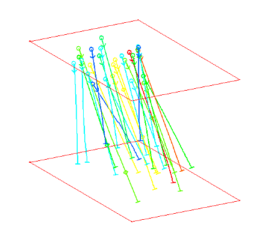
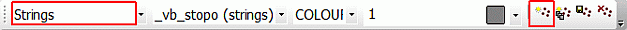
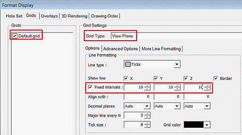
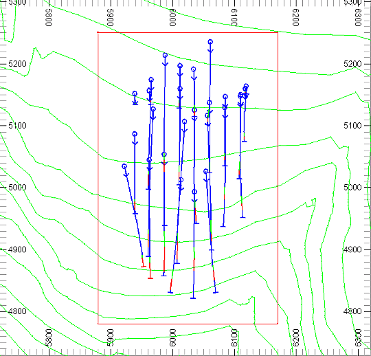
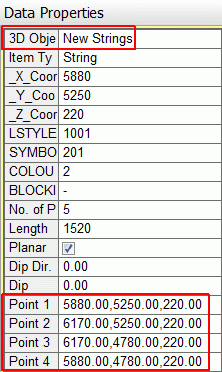
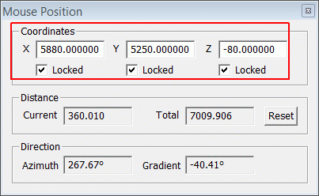
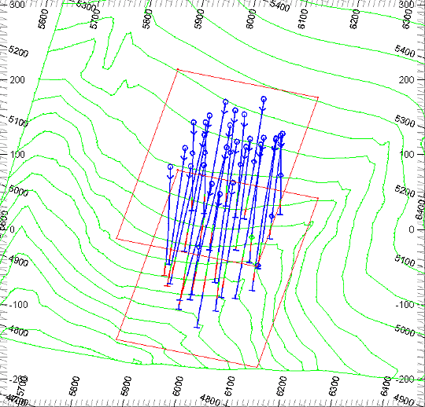
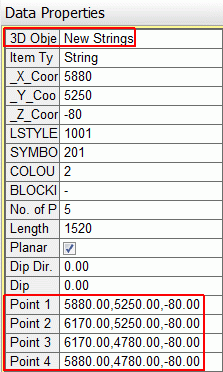
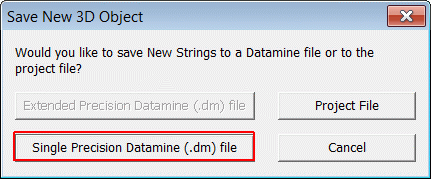
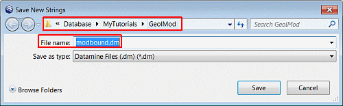

# Creating a Modeling Boundary

 |  Creating a Rectangular Modeling Boundary Drawing a pair of rectangular modeling boundary strings in the Design window using fixed coordinates.  
---|---  
  
# Overview

In this part of the tutorial you will create a pair of modeling boundary strings with fixed coordinates.

## Prerequisites

  * Completed the [Creating a New Project](<Creating_a_New_Project.md>) exercise.

  * Completed the [Defining Geological Modeling Settings](<Defining_Geological_Modeling_Settings.md#Exercise1>) exercise.

  * [Files](<Tutorial_Files_List.md>) required for the exercises on this page:

  *     * _vb_holes.dm

    * _vb_stopo.dm

## Links to exercises

The following exercise is available on this page:

  * Creating Modeling Boundary Strings in the Design Window

## Exercise: Creating Modeling Boundary Strings in the 3D Window

In this exercise you will use grid snapping and locked coordinates to digitize a pair of horizontal, rectangular perimeters (closed strings), one at 220m elevation and the other at -80m elevation. These perimeters define the extents of a block model prototype used in later block modeling exercises. These rectangular boundary strings, relative to the drillhole positions, are shown below:

 |  Use modeling boundary strings:

  * as input perimeters when selecting (and additionally flagging) data usingSELPER
  * to visualize block model prototype extents before defining a prototype block model.

  
---|---  
 | 

  * perimeters used as input into SELPER are typically single perimeters and not pairs of perimeters as created in this exercise. In this case one would use only the upper or lower perimeter for data selection or flagging; using Retrieval Criteria and the PVALUE attribute to use only the required string when running the process.

  
---|---  
  
## Loading the Data

  1. In the Project Files control bar, select the All Tables folder.

  2. Drag-and-drop the following strings and drillholes files (if not already loaded) into the Design window:

     * _vb_holes

     * _vb_stopo

  3. In the Sheets control bar, expand the Design-Overlays folder.

  4. Select only the following objects:

     * Default Grid

     * _vb_stopo.dm (strings)

     * _vb_holes (drillholes)

  5. Using the View ribbon, select Zoom Fit

  6. Using the Sheets control bar, double-click the Sections | Default Section item and, in the properties dialog, set the Azimuth to 0 and the Dip to -0.

  7. Apply these settings also:  
  
Mid-point x = 6195, y = 5185, z = 220.  
Section width = 20  
Clipping is set to [None]

  8. Using the View ribbon, select Align then Zoom Fit.

## Creating a New Strings Object

  1. Select the3Dwindow.
  2. In theCurrent Objectstoolbar, select theObject Type [Strings] and then click Create New Object Applying Default Template, as shown below:  
  

  3. In theLoaded Datacontrol bar, confirm that theNew Stringsobject has been added to the list.

## Digitizing the Upper Perimeter by Snapping to Grids

  1. Using the Sheets control bar, right click the Default Grid item and select Properties.

  2. In the dialog, Grids tab, define the grid settings as shown below, click Apply and OK:  
  
  

  3. In the Home ribbon, select [Snap: Grid]

  4. Using the View ribbon click Zoom Area and drag a zoom rectangle around the drillholes.

  5. Using the Edit ribbon, click New String

  6. Using the Current Objects toolbar, and the Colordrop down list, select the color Red (2).

  7. In the 3D window, move the cursor and right-click close to the XY-coordinate '5880, 5250'.

  8. Right-click close to the XY-coordinate '6170, 5250'.

  9. Right-click close to the XY-coordinate '6170, 4780'.

  10. Right-click close to the XY-coordinate '5880, 4780'.

  11. In the 3D window, click Cancel.

  12. Using the Edit ribbon, click Close String.

  13. Using the Home ribbon, select Snap: Points

| It is good practice to always set the snap mode back to the default setting.  
---|---  
  14. In the 3D window, right-click and select Deselect All Strings.

  15. In the 3D window, check that your new upper perimeter (closed string) is as shown below:  
  
  

| Depending on what exercises you have already completed, your drillholes may be formatted differently.  
---|---  
  16. In the 3D window, select the string.

  17. In the Data Properties control bar, check that the four corner points have coordinates values as shown below (expand the right side of the properties table to view all coordinate data):  
  
  

| Incorrectly placed string points can be moved by using Move Points , Delete Points and Insert Points in the Point and String Editing: Standard toolbar.  
---|---  
  
## Digitizing the Lower Perimeter using the Mouse Position dialog

  1. In the Loaded Data control bar, confirm that the New Strings object is the current strings object (it should be bold).

  2. In the 3D window, right-click and select Deselect All Strings.

  3. In the View Control toolbar, click View Settings.

  4. Using the Sheets control bar, double-click the Sections | Default Section item and, in the properties dialog, set the Azimuth to 345 and the Dip to -42.

  5. Apply these settings also:  
  
Mid-point x = 6195, y = 5185, z = 220.  
Section width = 20  
Clipping is set to [None]

  6. Using the View ribbon, select Align and then Zoom Fit.

  7. Click Zoom Area and drag a zoom rectangle around the drillholes and new string.

  8. Type 'ns' to digitize a new string

  9. Using the Color drop-down list in the Current Objects toolbar, select the color Red (2).

  10. Double click the coordinate position area on the bottom frame of the application.

  11. In the Mouse Position dialog, define the coordinate settings as shown below:  
  
  

  12. In the 3D window, click anywhere within the display limits.

  13. Repeat steps 9 and 10 using the XYZ coordinate '6170, 5250, -80'.

  14. Repeat steps 9 and 10 using the XYZ coordinate '6170, 4780, -80'.

  15. Repeat steps 9 and 10 using the XYZ coordinate '5880, 4780, -80'.

  16. In the Mouse Position dialog, clear the three coordinate Locked check boxes, and close the dialog.

  17. In the 3D window, click Cancel.

  18. In the Point and String Editing: Standard toolbar, click Close String.

  19. In the 3D window, right-click and select Deselect All Strings.

  20. In the 3D window, check that your new lower perimeter has been added below the upper perimeter as shown below:  
  
  

  21. In the 3D window, select the lower string.

  22. In the Data Properties control bar, check that the four coordinates are as shown below (expand the right side of the properties table to view all coordinate data):  
  

  23. In the 3D window, right-click and select Deselect All Strings.  

## Saving the New Strings to a Datamine File

  1. In the Loaded Data control bar, right-click on the New Strings object, select Data | Save As.

  2. In the Save New 3D Object dialog, click Single Precision Datamine (.dm) File.  
  

  3. In the Save New Strings dialog, select your project folder, define the File name 'modbound.dm', click Save:  
  

  4. In the Loaded Data control bar, check that the New Strings object has been replaced by the strings object modbound (strings).

| Your pair of modeling boundary strings (perimeters) modbound.dm can be checked against the example file _vb_modbound.dm  
---|---  
  
****[Next Section](<../Studio_RM_Only/Geological_Interpretation_Using_a_Background_Image.md>)