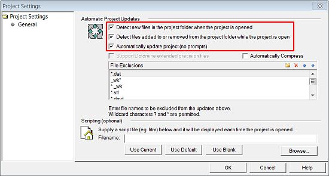

# Creating a New Project

 |  Creating a new Geological Modeling Project Creating a new project file for the geological modeling tutorial.  
---|---  
  
# Overview

The sections below introduce you to the creation of a new project.

## Prerequisites

  * Check that you have access to the tutorial data folders. These are located (with a standard installation) under C:\Database\DMTutorials. This path should exist and contain two sub-folders; Data and Projects. These contain data and project files that will be used in the various exercises.

  * If you cannot locate these folders, please reinstall Studio RM. If this does not resolve the issue, please contact your local Datamine Support Consultant.

  * Read through the pages under the tutorial heading "Principles"

## Links to exercises

The following exercises are available on this page:

  * Creating and Saving a New Project

## Exercise: Creating and Saving a New Project

In this lesson, you will create a new project "GeolMod", in a new folder C:\Database\MyTutorials\GeolMod, add the relevant data files and then save the project. This includes the following tasks:

  * Creating a tutorial folder and copying in files

  * Creating a new project

  * Checking and saving the project

## Creating a Tutorial Folder and Copying In Files

  1. In Windows Explorer create the folder C:\Database\MyTutorials\GeolMod.

  2. Browse to and open the folder C:\Database\DMTutorials\Data\VBOP\CAD.

  3. Copy the following files:

     * _vb_stopo.dwg

     * _vb_ltopo.dgn

     * vb_toecons.dxf

  4. Paste the files into your new tutorial folder C:\Database\MyTutorials\GeolMod.

  5. Open the folder C:\Database\DMTutorials\Data\VBOP\Datamine.

  6. Copy the following files:

     * _ostopoi.dm

     * _ostopo.dm

     * _vb_assays.dm

     * _vb_blastmarks

     * _vb_itpitstrings

     * _vb_collars.dm

     * _vb_faultpt.dm

     * _vb_faults.dm

     * _vb_faulttr.dm

     * _vb_holes.dm

     * _vb_holesc.dm

     * _vb_lithology.dm

     * _vb_min1st.dm

     * _vb_min2st.dm

     * _vb_min3st.dm

     * _vb_minpt.dm

     * _vb_minst.dm

     * _vb_mintr.dm

     * _vb_modbound.dm

     * _vb_modlim.dm

     * _vb_modopt.dm

     * _vb_modore.dm

     * _vb_modprot.dm

     * _vb_modwo.dm

     * _vb_modwst.dm

     * _vb_seisinterp_ns5985.dm

     * _vb_stopo.dm

     * _vb_stopopt.dm

     * _vb_stopotr.dm

     * _vb_itsurfacetr/_vb_itsurfacept

     * _vb_surveys.dm

     * _vb_viewdefs.dm

     * _vb_zones.dm

     * COMPS5.dm

     * Start_End_Samples.mac

  7. Paste the files into your new tutorial folder C:\Database\MyTutorials\GeolMod.

  8. Open the folder C:\Database\DMTutorials\Projects\S3GeoModTut\ProjFiles\Standard.

  9. Copy the following files:

     * _vb_holes_NLITH1.elg

     * _vb_holes_NLITH2.elg

  10. Paste the files into the tutorial folder C:\Database\MyTutorials\GeolMod.

  11. Browse to the folder C:\Database\DMTutorials\Data\VBOP\ODBC.

  12. Copy the file _vb_drillhole_data.xls, and paste it into your new tutorial folder C:\Database\MyTutorials\GeolMod.

  13. Open the folder C:\Database\DMTutorials\Data\VBOP\Pics.

  14. Copy the file _vb_Seismic_Section_NS_5985.bmp, and paste it into your new tutorial folder C:\Database\MyTutorials\GeolMod.

  15. Browse to and open the folder C:\Database\DMTutorials\Data\VBOP\Text.

  16. Copy the following files:

     * _vb_assays_comma.txt

     * _vb_collars_space.txt

     * _vb_lithology_comma.txt

     * _vb_surveys_comma.txt

     * _vb_zones_comma.txt

  17. Paste the files into your new tutorial folder C:\Database\MyTutorials\GeolMod, and close Windows Explorer.

## Creating a new Project

  1. Start Studio RM as follows: Start | All Programs | Datamine |Studio RM

  2. In the Studio RM window, click the Project button (top left corner) and select New Project

  3. If the Studio Project Wizard (Welcome ...) dialog is displayed, click Next>.

 |  The welcome screen is not displayed if the Skip this page in future option was selected the last time a new project was created.  
---|---  
  4. In the Studio Project Wizard (Project Properties) dialog:

     * Define the project Name as "GeolMod".

     * In the Location box, browse to C:\Database\MyTutorials\GeolMod.

     * Select Create Extended precision project.

     * Ensure the Automatically add files... option is selected, and click Project Settings...:  

  5. In the Project Settings dialog, Automatic Project Updates group, enable the following options and click OK(leave all other options as they are):  
  
\- Detect new files in the project folder....  
\- Detect files added to or removed from the project folder...  
\- Automatically update project (no prompts)  
  
  
  

  6. In the Studio Project Wizard (Project Properties) dialog, click Next.

  7. In the Studio Project Wizard (Project Files) dialog, check that 41 files have been automatically added, and click Next.

  8. In the Studio Project Wizard (Your project is ready to create) dialog, click Finish. This project will be used for the remaining exercises in this tutorial