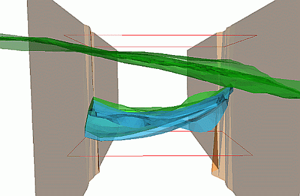
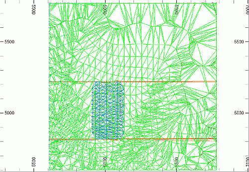
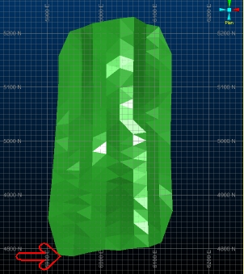
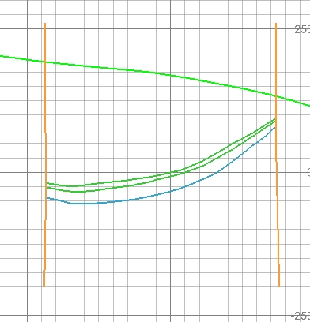
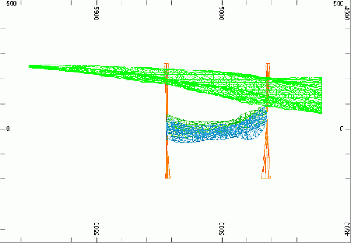
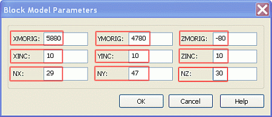
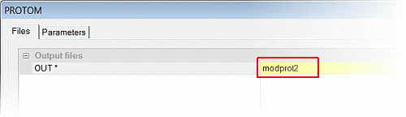
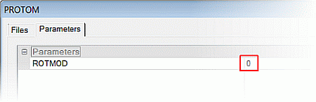
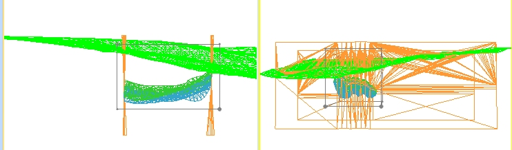
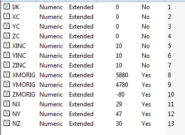

 |  Creating a Block Model Prototype How to create a block model prototype  
---|---  
  
# Overview

In this part of the tutorial you will determine block model prototype parameters, and create a block model prototype using various methods.

## Prerequisites

  * Completed the [Creating a New Project](<Creating_a_New_Project.md>) exercise.

  * Completed the [Defining Geological Modeling Settings](<Defining_Geological_Modeling_Settings.md#Exercise1>) exercise.

  * [Files](<Tutorial_Files_List.md>) required for the exercises on this page:

  *     * _vb_faultpt.dm

    * _vb_faulttr.dm

    * _vb_holes.dm

    * _vb_minpt.dm

    * _vb_mintr.dm

    * _vb_stopopt.dm

    * _vb_stopotr.dm

    * _vb_viewdefs.dm

## Links to exercises

The following exercises are available on this page:

  * Determining Block Model Prototype Parameters

  * Defining a Block Model Prototype using the Datamine Table Editor

  * Defining a Block Model Prototype using PROTOM

  * Creating a Block Model Prototype using Create Model Prototype

## Exercise: Determining Block Model Prototype Parameters

In this exercise, you will use 3D window tools to determine suitable parameters for a new block model prototype for the volume that contains both the ore body and the surrounding waste material. The topography, faults and ore body wireframe models, together with a set of strings defining the limits for the block model prototype, are shown below:

 | Block model extents can be determined as follows:

  * Interactively, using Design window tools - described in this exercise.
  * Using the process STATS to determine maxima and minima for the X, Y and Z coordinates.

  
---|---  
  
## Loading and Formatting the Data

  1. Unload any data that may already be loaded.

  2. In the Project Files control bar, select the All Tables folder.

  3. If not already loaded, drag-and-drop the following files into the 3D window:  

     * _vb_mintr

     * _vb_faulttr

     * _vb_stopotr

     * _vb_viewdefs

  4. Select the Sheets control bar, expand the 3D folder and select only the following objects:

  1.      * Default Grid

     * _vb_faulttr/_vb_faultpt (wireframes)

     * _vb_stopotr/_vb_stopopt (wireframes)

     * _vb_mintr/_vb_mintr (wireframes).

  4. Activate the View ribbon and select Zoom Fit | Zoom Plan.
  5. In the Command toolbar, Run Command field, type in '1' .
  6. In the3Dwindow confirm that the 'Plan 195m' view of the topography (Green 5), faults (Orange 3) and ore body wireframe models is displayed, as shown below:  
  

##  Determining the Model Prototype Extents

  1. Disable the view of the fault and topography wireframes using the 3D | Sheets folder.
  2. Activate the Edit ribbon and select Query | Points
  3. In the 3D window, select (left-click) a point to the southwest of the ore body wireframe model limits:  
  
  
  
| 
     * This point gives an indication of the prototype model **minimum****X** and **Y** coordinate.
     * The queried coordinates are written to the Output control bar.  
---|---  
  4. Select a point (left-click) to the northeast of the ore body wireframe limits, click Cancel.  
| This point gives an indication of the prototype model maximum X and Y coordinate.  
---|---  
  5. In the View Control toolbar, click Get View.
  6. In theCommandtoolbar,Run Command field, type in '3', press <Enter>.
  7. Activate the View ribbon and select Zoom Fit | Zoom East.
  8. Double-click the Default Section item in the Sheets | 3D | Sections folder and click the North-South button.
  9. Enter a Section Ref. Point for X of "5935" and clickOK.
  10. Set the display type for all loaded wireframes to anIntersectionwith the [Default Section].
  11. Set the background color to white, and you should see something similar to the followingIn the Design window, confirm that the N-S SECN 5935 view of the topography (Green 5), faults (Orange 3) and ore body wireframe models are displayed, as shown below:  
  

  12. Set the display type for all 3 wireframe objects to Wireframe and activate the View ribbon to disable the Perspective toggle
  13. Select Zoom Fit | Zoom East
  14. In the 3D window, confirm that the following section view is displayed:  
  

  15. Activate the Edit ribbon and select Query | Point
  16. LIn the 3D window, left-click a point below the ore body wireframe limits.  
  
| This point gives an indication of the prototype model minimum Z coordinate.  
---|---  
  17. Left-click a point above the surface topography wireframe limits, and click Cancel.  
  
| This point gives an indication of the prototype model maximum Z coordinate.  
---|---  
  18. Select the Output control bar, tabulate and check the values of these queried points, and then compare them to those summarized in the table below - your values will vary slightly (unless you're extremely lucky!):  
**Coordinate:**| **X**| **Y**| **Z**  
---|---|---|---  
**Maximum**|  6167.64| 5245.07| 214.50  
**Minimum**|  5881.68| 4786.45| -77.50  
  
| The selection of the position of these points will depend on the purpose of the block model - for example, if the model is used as input for an Open Pit Optimization exercise, these points should be selected so that sufficient "waste" material surrounds the ore body, to accommodate the required overall slope angles of the pit.  
---|---  
  
  19. Using a parent block (parent cell) size of 10m, round down the Minimum X, Y and Z values to the nearest 10m; and round up the Maximum X, Y and Z values to the nearest 10m:  
**Coordinate:**| **X**| **Y**| **Z**  
---|---|---|---  
**Maximum**|  6170| 5250| 220  
**Minimum**|  5880| 4780| -80  
  
  20. Calculate the X, Y and Z Distance by subtracting the Minimum from the Maximum:  
**Coordinate:**| **X**| **Y**| **Z**  
---|---|---|---  
**Maximum**|  6170| 5250| 220  
**Minimum**|  5880| 4780| -80  
**Distance**|  290| 470| 300  
  
  21. Using a parent block (parent cell) size of 10m, calculate the number of cells required to cover the Distance by dividing the Distance by the Cell Size:  
**Coordinate:**| **X**| **Y**| **Z**  
---|---|---|---  
**Maximum**|  6170| 5250| 220  
**Minimum**|  5880| 4780| -80  
**Distance**|  290| 470| 300  
**Cell Size**|  10| 10| 10  
**Number of Cells**|  29| 47| 30  

## Exercise: Defining a Block Model Prototype using the Table Editor

In this exercise, you will use the Table Editor to define a new block model prototype for the volume that contains both the ore body, and the surrounding waste material. These parameters will be saved to a new block model prototype file mprot1.dm. The extents of the block model prototype were determined in the exercise Determining Block Model Prototype Parameters, and are listed in the table below, and shown in the following image:

**Coordinate:**| **X**| **Y**| **Z**  
---|---|---|---  
**Maximum**|  6170| 5250| 220  
**Minimum**|  5880| 4780| -80  
**Distance**|  290| 470| 300  
**Cell Size**|  10| 10| 10  
**Number of Cells**|  29| 47| 30  
  

 | 

  * Use theDatamine Table Editorto create a block model prototype when a non-recordable method is required.
  * Make the block model prototype extents slightly larger (say 10-20%) than the extents of the base model data - that is, the drillholes, strings, wireframes.
  * Use a model cell size (parent and sub-cell) that suits the particular requirements of the task.

  
---|---  
 | 

  * Define block model prototype parameters with reference to the world coordinate system (Studio's standard), where:
  *     * X-axis coordinates increase towards the east
    * Y-axis coordinates increase towards the north
    * Z-axis coordinates increase upwards.
  * Block model prototype files contain only a data definition and no records.

  
---|---  
  
 | Block mode files can become very large - choose block model prototype parameters as follows:

  1.      * The extents of the volume to be modeled must be adequately covered.
     * Model cell sizes should be appropriate - very small blocks can produce very large file sizes!

  
---|---  
  
##  Defining a Block Model Prototype using the Datamine Table Editor

  1. Activate the Home ribbon and select Products | Table Editor
  2. In the Datamine Table Editor dialog, select _F_ ile | New Table | _B_ lock Model.
  3. In the Block Model Parameters dialog, referring to the table listed above, type in the parameters shown below and click OK:  
  
  
  
  
(What do these numbers mean? The "...ORIG" fields determine the origin of the model. This is important as block models work on a local coordinate system, with all points referenced to the origin. The "...INC" fields represent the size in XYZ for each model cuboid and the NX/Y/Z fields represent the total number of cells in each direction - with all that information, a compound cuboid-of-cuboids can be constructed in the 3D world space)  

  4. In the Datamine Table Editor dialog, select _F_ ile | Save As.

  5. In the Save As dialog, select your project folder, define the File name as 'modprot1' and click Save.

  6. In Table Editor dialog, select _F_ ile | Exit.

| Your block model prototype can be checked against the example file _vb_modprot.dm.  
---|---  
  
## Exercise: Defining a Block Model Prototype using PROTOM

In this exercise you will use the Studio process PROTOM to define a new block model prototype for the volume that contains both the ore body and the surrounding waste material. These parameters will be saved to a new block model prototype file mprot2.dm. The extents of the block model prototype were determined in the exercise Determining Block Model Prototype Parameters . These are listed in the table and shown in the image below:

**Coordinate:**| **X**| **Y**| **Z**  
---|---|---|---  
**Maximum**|  6170| 5250| 220  
**Minimum**|  5880| 4780| -80  
**Distance**|  290| 470| 300  
**Cell Size**|  10| 10| 10  
**Number of Cells**|  29| 47| 30  
  

  
 | 

  * Use thePROTOMprocessto create a block model prototype when a recordable method is required (using a macro or script).
  * Make the block model prototype extents slightly larger (say 10-20%) than the extents of the base model data - that is, drillholes, strings, wireframes.
  * Use a model cell size (parent and sub-cell) that suits the requirements of the task.

  
---|---  
 | 

  * Define block model prototype parameters with reference to the world coordinate system (Studio's standard), where:
  *     * X-axis coordinates increase towards the east
    * Y-axis coordinates increase towards the north
    * Z-axis coordinates increase upwards
  * Block model prototype files contain only a data definition and no records.

  
---|---  
  
 | Block mode files can become very large - choose block model prototype parameters as follows:

  1.      * The extents of the volume to be modeled must be adequately covered.
     * Model cell sizes should be appropriate - very small blocks can produce very large file sizes!

  
---|---  
  
##  Defining a Block Model Prototype using PROTOM

  1. Select the 3D window.
  2. In the command bar, type "PROTOM" and press <ENTER>Select Applications | Model Creation Processes | Define Prototype.
  3. In the PROTOM dialog, define the Files and Parameter settings as shown below and click OK:  
  
  
  
  

  4. View the sequence of prompts in the Command control bar.
  5. In the Run Command line, in the Command toolbar, respond to each prompt by typing in the following parameters, following each with <Enter>:  
  
**Command line parameters**|   
---|---  
**Is a Mined out field required?**|  N  
**Are Subcells to be used?**|  Y  
**X (Model Origin)**|  5880  
**Y (Model Origin)**|  4780  
**Z (Model Origin)**|  -80  
**X (Cell Dimension)**|  10  
**Y (Cell Dimension)**|  10  
**Z (Cell Dimension)**|  10  
**X (No of Cells)**|  29  
**Y (No of Cells)**|  47  
**Z (No of Cells)**|  30  
  
| The command is complete when the message >>> PROTOM Complete <<< is displayed in the Command control bar.  
---|---  

## Using the PROTOM Wizard to Construct a Prototype

## Saving the best until last - the PROTOM wizard was introduced to make the process of prototype modelling more interactive and ultimately more rapid. Using the same process as outlined above (PROTOM), the wizard option allows you to assess the influence of your prototype parameters in 3D.

  1. Activate theModelribbon and selectAuto Prototype
  2. Use theSheetscontrol bar to disable the view of the grid.
  3. Select theViewribbon and thenSplit Horizontally.
  4. Select the left-hand window and selectZoom Fit | Zoom East.
  5. Select the right-hand window and selectZoom Fit | Zoom North.
  6. In the Create Model Prototype dialog, define the following settings:  

     * Cell size: X, Y and Z to be "10"
     * X Origin: 5880
     * Y Origin: 4780
     * Z Origin: -80
     * Number of cells (X): 29
     * Number of cells (Y): 47
     * Number of cells (Z): 30
     * Model Prototype: "modprot3.dm"
  7. Click Preview Now \- you should see the 3D view update to show a bounding box indicating the extents of the prototype model - the orebody wireframe is completely encapsulated, so this is a good prototype to use.  
  

## Checking the Prototype Model Default Field Values

  1. Select the Files window.
  2. In the Project Files control bar, select the Block Models folder.
  3. In the Files window, note that the Rows value for the table modprot2 is '0'.  
| A prototype model file has no records.  
---|---  
  4. In the Project Files control bar, expand the Block Models folder and select the table modprot2.
  5. In the Files window, compare your listed fields and their associated Type, Precision, Default and Implicit values to those shown below:**  
  
**  
  
 | 
     * Take note of how your entered parameters have been set as default field values.
     * The block model origin coordinates (fields XMORIG, YMORIG and ZMORIG) and the number of cells (fields NX, NY and NZ) are stored as Implicit values. This means that they appear only in the table definition, and not as fields within the table - for example, when viewed in the Datamine Table Editor.
     * The Explicit fields (Implicit='No') do appear as fields in the table, however, when viewed in the Datamine Table Editor.  
---|---  

| Your block model prototype can be checked against the example file _vb_modprot.dm.  
---|---  
  
****[Next Section](<Creating_a_Waste_Block_Model_Below_the_Topography_Surface_Wireframe.md>)