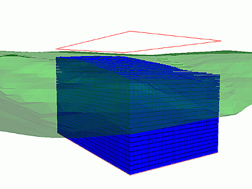
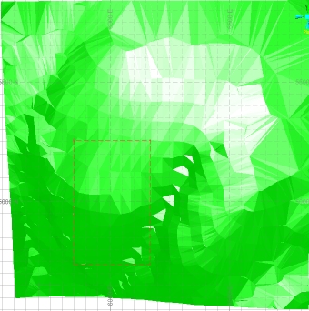
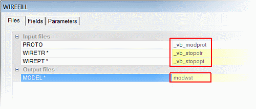
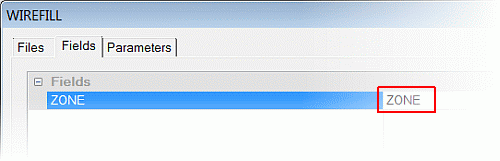
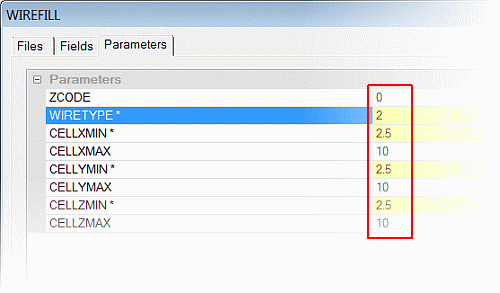
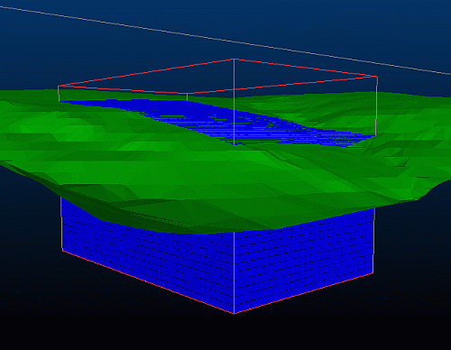
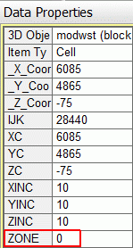

 |  Creating a Waste Block Model Creating a waste block model using a surface wireframe.  
---|---  
  
# Overview

In this portion of the tutorial you are going to create a waste material block model using the topography surface wireframe.

## Prerequisites

  * Completed the [Creating a New Project](<Creating_a_New_Project.md>) exercise.

  * Completed the [Defining Geological Modeling Settings](<Defining_Geological_Modeling_Settings.md#Exercise1>) exercise.

  * [Files](<Tutorial_Files_List.md>) required for the exercises on this page:

  *     * _vb_modbound.dm

    * _vb_modprot.dm

    * _vb_stopopt.dm

    * _vb_stopotr.dm

    * _vb_viewdefs.dm

## Exercise: Creating a Waste Block Model below the Topography Surface Wireframe

In this exercise, you will create a waste model below the topography surface using the process WIREFILL, the prototype block model **_vb_modprot **and the topography surface wireframe _vb_stopotr/_vb_stopopt (wireframes). A zone field ZONE will be added to the block model and its value will be set to "0".

 |  The field ZONE is a default name for the zonal control field used to control grade estimation.  
---|---  
  
The result will be saved to a new block model file. This ZONE field is important for use in grade estimation. The topography surface wireframe, the strings showing the limits of the block model prototype, and the "waste" block model are shown below:

 | 

  * Create a field ZONE, and set a default value - for example, '0'.
  * Before using a surface wireframe (DTM) for block model creation:
  *     * Validate the wireframe
    * Calculate the volume of the wireframe.
  * Make the waste block model large enough to cater for later economic optimization and resource estimation - for example, open pit optimization using NPVS, or mine design and evaluation exercises.
  * Use the same block model prototype when creating waste and ore block models.

  
---|---  
| Incomplete or damaged wireframes can potentially cause errors during the creation of a block model.  
---|---  
  
## Loading and Formatting the Data

  1. Unload any data that is currently loaded and remove any window splits that may have been added as a result of previous exercises.

  2. In the Project Files control bar, select the All Tables folder.

  3. Drag-and-drop the following files (if not already loaded) into the 3D window:

     * _vb_modbound

     * _vb_stopotr

     * _vb_viewdefs

  4. In the Sheets control bar, expand the 3D-Overlays tree.

  5. Select only the following objects:  

     * Default Grid

     * _vb_modbound (strings)

     * _vb_stopotr/_vb_stopopt (wireframes)

  6. Activate the View ribbon and select Zoom Fit | Zoom Plan:  
  
  
  
| The red strings object modbound (strings) shows the limits of the block model prototype _vb_modprot but is not used directly in the WIREFILL block modeling process .  
---|---  

## **Creating the Block Model Below the Open Surface**

  1. Activate the Model ribbon and select the From Wireframe option
  2. In the WIREFILL dialog, Files tab, browse for and define the file names, as shown below:  
  

  3. In the WIREFILL dialog, Fields tab, define the settings, as shown below:  
  
  
  
| 
     * The field ZONE does not exist in the wireframe triangle file and so cannot be transferred to the block model.
     * A new numeric ZONE field will be created in the block model if the ZONE field is set to "ZONE", as is the case here.  
---|---  
  4. In the WIREFILL dialog, Parameters tab, define the settings shown below and click OK:  
  
  
  
 | 
     * The ZCODE parameter must be set to "0".
     * As a result of the ZONE field and ZCODE parameter settings, the block model will contain a numeric field ZONE with the value set to "0".
     * This value for the "waste" fits in with the other zone codes for the upper (ZONE=1) and lower (ZONE=2) mineralization zones in the ore body block model.
     * These ZONE values are used in the later grade estimation exercises.
     * The following wireframe types (parameter WIRETYPE) can be accommodated:
     1.         1. Solid - create cells inside
        2. Surface - create cells below
        3. Surface - create cells above
        4. Surface - create cells to the south
        5. Surface - create cells to the north
        6. Surface - create cells to the west
        7. Surface - create cells to the east.  
---|---  
  5. Check the status of the WIREFILL process by viewing the messages in the Command control bar. The process should complete without errors, with the number of parent cells being reported as 40890.

## Checking the Waste Block Model

  1. Select theProject Filescontrol bar,Block Modelsfolder.

  2. Drag-and-drop the modwst file into the 3D window.

  3. In the Sheets control bar, expand the 3D-Overlays folder.

  4. Select only the following objects:  

     * Default Grid

     * _vb_modbound (strings)

     * _vb_stopotr/_vb_stopopt (wireframes)

     * modwst (block model)

  5. In the View Control toolbar, click Get View 'gvi'.
  6. In the Command toolbar, Run Command field, type in '1', press <Enter>.
  7. In the Sheets control bar, expand the 3D-Block Models folder and double-click modwst (block model).
  8. In the Block Model Properties dialog, Display Type group, select Blocks.
  9. In the Color group, select Fixed and the color [(11) Bright Blue] and click OK.
  10. In the 3D window, rotate and zoom the view to check the extents of the block model against the topography surface wireframe, and the prototype block model limits strings (ignore the color of the background - yours may be different):  
  

  11. In the 3D window, left-click a block model cell.
  12. In the Data Properties control bar, confirm that the ZONE value is set to '0':  
  

  13. Repeat steps 12 and 13 for other cells.
  14. Activate the Data ribbon and select Manage Objects
  15. In the Data Object Manager dialog, Data Object tab, select the modwst object and then check the Statistics pane, confirm that there are 32984 full cells and 18120 subcells - a total number of 51104 records - and then close the dialog (red cross - top right).

| Your waste block model can be checked against the example file _vb_modwst.dm.  
---|---  
  
##  [Next Page](<Creating_an_Ore_Body_Block_Model_from_a_Closed_Volume_Wireframe.md>)