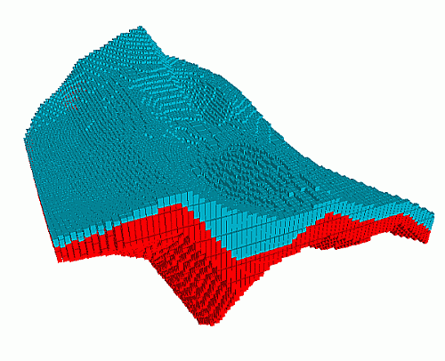
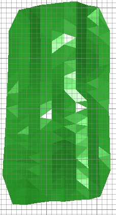
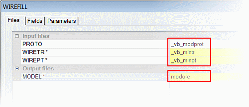
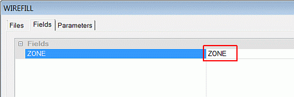
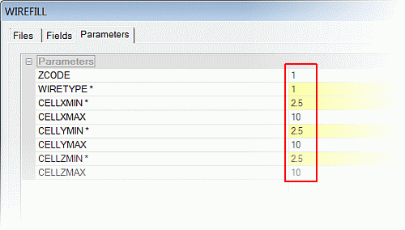
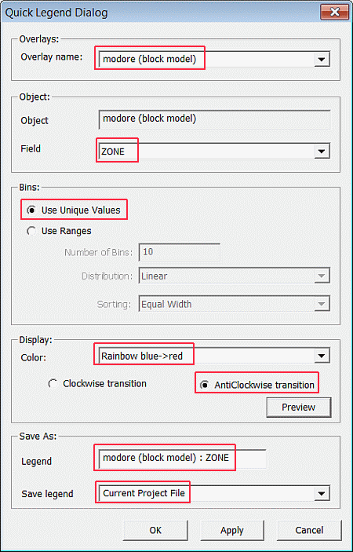
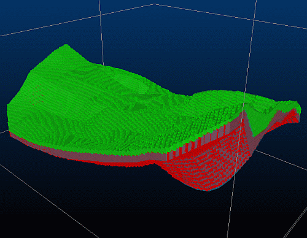
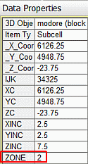

 |  Creating an Ore Body Block Model Creating an ore body block model using a closed volume wireframe  
---|---  
  
# Overview

In this part of the tutorial you will create an ore body block model using the ore body's closed volume wireframe.

## Prerequisites

  * Completed the [Creating a New Project](<Creating_a_New_Project.md>) exercise.

  * Completed the [Defining Geological Modeling Settings](<Defining_Geological_Modeling_Settings.md#Exercise1>) exercise.

  * [Files](<Tutorial_Files_List.md>) required for the exercises on this page:

  *     * _vb_minpt.dm

    * _vb_mintr.dm

    * _vb_viewdefs.dm

## Exercise: Creating an Ore Body Block Model from a Closed Volume Wireframe

In this exercise, you will use the WIREFILL process to create an "ore" model within the ore body's closed volume wireframe object **_vb_mintr/_vb_minpt (wireframe)** and the prototype block model **_vb_modprot**. A zone field ZONE will be added to the block model, and these attribute values will be transferred from the wireframe to the model cells.

 |  The field ZONE is a default name for the zonal control field used to control grade estimation.  
---|---  
  
The upper mineralization zone is set to ZONE =1 and the lower mineralization zone is set to ZONE =2. The ore body block model with its upper (blue) and lower (red) mineralization zones, is shown below:

 | 

  * Create a field ZONE and set values for each mineralization zone
  * Before using a closed volume wireframe for block model creation:
  *     * Validate the wireframe
    * Calculate the volume of the wireframe.
  * Use the same block model prototype when creating waste and ore block models.

  
---|---  
| Incomplete or damaged wireframes can potentially cause errors during the creation of a block model.  
---|---  
  
## Loading and Formatting the Data

  1. Unload any data you may already have loaded.

  2. In the Project Files control bar, select the All Tables folder.

  3. Drag-and-drop the following files into the 3D window:  

     * _vb_modbound

     * _vb_mintr

     * _vb_viewdefs

  4. In the Sheets control bar, expand the 3D folder.

  5. Select only the following objects:  

     * Default Grid

     * _vb_mintr/_vb_minpt (wireframes)

  6. In the View Control toolbar, click Get View.
  7. In the Command toolbar, Run Command field, type in '1' and press <Enter>.
  8. In theView Controltoolbar, clickZoom All Data.
  9. Activate the View ribbon and select Zoom Fit | Zoom Planandconfirm that the 'Plan 195' view showing the ore body wireframe model (upper and lower mineralization zones) is displayed as shown below:**  
  
**

## **Creating the Block Model Within the Ore Body's Closed Volume**

  1. Select the 3D window.
  2. Activate the Structure ribbon and select Create | From Wireframe
  3. In the WIREFILL dialog, Files tab, browse for and define the file names, as shown below:**  
  
**
  4. In the WIREFILL dialog, Fields tab, define the settings, as shown below:**  
  
  
**  
| 
     * The field ZONE exists in the wireframe triangle file and its field values are transferred to the block model when the ZONE field ZONE is defined.
     * As a result, the block model will contain a field ZONE, with values set as follows: upper mineralization zone (ZONE=1) and lower mineralization zone (ZONE=2).
     * These ZONE values are used as input into the zonal control option for grade estimation purposes.  
---|---  
  5. In the WIREFILL dialog, Parameter tab, define the settings shown below, then click OK:**  
  
**  
  
| 
     * The ZCODE value is ignored if a ZONE field has been defined i.e. ZONE field values are to be transferred from the wireframe triangle file to the block model.
     * The following wireframe type (parameter WIRETYPE) is used for solid volumes: 
       1. Solid - create cells inside  
---|---  
  6. In the Command control bar, view the messages to check the status of the WIREFILL process.

## Checking the Ore Block Model

  1. Select theProject Filescontrol bar,Block Modelsfolder.

  2. Drag-and-drop the modore file into the 3D window.

  3. Select the Sheets control bar and expand the 3D-Overlays folder.

  4. Select only the following check boxes (i.e. display these objects):  

     * Default Grid

     * _vb_mintr/_vb_minpt (wireframes)

     * modore (block model)

  5. In the Sheets control bar, 3D-Wireframes folder, double-click _vb_mintr/_vb_minpt (wireframes).
  6. In the Wireframe Properties dialog, Opacity group, click-and-drag the slider bar to approximately 50%, click OK.
  7. In the Sheets control bar, 3D-Block Models folder, double-click modore (block model).
  8. In the Block Model Properties dialog, Display Type group, select Blocksand set theExaggerationfield to '90%' click OK.  
  
| The Intersection option can also be used, primarily to view slices through the block model. These ca be used to check:
     * parent and subcell sizes
     * for gaps in cell filling
     * cell filling along wireframe boundaries
     * values of attributes e.g. ZONE.  
---|---  
  9. In the Sheets control bar, 3D-Block Models folder, right-click modore (block model)., select Quick Legend.
  10. In the Quick Legend dialog, define the settings shown below, click OK:**  
  
**
  11. In the 3D window, rotate and zoom the view, check the extents of the block model against the ore body wireframe (ignore the background colore - yours may differ depending on previous exercises):**  
  
**
  12. In the Sheets control bar, 3D-Wireframes folder, hide _vb_mintr/_vb_minpt (wireframes).
  13. In the 3D window, select (left-click) a block model cell in the lower (red) zone.
  14. In the Data Properties control bar, check that the ZONE value is set to '2':**  
  
**
  15. In the 3D window, select (left-click) a block model cell in the upper (green) zone.
  16. In the Data Properties control bar, check that the ZONE value is set to '1'
  17. In the Loaded Data control bar, right-click on modore (block model) , select _D_ ata Object Manager....
  18. In theData Object Managerdialog,Data Objecttab,Statisticspane, check that there are 829 full cells and 54027 subcells i.e. a total number of 54856 records, then close the dialog.

| Your ore body block model can be checked against the example file _vb_modore.dm.  
---|---  
  
****[Next Page](<Creating_a_Combined_Ore_Body_and_Waste_Block_Model.md>)