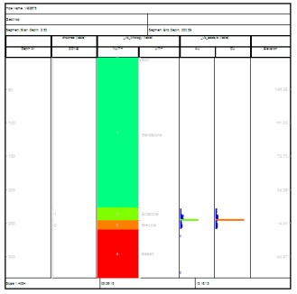
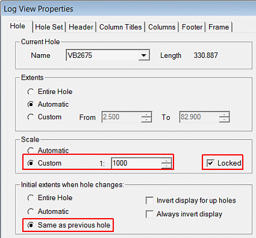
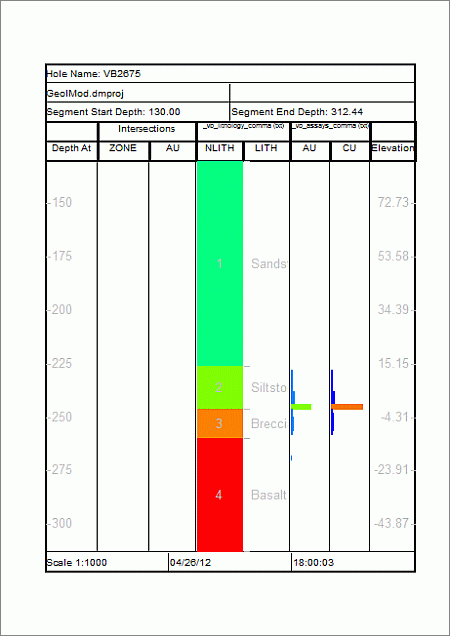

 |  Creating and Viewing Log Sheets Creating a standard drillhole log sheet and viewing drillholes.  
---|---  
  
# Overview

In this part of the tutorial you will create a standard drillhole log sheet, and use it to view logs of different drillholes.

## Prerequisites

  * Completed the [Creating a New Project](<Creating_a_New_Project.md>) exercise.

  * Completed the [Defining Geological Modeling Settings](<Defining_Geological_Modeling_Settings.md#Exercise1>) exercise.

  * Completed the [Creating Dynamic Drillholes](<Creating_Dynamic_Drillholes.md#TOP>) exercise and have all dynamic holes tables loaded

  * Objects (Loaded Data) required for the exercises on this page:

  *     * Holes

    * Intersections

## Links to exercises

The following exercises are available on this page:

  * Creating a New Log Sheet

  * Viewing Drillhole Logs

## Exercise: Creating a New Log Sheet

In this exercise you will create a new log sheet using the dynamic drillholes stored in the Holes object created in the exercise [Creating Dynamic Drillholes](<Creating_Dynamic_Drillholes.md#TOP>). This will be done by inserting a new log sheet, modifying the zoom and scale parameters, and then setting the log sheet to display only the mineralized portion of the drillhole extents.

 |  Use drillhole log sheets to:

  * view the drillhole data in a customizable log sheet format;
  * simultaneously view multiple geological data types associated with the same sample interval;
  * validate data - for example, mineral grade and rock type associations, stratigraphic sequence;
  * aid in the definition of mineralization zones;
  * supplement the drillhole data viewed as drillhole traces or tables in the other windows.

  
---|---  
  
## Creating a New Log Sheet

  1. If have not already done so, please complete the exercise Creating Dynamic Drillholes.
  2. Using the Sheets | 3D | Drillholes folder, double-click the Holes item.
  3. In the Lines & Symbols tab, ensure the Legend option is selected, and the [_vb_lithology (table).NLITH)] Column is selected.
  4. Auto-create a default legend for this column and clickOK.
  5. If the Logs window is not displayed, activate the Home ribbon and select Show | Logs.
  6. Activate the Plots view, and using the Manage ribbon, select Sheet | Log.
  7. In the Logs window, confirm that a new log sheet has been created for drillhole VB2675:  
  
  

**Setting Zoom and Scale Parameters**

  1. In the Zoom toolbar, toggle on Zoom Fit.
  2. Left-click inside the header area of the Hole Log Frame (the frame should now appear dashed)
  3. Right-click, and select Hole Log Frame (VB2675) Properties... .
  4. In the Log View Properties dialog, select the Hole tab.
  5. In the Scale group, select Custom, set the scale 1: [1000] , and select Locked .
  6. In the Log View Properties dialog, **Initial Extents when hole changes** group, select Same as previous hole:  
  

  7. In the Log View Properties dialog, click Apply.

**  
Setting the Hole Extents Parameters**

  1. In the Log View Properties dialog, Hole tab, Extents group, select Custom .
  2. Specify a value of '130' in theFrombox.
  3. In the Log View Properties dialog, click Apply, and then OK.
  4. View your modified log sheet and compare it to that shown below:  
  
  
  
 |  The log sheet now:
     * starts at a depth of 130m (previously 2.5m);
     * displays more of the mineralized portion of the drillhole at a scale of 1:1000 (previously approximately 1:4000).
The log sheet header, footer and column contents can be customized, formatted and colored using legends, in a similar way to other objects in other windows.  
---|---  

## Exercise: Viewing Drillhole Logs

In this exercise you will use the log sheet created in the previous exercise to view some of the other drillholes stored in the Holes object.

 |  Use drillhole log sheets to:

  * view the drillhole data in a customizable log sheet format;
  * simultaneously view multiple geological data types associated with the same sample interval;
  * validate data - for example, mineral grade and rock type associations, stratigraphic sequence;
  * aid in the definition of mineralization zones;
  * supplement the drillhole data viewed as drillhole traces or tables in the other windows.

  
---|---  
  
## Moving between Drillholes - Method 1

  1. In the Logs window, select the VB2675 Log sheet tab.
  2. Click inside the header area of the Hole Log Frame (the frame should now appear dashed).
  3. Right-click and select Hole Log Frame (VB2675) Properties....
  4. In the Log View Properties dialog, select the **Hole** tab.
  5. In the Current Hole group, set the Name to [VB4280].
  6. Click Apply and then OK.
  7. Check the results in the Logs window.

## Moving between Drillholes - Method 2

  1. In the Logs window, select a Log sheet tab.
  2. Using the Manage ribbonIn the Log toolbar, click Hole Next or Previous Hole to move between drillholes.

## Moving between Drillholes - Method 3

  1. In the Logs window, select a Log sheet tab.
  2. Display the Manage ribbon and use the Logs | Previous and Logs | Next options.

  
 | 

  * A default Drillhole Log sheet is created in the Logs window when drillhole data tables are loaded to create dynamic drillholes.
  * The Log sheets can be independently modified for both data content and formatting.
  * Multiple log 'templates' sheets can be defined, each with a different column content and format.
  * Different drillholes are viewed by using the drillhole navigation tools.

  
---|---  
  
****[Next Section](<Creating_a_Modeling_Boundary.md>)