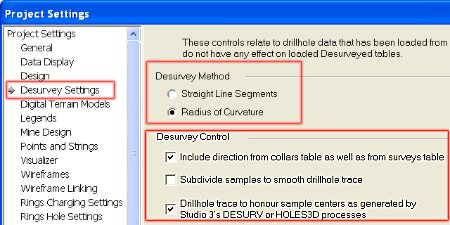
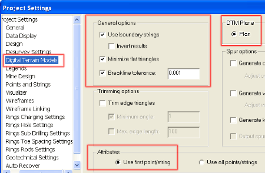
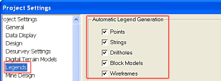
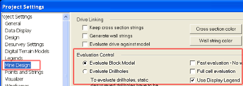
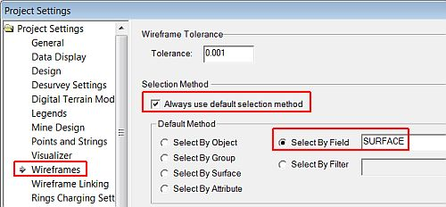
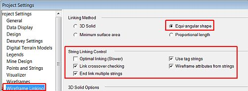

 |  Defining Geological Modeling Settings Defining typical settings for a geological modeling project  
---|---  
  
# Overview

In this part of the tutorial you will define conventions, general interface and project settings that are typically used during the geological modeling process.

## Prerequisites

  * Completed the [Creating a New Project](<Creating_a_New_Project.md>) exercise.

  * [Files](<Tutorial_Files_List.md>) required for the exercises on this page:

  *     * None

## Exercise: Defining Geological Modeling Settings

In this exercise you will define settings for the following:

  * default symbol size for points on strings (0.2mm)
  * enable automatic redraw
  * drillhole desurvey
  * digital terrain modeling
  * legends
  * evaluation control
  * wireframe selection
  * wireframe linking.

## Setting a Default Symbol Size for Displayed Data

  * Ensure the 3D window is displayed.

  * Activate the Home ribbon and select Project | Settings

  * In the Project Settings dialog, Project Settings list, select Data Display.

  * In the right pane, Symbols group, use the Default symbol size: spin buttons to define a value of 0.2 mm

 |  Setting the default string point symbol size to at least 0.2mm (or larger) makes the string points easier to see when string modeling in the 3D window.  
---|---  
  
## Enabling Automatic Redraw

  * In the Project Settings dialog, select Design.

  * In the right pane, Control group, select Enable automatic redraw.

## Drillhole Desurvey Settings

  * In the Project Settings dialog, select Desurvey Settings.

  * In the right-hand pane, define the settings shown below.  
  

## Digital Terrain Model Settings

  * In the Project Settings dialog, select Digital Terrain Models.

  * In the right-hand pane, define the settings shown below.  
  
  

## Legends Settings

  * In the Project Settings dialog, select Legends.

  * In the right-hand pane, define the settings shown below:  
  

## Evaluation Control Settings

  * In the Project Settings dialog, select Mine Design.

  * In the right-hand pane, define the settings shown below:  
  
  

 | 

  * Clearing the Full cell evaluation check box allows the evaluation commands to run a partial cell evaluation i.e. the portions of block model cells falling outside the evaluated strings or wireframes do not form part of the evaluation. This allows a more accurate evaluation to be done, but is also generally slower.
  * The default selected item in the Legend drop-down list is used for now, as an evaluation legend will be defined in a later exercise.

  
---|---  
  
##  Wireframe Selection Settings

  * In the Project Settings dialog, select Wireframes.

  * In the right-hand pane, define the settings shown below:  
  
  

## Wireframe Linking Settings

  1. In the Project Settingsdialog, select Wireframe Linking.

  2. In the right-hand pane, define the settings shown below:  
  
  

  3. In the Project Settings dialog, click OK.

## Saving the Settings

  * Use the Project button to select Save

| 

  * These geological modeling settings are only stored in the project file when it is saved.
  * If the project is exited without saving, any changes to these settings will be lost.

  
---|---  
  
****[Next Section](<Importing_Topography_Contours.md>)