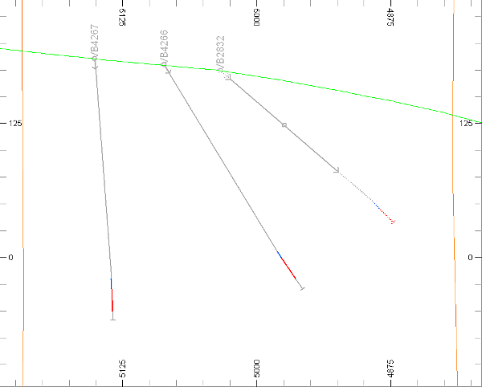
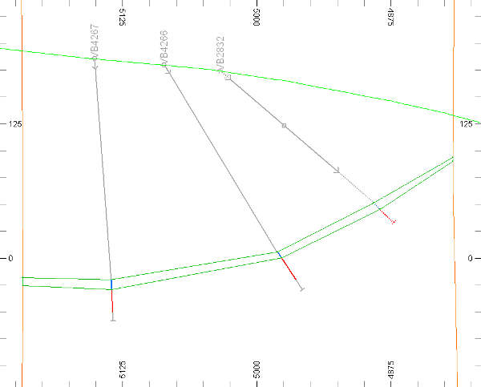
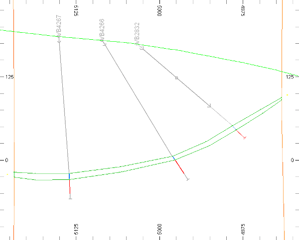
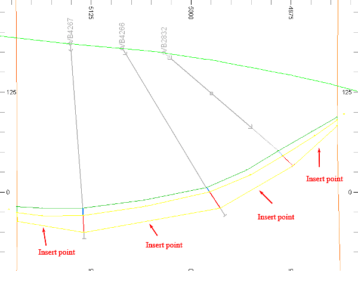
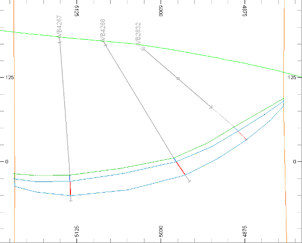
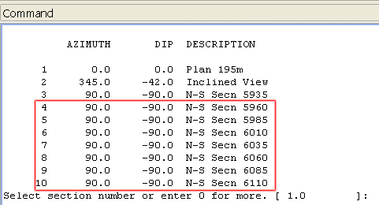
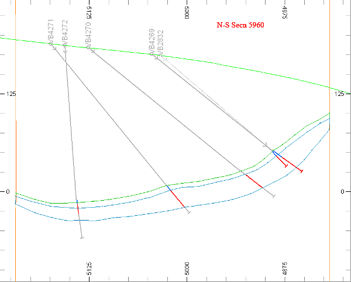
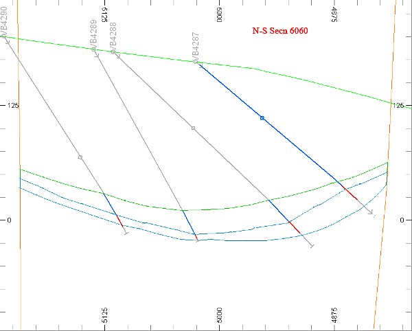
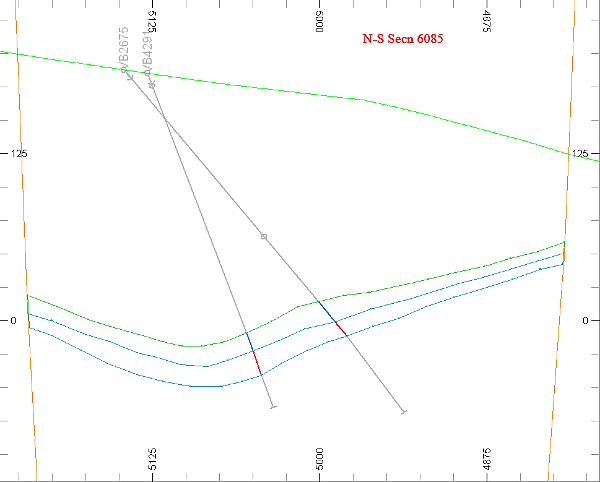

# Digitizing Vertical Section Strings

 |  Digitizing Vertical Section Strings Ore body interpretation by digitizing vertical section strings and using drillholes.  
---|---  
  
# Overview

In this part of the tutorial you will create the basic framework for a geological ore body string model, consisting of sets of vertical section strings, which are guided by the mineralized zones displayed in the drillhole data.

## Prerequisites

  * Completed the [Creating a New Project](<Creating_a_New_Project.md>) exercise.

  * Completed the [Defining Geological Modeling Settings](<Defining_Geological_Modeling_Settings.md#Exercise1>) exercise.

  * [Files](<Tutorial_Files_List.md>) required for the exercises on this page:

  *     * _vb_stopopt.dm

    * _vb_stopotr.dm

    * _vb_faultpt.dm

    * _vb_faulttr.dm

    * _vb_holesc.dm

    * _vb_viewdefs.dm

## Links to exercises

The following exercise is available on this page:

  * Digitizing Vertical Section Strings using Drillholes

## Exercise: Digitizing Vertical Section Strings using Drillholes

In this exercise you will create a geological ore body string model consisting of sets of vertical section perimeter strings. This will be done for each of the two mineralized zones displayed in the composited static drillhole file _vb_holesc.dm , for each of the vertical N-S sections.

The northern and southern limits of the ore body strings will be defined by the vertically dipping faults. Different colors will be used to represent each zone. The strings will then be saved to a Datamine file min1st.dm .

The image below shows the digitized and conditioned set of strings for the upper (Green 5) and lower (Cyan 6) mineralization zones, relative to the drillhole, topography and fault surface data, for one of the sections:

 |  Use section perimeters (closed strings) to model the ore body when:

  * drillhole data is organized in sections;
  * ore bodies have complex geometries - for example, irregular shapes or folded limbs;
  * needing to generate closed wireframe volumes.

  
---|---  
 | The interpretation of mineralization zones and the creation of geological string models for ore bodies can be done using a variety of string modeling methods:

  * Vertical, horizontal or inclined section perimeters (closed strings).
  * Contour strings e.g. separate top and bottom ore zone contact contours, surface topography.

  
---|---  
  
## Loading and Formatting the Data

  1. In the Project Files control bar, select the All Tables folder.

  2. Drag-and-drop the following files (if not already loaded) into the Design window:

     * _vb_faulttr

     * _vb_holesc

     * _vb_stopotr

     * _vb_viewdefs

  3. Select the Sheets control bar and expand the 3D-Overlays folder.

  4. Select only the following check boxes (i.e. display these objects) :

     * Default Grid

     * _vb_faulttr/_vb_faultpt (wireframe)

     * _vb_holesc (drillholes)

     * _vb_stopotr/_vb_stopopt (wireframe)

  5. Double-click _vb_faulttr/_vb_faultpt (wireframe).
  6. Select Intersectionas theDisplay Type

  7. Repeat steps 6. and 7 for the _vb_stopotr/_vb_stopopt (wireframe)overlay

  8. In the Drillholes folder, double-click _vb_holesc (drillholes).

  9. In the Properties dialog, select the Lines and Symbols tab.

  10. In the Color group, select the Legend: [ ZONE (_vb_holesc)] (near the bottom of the list).

  11. In the Color group, select the Column: [_vb_holesc (drillholes).ZONE].

  12. Select the Labels tab, then activate the Display Labels check box

  13. You'll see that [BHID} is a default label - you're going to show it at the top of the hole, so just ensure the Collar check box is selected in the Position group, below (this should be selected by default).

  14. In the 3D window, confirm that the 'N-S Secn 5935' clipped vertical view of the composited static drillholes, topography and fault wireframe surfaces (as intersections) is displayed as shown below:  
  
  
  

  15.  | In the above view:
     * The primary clipping is set to10m in front of, and behind the view plane.
     * The drillholes have already been flagged with a mineralization zone field ZONE - the blue portion of the drillhole trace represents the upper mineralization zone (ZONE=1), and the lower red portion, the lower mineralized zone (ZONE=2).
     * The grey portions of the drillholes fall outside of the mineralized zones.
     * The drillholes are labelled at the collar position with the borehole identifier (field BHID).  
---|---  

## Creating a New String Object

  1. In theCurrent Objectstoolbar, select theObject Type [Strings], and click Create New Object Applying Default Template.
  2. In theLoaded Datacontrol bar, confirm that theNew Stringsobject is listed, and is highlighted in bold to indicate that it is the current strings object.

## Digitizing the Upper Zone String for the "N-S Secn 5935"

 | 

  * The perimeter will be digitized in a clockwise direction.
  * The start point is the extrapolated top of the upper zone (blue drillhole segments) position, on the fault just north (left) of drillhole VB4267.
  * Points will be digitized on the top (top contact) or bottom (bottom contact) of the relevant drillhole segments, by pointing (extrapolated positions e.g. off-section drillhole VB2832) or snapping to segment ends.
  * Points are digitized where the extrapolated northern and southern ends of the ore zone is truncated by the faults.
  * The string will be closed to create a closed string (perimeter).

  
---|---  
  

| The string points are labeled with the digitizing sequence.  
---|---  
  
  1. Select the 3D window.

  2. Using the Home ribbon, set Snap: Points.

  3. In the Snap Todrop-down list, ensure that [Drillholes] is active

  4. Type 'ns' to digitize a new string

  5. In the Current Objects toolbar, select the attribute [COLOUR], set the value to [5] i.e. color Green.

  6. Using theViewribbon, click Zoom Inand define an area including the North fault and the bottom of drillhole VB4267, as shown below:  
  

  7. Move to a point 1 (5935.00, 5217.44, -18.74), on the north fault, and left-click.

  8. Move to point 2 (5935.00, 5135.64, -20.09), top contact of VB4267, and right-click (snap).

  9. Press <Left Arrow> (x10) and <Down Arrow> (x2) to pan across to drillhole VB4266.

  10. Move to point 3 (5935.00, 4980.47, 5.47), top contact of VB4266, and right-click.

  11. Press <Left Arrow> and <Down Arrow> to pan across to drillhole VB2832.

  12. Move to point 4 (5935.00, 4891.56, 50.30), extrapolated top contact of VB2832, and left-click.

  13. Press <Left Arrow> and <Down Arrow> to pan across to the south fault.

  14. Move to point 5 (5935.00, 4817.06, 93.70), top contact on south fault, and left-click.

  15. Move to point 6 (5935.00, 4817.06, 89.89), bottom contact on south fault, and left-click.

  16. Press <Right Arrow> and <Up Arrow> to pan across to drillhole VB2832.

  17. Move to point 7 (5935.00, 4884.74, 44.79), extrapolated bottom contact of VB2832, and left-click.

  18. Press <Right Arrow> and <Up Arrow> to pan across to drillhole VB4266.

  19. Move to point 8 (5935.00, 4976.81, -0.14), bottom contact of VB4266, and right-click.

  20. Press <Right Arrow> and <Up Arrow> to pan across to drillhole VB4267.

  21. Move to point 9 (5935.00, 5135.17, -29.38), bottom contact of VB4267, and right-click.

  22. Press <Right Arrow> and <Up Arrow> to pan across to the north fault.

  23. Move to point 10 (5935.00, 5217.44, -26.13), bottom contact on north fault, and right-click.

  24. In the 3D window, click Done.

  25. Using the Edit ribbon, select Condition | Close

  26. In the 3D window, right-click and select Deselect All Strings.  

| A selected string(s) is displayed in the yellow highlight color (default setting). The de-selected upper mineralization zone string is shown in its assigned color Green 5.  
---|---  
  27. Using the View ribbon, click Zoom and drag to zoom out. In the 3D window, compare your digitized upper mineralized zone string to that shown below:  
  
  

  28. Check the position of the upper mineralized zone string points relative to the drillholes, fault surfaces and the current view plane. 

## Smoothing the Upper Zone Perimeter for the "N-S Secn 5935"

  1. Click on (i.e. select) the newly digitized upper zone string.  
| The selected string is displayed in the yellow highlight color (default setting).   
---|---  
  2. Using the Edit ribbon, click Condition | Smooth

 | 
     * Smoothing has added additional points to the string, one between each existing point.
     * The two extra points outside the faults are not needed and will be deleted.
     * A string can be smoothed multiple times - beware of over-smoothing a string.  
---|---  
  3. Again, using the Edit ribbon, clickDelete Pointsselect the two points shown below and then click Done.:  
  

  4. Compare your smoothed upper mineralized zone string to that shown below:  
  

##  Digitizing, Smoothing and Editing the Lower Zone String for the "N-S Secn 5935"

  1. Using the Home ribbon, select Snap: Points

  2. Ensure both [Drillholes] and [Strings] are active in the Snap To drop-down list.

  3. Type 'ns' to digitize a new string.

  4. In the Current Objects toolbar, select the attribute [COLOUR], set the value to [6] i.e. color Cyan.

  5. Referring to the steps in the previous two sections, digitize a string along the top contact, down and then along the bottom contact, starting at the northern side and going in a clockwise direction.  

 | 
     * Snap (right-click) to the existing upper zone string points.
     * The top contact of the lower zone string follows the path of the bottom contact of the upper zone string.
     * There should be no gaps or overlaps between the upper and lower zone strings.   
---|---  
  6. Using the Edit ribbon, select Insert Points.

  7. Left-click to insert four points at the following locations along the bottom contact:  
  

  8. Compare your lower zone string (Cyan 6) to that shown below:  
  

##  Saving the New Strings to a Datamine File

  1. Select the Loaded Data control bar.

  2. Right-click on the New Strings object and select Data | Save As.

  3. In the Save New 3D Object dialog, click Single Precision Datamine (.dm) File.
  4. In the Save New Strings dialog, select your project folder, define the File name as 'min1st.dm', click Save.
  5. In the Loaded Data control bar, check that the New Strings object has been replaced by the strings file object min1st (strings).

| Your interpretation of the ore zone strings can be checked against the example file for all the sections, _vb_min1st.dm  
---|---  
  
## Creating the Strings for the Remaining Sections (Optional)

| The exercise section below can be completed if you wish to practice your digitizing skills; alternatively, you can load and view the completed example set of section strings stored in the example file _vb_min1st.dm.  
---|---  
  
  1. Using the viewing, digitizing and editing techniques covered in the above headings on this page, create upper and lower zone strings for the remaining seven sections highlighted below:  
  

  2. Use the 3D window to compare your upper and lower zone strings to those shown below:  
  
  
  
  
  
  
  
  
  
  
  
  
  

  3. Select theLoaded Datacontrol bar.

  4. Right-click on the min1st (strings) object , select Save.

| Your interpretation of the ore zone strings can be checked against the example file _vb_min1st.dm  
---|---  
  
##  [Next Page](<Extrapolating_Section_Strings.md>)