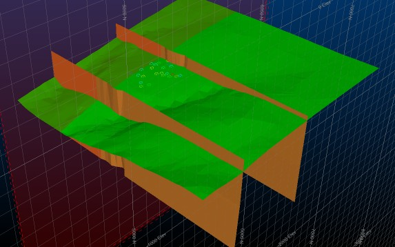
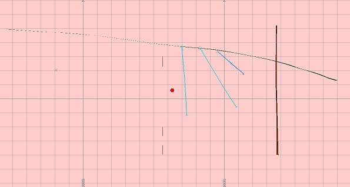
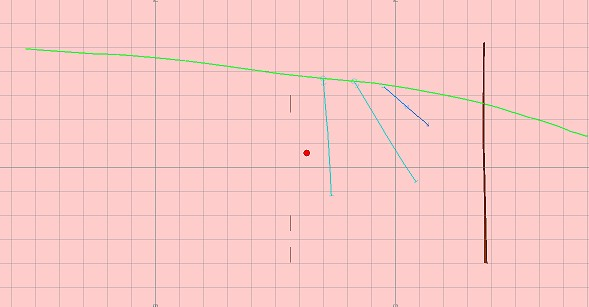
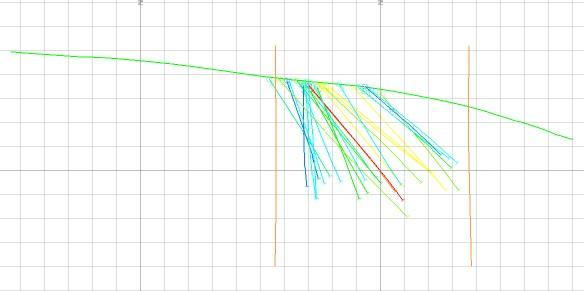

 |  Displaying Wireframes as Intersections How to display wireframes as intersections in the 3D window  
---|---  
  
# Overview

In this part of the tutorial you will display wireframes as intersections in a vertical viewplane.

## Prerequisites

  * Completed the [Creating a New Project](<Creating_a_New_Project.md>) exercise.

  * Completed the [Defining Geological Modeling Settings](<Defining_Geological_Modeling_Settings.md#Exercise1>) exercise.

  * [Files](<Tutorial_Files_List.md>) required for these exercises:

  *     * _vb_stopopt.dm

    * _vb_stopotr.dm

    * _vb_faultpt.dm

    * _vb_faulttr.dm

## Exercise: Displaying Wireframes as Intersections

In this exercise you will display the topography object _vb_stopotr/pt (wireframe) and fault surfaces object _vb_faulttr/pt (wireframe) as intersections in a N-S vertical viewplane, using the 3D window.

 |  Display wireframes (both surfaces or closed volumes) as intersections when:

  * checking the location of data - for example, drillholes - relative to a wireframe surface;
  * validating wireframe surfaces along a section - for example, identifying crossovers or gaps;
  * validating block model cells which were generated by filling wireframes.

  
---|---  
  
## Loading Data

  1. Select the 3D window and unload all existing data by activating the Data ribbon and select Unload | Unload All.

  2. In the Project Files control bar, expand the All Tables folder.

  3. Drag-and-drop the following wireframe, drillholes and section definition *.dm files (if not already loaded) into the Design window:

     1.         * _vb_faulttr

        * _vb_holes

        * _vb_stopotr

        * _vb_viewdefs

  4. Select the Sheets control bar, and expand the 3D folder.

  5. Select only the following check boxes (i.e. display these objects) :

     * Grid folder - Default Grid

     * Drillholes folder - _vb_holes (drillholes)

     * Wireframes folder - _vb_faulttr/_vb_faultpt (wireframe)

     * Wireframes folder - _vb_stopotr/_vb_stopopt (wireframe)

## Retrieving the View

  1. Activate the View ribbon and select [_vb_viewdefs (table)] from the Section drop-down list.

  2. If the section Indicator option is on, disable it.

  3. Make sure the Lock toggle is disabled.

  4. Double-click the _vb_viewdefs (table) item in the Sheets | 3D | Sections folder.

  5. Press the right-arrow button until 'N-S Secn 5935' is displayed in the Studio RM status bar:  
  

  6. Disable theUse Dimensionscheck box and clickOK. You should see something similar to the following:  
  
  

  7. Enable the Lock toggle - the view will automatically align and lock itself to an orthogonal view plane (relative to the N-S section).

## Displaying Wireframes as Intersections

  1. Double-click any empty area of the 3D window and set the Background Color to a Single [White] and click OK.

  2. Showing a section of a wireframe (or any visual object) is easy in 3D; all you have to do is manage the properties of the section through which the data passes.

  3. Double-click the _vb_viewdefs (table) item in the Sheets | 3D | Sections folder.

  4. In the Section Properties dialog, set the Section Width (front and back) to "1" and enable the Clipping - Outside option. Click Apply and you should see something similar to this:  
  

  5. Topography is a bit hard to see? Double-click the _vb_stopotr/_vb_stopopt entry in the 3D | Wireframes folder.
  6. In the Wireframe Properties dialog, Shading group, select Intersection.
  7. Make sure the [_vb_viewdefs (table)] is selected in the Intersection Section drop-down list. Leave all other settings and click OK. This makes things clearer:  
  

  8. Use the same process to change the _vb_faulttr/_vb_faultpt item to an intersection.
  9. Disable the view of the active section by disabling the checkbox in the 3D | Sections folder. A clear section view is created:  
  

## 

****[Next Section](<Filtering_Ore_Body_Strings_using_the_DataObjectManager.md>)