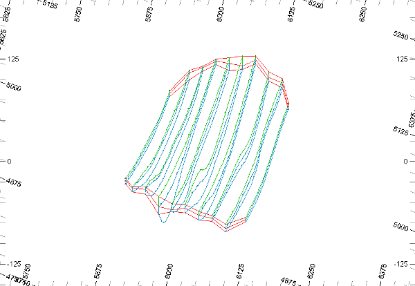

# Extracting Parts of the String Model

 |  Extracting Parts of a Strings Model Using the Data Object Manager to extract parts of a strings model in creating new strings objects.  
---|---  
  
# Overview

In this part of the tutorial, you will use the Data Object Manager to extract part of the strings model using a filter expression.

## Prerequisites

  * Completed the [Creating a New Project](<Creating_a_New_Project.md>) exercise.

  * Completed the [Defining Geological Modeling Settings](<Defining_Geological_Modeling_Settings.md#Exercise1>) exercise.

  * [Files](<Tutorial_Files_List.md>) required for the exercises on this page:

  *     * _vb_minst.dm

## Exercise: Extracting the Upper Zone of the Ore Body Strings Model

In this exercise, you will use the Data Object Manager to extract the upper (Green 5) mineralization zone strings from the ore body strings model object **minst.dm (strings)** and create a new strings object **_vb_minst.dm - Split (COLOUR=5)**. The extraction will be done using the COLOUR attribute and a filter expression. The techniques covered in this exercise can be used to extract or split other types of model objects of the same type e.g. wireframes, block models, tables. 

 |  Extract or split strings objects into separate strings objects:

  * when working with large data sets and the potential exists to split the data in separate geographical or;
  * when working on a subset of the model data;
  * as an alternative method to filtering data.

  
---|---  
| 

  * Extracting or splitting objects can potentially generate many objects - especially when the Extract By Field option is used.

  
---|---  
  
## Loading the Data

  1. Unload any data you currently have loaded.

  2. In the Project Files control bar, expand the All Tables folder.

  3. Drag-and-drop the following files (if not already loaded) into the 3D window:

     * _vb_minst

     * _vb_viewdefs

  4. Select the Sheets control bar and expand the 3D-Overlays folder.

  5. Select only the following check boxes (i.e. display these objects) :  

     * Default Grid

     * _vb_minst (strings)

  6. Set up a view approximately as shown using the <SHIFT> button and mouse movement.  
  

 | 

  * The data is shown looking from above, and the southeast.
  * The mineralization zone strings lie in vertical N-S orientated planes, spaced 25m apart.
  * The mineralization zone strings are colored on COLOUR using a standard legend, where:
  *     * the tag strings (COLOUR=2) are colored Red
    * the upper mineralization zone strings (COLOUR=5) are colored Green
    * the lower mineralization zone strings (COLOUR=6) are colored Cyan.

  
---|---  
  
## Extracting the Upper Zone Strings From the _vb_minst (strings) Object

  1. Select the Loaded Data control bar.

  2. Use the Data ribbon to select Objects | Extract

| The Data Object Manager can also be used to extract objects accessed using the Extract from Object function.  
---|---  
  3. In the Extract Data Object dialog, Choose an Extraction Method group, select Extract Using Filter.  
  
| The Extract by Field option can be used to generate a set of strings objects - one for each unique value of the selected Key Field.  
---|---  
  4. In the filter box, type in the expression 'COLOUR=5' and click OK.
  5. Click Manage Objects
  6. In the Data Object Manager dialog, Loaded Data Objects pane, select _vb_minst - Split (COLOUR=5) and select the Data Table tab.
  7. If required, in the Data Table tab, drag the horizontal slider bar to the right, to display the COLOUR column.
  8. Use the <Page Down> and <Page Up> buttons to confirm that the COLOUR column contains only the value '5'.
  9. Close the Data Object Manager dialog using the red cross in the top right corner.

##